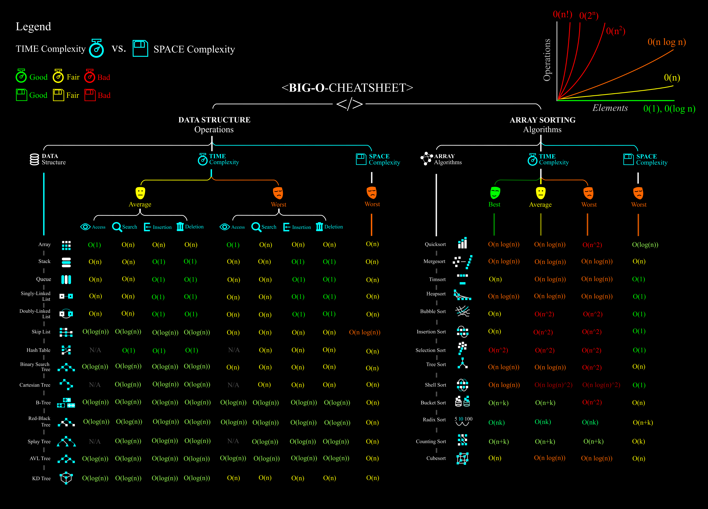

# Familias O grande, Omega, Theta y o pequeña

These notation families give us a standard, mathematical way to describe how an algorithm's running time grows. Their main purpose is to **simplify analysis**: instead of tracking an exact formula, we focus on how the algorithm behaves as the input size **N** grows large. When N is big enough that only the *growth rate* matters, we say we are studying the algorithm's **asymptotic efficiency**.

For example, insertion sort has a running time of the form `a·n² + b·n + c` for some constants `a`, `b`, `c`. When we say its running time is **O(n²)**, we are abstracting away the constants and lower-order terms, keeping only the dominant growth rate.

Each family is suited to a different kind of analysis, but **Big O is the most widely used**, since it describes the **worst case**.

### Big O — O(f(n))
- Describes an **upper bound** on the running time: the algorithm never does *worse* than this.
- Formally, `f(n)` is `O(g(n))` if there exist positive constants `c` and `n₀` such that `0 ≤ f(n) ≤ c·g(n)` for all `n ≥ n₀`.
- **Transitivity**: if `f(n)` is `O(g(n))` and `g(n)` is `O(h(n))`, then `f(n)` is `O(h(n))`.
- **Sums**: if `f(n)` is `O(h(n))` and `g(n)` is `O(h(n))`, then `f(n) + g(n)` is `O(h(n))`.
- A term `a·nᵏ` is `O(nᵏ)`, and `nᵏ` is also `O(nᵏ⁺ʲ)` for any positive `j` — in general, **any polynomial is O of its highest-degree term**.
- `logₐ(n)` and `log_b(n)` belong to the same O-family for any positive bases `a, b > 1` (logarithms only differ by a constant factor).
- Because it represents an upper bound, Big O is used to describe the **worst-case** scenario.

### Omega — Ω(f(n))
- The mirror image of Big O: it describes a **lower bound** instead of an upper bound.
- `f(n)` is `Ω(g(n))` if there exist positive constants `c` and `n₀` such that `0 ≤ c·g(n) ≤ f(n)` for all `n ≥ n₀`.
- Represents the **best-case (optimistic)** scenario.

### Theta — Θ(f(n))
- Used when a function is **both** `O(g(n))` and `Ω(g(n))` — i.e., the upper and lower bounds match (up to constants).
- `f(n)` is `Θ(g(n))` if there exist positive constants `c₁`, `c₂`, and `n₀` such that `c₁·g(n) ≤ f(n) ≤ c₂·g(n)` for all `n ≥ n₀`.
- Example: `2n² + 3n + 1` is `Θ(n²)`.
- Because it tightly bounds the function from both sides, Theta is typically used to describe the **average case**.

### Little-o — o(f(n))
- Similar to Big O, but **strict**: the growth rate must be strictly slower, not equal.
- `f(n)` is `o(g(n))` if there exists `c` and `n₀` such that `0 ≤ f(n) < c·g(n)` for all `n ≥ n₀`.
- Still a pessimistic-style bound, but tighter (more optimistic) than the plain worst-case Big O bound.

### Little-omega — ω(f(n))
- Similar to Omega, but **strict**: the growth rate must be strictly faster, not equal.
- `f(n)` is `ω(g(n))` if there exists `c` and `n₀` such that `0 ≤ c·g(n) < f(n)` for all `n ≥ n₀`.
- Represents a **very optimistic** case.

---

Perform the analysis of the quicksort algorithm, then take a look to this image:

---

## Excercises 

For the following exercises, design a solution algorithm aiming to obtain a solution with a complexity below **O(n³)**. After designing the algorithm in pseudocode, calculate its **polynomial** and **Big O complexity**.

1. **Concentric Circles**

   Given an unordered list of circles, where each circle is defined by its **radius** and its **center coordinates (X, Y)**, generate a list of circles such that they form **concentric circles**, with no repetitions. Circles sharing the same center must be separated by at least **3 radius units** and must not overlap. Additionally, the concentric circles associated with different centers must not overlap each other.

2. **Minimum-Cost Chocolate Bar Cutting**

   Given a chocolate bar consisting of **N × M pieces**, where each piece is 1 × 1, determine the minimum cost required to cut the chocolate bar into individual pieces, given that each cut has an associated cost.

   Let `x₁, x₂, …, xₘ` represent the costs of making the **vertical cuts**, and `y₁, y₂, …, yₙ` represent the costs of making the **horizontal cuts**.

   For example, if all horizontal cuts are made first, followed by all vertical cuts, the total cost would be:

   `y₁ + y₂ + … + yₙ₋₁ + N(x₁ + x₂ + … + xₘ₋₁)`.

