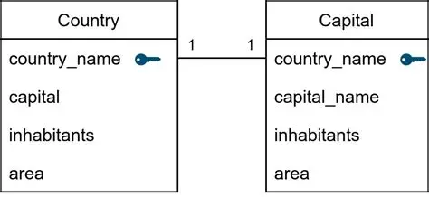
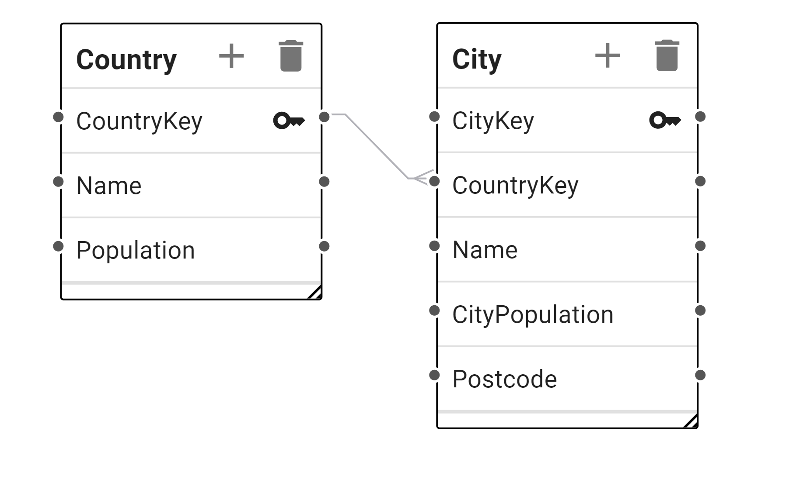
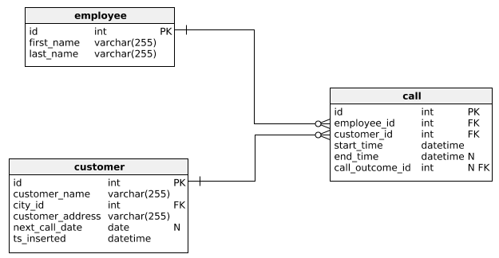

# Proceso de diseño de bases de datos

El diseño de base de datos depende del paradigma, nos vamos a enfocar en el relacional y posteriormente abordaremos las particularidades del diseño documental. 

Lo primero es entender las cardinalidades 1:1, 1:N y N:N que establecen las relaciones del modelo relacional. 

En una relación 1:1, un registro de una tabla se relaciona con un único registro de otra tabla. Por ejemplo, Persona y Pasaporte: una persona tiene un pasaporte y un pasaporte pertenece a una sola persona. Aquí la llave primaria (PK) de Persona puede ser persona_id, y en Pasaporte ese mismo valor puede usarse como llave foránea (FK) con restricción UNIQUE para garantizar la relación uno a uno. 

En una relación 1:N, un registro de una tabla puede relacionarse con muchos registros de otra. Por ejemplo, Cliente y Pedido: un cliente puede tener muchos pedidos, pero cada pedido pertenece a un solo cliente. En este caso, cliente_id es PK en Cliente y aparece como FK en Pedido. 

En una relación N:N, muchos registros de una tabla se relacionan con muchos registros de otra, como Estudiante y Curso. Aquí se requiere una tabla intermedia, por ejemplo Estudiante_Curso, que contiene las llaves foráneas estudiante_id y curso_id. Esa tabla suele tener como PK una llave compuesta formada por ambos campos para evitar duplicidades.

También existes las llaves compuestas que son llaves primarias formadas por más de un atributo. Se utilizan cuando la unicidad de un registro depende de la combinación de varios campos y no de uno solo. Por ejemplo, en la tabla Estudiante_Curso, la combinación (estudiante_id, curso_id) identifica de forma única cada inscripción. También pueden usarse en contextos como Inventario (producto_id, bodega_id) donde un producto puede repetirse en distintas bodegas, pero no dos veces en la misma bodega. Las llaves compuestas obligan a pensar en reglas reales del negocio y ayudan a prevenir inconsistencias.

En el proceso de levantamiento de requerimientos para el diseño de base de datos es importante capturar: entidades principales del negocio y sus atributos; reglas de negocio explícitas; relaciones y cardinalidades; volúmenes esperados de datos; frecuencia de inserción, actualización y consulta; reglas de validación; restricciones legales o regulatorias; necesidades de auditoría; configuraciones que podrían cambiar en el tiempo; y requerimientos de reporte o visualización. También es clave entender qué datos son obligatorios, cuáles opcionales y cuáles deben ser únicos.

## Patrones de diseño:
1. User permissions

2. Variable columns 

3. Master-detail / Catalogs-actions

4. Transactions/Movements

5. Balances

6. Logs

7. Current and historical 

8. Addresses 

9. Contact Info

Ejecutar algunos ejercicios de diseño:

- Puesto de lotería

- Post/Like/Comments/Share

## Tips para evaluar diseños:

**Reducción de duplicidades**
“Analiza este modelo relacional y detecta posibles redundancias de datos. Indica qué atributos podrían estar duplicados en múltiples tablas y sugiere una normalización adecuada.”

**Información para desplegar en UI**
“Cuáles campos del modelo son propensos a ser mostrados en el UI como selecciones no como inputs”

**Configuraciones variables**
“Revisa el diseño y determina si los valores que pueden cambiar en el tiempo están modelados como tablas parametrizables en lugar de atributos fijos. Sugiere mejoras para soportar configuraciones dinámicas.”

**Remoción de valores alambrados**
“Identifica campos o estructuras que representen listas fijas o códigos estáticos. Propón cómo modelarlos en tablas de catálogo o parámetros para evitar hardcoding.”

**Escalabilidad del diseño**
“Propon escenarios en ciertas tablas donde se incrementa volúmen, cantidades o tipos de elementos, pregunta si ese cambio va a requerir crear tablas nuevas, o crear columnas nuevas” en cuyo caso hay que mejorar el diseño. 

**Evaluar si el diseño cumple los requerimientos**
“Compara este modelo de datos contra los siguientes requerimientos funcionales y no funcionales. Indica qué requerimientos están cubiertos, cuáles parcialmente y cuáles no están reflejados en el diseño: [ lista de requerimientos]”

