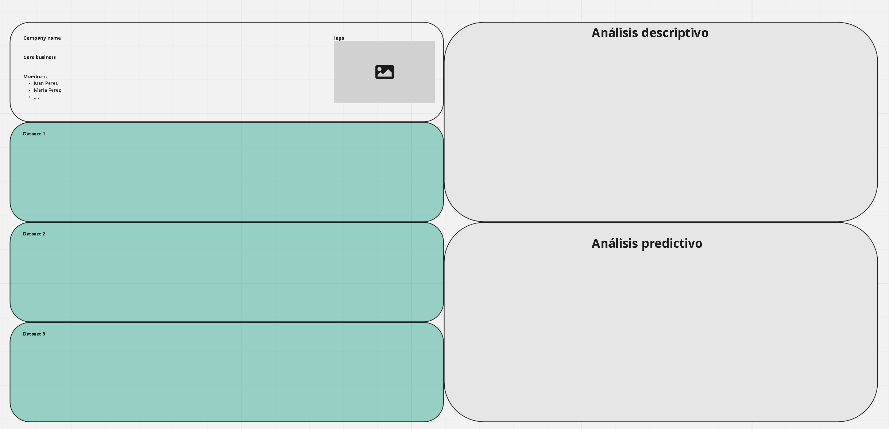
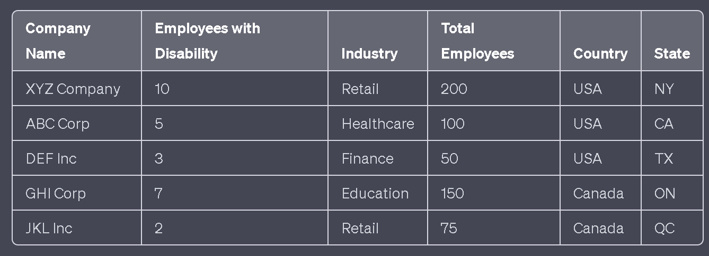

# caso #1, 10%

_instituto tecnológico de costa rica_, escuela de computación  
_bases de datos II_  
_prof. rodrigo núñez_  
_tipo:_ parejas

## descripción

la empresa ferianueva de costa rica quiere crear una plataforma web donde las personas inscritas puedan comprar frutas, verduras y otros productos de consumo que estaban destinados a ser desperdicio. ferianueva se encarga de recoger dichas frutas y verduras, restaurarlos para que sean aprovechables para consumo; tomar productos procesados o otros que tienen defectos o fechas próximos a vencimiento que ha recolectado de un proceso logístico y los vende en un ecomerce. una vez que una persona registrada compra los productos, ferianueva se encarga de entregarlos en una única ruta que hace 2 veces por semana.

entre los retos más importantes que tiene feria nueva son:

1. mantener el inventario de productos disponible incluso con antelación desde antes de irlo a recoger y luego de restaurarlo

2. organizar en el espacio físico de bodegaje el producto listo para vender y entregar

3. que el camión de entrega sepa bien que productos son los que tiene que entregarle a cada persona en la ruta en ese día

4. asegurarse que el consumidor reciba un producto en buen estado y que el repartidor le haya dado un servicio amable y completo

proceda a realizar un diseño para la base de datos de ferianueva hecho en sql server. luego una vez que tenga el diseño proceda a cargar de información de tal forma que se tengan:

- al menos 15 productos
- al menos 20 personas registradas
- entre 1 a 3 ordenes de varios productos por persona en 4 semanas en el pasado y que hayan sido entregadas

el líder técnico quiere que usted le demuestre con su base de datos diseñada, implementada y con datos que podrá dar respuesta a las siguientes incognitas:

## preliminar #1, 15 de febrero, 20pts

1. cuál es el top 5 de compradores estrella

2. cuál es el top 5 de productos más vendidos en los últimos 15 días

3. cuál es el total de compras por persona

4. cuál es el total vendido por producto

- contenido: un archivo sql con todos los scripts necesarios

## preliminar #2, 22 de febrero, 40pts

5. determinar si existe al menos una diferencia de carga de trabajo del 20% entre los dos días de entrega

6. cuáles son las principales razones por las que el consumidor devuelve producto

7. demostrar que las operaciones de ordenar productos y agregar productos a bodega pueden ser transaccionales

8. demostrar si va a ser posible crear vistas que ayuden a la implementación del sistema

- contenido: un archivo sql con todos los scripts necesarios

## entrega final #3, 27 de febrero, 40pts

9. demostrar bajo que circustancias en su modelo podrían suceder problemas de dirty read, lost update y phantoms

10. demostrar bajo que circustancias en su modelo podrían darse deadlocks

11. como se defiende su modelo ante fraudes donde el sistema se ve comprometido con los datos para beneficio de alguna persona

- contenido: un archivo sql con todos los scripts necesarios

## aspectos operativos

- entrega al asistente al correo: fvsasistencia@gmail.com
- subject: bases 2 - caso #1 - <entregable>

---

# caso #2, 7%

_instituto tecnológico de costa rica_, escuela de computación  
_bases de datos II_  
_prof. rodrigo núñez_  
_tipo:_ parejas

Proceda a generar en una base de datos con la siguiente tabla debidamente rellena basado en el script a continuación:

```sql
USE [hacker_rank]
GO

/****** Object:  Table [dbo].[hackerranklog]    Script Date: 2/20/2023 10:43:23 PM ******/
IF  EXISTS (SELECT * FROM sys.objects WHERE object_id = OBJECT_ID(N'[dbo].[hackerranklog]') AND type in (N'U'))
DROP TABLE [dbo].[hackerranklog]
GO

/****** Object:  Table [dbo].[hackerranklog]    Script Date: 2/20/2023 10:43:23 PM ******/
SET ANSI_NULLS ON
GO

SET QUOTED_IDENTIFIER ON
GO

CREATE TABLE [dbo].[hackerranklog](
	[logid] [bigint] IDENTITY(1,1) NOT NULL,
	[posttime] [datetime] NOT NULL,
	[exercise] [int] NOT NULL,
	[level] [varchar](10) NOT NULL,
	[type] [varchar](20) NOT NULL,
	[username] [varchar](34) NOT NULL,
	[points] [smallint] NOT NULL,
	[duration] [smallint] NOT NULL,
	[result] [varchar](20) NOT NULL,
 CONSTRAINT [PK_hackerranklog] PRIMARY KEY CLUSTERED
(
	[logid] ASC
)WITH (PAD_INDEX = OFF, STATISTICS_NORECOMPUTE = OFF, IGNORE_DUP_KEY = OFF, ALLOW_ROW_LOCKS = ON, ALLOW_PAGE_LOCKS = ON, OPTIMIZE_FOR_SEQUENTIAL_KEY = OFF) ON [PRIMARY]
) ON [PRIMARY]
GO


DECLARE @AMOUNT_OF_RECORDS INT
DECLARE @PostTime DATETIME
DECLARE @Exercise_Number INT
DECLARE @Points INTEGER

SET @AMOUNT_OF_RECORDS = 25000

WHILE @AMOUNT_OF_RECORDS>0 BEGIN
	SET @PostTime = DATEADD(dd, ABS(CAST(CAST(NEWID() AS VARBINARY) AS INT))%1345*-1, GETDATE())
	SET @Exercise_Number = ABS(CAST(CAST(NEWID() AS VARBINARY) AS INT))%100+1
	SET @Points = 65+ABS(CAST(CAST(NEWID() AS VARBINARY) AS INT))%35+1

	INSERT INTO dbo.hackerranklog (posttime, exercise, [level], [type], username, points, duration, result)
	SELECT @PostTime, @Exercise_Number,
	CASE WHEN @Exercise_Number<34 THEN 'Basic'
		 WHEN @Exercise_Number>33 and @Exercise_Number<64 THEN 'Medium'
		 WHEN @Exercise_Number>63 THEN 'Advance'
	END,
	CASE WHEN @Exercise_Number%2=0 THEN 'Divide and Conquer'
		 WHEN @Exercise_Number%3=0 THEN 'Hashing'
		 WHEN @Exercise_Number%5=0 THEN 'Sorting'
		 ELSE 'Decision tree'
	END,
	CONCAT('User_', CONVERT(VARCHAR,ABS(CAST(CAST(NEWID() AS VARBINARY) AS INT))%1315) ,'_'),
	@Points,
	20+ABS(CAST(CAST(NEWID() AS VARBINARY) AS INT))%40,
	CASE WHEN @Points<85 THEN 'Failed' ELSE 'Approved' END

	SET @AMOUNT_OF_RECORDS = @AMOUNT_OF_RECORDS - 1
END
GO

```

El anterior es la bitácora resultado de una plataforma de entrenamiento y evaluación de ejercicios algoritmos. La tabla contiene el número de ejercicio, el nivel de complejidad el ejercicio, el tipo de estrategia de solución esperado, el usuario que hizo el test, los puntos obtenidos y la cantidad de minutos usados en la resolución del ejercicio.

De los datos extraídos se quiere averiguar lo siguiente:

1. cuál es el ranking semestral año con año, de los 10 mejores puntajes aprobados en cada semestre para cualquier ejercicio. Genere el ranking con y sin empates.

2. clasifque a los usuarios en quintilos basándose en los puntajes obtenidos en promedio de cada usuario dentro de un mismo nivel. Se espera que se creen quintilos para basic, medium y advance. Utilice solo los datos del 2022.

3. determinar si los usuarios mayormente van subiendo de nivel en el tiempo conforme avanzan en los algoritmos de una misma dificultad o no.

4. determine el ranking de los top 3 puntajes obtenidos, sacando el ranking por complejidad de los ejercicios y por cada año.

5. Se quiere generar un pie chart porcentual basado en las duraciones de la resolución de los algoritmos, el objetivo es visualizar solo 5 slides en el chart con su respectivo porcentaje y cantidades, cada slide es el porcentaje de personas que en promedio han durado cierto rango de duración considerando basic, medium y advance. Es importante al ver un slide del chart saber la cantidad de cada nivel que están en ese rango de duración.

## aspectos operativos

- entrega al asistente al correo: fvsasistencia@gmail.com
- fecha de entrega: máximo lunes 6 de marzo, 7pm
- subject: bases 2 - caso #2 - entregable final

---

# caso #3, 13%

_instituto tecnológico de costa rica_, escuela de computación  
_bases de datos II_  
_prof. rodrigo núñez_  
_tipo:_ grupos hechos en el ejercicio de webkit

## descripción

en la semana anterior se crearon grupos de trabajo que ejecutaron la siguiente actividad:

---

_textualmente_

1. Crear una propuesta de sitio web innovador, de un servicio completamente nuevo o similar que ya exista en otro lugar que no exista en costa rica o latam

2. Del MethodKitStartupCanvas.pdf (dropbox), pensar en que se va a construir un sitio web, proceder a trabajar con el grupo de trabajo designado los puntos:

- company name, team, question, solution, existing alternatives, target group, goals, mvp

ademas agregue la siguiente información supuesta

- países donde va operar
- internacionalización que va a soportar
- cuátos millones de usuarios van a utilizar el sistema en cada país
- cantidad de items (productos, artículos, servicios, assets, o similares) que el sistema va a tener para ofrecer

---

cada grupo seleccionó un sistema de base de datos nonSQL (not only sql) en la nube entre dynamodb, strapi, contenful, firebase y cosmosdb. Se quiere hacer la prueba de cuánto se demora implementar un endpoint REST usando como cloud service uno de esos 5 sistemas seleccionados para luego comparar eso con desarrollo en modelos relacionales.

## preliminar #1, bitácora y diseño de arquitectura, 21 de marzo, 2023

se quiere crear un servicio REST que tenga un único endpoint, https://jamboard.google.com/d/1568pa8tc3KsLe6QiUZPuwK8FjuKLPHbBpeGqxLWsQ30/edit?usp=sharing , el nombre del resource queda a su criterio y con este jamboard puede revisar el standard de nombres. El método HTTP se sugiere que sea GET por simplicidad del ejercicio. Dependiendo de la tecnología de base de datos cloud que haya escogido, es posible que sea requerido un mínimo de programación a practicamente nada para habilitar dicho REST endpoint.

1. diseñe una bitácora para registrar las horas invertidas en realizar este caso #3, puede ser un excel file compartido entre el grupo y el profesor al email vsurak@gmail.com, se espera que el excel contenga mínimo los siguientes campos: fecha, nombre del estudiante, cantidad de minutos invertidos, tipo de actividad. El tipo de actividad debe ir desde investigación, pruebas, reuniones, programación, entrega final, en general cualquier tipo de actividad que haya sido necesaria, individual o grupalmente para la realización de este ejercicio. esta bitácora no pretende medir cual integrante trabajó o aportó más o menos tiempo en el trabajo, lo que se quiere es tener un total clasificado para luego hacer un ejercicio de estimación comparativo con una plataforma relacional y sacar costos. Por dicha razón se les pide que mantengan la bitácora al día, si no pueden entrar actualizarla, talvez hacen un grupo de chat entre los integrantes y asi si alguno invierte un tiempo en alguna actividad avisa a alguien para que registren el tiempo usado, no importa si se invertió tiempo y algo no resulto, al fin y al cabo es tiempo de investigación y pruebas, contabilicen todo.

2. Haga un diagrama de arquitectura de cómo va a terminar funcionando las diferentes piezas involucradas del sistema, eso son cajitas de colores que se conectan con flechas, es importante visualizar a postman, la capa de aplicación y la capa de datos como mínimo.

enviar a: vsurak@gmail.com

subject: Bases de datos II - caso #3 - preliminar #1

antes de media noche y debe venir la lista de integrantes la cual debe concordar con los grupos que trabajaron en clase. En el entregable envíe la imagen de la arquitectura, la bitácora ya el profesor la habrá podido estar chequeando en tiempo real al ser un share file.

## final, implementación del servicio REST, 24 de marzo, 2023

1. Un integrante del grupo hará la demostración, durante el proceso nos va a explicar cómo fué el proceso de definición de la arquitectura, cómo fué la creación de la base de datos, cómo fué el proceso de diseño de la base de datos y la carga de los datos. Posteriormente nos va a explicar como fué posible habilitar el REST endpoint y hacer el query a la base de datos para obtener la información.

2. La misma persona procede por medio de postman a hacer la demostración de que el servicio rest efectivamente funciona.

Lo anterior se hará durante la clase y ahi mismo se le asignará la nota.

Notificar a mas tardar el jueves 23 al profesor si algún integrante va a ser descartado del grupo por no haber trabajado en la asignación.

---

# caso #4, 25%

_instituto tecnológico de costa rica_, escuela de computación  
_bases de datos II_  
_prof. rodrigo núñez_  
_tipo:_ teams of 3 or 4

## descripción

debido a los recientes avances en los asistentes basados en inteligencia articial en especial los gpts, ha iniciado una transformación en la forma de interacción en que se entregan servicios y contenido a las personas por medio del internet. el vasto panteón de aplicaciones ha impulsado al consumidor digital a tener una experience de "have the job done" en lugar de instalar aplicaciones para cada cosa que sea necesaria.

eso ha hecho emerger nuevas empresas y nuevos servicios a lo largo del globo compitiendo por el mercado de facilitar dicha experiencia, proveyendo comodidad al consumidor al integrar servicios regionalizados y personalizados. la empresa AIBulb no es la excepción en dicha competencia, actualmente es uno de los competidores más importantes en el mercado, tiene presencia en estados unidos, méxico, costa rica y guatemala, con planes de expandirse.

su grupo de trabajo ha sido llamado a la misión de preparar la nueva arquitectura de datos y flujos de trabajo para AIBulb que le permita atender con eficacia el mercado actual y facilite a los directivos alcanzar más servicios en cada país y más países.

cómo funciona el sistema de AIBulb?

1. realizan contratos con prestadores de servicios en cada país, por ejemplo, netflix, spotify, lavandería, plomería, taxi, venta de entradas a eventos, entre muchos. existen contratos que son globalizados como spotify por ejemplo, o bien, otros que con del país como lavanderías, plomería, entradas a eventos, entre otros, incluso algunos prestadores de servicio podrían operar de forma regionalizada.

2. estos proveedores de servicios al tener presencia o no en cada país, deben sujetarse a las leyes relacionadas a impuestos, anualidades y cualquier otro aspecto legal que esté relacionado a la prestación de servicios por medios digitales. normalmente los proveedores ofrecen modelos de negocio a sus clientes tales como in-service purchase, free, on-demand, by subscription, entre otros.

3. los proveedores compiten por calidad de servicios, extras, amplitud de opciones y precio obviamente. AIBulb ha desarrollado toda su plataforma en digital wallets, de tal forma que la única forma de pagar es por medio del wallet seleccionado en el smartphone o dispositivo personal. el sistema de geolocalización y perfil de usuario provee la información necesaria a la aplicación de AIBulb para determinar quién es la persona, donde se encuentra ubicada y que servicios están disponibles según esa información. esa identidad se la dá el smartphone al app, de la misma forma los derechos a enviar solicitudes de pago al wallet. de esa forma AIBuld puede identificar universalmente a los usuarios, la disponibilidad de servicios según donde se encuentre y una forma de pago.

4. la aplicación toma lo que el usuario quiere, ya sea de forma verbal o escrita, por ejemplo:

   "quiero ver que están pasando en todos los canales de películas"

   "buscar un lugar de vacaciones para semana santa en puerto viejo para 5 personas, con piscina, a menos de 1km de la playa, completamente equipado y en menos de $100 la noche"

   "enviame un taxi que me lleve al teatro nacional"

   "necesito que recojan mi ropa y me la regresen lavada y aplanchada"

   la aplicación usando la identificación previa, más esta solicitud, con ayuda de los gestores de AI, determina del texto el servicio que mejor se ajusta a lo solicitado y el contexto del usuario, crea la información necesaria para hacer el request a un api del servicio, con los parámetros que deduce de la solicitud, sucedido esto, pueden ocurrir múlltiples escenarios de respuesta:

   - se encuentra un servicio al que la persona está debidamente subscrita y es el servicio que más utiliza para dicho tipo de tarea, con lo cual recibe la respuesta del servicio según lo solicitado, y de ser neceario nuevas preguntas al usuario para mejorar los resultados

   - se encuentra un servicio apropiado y aunque el usuario no tenga ningún plan con dicho proveedor de servicio, se le responde al usuario las opciones disponibles y a la vez la respuesta que daría alguno de los servicios rankeados para ese tipo de tarea

   - no se encuentra un servicio apropiado, pero se le ofrecen opciones aproximadas a la persona por si alguno de los servicios disponibles pueden efectivamente resolver lo solicitado

5. una vez que el usuario decide pagar por un servicio o no, se debe guardar registro en el sistema de:

- el request procesado con todas las aclaraciones relacionadas al request, también si el request no fué usado por el usuario, es decir, que canceló
- registro de la transacción exitosa con el wallet
- registro de la transacción exitosa con el proveedor
- la entrega del servicio al consumidor
- en cuanto a las transacciones se deben registrar las transacciones desglozadas como uso de la plataforma, costo del proveedor, impuestos o cargos asociados al lugar y la forma en que se creo el contrato, pues cada transacción de esas va a tener una cuenta destino diferente
- la bitácora de preguntas y respuestas del sistema y el usuario que se dieron para afinar el request
- las transacciones de pago deben ser completamente consistentes, por lo que el arquitecto prefiere utilizar un SABD relacional para tal fin

7. la aplicación de AIBulb, siempre está activa si el usuario la deja así configurada, sin embargo al abrirse posee un home page donde basado en el usuario del smartphone, su localización y aquellos proveedores ya pagados, se le muestran los servicios disponibles, similar a como se ven las películas y series en netflix, es decir, imagen, nombre, año, rate, clasificados por categoría por ejemplo: hospitality, health, finance, services, transport, house keeping, etc. Y algunas veces podrían salir alerts o publicidad de nuevos servicios disponibles que podrían ser recomendables para dicho usuario.

8. AIBulb monetiza fees por las transacciones realizadas, es decir, cualquier compra que el consumidor haga se le hace un cargo. sin embargo hay servicios que son de subscripción, otros gratis, no todos son de pago on-demand; por otro lado, hay request que podrían solicitarse a los servicios pero que el consumidor decida no adquirir. eso puede causar mucho tráfico no monetizado en la plataforma, para ello AIBulb vende paquetes mensuales a los proveedores, dichos paquetes incluyen cierta cantidad de request que no terminan en pago y cantidad de request que si hacen uso de algun pago. El request se mide como una solicitud completa al app con todas las modificaciones, es decir, si una persona dice que quiere sacar una cita con un dentista, las mejoras a la solicitud que se van a ir pidiendo como por ejemplo el lugar, días de preferencia, precio máximo esperado de la consulta, etc... todo eso entra dentro del mismo request, como una sola unidad y eso debe controlarse los planes que cada proveedor tenga contratados con AIBulb en el país o internacionalmente.

9. cuando los proveedores desean actualizar la información de los servicios que ofrecen, lo hacen por medio de un API que provee AIBulb, dicha actualización es guardada en una base de datos en memoria, redis. para que así luego un proceso asíncrono se encargue de tomar las modificaciones pendientes, enviarle la información necesaria a las bases de datos y modelos del IA, actualizar los URLs y objetos de los servicios que actualiza el proveedor, y luego finalmente enviar los datos de la modificación a los lugares respectivos. recordar que un mismo proveedor puede operar en varios países y podría para un mismo servicio no ofrecer exactamente las mismas funciones, por ello, la actualización de URLs, versión y objetos se realiza localizadamente según las zonas indicadas en la actualización. con la actualización lista las aplicaciones inician a hacer uso de los nuevos servicios y funciones.

las aplicaciones, interfaces de análisis de AI, apis, y demás que permiten que este sistema funcionaria en la vida real, NO están dentro del alcance del caso, solo lo solicitado específicamente en los entregables de cada preliminar y final.

## preliminar #1, data cluster, databases design and implementation, lunes 24 de abril, 40pts

- dado los requerimientos anteriores proceda a diseñar las colecciones y json necesarios para el sistema
- diseñe e implemente relacionalmente en el SABD de su elección lo que sea necesario para dar consistencia transaccional
- diseñe, implemente y ponga en ejecución un shard cluster en mongodb que permita a AIBulb proveer con eficiencia (esto es reduciendo al máximo posible que un usuario tenga que consultar y evaluar aplicaciones que involucren hacer query a datos que estén fuera del alcance de su localización o sus preferencias)
- esto se revisará con cita con el profesor
- utilice docker compose para la configuración del cluster
  deberán ser mantenidos en un repositorio en github centralizado para todos los integrantes del grupo de trabajo
- distribuya las cargas de los servidores entre las computadoras de todos los integrantes del grupo, para ello va a ser necesario utilizar un software de VPN como https://openvpn.net/ , https://vpn.net/ o similar .
- pruebe el cluster anterior tanto su distribución de llaves (shard), consulta de datos focalizados en el consumidor, alta disponibilidad y tolerancia a fallas del cluster
- todos los scripts, archivos de comandos y datos que sean necesarios para este ejercicio
- fecha y hora del último commit : _domingo 23 de abril, media noche_

## preliminar #2, real time notifications, async update for content and sales, domingo 14 de mayo, 60pts

- cuando un proveedor de servicio quiere actualizar su contenido de la página principal debe hacerlo por medio de un api
- dado que esto es tan masivo, no se realiza la actualización en el cluster en tiempo real si no que se hace de forma asíncrona
- el request del proveedor al api en lugar de ser salvado es enviado a un servidor de notificaciones persistente, en este caso se ha decidido que sea kafka
- una vez que kafka recibe la notificación se dispara un consumidor que se encarga de actualizar basado en el request la información necesaria en el cluster de mongo
- el otro proceso automático que debe existir se va a implementar en logstash, este se va encargar de cada cierto tiempo analizar los request de los usuarios y posteriormente indexar en un elastic search la información necesaria para poder mostrarle reportes por rangos de fecha a los provedores, de la cantidad y tipo de request que han estado procesando por ellos de forma exitosa, el monto de ventas que le han generado cada una; y también, la cantidad y tipo de request que los usuarios están buscando, que se acerca a hacer match con ellos pero que ellos no lo proveen y así crear oportunidades de negocio
- dicho reporte anterior deberá generarse por proveedor y por rango de fechas utilizando Kibana
- diseñe una arquitectura solución y obtenga aprobación de dicha arquitectura con el profesor para los objetivos de este preliminar
- una vez con la arquitectura aprobada proceda a realizar la implementación necesaria
- con respecto a las transacciones consistentes, estás podrían estar ocasionando problemas de: dirty read, phantom, lost update y deadlock. estudie los pasos de las transacciones de request y pago del sistema, y encuentre junto con el profesor cuáles son esos posibles casos. Implemente los stored procedures y simule dichas situaciones por medio de llamadas a los SP transaccionales para que así su equipo de trabajo analice posibles soluciones a nivel de diseño o SQL.
- la revisión será demostrativa en las herramientas solicitadas y con la arquitectura diseñada por el grupo, será con cita de revisión con el profesor

---

# caso #5, 25%

_instituto tecnológico de costa rica_, escuela de computación  
_bases de datos II_  
_prof. rodrigo núñez_  
_tipo:_ teams up to 4 people

## descripción

como se ha descubierto en las últimas lecciones el análisis de datos tiene muchas aristas y muchos roles, es un trabajo especializado que requiere de varios actores tanto para la planificación y diseño de los modelos de datos, la labor de ingeniería de datos y el análisis de los mismos; sin embargo todo eso no tiene sentido si no existen efectivamente un valor o ganancia a obtener de la extracción y análisis de los datos.

otro reto importante que se debe tomar el cuenta es el tamaño de los datos, las herramientas tradicionales OLTP SQL y nonSQL en muchos casos son incapaces de procesar tanto volúmen de información por lo que entran a jugar otras herramientas. Si bien, en este caso usted no va a trabajar con un tamaño tan grande ni con clusters para procesarlo, se va a asumir en todo momento que el tamaño de la data es intratable por los motores de base de datos tradicionales y que es necesario recurrir a herramientas especializadas para big data.

en la semana 13 su grupo ha trabajado en el diseño y planificación de lo que haría un consultor de ciencia de datos para determinar que valor y utilidad podrían tener los datos y cómo deberían diseñarse los modelos analíticos para sacar valor agregado de los mismos. El profesor le ha proporcionado un dataset https://www.dropbox.com/s/20azr0jxnqhae9b/EAWCSV.zip?dl=0 y ustedes han agregado a la ecuación otros 2 los cuales deben ser reales o parcialmente reales. dicha información va a servir para construir y pactar el modelo de análisis de este caso en particular.

## preliminar #1, 22/05/2023 media noche, formalización del modelo de datos, 20pts

este trabajo ya se encuentra adelantado de los acuerdos hechos en el ejercicios de de la semana 13, https://github.com/vsurak/cursostec/blob/master/bases%20II/lecciones/week%2013.md#actividades-en-clase

proceda ahora a crear un board en miro que sirva como base del acuerdo de trabajo de lo que se va a realizar en este caso #5, en el miro debe ser posible visualizar lo siguiente:



_datos de su grupo de trabajo:_

company name, core business, members and logo

_datasets:_

debe mostrar los 3 datasets que va a utilizar donde claramente se vean las columnas y datos fake para imaginar el contenido de los datasets. para cada dataset deje claro cuáles campos se van a interrelacionar con los otros datasets. desde el punto de vista de forma se espera visualizar en cada dataset algo similar a esto:



_analisis descriptivo:_

utilizando el análisis hecho documente aquí los dos análisis descriptivos que va a realizar, cada análisis debe incluír descripción visual de los reportes o gráficos, los cálculos que deberán realizarse y el valor esperado en $ que debe venir de la data misma.

al ser visual se requiere ver un ejemplo de los gráficos esperados. en cuanto a las fórmulas deben ser exactas, detallar las sumatorias, grupos, campos involucrados, operaciones, que van a ejecutarse en los data sets para lograr llegar a los valores esperados.

_analisis predictivo:_

usando nuevamente su análisis previo, selecione 2 análisis predictivos a realizar. cada análisis deberá incluír la descripción de los reportes a realizar, detallando las columnas, la columna predecida, el método, campos y fórmula utilizado para hacer la predicción y por sobre todo las ganancias que se esperarían con dicha predicción.

en el caso del análisis predictivo este puede ser meramente tabular por su naturaleza.

_data value:_

finalmente, sabiendo el valor agregado de los 4 análisis anteriores y el tamaño de su dataset, determine el valor de los registros en su sistema.

todos los elementos anteriores deben salir de los datos mismos y en ningún momento ser caracter de especulación que haya que calcular manual o visualmente.

- entregable: pdf con toda esta información al correo del profesor

## entrega final, 18/06/2023, data engineering and data analysis,80pts

en este momento usted debe tener su preliminar #1 debidamente aprobado por el profesor y con ello una claridad completa sobre los datasets con los que debe contar para realizar los análisis y propiamente los análisis que debe realizar.

durante todo este entregable final, cualquier tipo de manipulación de sin exclusión va a sumir que los datos entran en la categoría de "big" por lo que ninguna operación podrá hacerse sin usar herramientas capaces de procesar big data.

en este proceso de análisis se van a distinguir 3 etapas de los datos:

<div style="text-align: center;">data staging ---> data warehouse --> data analysis</div>

### data staging

- inputs: dataset de disabilities proporcionado por el profesor, otras fuentes de datos reales

- outputs: los datasets que se definieron en el entregable #1 con sus datos debidamente llenos, las columnas deben ser las mismas definidas en dicho preliminar

el objetivo de data staging es poder obtener los 3 o más datasets que fueron diseñados en el preliminar #1 para con ellos poder construir en la segunda etapa el dataware house.

- para la construcción de dichos datasets usted puede contar con sql server, hive, hadoop, mapr, pyspark y dbt

- la única restricción que tiene es que el dataset de disabilities proporcionado por el profesor debe ser cargado en sql server (las partes que necesite únicamente), limpiado, procesado y ajustado a su especificación utilizando únicamente dbt

- para llenar y adecuar los otros datasets puede utilizar cualquiera de las herramientas disponibles para esta etapa antes mencionados

- los datasets resultantes pueden quedar almacenados en medios o lugares distintos, es decir, esta etapa no se preocupa por unificarlos ni tenerlos en un único storage, salvo que su estrategia así lo logre por defecto

- deben contener toda la data necesaria como fuente de datos, a máximo la fecha del 20 de mayo del 2023

### data warehouse

- la etapa de data warehouse pretende justamente la construcción del warehouse final para poder almacenar la información que se requiere para hacer los análisis debidamente cruzada y desnormalizada hasta donde sea necesaria, con los campos calculados que sean necesarios

- para ello deberá diseñar su tabla de hechos (fact table), tablas de dimensiones (dimesions) de su data warehouse

- deberá crear un data pipeline que permita tomar los datasets resultantes de la etapa anterior, desde la ubicación donde hayan sido dejados (no olvide que está en un ambiente big), y que llene las tablas de su warehouse, usando el diseño definido en el punto anterior

- para crear este data pipeline usted contará con dbt, logstash, microsoft integration services, pyspark, hive, hadoop, apache nifi, apache airflow

- al final de este proceso usted contará con un dataware house con su respectiva tabla de hechos, las tablas de dimensiones y todas debidamente llenas con toda la data limpia, depurada y lista para poder realizar los análisis solicitados

### data analysis

- en este momento usted ya cuenta con el warehouse y su data correcta

- además ya usted sabe cuáles análisis descriptivos y predictivos debe realizar para el negocio que planteo en el preliminar #1

- el análisis de los datos desde el warehouse para obtener los resultados esperados puede realizarlos usando pyspark, hive o lenguaje R

- luego de ese procesamiento ya los resultados estarán resumidos y calculados propiamente, por lo cual ya no serán de tamaño "big" y por ende es más simple su traslado y visualización

- el análisis descriptivo exige el uso de charts, el análisis predictivo no necesariamente

- diseño un dashboard que permita a su negocio mostrar los análisis descriptivos y predictivos que se acordaron en el preliminar #1 y que con ello pueda comunicar y convencer sobre las oportunidades de su negocio

- para crear dicho dashboard usted contará con ya sea powerbi, tableau o kibana

- puede que la salida resultante de los análisis hechos en pyspark, R o hive, no sean accesibles por un generador de dashboards como los anteriores, en cuyo caso puede realizar una migración manual de los datos a otro media storage que si pueda conectar con facilidad como por ejemplo memsql, redis, elasticsearch, mongodb, sql server

### otros aspectos

- se recomienda diseñar todo el pipeline de los stages haciendo mini pruebas de concepto para que pueda garantizar que puede procesar toda la data end to end usando herramientas para big data y que efectivamente tendrán una forma de que los outputs de una etapa sean directamente los inputs de la otra, sin requerir copiar o operaciones manuales

- el trabajo es en grupos, pero se asume que todos los integrantes conocen como está todo interconectado, cuál es el flujo, las operaciones, transformaciones y lógica de estos data pipelines, de la construcción de data warehouse, de los cálculos de los análisis y la visualización de los datos

- la revisión se hará con cita con el profesor entre el 19 y el 21 de junio
