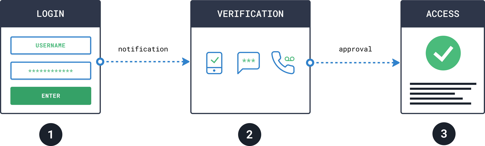
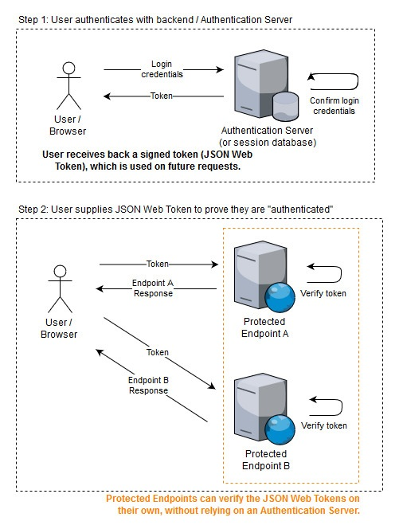
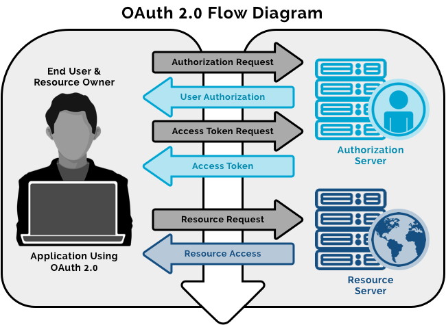

## 1. Qué es el diseño de software y sus implicaciones. ##
El profesor realizar una explicación magistral con dicha introducción, dejando claro con costos de dinero en dólares $ y tiempo, sobre el efecto que tienen las decisiones del diseño en las etapas tempranas y avanzadas de los proyectos de software. Se hace hincapié de la influencia del diseño cuando se negocian proyectos de software. 

## 2. Patrones de diseño. ##
El tema de patrones de diseño para programas orientados a objetos se abordan desde el curso de programación orientada a objetos, estructuras de datos, análisis de algoritmos y otros. Se recomienda repasar dichos diseños que son fundamentales para la implementación de frontend y backends. Se realiza el ejercicio #1 y se analizan los resultados del ejercicio.

A partir de este punto va a ser necesario el uso de las siguientes herramientas en clase:
- github, github command line
- vscode 
- vscode extensions: prettier code formatter, copilot si es posible, typescript
- docker desktop

## 3. Dependency injection: ## 
 
[Understanding Dependency Injection](https://medium.com/@sardar.khan299/understanding-dependency-injection-a-powerful-design-pattern-for-flexible-and-testable-code-5e1161dd37dd) 

[Dependency Injection Example](src/dependencyinjection)

## 4. Patrones de autenticación: password, multifactor authentication, tokens, oauth, certificates, biometrics ## 

*Multi factor or Two factor authentication*

Something You Know: This is typically a password or a response to a security question.
Something You Own: It could be a smartphone app (like Microsoft Authenticator) that generates verification codes or a physical token-generating device.
Something You Are: Usually a biometric trait like a fingerprint or face scan.

*Token-Based Authentication* 

Token-based authentication is a popular approach for securing applications and APIs. It involves issuing a token to a client (such as a user or an application) upon successful validation of credentials. The client then includes this token in subsequent requests to access protected resources.

User Authentication: 

- The user logs in using their credentials (e.g., username and password).
- The server validates the credentials and generates a token.
- This token represents the user’s identity and permissions.

Token Issuance: 

- The server issues a token (usually a JSON Web Token or JWT) to the client.
- The token contains claims (information) about the user, such as their user ID, roles, and expiration time.
- The token is digitally signed to ensure its integrity.

Token Storage: 

- The client (e.g., a web browser or mobile app) stores the token securely (e.g., in local storage or a cookie).

Subsequent Requests: 

- When the client makes requests to protected resources (e.g., APIs or routes), it includes the token in the request headers (usually as an “Authorization” header).
- The server verifies the token’s signature and decodes its claims.
- If the token is valid and not expired, the server grants access to the requested resource. 

## 5. Patrones de autorización: role based, attribute based, ACL, policy based ## 

*Role-Based Access Control (RBAC)* 

RBAC authorizes and restricts system access based on user roles within an organization.

- Role Assignment: Users are assigned specific roles (e.g., admin, manager, employee). 

- Role Authorization: Active roles must be authorized. 

- Permission Authorization: Users can only exercise permissions authorized for their active role. 

- Benefits: Efficient, scalable, and minimizes unauthorized access. 

*Access Control Lists (ACL):* 

ACL specifies permissions for individual users or groups on specific resources.

- Each resource has an associated list of users/groups and their allowed actions.
- Fine-grained control over access (read, write, execute).
- Benefits: Granular control but can become complex to manage.

*Policy-Based Access Control (PBAC):* 

PBAC determines access dynamically based on rules and policies. 

- Policies define conditions for access (e.g., time of day, location, user attributes).
- Access decisions made at runtime based on policy evaluation.
- Benefits: Flexible, adaptable, and context-aware.

*OAuth 2.0*  

is an essential protocol for securing applications and APIs. I’ll break it down in a similar manner:

_Roles:_

- Resource Owner: The end-user who can grant access to protected resources.
- Resource Server: Hosts the protected resources (usually an API).
- Client: Represents the application requesting access on behalf of the Resource Owner.
- Authorization Server: Authenticates the Resource Owner and issues access tokens.

_Grant Types (Flows):_

- Authorization Code Flow: Used by web apps (executing on a server) and mobile apps (with Proof Key for Code Exchange, PKCE).
- Implicit Flow with Form Post: For JavaScript-centric apps (Single-Page Applications) executing in the user’s browser.
- Resource Owner Password Flow: Trusted apps (not recommended for public clients).
- Client Credentials Flow: For machine-to-machine communication.

_Endpoints:_
- /authorize: Initiates the authorization process.
- /oauth/token: Exchanges authorization code or credentials for an access token. 
