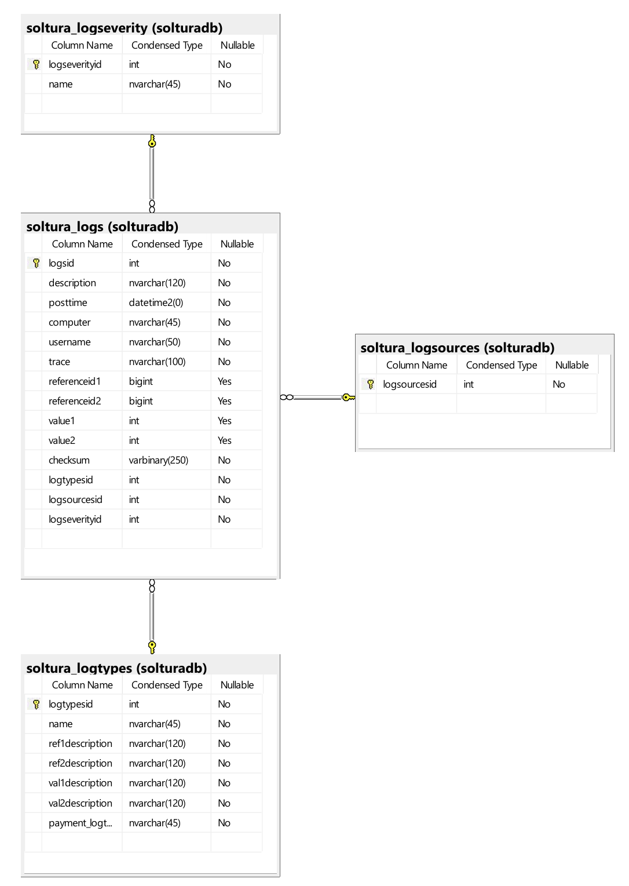

# Tendencias de la industria en el diseño de software 

1. las tecnologias de tendencia se van a trabajar y abordar en todos los casos y ejercicios de clase, tanto técnicas de descubrimiento, de diseño, de interacción con los stakeholders y para la visión detallada del sistema previo al desarrollo


2. Uno de los aspectos que ha empezado a tomar fuerza en los últimos años, son las modificaciones de la forma de diseñar con la aparición de las AI, LLMs, diseño de agentes y otros algoritmos de aprendizaje supervisado y no supervisado. 

El diseño se ve mejorado por dicha tendencia:

## Consideraciones en el diseño del modelo de datos 


### Incorporación de Semántica y Ontologías en el Modelo Relacional

*relaciones:* Se agregan tablas de metadatos semánticos, relaciones tipo "es un", "tiene", "parte de", etc.

*columnas semánticas:* Se usan columnas adicionales o tablas auxiliares para anotar entidades con etiquetas semánticas, categorías o clases.

```sql
CREATE TABLE Producto (
  id INT PRIMARY KEY,
  nombre VARCHAR(100),

  -- categoria_semantica: 'Dispositivo Electrónico' , 'Motor', o 'motor motorizado combustion mecánico'   
  categoria_semantica VARCHAR(100), 
  precio DECIMAL(16,2),
  product_categoryid INT NOT NULL,
  descripcion TEXT NOT NULL
)
```

### Audit Logs y procedencia de los datos de forma estructurada

Se integran tablas para rastrear el origen de los datos , cambios y su contexto, incluyendo quién, cuándo, y por qué se hizo una actualización. Esto le permite a los LLMs razonar sobre la validez y origen de los datos, quiénes los están usando, cómo los están usando o generando, cuándo suceden las cosas, la periodicidad y el tipo de comportamiento que se espera de las acciones. 

Tal cual como lo hacemos en diseño de tablas de logs



### Inyección de Datos Naturales y Representaciones Textuales en Tablas

Se agregan columnas textuales diseñadas para ayudar a la comprensión de LLMs como descripciones, ejemplos, resúmenes, prompts embebidos. Incluso se pueden almacenar embeddings en bases relacionales extendidas (como PostgreSQL con extensiones vectoriales).  Aquí se recomienda investigar sobre bases de datos vectoriales tales como: faiss, pinecone, weaviate. 

### Metadatos a incorporar: 

- Descripciones naturales de entidades y relaciones. 

- Trazabilidad de datos: cuándo, cómo y por quién fueron creados o modificados. 

- Ontologías ligeras o taxonomías internas. 

- Embeddings o referencias cruzadas hacia datos no estructurados (como documentos, imágenes, etc.). 

- Mapeo a APIs externas o fuentes contextuales que los agentes puedan consultar. 


_*Qué se pretende lograr con esta extensión del diseño?*_ 

https://www.akira.ai/blog/ai-agents-in-relational-rag 


## Nuevos patrones de diseño arquitectónicos y de objetos orientados a agentes 

Estudiar el siguiente artículo de referencia sin embargo es importante profundizar en cada patrón según sea necesario : 

https://lekha-bhan88.medium.com/introduction-to-agentic-ai-and-its-design-patterns-af8b7b3ef738 

_*Qué es lo que estamos buscando lograr con esta óptica del diseño?*_

https://vectorize.io/designing-agentic-ai-systems-part-4-data-retrieval-and-agentic-rag/ 

