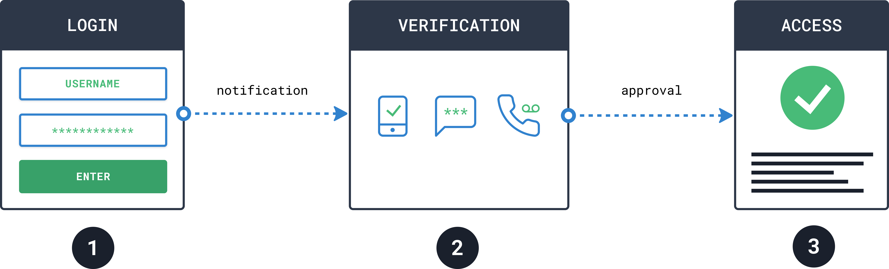
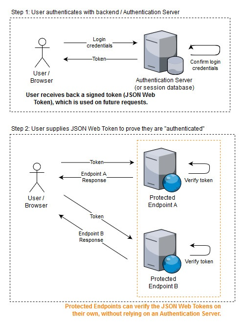
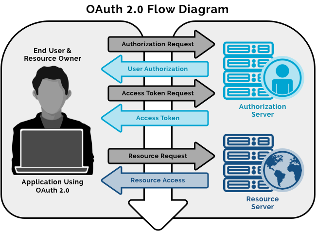
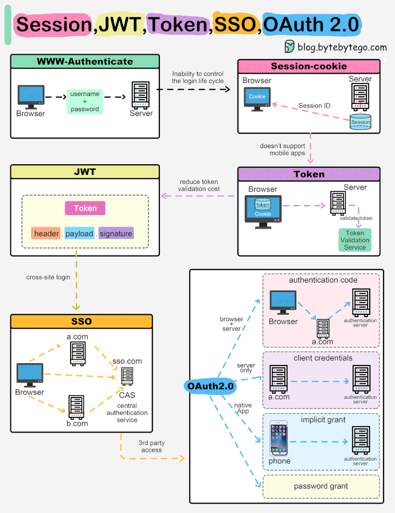

# Diseño del frontend

A continuación clase a clase se van a abordar un conjunto de aspectos que deben ser considerados cuando se diseña el frontend de un sistema. Tenemos que entender frontend como todo el alcance de la interacción humano computador, la cual puede ser por medio de mobile apps, web apps, por comandos de voz, chat, biométricos, impulsos mentales, entre otros. Es decir, es la interface entre el humano y el componente tecnológico físico y digital. 

## Technology stack: tecnología de frontend, de seguridad, librerías de terceros, frameworks, hosting; todos con su respectiva versión.

- Consideraciones para decidir el stack de tecnologías

## Authentication and Authorization mechanism - architectural patterns 

### Authentication

**Password**
El password es el mecanismo de autenticación más tradicional y ampliamente adoptado. Consiste en algo que el usuario *sabe* y que debe coincidir con un valor previamente almacenado (idealmente en forma de hash seguro). Arquitectónicamente, requiere políticas de complejidad, expiración, almacenamiento cifrado y protección contra ataques como brute force o credential stuffing. Aunque es simple de implementar, por sí solo representa un nivel de seguridad bajo frente a amenazas modernas, por lo que suele combinarse con mecanismos adicionales.

**MFA (Multi-Factor Authentication)**
MFA agrega una capa adicional al proceso de autenticación al requerir dos o más factores: algo que el usuario sabe (password), algo que tiene (token físico o app móvil) o algo que es (biometría). Desde el punto de vista arquitectónico, fortalece significativamente la seguridad reduciendo el riesgo de compromiso por credenciales robadas. Implica integrar proveedores de verificación secundaria (OTP, push notifications, hardware tokens) y diseñar flujos de validación tolerantes a fallos y sincronización temporal.

**Token**
La autenticación basada en tokens reemplaza el uso continuo de credenciales por un artefacto digital emitido tras una validación exitosa. Ejemplos comunes incluyen JWT (JSON Web Tokens). En términos arquitectónicos, permite sistemas stateless, mejora la escalabilidad y facilita la autenticación en arquitecturas distribuidas y microservicios. El token contiene claims firmados digitalmente y debe manejarse con estrategias claras de expiración, renovación y revocación.

**OAuth**
OAuth 2.0 es un framework de autorización que también se utiliza como mecanismo de autenticación delegada. Permite que una aplicación acceda a recursos en nombre de un usuario sin compartir sus credenciales. Arquitectónicamente, separa los roles de Resource Owner, Client, Authorization Server y Resource Server. Es clave en integraciones con terceros y en arquitecturas modernas basadas en APIs, especialmente cuando se combina con OpenID Connect para autenticación federada.

**Certificate**
La autenticación basada en certificados utiliza criptografía de clave pública para validar identidad. Un cliente presenta un certificado digital emitido por una autoridad certificadora confiable. Este patrón es común en entornos empresariales, VPNs y comunicación entre servicios (mTLS). Arquitectónicamente, proporciona alta seguridad, autenticación mutua y elimina la dependencia de contraseñas, aunque requiere infraestructura PKI y gestión de ciclo de vida de certificados.

**Biometric**
La autenticación biométrica valida la identidad a partir de características físicas o comportamentales como huella digital, reconocimiento facial o iris. Desde la arquitectura, generalmente actúa como un factor adicional (MFA) y depende de hardware especializado y APIs del sistema operativo. Su fortaleza radica en que es difícil de replicar, pero requiere manejo cuidadoso de datos sensibles y cumplimiento de normativas de privacidad.

---

### Authorization

**Role-Based Access Control (RBAC)**
RBAC asigna permisos a roles y luego asigna roles a usuarios. Es uno de los modelos más comunes por su simplicidad y claridad administrativa. Arquitectónicamente, centraliza la gestión de permisos y facilita el cumplimiento organizacional. Sin embargo, puede volverse rígido y complejo en escenarios con muchas combinaciones de permisos.

**Attribute-Based Access Control (ABAC)**
ABAC toma decisiones de autorización basadas en atributos del usuario, del recurso y del contexto (hora, ubicación, tipo de dispositivo, etc.). Ofrece alta granularidad y flexibilidad. Desde el diseño arquitectónico, requiere un motor de evaluación de políticas y un modelo claro de atributos, lo que incrementa complejidad pero mejora escalabilidad y adaptación a reglas dinámicas de negocio.

**ACL (Access Control List)**
Una ACL es una lista asociada a un recurso específico que define qué usuarios o grupos tienen qué permisos. Es un modelo directo y fácil de entender en sistemas pequeños. Arquitectónicamente, funciona bien cuando el control está fuertemente ligado al recurso, pero puede generar sobrecarga administrativa y dificultades de mantenimiento en sistemas distribuidos grandes.

**Policy-Based Access Control**
Este modelo define reglas formales (policies) que determinan si una acción está permitida o no. Las políticas suelen evaluarse mediante un motor centralizado, permitiendo separar claramente la lógica de negocio de la lógica de autorización. Arquitectónicamente, favorece la desacoplación, escalabilidad y cumplimiento normativo, siendo común en arquitecturas empresariales modernas y plataformas cloud.

## UX UI analysis: 

Incluye los atributos de usabilidad deseables del aplicativo, un diseño preliminar del UX a modo wireframes, y las evidencias de las pruebas de UX con usuarios reales que validan diseño diseño preliminar

## 1.2 UX/UI Analysis

El **UX/UI Analysis** tiene como objetivo asegurar que el aplicativo no solo funcione correctamente, sino que sea **usable, intuitivo, eficiente y alineado con las expectativas del usuario y del negocio**. No es una fase estética, sino estratégica: reduce fricción, mejora adopción y disminuye costos de soporte o retrabajo.

Un análisis sólido debe contemplar al menos estos atributos: 

* **Usabilidad**: facilidad de aprendizaje y uso.
* **Accesibilidad**: cumplimiento de estándares (ej. WCAG).
* **Consistencia**: patrones visuales y de interacción coherentes.
* **Eficiencia**: mínima cantidad de pasos para completar tareas.
* **Feedback claro**: confirmaciones, errores comprensibles.
* **Tolerancia a errores**: posibilidad de deshacer o corregir.
* **Performance percibida**: sensación de rapidez y fluidez.
* **Confianza y credibilidad**: diseño profesional y seguro.

Pasos que normalmente se realizan: 

1. **Entendimiento del negocio y usuario**

   * Definición de objetivos.
   * Identificación de perfiles (personas).
   * Mapeo de customer journey.

2. **Análisis de tareas**

   * Identificación de flujos críticos.
   * Priorización de escenarios de uso.

3. **Benchmarking**

   * Evaluación de soluciones similares.
   * Identificación de mejores prácticas.

4. **Arquitectura de información**

   * Organización lógica de contenidos.
   * Definición de navegación.

5. **Wireframing**

   * Diseño preliminar de baja fidelidad.
   * Validación temprana de estructura y flujo.

6. **Prototipado**

   * Mockups interactivos.
   * Simulación de comportamiento real.

7. **Pruebas de usabilidad**

   * Test con usuarios reales.
   * Recolección de métricas y feedback.

Herramientas comunes en el mercado: 

* **Figma** – Diseño colaborativo y prototipado interactivo.
* **Adobe XD** – Diseño UX/UI y pruebas de interacción.
* **Sketch** – Diseño de interfaces (principalmente en Mac).
* **Miro** – Mapas de experiencia y workshops.
* **Maze** – Pruebas de usabilidad no moderadas.

La inteligencia artificial está transformando el UX en varias dimensiones:

1. **Generación automática de wireframes** a partir de prompts o requerimientos.
2. **Análisis predictivo de comportamiento** usando datos históricos.
3. **Optimización automática de layouts** basada en métricas de interacción.
4. **Personalización dinámica de interfaces** según perfil del usuario.
5. **Creando AX experiences**, https://microsoft.design/articles/ux-design-for-agents/

Un entregable profesional suele incluir:

* Capturas de wireframes.
* Descripción de escenarios testeados.
* Perfil de usuarios participantes.
* Métricas (tiempo promedio de tarea, tasa de error).
* Hallazgos priorizados (High / Medium / Low impact).
* Recomendaciones concretas de mejora.
* Iteraciones comparativas antes/después.

1.3 Component design strategy: Define la técnica y los principios de diseño de componentes del frontend, cómo se logra la reutilización de componentes, cómo se logra centralizar los estilos, el branding, la internacionalización y la responsividad.

1.4 Security: Tecnologías, técnicas y classes con su respectiva ubicación en la estructura del proyecto responsables de la autenticación y la autorización de permisos y sesiones.  

1.5 Layered design: diseño y explicación de las diversas capas de la aplicación en el frontend.  

1.6  Design patterns: Diseño de classes con su respectiva ubicación en la estructura del proyecto, donde sea necesario aplicar patrones de diseño orientado a objetos, como por ejemplo: seguridad, refrescado de UI, recepción de notificaciones, almacenamiento de estados, llamadas a api, operaciones asíncronas, invalidación de sesiones, programación por eventos, creación de objetos. 

