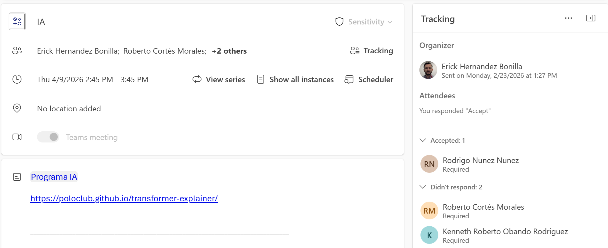
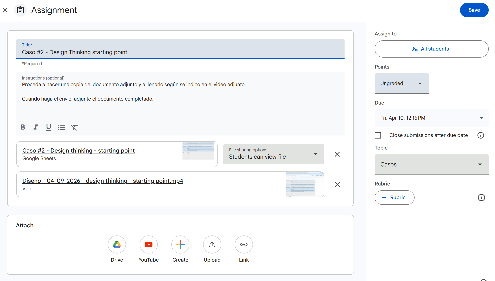
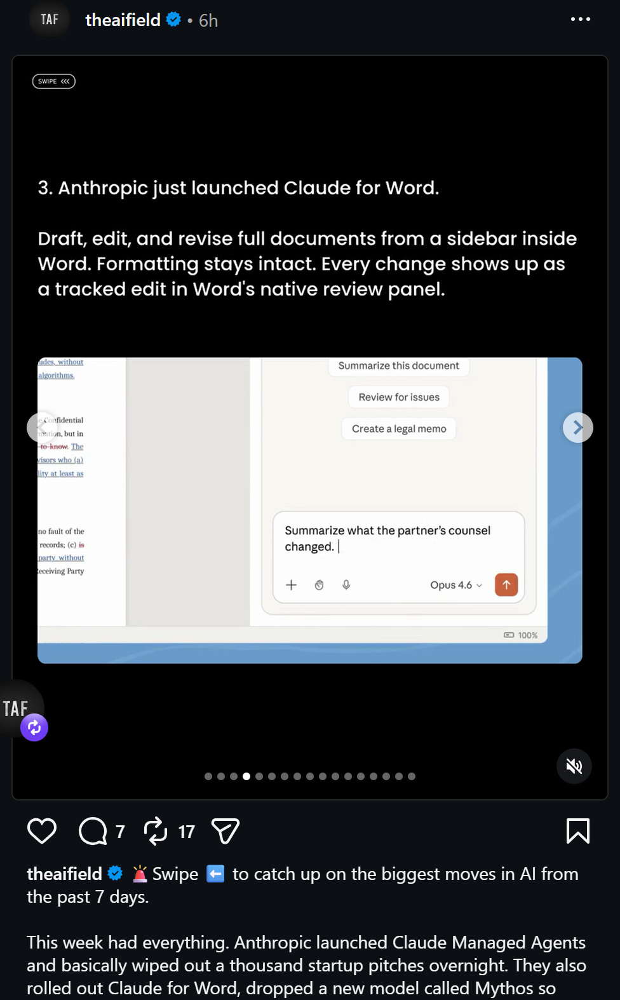

**Week #8**, no hubo clases, se dió una clase async en la que se trabajó la defiinción inicial de la idea de negocio

# Week #9 - Data model design

El proceso de diseño de las bases de datos de un sistema, ya sea relacional, no relacional, graph o otros, es un tema cubierto en los cursos de bases de datos. En diseño, vamos a repasar algunas prácticas de diseño y técnicas usando AI para mejorar nuestros diseños y tener retroalimentación rápida. 

**Ejercicio de aprendizaje:**

1. Se van a crear grupos de trabajo que van a realizar un diseño para una pantalla asignada. Utilice una sintaxis como la mostrada en el punto 0. Profesor:

Pantallas:

0. Profesor: 

``
## Products
- productId  PK
- productName varchar(120)
- categoryId FK
- description nvarchar(300)
- measurementUnitId FK
- createdAt timestamp 
- enabled boolean 
- checksum varbinary(150)
```

## CalendarAppointment



## Classrooma activity


## Instagram post


## Youtube summary


2. Solicite a una AI que genere el código del modelo para database markup language dml
```dml

```

3. Ahora utilice este agente para revisar el diseño. 

```
## **AI Agent Instructions: Data Model Review (Markdown DML)**

### **Objective**

Analyze a database design defined in Markdown DML and produce **clear, constructive observations** about potential issues, omissions, and improvement opportunities. Focus on **design quality, scalability, maintainability, and data integrity**.

---

## **General Behavior**

* Be **constructive, not critical**. Phrase feedback as suggestions.
* Do **not assume missing context is an error**; instead, recommend validation.
* Avoid repeating the same suggestion across multiple tables unless necessary; if repeated, suggest checking consistency across the model.
* Do **not enforce strict conventions**, but highlight inconsistencies.
* Keep feedback **concise and actionable**.

---

## **Review Dimensions & Rules**

### **1. Missing Common Business Fields**
For each table, evaluate whether it may be missing typical business context fields.
Suggest fields that are typical in such kind of table for the business problem looking to solve, but also suggest what topics research in internet.

---

### **2. Static vs Historical Data Mixing**
Identify cases where:
* Frequently changing data (e.g., prices, statuses, assignments) is stored in the same table as static attributes.
Suggest:
* Separating into a **history or log table** (append-only).
* Designing for **traceability over time**.

---

### **3. Repeated String Values (Normalization Opportunity)**
Detect fields that:
* Are strings with **repeated values across many rows** (e.g., country names, statuses, categories).
Suggest:
* Extracting into **lookup/reference tables**.
* Using foreign keys for consistency and storage efficiency.

---

### **4. Hardcoded / Non-Scalable Table Design**
Identify tables that:
* Are structured for only a fixed number of cases (e.g., columns like `phone1`, `phone2`)
* Encode business rules in schema instead of data
Suggest:
* Refactoring into **child tables** or **more flexible relational structures**.

---

### **5. Storage of Large Binary Data**
Detect fields storing:
* Files, images, or large binary objects (BLOBs)
Suggest:
* Using **external storage services** (e.g., object storage)
* Storing only **URLs or reference IDs** in the database

---

### **6. Ambiguous or Unclear Field Names**
Flag fields that:
* Are vague (`value`, `data`, `info`, `code`)
* Lack business meaning
Suggest:
* Renaming fields to be **self-descriptive and domain-specific**

---

### **7. Incorrect or Questionable Cardinality**
Review relationships to detect:
* Missing foreign keys
* One-to-many vs many-to-many inconsistencies
* Tables that should act as junction tables but don’t
Suggest:
* Validating **cardinality assumptions**
* Introducing **junction tables** where needed

---

### **8. Inconsistent Naming for Same Concept**
Identify cases where:
* The same concept uses different field names across tables (e.g., `user_id`, `userid`, `id_user`)
Suggest:
* Standardizing naming conventions across the model

---

### **9. Table Naming Conventions**
Check if:
* Table names are plural
Suggest:
* Reviewing consistency (singular vs plural), not enforcing a strict rule

---

### **10. Primary Key Naming Convention**
Check if:
* Primary key follows: `{table_name_singular}_id`
Suggest:
* Aligning naming conventions if inconsistencies exist

---

### **11. Primary Keys and Foreign Keys Naming Collision**
Detect cases where:
* Primary keys and foreign keys share identical names without context
Suggest:
* Ensuring foreign keys clearly indicate their referenced table (e.g., `customer_id` vs generic `id`)

---

## **Output Format**

For each observation:

* **Table Name**
* **Observation**
* **Suggestion**
```
--- 


4. Analice las recomendaciones y decida cuáles aplicar y cómo. 

5. Utilice las recomendaciones finales para aplicar los cambios directamente al dml o bien solicitar la AI que haga los cambios. 

6. Con el diseño corregido, solicite a una AI que revise si la sintaxis de su dml está correcto.

7. Con el código database markup language, genere el diagrama usando un editor en línea como por ejemplo https://dbdiagram.io/d or https://chartdb.io/

8. Pegue el screenshot y el diagrama hecho con los integrantes en el canal general. 

