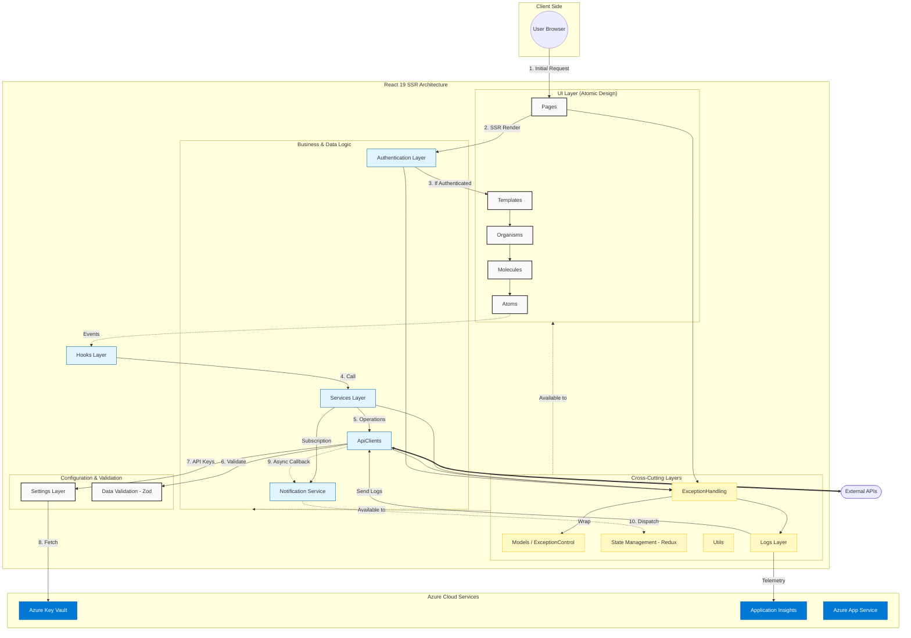

# Dua streamliner design 

**Author**: rodrigo nunez 

The current process of preparing the DUA is highly manual, time-consuming, and error-prone for importers and exporters. Information required to complete the document is typically scattered across multiple files such as Excel sheets, Word documents, PDFs, and scanned invoices. These documents often follow different structures and formats, making data extraction complex and heavily dependent on human interpretation. As a result, customs specialists spend significant time consolidating, validating, and transcribing information into the official template.

To address this challenge, the proposed solution is an automated system that requires only a folder path containing all relevant documents. The system will intelligently read multiple formats, extract both structured and unstructured data—including OCR from scanned images—and apply AI-driven semantic interpretation tailored to customs terminology. It will then automatically map the extracted information to the official DUA template defined by the Ministerio de Hacienda, validate basic consistency rules, and flag ambiguous or low-confidence fields for review.

The expected result is a fully pre-filled Word DUA document with visual confidence indicators that guide expert validation. This approach does not eliminate the customs specialist’s role but transforms it into a strategic review function, significantly reducing manual operational workload. Ultimately, the system aims to increase efficiency, reduce errors, accelerate processing times, and improve compliance accuracy in international trade operations.

# 1. Frontend design

## 1.1 Technology stack 

- Application type: server side rendering web app
- Web framework: reactjs version 19.2
- NodeJs version 21
- TypeScript 5.9.3
- Unit testing: Jest 30.2.0
- Zod 4.3.6 to data validation 
- Prettier 3.8.1
- eslint 10.0.2 
- Integration testing: Playwright version 1.58.2
- Cloud service: Azure cloud services
- Hosted by Azure App Service
- Code respositories by Azure DevOps
- Automated code tasks by Husky 9.1.7
- CI CD by Azure DevOps Pipelines
- Environments: development, stage and production
- Environment deployments Azure DevOps Environments
- Observability by Azure Application Insights SDK
- State management with redux 5.0.1

## 1.2 UX UI analysis 

### Core business process
Describir paso a paso lo que sucede en cada pantalla en términos de acciones (no hablen de botones, ni listas ni de ningún componente visual, solo acciones de usuario y el resultado de cada acción)

#### Login
1. El usuario ingresa su login, password y el one time token
2. Al intentar loguearse si falla, se le presenta un mensaje de user and pass invalido
3. Si es succed ....

#### Configurar el generador

#### Monitoreo del avance

#### Obtención del resultado / exportar

#### Logout 

### Wireframes
Con esos pasos anteriores le pido a una AI que me genere los screens y los pego aqui con un titulo, descripción y la imagen empotrada.

Login screen
The user can login into his account using the microsoft authentication screen

- Seleccionar el folder 
- Seleccionar la plantilla de DUA
- Cómo monitoreo el avance del proceso 
- Cómo se ve el resultado final

### UX test results
- escoger alguna app para ejecutar el UX test usando esos wireframes
- el test se lo van a aplicar en forma remota compartiendo un URL a 3 estudiantes o amigos
- eso va  generar un reporte de resultados

- crear un markdown table con los resultados
- Evidencias

- Heatmap

## 1.3 Component design strategy
- Use atomic design for basic and complex component design
- Centralize CSS styles in just one file per component type
- Class names patterns for CSS: ComponentName-StyleName
- Use only "em" positional units to support responsiveness in the design
- Components supports react-i18next 16.5.8
- There're not accesible requirements

## 1.4 Security 
- Multi-Factor Authentication (MFA) through **Azure Entra ID**.
- Mobile authenticator application only.
- Single Sign on Azure Entra ID
- Authentication is handled by Azure Entra ID.
- Roles: Manager, Customs Agent
- Permissions by Role:
  - **Manager**
    - Permission Code: `MANAGE_USERS`  
      - Description: Manage user crud
    - Permission Code: `VIEW_REPORTS`  
      - Description: Access operational and performance reports.
    - Permission Code: `EDIT_TEMPLATES`  
      - Description: Change or update DUA templates available
  - **Customs Agent**
    - Permission Code: `LOAD_FILES`  
      - Description: Set and upload a folder with data files. 
    - Permission Code: `GENERATE_DUA`  
      - Description: Starts the AI process of generating a DUA 
    - Permission Code: `DOWNLOAD_DUA`  
      - Description: Downloads the DUA generated
- Azure Key Vault is used to store Environment variables, API keys, Sensitive configuration data
- Server Name: `customsidentityserver`

## 1.5 Layered design:

## Adjusted Frontend Execution Workflow

* **Initial Request:** Handle initial page request via **SSR (Server-Side Rendering)**.
* **Session Guard:** Validate session; if unauthenticated, trigger the **Authentication Layer**.
* **Component Rendering:** Upon successful auth, render the UI using **Atomic Design** (Atoms → Pages).
* **Action Handling:** **Hooks** bridge UI components with the **Business Logic / Services Layer**.
* **Business Logic Execution:** **Services** perform application operations, consuming **Utils**, **Settings**, and **ApiClients**.
* **Configuration Access:** **Settings** fetch environment variables and API keys from **Azure Key Vault** during render.
* **Data Acquisition:** **ApiClients** execute external requests using configurations from **Settings**.
* **Data Integrity:** All **ApiClient** inputs and outputs use **Models** strictly enforced by the **DataValidation Layer**.
* **Async Communication:** Asynchronous API responses are handled via callbacks through the **Notification Service Layer**.
* **Event Subscription:** Layers subscribe to system events using callback URLs via the **Notification Service**.
* **Observability:** The **Logs Layer** records system events and transmits them through **ApiClients**.
* **Shared Resources:** **Models**, **Utils**, and **State Management** are accessible across all architectural layers.
**ExceptionHandling:** All classes access the ExceptionHandling to log errors and control fails, the Exceptions are wrap into a ExceptionControl class within the Model layer. 

based in the following architecture [## 1.1 Technology stack 

- Application type: server side rendering web app
- Web framework: reactjs version 19.2
- NodeJs version 21
- TypeScript 5.9.3
- Unit testing: Jest 30.2.0
- Zod 4.3.6 to data validation 
- Prettier 3.8.1
- eslint 10.0.2 
- Integration testing: Playwright version 1.58.2
- Cloud service: Azure cloud services
- Hosted by Azure App Service
- Code respositories by Azure DevOps
- Automated code tasks by Husky 9.1.7
- CI CD by Azure DevOps Pipelines
- Environments: development, stage and production
- Environment deployments Azure DevOps Environments
- Observability by Azure Application Insights SDK
- State management with redux 5.0.1
] and workflow architecture [* **Initial Request:** Handle initial page request via **SSR (Server-Side Rendering)**.
* **Session Guard:** Validate session; if unauthenticated, trigger the **Authentication Layer**.
* **Component Rendering:** Upon successful auth, render the UI using **Atomic Design** (Atoms → Pages).
* **Action Handling:** **Hooks** bridge UI components with the **Business Logic / Services Layer**.
* **Business Logic Execution:** **Services** perform application operations, consuming **Utils**, **Settings**, and **ApiClients**.
* **Configuration Access:** **Settings** fetch environment variables and API keys from **Azure Key Vault** during render.
* **Data Acquisition:** **ApiClients** execute external requests using configurations from **Settings**.
* **Data Integrity:** All **ApiClient** inputs and outputs use **Models** strictly enforced by the **DataValidation Layer**.
* **Async Communication:** Asynchronous API responses are handled via callbacks through the **Notification Service Layer**.
* **Event Subscription:** Layers subscribe to system events using callback URLs via the **Notification Service**.
* **Observability:** The **Logs Layer** records system events and transmits them through **ApiClients**.
* **Shared Resources:** **Models**, **Utils**, and **State Management** are accessible across all architectural layers.
**ExceptionHandling:** All classes access the ExceptionHandling to log errors and control fails, the Exceptions are wrap into a ExceptionControl class within the Model layer. 
] generate de architecture diagram for this azure solution with its symbols. 

## 1.6  Design patterns 
Diseño de classes con su respectiva ubicación en la estructura del proyecto, donde sea necesario aplicar patrones de diseño orientado a objetos, como por ejemplo: seguridad, refrescado de UI, recepción de notificaciones, almacenamiento de estados, llamadas a api, operaciones asíncronas, invalidación de sesiones, programación por eventos, creación de objetos. 

## 1.7 un folder en /src

que contiene el scaffold del proyecto, el cual se genera a partir de toda la especificación de los puntos del 1.1 al 1.6. 

# Backend design

# Data design