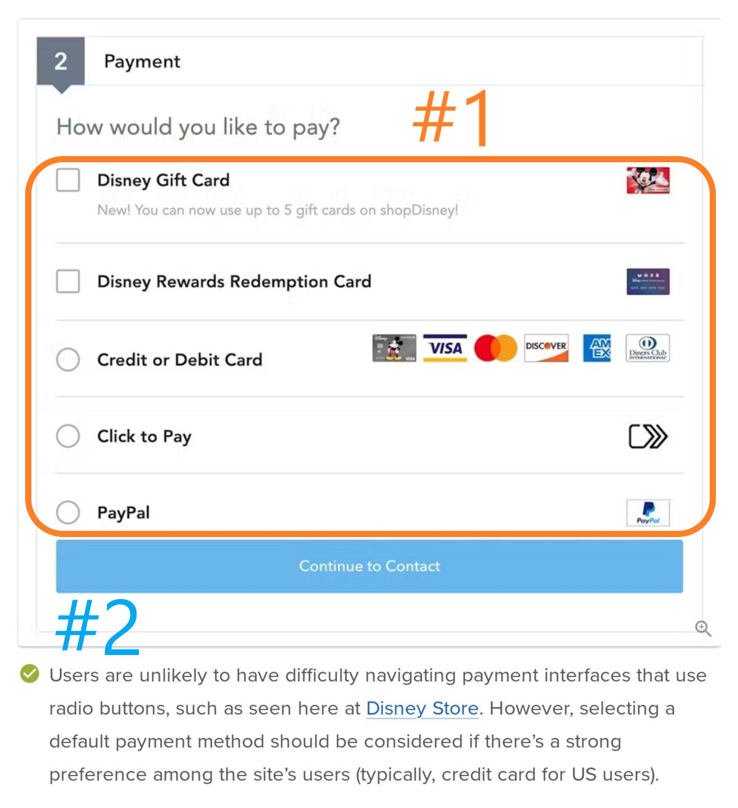

# caso #1, 10%, authorization and authentication

_instituto tecnológico de costa rica_, escuela de computación  
_diseño de software_  
_prof. rodrigo núñez_  
_tipo:_ individual

## descripción 
At the company GummyBears, there are several applications that are used both internally and externally. For years, they've used their own model for permissions per application/database. However, now they want to migrate everything to a cloud-based authentication/authorization service and are deciding which platform to use. For authentication, they are considering whether to use [Okta](https://www.okta.com/), [Auth0](https://auth0.com/), or [Firebase](https://firebase.google.com/). As for authorization, they are certain they will use [Okta Fine-Grained Authorization](https://auth0.com/fine-grained-authorization).

To evaluate which tool to use, you will conduct a proof of concept to familiarize yourself with the platform and understand the complexity involved in integrating these services' APIs into the existing applications. The proof of concept will be done using Postman to avoid programming, focusing solely on identifying the endpoints, requests, and responses that will need to be implemented in the future. Additionally, this will provide an understanding of what it takes to configure the chosen platform.

### Authentication
1. Investigate how authentication can be performed with pre-created users in the administrative console of the service among Okta, Auth0, and Firebase.

2. Choose a single service from those investigated to conduct the proof of concept. Create users with passwords, always using the resources provided by the service. It is not expected at any point that you will create a custom service with a tailor-made database.

3. Configure the selected cloud service for authentication and create at least four different users.

4. Using Postman, make a call to the respective endpoint to perform authentication via username, password, and client credentials. Keep in mind that for many of these services, Postman collections may already exist to facilitate this step. The response from this request should confirm that the login and password are correct, thereby confirming the receipt of the expected session token or access token. 

5. Once basic authentication is confirmed to be working, enable MFA or two-factor authentication, and make the respective API calls to log in and confirm the two-factor authentication.

### Authorization

Once the user is properly authenticated, authorization calls must be made. Configure your authorization rules as follows:

**User Groups:**
- **Marketing**: Can only access the CRM application.
- **Sales**: Can access both the CRM and Payments applications.
- **C-Level**: Can only access the CRM application.

**User Configuration:**
- There is at least one user who is only a member of Marketing.
- There are at least two users who are only members of Sales.
- There is one user who is only a member of C-Level.

Below are two screenshots corresponding to the two applications. They contain numbered markers indicating the permissions that need to be authorized within each app for the proof of concept.

### Screenshot of the GummyBears Payments Application

- **#1**: A permission or permissions that determine which payment methods the user is entitled to use. The two Sales users should be configured with different payment methods.
- **#2**: Permission to determine whether the user can access and modify the contact info. A Sales user will not have this permission.

### Screenshot of the GummyBears CRM Application

- **#3**: Permission to determine whether the user can see the two sales columns: *Sales Goals* and *Sales Amount*. Users in C-Level can see it, other groups cannot, but one specific Marketing user will have the right to see it. This permission is granted directly to the user, not to the group.
  
- **#4**: Permission to display the "Sales Target Progress" card. Only members of C-Level can see it.

#### To carry out the previous steps, a high-level guide is provided below

1. Access the FGA of Auth0 by Okta and create your free trial account.
2. Create your first authorization store.
3. Log in to the FGA dashboard.
4. Follow the getting started guide, design the model, and create the rule tuples.
5. Test the model and rules: ask if a group has a certain permission in a specific application, if a user has access permission in a particular application, or if a user has a certain permission in an application inherited from belonging to a specific group; both for failed and successful cases.
6. Once your model and rules are working, finalize the proof of concept by making the API calls from Postman.
7. Follow the steps in the dashboard to create a client. This client will only perform security checks and will not modify any authorization settings.
8. Once the client is created, you will have a model ID, client ID, and client secret.
9. Obtain an access token through the /oauth/token API, as described in the FGA API help instructions, always using Postman.
10. With the access token, proceed to make the checks, simulating the same tests from step 5 but through the API using Postman, /stores/{{store_id}}/check.

**Other reference links**

Okta Developer REST API Reference: https://developer.okta.com/docs/reference/rest/

**Final instructions**
Review dates: August 19, 20, and 21.
The professor will assign review appointments.

# caso #2, 7%, UX test un caso de la vida real

_instituto tecnológico de costa rica_, escuela de computación  
_diseño de software_  
_prof. rodrigo núñez_  
_tipo:_ grupos de 4 personas, aleatorios

## descripción

LightSoul es una empresa que instala iluminación de alta gama con un estilo futurista. Normalmente realizan las ventas desde una sofisticada aplicación web. El director de innovación los ha convocado a una reunión donde les quiere explicar una nueva idea que tiene para la aplicación de ventas, esto para que diseñen una primer versión del UI para este nuevo módulo. 

Se va a realizar el ejercicio simulando una situación del mundo real. El profesor durante 10 minutos será el director de innovación que les ha convocado a la reunión ejecutiva donde explicará esta nueva idea. Usted deberá tomar anotaciones y hacer preguntas, buscando tener la mayor claridad posible de la idea, pués, deberá diseñar el UI para este módulo y esta va a ser la única oportunidad de recabar información. 

1. El profesor procederá a armar los grupos en discord. 
2. Cada grupo deberá investigar qué herramientas podrían usarse para crear mockups/wireframes para una propuesta UI del módulo.
3. Utilice como un criterio de suma importancia el cómo podría testear la usabilidad de la interfaz UI propuesta por medio de algún servicio digital, donde pueda realizar pruebas asistidas por humanos para obtener resultados sobre el comportamiento y uso del UI propuesto.
4. Investigue al mismo tiempo, que resultados y en que formato se podría estar obteniendo de las pruebas de usabilidad.
5. Antes de proceder con el diseño del UI y posterior a investigar los puntos anteriores, presente al profesor una propuesta de en qué se haría el UI, cómo harían las pruebas de usabilidad y qué resultados estarían obteniendo, obtenga del profesor el visto bueno final antes de iniciar. 
6. Diseñen los mockups/wireframes del UI del módulo solicitado 
7. Realice las pruebas de usabilidad usando los mockups creados en la herramienta de creación y apoyandose en la herrmienta de testing de usabilidad.
8. Documente los resultados, errores, tendencias, comportamientos que revele el estudio de usabilidad. Recuerde que encontrar errores y que el UI falle, significa que el ejercicio fué muy bueno y está correcto.
9. documente en un readme.md file el UI, el proceso que se seguió para el test de usabilidad, los sujetos de prueba, los resultados obtenidos de las pruebas de usabilidad y un listado de las correciones que le harían al UI para mejorar los problemas encontrados. Realice la investigación respectiva para ver ejemplos de como mostrar esta información. 

Suba el MD file a un repositorio de git y envíe ese link como su entregable final del caso.
Fecha de entrega: viernes 30 de agosto, 8pm 
Email: vsurak@gmail.com 
Subject: Caso #2 - LightSoul
Contenido: link al repositorio de git con el readme.md, lista de integrantes 

# caso #3, 4%, entrevista para puesto de backend engineer

_instituto tecnológico de costa rica_, escuela de computación  
_diseño de software_  
_prof. rodrigo núñez_  
_tipo:_ individual 

## descripción
usted es un ingeniero de software especializado en backend, por más de 10 años ha trabajado en varias empresas y proyectos que han usado todas las tecnologías de backend presentes en este [artículo](https://ellow.io/top-10-backend-technologies-2024/). usted va a tener una entrevista de trabajo para un puesto de backend engineer, cree su curriculum ficticio utilizando una plantilla similar a las existentes en este [link](https://resumeworded.com/backend-developer-resume-example). asegúrese que en la experiencia laboral sea claro:
- el role que desempeñaba
- en que consistía el proyecto 
- el usó que le dió a cada una de las tecnologías requeridas en el proyecto para solucionar el reto

el objetivo es que entienda el role de todas esas tecnologías en proyectos de software, no tiene que estudiar o aprender ninguna de esas, con la información del artículo es suficiente. una vez que tenga su CV listo proceda:

1. enviar el CV a vsurak@gmail.com , con el subject: caso #3 - backend engineer
2. fecha máxima para enviar el CV el miércoles 11 de septiembre, 11-09-2024
3. [agende](https://outlook-sdf.office.com/bookwithme/user/7e85ed0aa69344e48d8dfd2b5da9d877%40akurey.com/meetingtype/3328d64e-3697-4577-b711-5dcc21a5ad02?bookingcode=3de07cc0-e5ea-4e94-8d1d-b03d3d27ca41&anonymous) la entrevista de trabajo para el puesto
4. durante la entrevista solo se le haran preguntas sobre las tecnologías del artículo, las cuales deben aparecer en el curriculum, espere preguntas del tipo:
- qué lenguaje de programación usaron para el backend del proyecto XYZ
- por qué utilizaron la tecnología X en el proyecto Y
- por qué utilizaron X y no Y en el proyecto Z
- que ventajas/desventajes tuvieron con la tecnología X en el proyecto Y
- explíque qué fué lo que se hizo tecnológicamente hablando en el proyecto X

# caso #4, 9%, conexiones de datos y concurrencia en REST

_instituto tecnológico de costa rica_, escuela de computación  
_diseño de software_  
_prof. rodrigo núñez_  
_tipo:_ grupos del proyecto 

## descripción

en conjunto con el profesor determine al menos uno de los motores de bases de datos a utilizar en su proyecto. luego investigue para algún lenguaje de su preferencia entre c#, java, go, python o typescript las tecnologías disponibles en ese lenguaje para la implementación de un servicio REST.

una vez que haya determinado tanto la base de datos, el lenguaje de programación y el framework para desarrollar el rest proceda:

1. cree una tabla o collection en la base de datos y llenela con 60000 registros ficticios
2. agregue un endpoint a su REST api que dado un query y o parámetros retorne aproximadamente un 35% de los registros
3. agregue otro endpoint a su REST api que haga exactamente lo mismo del punto #2 y que haga uso de un fixed size connection pool para el acceso de la base de datos
4. agregue otro endpoint a su REST api que haga exactamente lo mismo del punto #2 y #3 y agregue una cache por medio de un redis server, de tal forma que los parámetros del endpoint sirvan de llave para la cache, permitiendo que hayan cache hits y fails entre los requests
5. una vez terminado y probados los endpoints dockerice la solución, usando un container para el api, otro para redis y otro para la base de datos. utilice docker compose para dockerización. este paso se pudo haber hecho desde el paso #1.
6. utilizando postman o jmeter, proceda a ejecutar un test de stress sobre la solución implementada, atacando a los 3 endpoints, configure la prueba para que se simulen 20 clientes (threads) concurrentes haciendo los requests continuamente con una pausa de 233ms entre cada request de cada thread. la prueba completa corre durante 1 minuto.
7. extraiga los resultados obtenidos por el software de pruebas (jmeter o postman), de lo que tenga para monitorear conexiones de base de datos, cpu y memoria del lado de los servidores, tabule toda la información asegurándose de tener medidas de las variables:
- cpu, memoria y conexiones de la base de datos para cada endpoint
- cpu, memoria y conexiones de redis para cada endpoint
- cpu, memoria y conexiones del backend api para cada endpoint
- tiempo promedio de respuesta para cada endpoint
8. emita las conclusiones cuantitativas basadas en los resultados obtenidos que contrasten los cambios de rendimiento usando el framework seleccionado para REST, la incorporación de pool, y de cache respectivamente
9. suba todo el proyecto a un repositorio de git y documente todo lo anterior en el readme.md 

- fecha para el último commit: 29-09-2024, 29 de setiembre a las 10am
- la revisión será con cita con el profesor 
- cualquier sospecha de copia implicará una nota de cero

# caso #5

responder las siguientes preguntas en el canal general:

suponga que el 6 de noviembre debe realizar una presentación demo de su proyecto a unos inversionistas, que a la vez seran jueces de su proyecto, y debe cumplir que:

1. hace uso de alguna AI de alguna forma
2. accede al menos a un servicio de terceros,  que no es la AI
3. el demo pareciera como si estuviera funcionando y tiene un efecto "woow" para convercer a los inversionistas, pues va a pedir a los inversionistas fondos para financiar su proyecto
4. hay publicada en vivo un landing page del producto
5. asuma que alguno de los integrantes podría no abordar el caso

Cuál sería su estrategia para lograr lo anterior en el tiempo dado, Aclare cómo sería el demo, la presentación y el landing page. 
