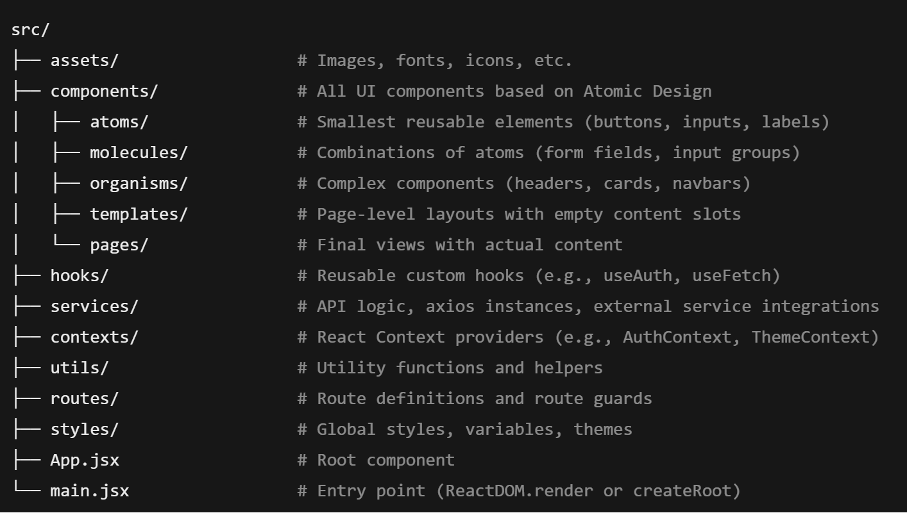

# Instituto Tecnológico de Costa Rica
**Profesor Rodrigo Nunez**
**Curso de diseño de software**
**Casos a resolver - 80%**

# Caso #1 - primer acercamiento al diseño de alto nivel, 10% 

A continuación se le va a presentar un conjunto de requerimientos de un software para dos sistemas, de los cuales solo va a trabajar en uno. Con ello usted va a realizar las preguntas que considere oportunas al cliente (profesor), con lo cual va a empezar a tomar decisiones de cómo se va a realizar el diseño de este sistema. Los pasos para completar este caso se irán dando conforme avancen las lecciones. 

## Title: Payment Assistant

**Descripción**

Imagina un asistente personal que no solo recuerda tus pagos recurrentes, sino que también los ejecuta por ti con solo confirmar un recordatorio. Con tecnología de inteligencia artificial de vanguardia, nuestra app te permite registrar y programar pagos de servicios como luz, agua, renta y más, usando simplemente tu voz. Olvídate de fechas vencidas, multas o estrés financiero. Además, con planes flexibles que se adaptan a tus necesidades, disfrutas de una experiencia gratuita para un pago mensual y opciones premium para múltiples transacciones.

**Requerimientos Funcionales**

1. **Interacción por Voz:**
   - La aplicación debe permitir al usuario registrar pagos recurrentes (electricidad, agua, renta, pólizas, préstamos, etc.) mediante comandos de voz.
   - Debe procesar y entender el lenguaje natural para capturar detalles como el nombre del servicio, monto, fecha de pago y frecuencia.
   - Debe confirmar con el usuario los detalles capturados antes de guardarlos.

2. **Configuración de Pagos:**
   - El usuario debe poder configurar cuentas bancarias de origen (nombre del banco, número de cuenta, saldo disponible, etc.).
   - Debe permitir la vinculación de APIs bancarias o servicios de pago para realizar transacciones automáticas.
   - El usuario debe poder editar o eliminar cuentas y pagos configurados.

3. **Recordatorios y Confirmaciones:**
   - La aplicación debe enviar notificaciones push o SMS cuando se acerque la fecha de pago.
   - El usuario debe confirmar el monto, la cuenta de origen y autorizar el pago antes de que se ejecute.
   - En caso de no recibir confirmación, la aplicación debe enviar recordatorios adicionales.

4. **Ejecución de Pagos:**
   - La aplicación debe realizar pagos automáticos una vez que el usuario confirme.
   - Debe manejar transacciones exitosas y fallidas, registrando el estado de cada una.
   - En caso de fallo, debe notificar al usuario y permitir reintentar el pago.

5. **Registro y Historial:**
   - La aplicación debe almacenar un historial completo de pagos realizados, incluyendo monto, fecha, cuenta de origen y estado (éxito/fallo).
   - Debe permitir al usuario consultar y filtrar el historial de transacciones.

6. **Integración con APIs y SMS:**
   - Debe integrarse con APIs bancarias o servicios de pago para realizar transacciones.
   - Debe enviar y recibir SMS para confirmaciones y autorizaciones de pagos.

7. **Planes y Monetización:**
   - La aplicación debe ser gratuita para un pago único al mes.
   - Debe ofrecer planes de suscripción basados en la cantidad de pagos y transferencias mensuales.
   - Debe gestionar la facturación y renovación automática de suscripciones.

**Requerimientos No Funcionales**

1. **Escalabilidad:**
   - La aplicación debe soportar 1,000 usuarios en fase beta y escalar a 100,000 usuarios en 6 meses.
   - El backend debe ser capaz de manejar picos de uso durante fechas de pago recurrentes.

2. **Seguridad:**
   - Todos los datos sensibles (cuentas bancarias, contraseñas, tokens de API) deben estar encriptados.
   - Debe cumplir con estándares de seguridad como PCI DSS para manejo de pagos.
   - Implementar autenticación de dos factores (2FA) para acceso a la aplicación.

3. **Rendimiento:**
   - La aplicación debe tener un tiempo de respuesta menor a 2 segundos para la mayoría de las operaciones.
   - Las notificaciones y recordatorios deben enviarse en tiempo real.

4. **Disponibilidad:**
   - La aplicación debe tener un uptime del 99.9%.
   - Debe implementarse un sistema de backup y recuperación ante desastres.

5. **Compatibilidad:**
   - Debe funcionar en las últimas versiones de Android (10+) e iOS (14+).
   - Debe ser compatible con diferentes dispositivos (smartphones y tablets).

6. **Usabilidad:**
   - La interfaz debe ser intuitiva y accesible para usuarios no técnicos.
   - Debe soportar múltiples idiomas (español, inglés, etc.).

**Requerimientos de Infraestructura**

1. **Hosting:**
   - Uso de servicios en la nube (AWS, Google Cloud, Azure) para alojar el backend y la base de datos.
   - Implementación de balanceadores de carga y autoescalado.

2. **Monitorización:**
   - Uso de herramientas como Prometheus, Grafana o New Relic para monitorizar el rendimiento y la disponibilidad.
   - Implementación de alertas automáticas para errores y fallos.

3. **CI/CD:**
   - Implementación de pipelines de integración y despliegue continuo (GitHub Actions, Jenkins, GitLab CI).

## Title: App assistant

**Descripción**

Esta es una herramienta que no solo simplifica la capacitación de tus empleados, sino que también se convierte en un asistente experto para guiar paso a paso en tareas complejas dentro de cualquier aplicación. Con nuestra innovadora solución, tus equipos pueden grabar tareas específicas usando comandos de voz y acciones en su computadora o teléfono, creando una base de conocimiento impulsada por inteligencia artificial. Desde agregar una cuenta favorita en un banco hasta cancelar una suscripción en Netflix, nuestra app aprende y replica estos procesos, ofreciendo asistencia en tiempo real cuando los usuarios más lo necesitan. Con planes flexibles que crecen junto a tu empresa, comienza con una tarea gratuita y escala según tus necesidades.

**Requerimientos Funcionales**

1. **Grabación de Tareas:**
   - La aplicación debe permitir a los usuarios grabar tareas mediante comandos de voz y capturar las acciones realizadas en la computadora o dispositivo móvil.
   - Debe soportar la grabación en segundo plano (background mode) para capturar tanto las indicaciones verbales como las interacciones en pantalla.
   - El usuario debe poder pausar, reanudar y finalizar la grabación de una tarea.

2. **Almacenamiento y Procesamiento de Datos:**
   - La aplicación debe almacenar las tareas grabadas en una base de datos estructurada.
   - Debe procesar las grabaciones para extraer pasos clave y generar un flujo de trabajo automatizado.
   - Los datos deben ser utilizados para entrenar un modelo de inteligencia artificial (IA) que pueda replicar y explicar las tareas.

3. **Asistencia en Tiempo Real:**
   - La aplicación debe detectar cuando un usuario está intentando realizar una tarea en una aplicación específica.
   - Debe ofrecer asistencia mediante notificaciones preguntando si el usuario necesita ayuda.
   - Si el usuario acepta, la aplicación debe guiar paso a paso, indicando qué hacer y a dónde ir dentro de la aplicación.

4. **Interfaz de Usuario:**
   - Debe proporcionar una interfaz intuitiva para grabar, editar y revisar tareas.
   - Los usuarios deben poder buscar y acceder a tareas previamente grabadas.

5. **Gestión de Empresas y Usuarios:**
   - La aplicación debe permitir la creación de cuentas para empresas y usuarios individuales.
   - Cada empresa debe poder gestionar sus tareas grabadas y asignar permisos a sus empleados.
   - Debe incluir un sistema de roles (admin, editor, usuario básico, etc).

6. **Planes y Monetización:**
   - La versión gratuita debe permitir grabar una tarea por empresa.
   - Debe ofrecer planes de pago basados en la cantidad de tareas grabadas y el número de usuarios.
   - Implementar un sistema de facturación recurrente y gestión de suscripciones.

**Requerimientos No Funcionales**

1. **Escalabilidad:**
   - La aplicación debe soportar 900 usuarios en la fase beta y escalar a 500,000 usuarios en dos años.
   - El backend debe ser capaz de manejar múltiples grabaciones y solicitudes de asistencia simultáneamente.

2. **Seguridad:**
   - Todos los datos sensibles grabados deben estar encriptados tanto en tránsito como en reposo.
   - Debe cumplir con regulaciones de privacidad como GDPR (Europa) y CCPA (California).
   - Implementar autenticación de dos factores (2FA).

3. **Rendimiento:**
   - La aplicación debe tener un tiempo de respuesta menor a 3 segundos para la mayoría de las operaciones.
   - Las grabaciones y procesamientos de IA deben realizarse sin afectar el rendimiento del dispositivo.

4. **Compatibilidad:**
   - Debe funcionar en sistemas operativos Windows, macOS, iOS y Android.
   - Debe ser compatible con navegadores web (como Chrome, Firefox, Safari) si se implementa como plugin.
   - Debe soportar integración con aplicaciones comunes (bancos, Netflix, erp, sap, web apps, etc.).

5. **Usabilidad:**
   - La interfaz debe ser intuitiva y accesible para usuarios no técnicos.
   - Debe incluir tutoriales y guías para facilitar la adopción de la aplicación.

**Requerimientos de Infraestructura**

1. **Hosting:**
   - Uso de servicios en la nube (AWS, Google Cloud, Azure) para alojar el backend y la base de datos.
   - Implementación de balanceadores de carga y autoescalado para manejar picos de uso.

2. **Monitorización:**
   - Uso de herramientas como Prometheus, Grafana o New Relic para monitorizar el rendimiento y la disponibilidad.
   - Implementación de alertas automáticas para errores y fallos.

3. **CI/CD:**
   - Implementación de pipelines de integración y despliegue continuo (GitHub Actions, Jenkins, GitLab CI).

## Entregable #1 - 3%

1. el profesor va a crear parejas de trabajo en forma aleatoria

2. la pareja, como ingenieros consultores, están en el predicamente de obtener del cliente tanta información como sea posible sobre el sistema, busque siempre simplificar los problemas del cliente para que también su diseño y solución se reduzca lo más posible.

3. Para el martes 25 de febrero, envíe un mensaje de discord al cliente, con el cuestionario de preguntas sobre el sistema. 

4. Obtenga las respuetas del cliente esa misma semana

5. Para el viernes 28 antes de las 5pm, envíe en un mensaje al profesor los una aproximación inicial a muy alto nivel de cómo ustedes como consultores ven diseñada esta solución, incluyendo en el mensaje: 

a) retos principales y más complejos de esta aplicación 

b) determinar la lista de requerimientos que va a ser imposible lograr en un 100% (del todo no, o si es parcialmente especificar lo que podrían alcanzar hacer) 

c) listar las tecnologías lenguajes, frameworks, servicios y plataformas respectivas para: frontend/mobile, backend, bases de datos, AI, 3rd parties, cloud/hosting, devops y QA. Justique el uso de cada item dentro del app, escribiendo la responsabilidad que va a tener dentro del sistema. Por ejemplo:  react/native, para generar el código del app mobile tanto en android como en ios.  

## Entregable #2 - 7%

1. Investigue como realizar un goal map en referencia a técnicas como google sprint o design thinking 

2. Proceda a crear un goal diagram ubicando el objetivo principal del sistema lo más a la derecha del diagrama y las entidades involucradas a la izquierda. Rellene el workflow del mapa y diagramelo en alguna herramienta que se lo permita. 

3. Determine entonces usando ese mapa cuales son los estados que garantizan el éxito del sistema, aquellos puntos que son más valiosos para lograr el objetivo principal del sistema, los cuales van a hacer que el usuario acepte o no el uso de esta aplicación.

4. Una vez determinados los más importantes, listelos y proceda a diseñar las pantallas de su sistema que realizarían dichos flujos del mapa.

5. Diseñe los wireframes en blanco y negro de las pantallas necesarias para esos flujos prioridad #1 para el negocio.

6. Cree las pantallas a modo mockup o mimic utilizando alguna AI que genere código en el lenguaje que haya seleccionado en el entregable #1. Si ninguna AI genera para ese lenguaje, entonces proceda a utilizar plantillas para crear las pantallas diseñadas. 

7. Proceda a realizar un test de usabilidad con al menos 3 personas (que no sean estudiantes del Tec), de las pantallas diseñadas utilizando alguna herramienta de testing de usuabilidad digital en la nube, recopile los resultados. 

8. Documenten todo el entregable del punto 1 al 7 en un md file en github, dividiendose el trabajo a su criterio. Debe ser evidente los commits de cada integrante en las diversas secciones del documento md. Solo un md file. En la documentación debe dejar claro las evidencias de que las pruebas de usabilidad se hicieron con personas reales no estudiantes del Tec. Fotografías de personas frente a una computadora no es evidencia, no debe caber duda en la evidencia de que esa persona hizo esa prueba. 

9. La revisión será con el profesor, y se espera que cualquier miembro del grupo de trabajo sea capaz de defender, explicar y realizar raciocinios y conclusiones sobre todo el entregable, de lo contrario se le asignará una nota de cero.

La entrega será enviándole al profesor un correo con los integrantes y el link al url público de github el cual contiene el MD file, fecha máxima para la entrega domingo 9 de marzo, 10pm.  Fecha límite para consultas viernes 7 de marzo a medio día. 

# Caso #2 - diseño del FE y BE, 20% 

El caso #2 se realizará en grupos de 3 a 4 personas máximo, los estudiantes deciden como armar los grupos y no es necesario mantener la pareja anterior. Los grupos se deben reunir y analizar los resultados y diseños hechos en el caso #1, rescatar aquello que sea más aprovechable para este siguiente entregable. Si en el grupo quedan integrantes de payment assistant y app assistant mezclados, deben decidir como grupo a cuál plataforma entregarse. 

Este caso pretende completar aspectos del diseño de objetos y arquitectónicos de la solución. El profesor dará una inducción sobre diagramas de arquitectura y sus diseños para que tengamos una base de lo que se quiere lograr principalmente.

En el caso #1 entregable #1, los integrantes habían sacado una primer aproximación de las tecnologías que se pretendían usar para la implementación de la solución, al crear estos nuevos grupos, reúnase con sus compañeros y consoliden un stack. Al igual que en los entregables anteriores, cree un repositorio en gihub que pueda acceder todos los miembros del grupo y creer una estructura inicial y proceda a ir creando las diferentes secciones, toda la documentación esta vez será en inglés.

Estructura sugerida :

- "# System name - set your own name" 

- "*Members* - list the names of the group members" 

- "## Description: Write a brief description of the system, highlighting its strengths"

- "## Stack: write down the final stack to be use decided for the group"

- "## Frontend design specifications"

- "### Authentication platform", Conduct research to determine which service platform you will use for authentication, ensuring that it offers at least: 

   a) login y password 

   b) login y password automatic screen generation or SDK for screen generation 

   c) compatible with your FE programming language  

   d) access by API available 

   e) MFA and a sandbox for testing purpose 
   

- Using a demo code, proceed to test how the chosen platform works and how the login screen can be customized. Document this process in the MD file. The demo code must be use in the selected programming language of the FE, and the source code stored in the repository

- Using Postman, make API calls to simulate authentication with MFA. Document the process and save your own Postman collection for future review. Link this file in the document and stored it in the repository. 

- suggested platforms to look into: auth0, okta, cognito, MS entra, onelogin, firebase, veriam

Following the same document structure, at heading level 3 (###), complete the following frontend (FE) designs:

### Client architecture  

Determine whether your client will follow a client-server or N-layer architecture. Additionally, specify the technology that will be used to implement this architecture. In this section, also indicate whether mobile development will be native or hybrid (shared code base). In the case of a web app, determine whether it will use client-side rendering or server-side rendering:

   - client server: PHP+Laravel, Ruby on Rails, Asp.net, python+Django, python+Flask, ReactJS+NextJS, Java+JSF y similares. (Only server side rendering)

   - N layer: siempre requiere uso de APIs, PHP, Asp.Net, python+Django, python+Flask, ReactJS, ReactJS+NextJS, ReactNative, Angular, Swift, Kotlin y similares. (both CSR y SSR is achievable)

### Visual Components 

In this section, clarify all the design patterns and strategies that will be strictly followed to design and build the visual components of your application. Keep in mind that many of these techniques may or may not apply to the technologies chosen in the previous step. Research and select the approaches that best suit your project’s needs. For example: 

*Patterns & Principles:* 

   - Solid principle (must) 

   - Dry principle (must) 

   - Separation of concern (must) 

   - Responsive Design (must) 

   - Atomic Design (all) 

   - MVC (all), MVP (android), MVVM (WPF, Angular, React) 

   - State management pattern (web): redux, vuex 

*Toolkits and standards:*  

   - Jetpack compose (kotlin) 

   - Material design (kotlin) 

   - Swift UI declarative (swift) 

   - Apple HIG  

   - https://developer.apple.com/design/human-interface-guidelines 

   - netlify, amplify, tailwind, vercel

   - bootstrap  

   - storybook 

   - Chakra UI 

### Object design patterns

In this section, proceed to create a class design diagram using a simplified UML, focusing on classes, attributes, methods, packages, and associations. Where applicable, apply object-oriented design patterns, and use colors or boxes to visually group the classes involved in each pattern.

Refer to the catalog of design patterns at: 

👉 https://refactoring.guru/design-patterns/catalog

### External services 

Design this section using boxes and brief explanations within the document to describe all components in the frontend architecture responsible for:

- Handling the interaction between UI components and client-side business logic. In many cases, the technologies chosen above already define the proper components and layers to achieve this. 

- Managing connectivity with third-party services such as: 

   - Authentication and authorization providers

   - SaaS platforms

   - Cloud storage solutions

   - External APIs

   - Any other external services required by the application

### Project structure 

Finally, paste and document the structure of your frontend project, specifying the base folders and explaining what each folder should contain, similar to the example below:

### Final FE architecture diagram 

Create a final unified diagram using a tool like Miro, covering all parts of the **Frontend Design** section:  

- **Stack, technologies, patterns, protocols**  
- **Association and responsibility arrows**  
- **Color-coded layers**  
- **Principle indicators**  
- **Class diagram with design patterns**  
- **Helpers, architecture, and rendering**  

The diagram can be **top-down or left-right**. Embed this diagram in the **MD file** under this section.  

## **Backend Design Specifications**  

Before designing the backend, you will complete a small **serverless API deployment exercise** using **AWS and Serverless Framework**. This will help clarify how to architect your backend.  

The professor has provided a **Serverless Framework API template** located at:  
[`src/svlesstemplate`](src/svlesstemplate)  

Currently, the template uses:  
- **Two handlers**  
- **One middleware class**  
- **One repository class**  

Modify this template to fit your **Case #2 design**, considering the following recommendations:  

1. **Handler Responsibilities (SOLID & Cohesion Principle)**  
   - Multiple handlers should have **clearly distinct responsibilities** (currently unclear in the template).  
   
2. **README.md Fixes & Adjustments**  
   - Improve the readme.md by document any issues you encountered and the fixes applied.  

3. **Logger Improvements (Design Pattern Required)**  
   - Replace `console.log` with **CloudWatch, persistent storage, or third-party logging**.  
   - The logger should be **agnostic**, allowing different logger implementations (use an **object design pattern**).  

4. **Optional & Mandatory Middleware (Design Pattern Required)**  
   - Middleware should be **optional** and allow **chaining multiple middleware**.  
   - Some middleware (e.g., **authentication**) should be **mandatory** (use a **design pattern** to enforce this).  

5. **Repository Layer Improvements (Decoupling & Reusability)**  
   - Handlers **should not directly access repositories**.  
   - Introduce a **business logic layer** between handlers and repositories.  
   - Support **multiple repositories** (different data sources: DBs, APIs, etc.).  
   - Ensure **transparency** for handlers (prepare for **serverless & microservices**).  

6. **Deployment & Testing**  
   - Implement **two test functions** in the new serverless template (one for each handler).  
   - Read different data from a **cloud database** in both functions.
   - **Deploy to AWS**.  
   - Create a **Postman collection** to test the deployed API.  

### **Proof of Concepts**  
Add a **"Proof of Concepts"** subsection under **Backend design**. Document each of the **6 points above**, explaining:  
- **Challenge faced**  
- **Solution chosen**  
- **Advantages over the original template**  

Format:  
- **POC Step 1**  
- **POC Step N**  
...and so on.  

### **Backend Architecture**  
In this section, analyze and decide on the following architectures:  

1. **REST, GraphQL, gRPC, Monolithic, or Monolithic-MVC?**  
   - Which **internal layers** will handle requests/responses?  
   - How do **object design patterns** interact with requests or any other triger   

2. **Serverless, Cloud, On-Premise, or Hybrid?**  
   - Determine **hardware demands** and **cloud machine types**.  
   - Impacts **frameworks, libraries, and programming languages**. Enlist which ones and what are the advantages

3. **Service vs. Microservices?**  
   - Defines **logical divisions** for workload distribution.  
   - It affects **code organization** and **team collaboration**, how to handle it

4. **Event-Driven, Queues, Brokers, Producer/Consumer, Pub/Sub?**  
   - Identify which parts need these architectures.  
   - Map **cloud services** that provide these features.  
   - Define **integration layers and classes**.  

5. **API Gateway (Security & Scalability)?**  
   - Decide if an **API Gateway** is needed.  
   - Choose the **cloud service** that supports it.  
   - How it support security and scalability 

### **Data Layer Design**  
Make all design decisions specified in:  
[**Data Layer Design**](https://github.com/vsurak/cursostec/blob/master/diseno/3.%20dise%C3%B1o%20de%20la%20l%C3%B3gica%20y%20los%20datos%2C%20o%20backend%20y%20data.md#dise%C3%B1o-de-la-capa-de-datos)  

Each decision must analyze at least:  
1. **Cloud service technology**  
2. **Object-oriented design patterns**  
3. **Class layers for data access**  
4. **Configuration policies/rules**  
5. **Expected benefits**  

## **Architecture Design**  

At this point, you have documented all decisions in the previous sections in a **markdown architecture document**. Now, create a **single, detailed architecture diagram** of the **entire system solution**, ensuring:  

- **All designed layers are shown**  
- **Object patterns & involved classes per layer**  
- **System behavior under external stimuli**  
- **Required cloud services & libraries**  
- **Architectural patterns used**  
- **Consistent color/symbol coding**  
- **Top-down or left-right structure**  
- **Communication protocols & cloud zones**  
- **Key architecture attributes**  
- **Clear communication of analysis results**  

## **Architecture Compliance Matrix**  

Create a **matrix** where:  
- **Rows** = Non-functional requirements + top 3 functional requirements.  
- **Columns** = Key architectural components/decisions.  

Fill the matrix with **X/marks** to show which parts of the architecture fulfill each requirement.  

### **Delivery Deadline for Full Design: Sunday, April 27th**  
### **Last Consultation Date: Sunday, April 26th**  

#### **Deliverables:**  
1. **GitHub repository**  
2. **Markdown (MD) file** in the repository containing:  
   - The complete architecture design for this case.  
   - All sections outlined previously.  
   - **Commit history** reflecting contributions from all team members throughout the case resolution.  
3. **All supporting files**, including:  
   - Images (diagrams, screenshots).  
   - Postman collections.  
   - Scripts, PDFs, or any other necessary files.  
4. **Submission email** to the professor with:  
   - Repository link.  
   - Group name and member list.  

#### **Review Process:**  
- Scheduled meetings with the professor **starting May 2nd**.  

# Caso #3 - Data Pura Vida - 50% 

Durante años, Costa Rica ha enfrentado una limitación estructural importante: la ausencia de un sistema centralizado de datos que facilite el acceso, análisis y aprovechamiento de la información por parte de diversos actores. Actualmente no existe un ecosistema nacional que permita a personas, instituciones públicas, poderes del Estado, organizaciones sociales y al sector privado compartir, reutilizar y comercializar información de forma estructurada. Esta fragmentación ha dificultado la toma de decisiones basadas en evidencia, ha ralentizado los procesos institucionales y ha limitado el desarrollo de soluciones innovadoras que podrían surgir del uso estratégico de datos.

Frente a este desafío, se propone la creación de un ecosistema nacional de datos interoperables, seguros y regulados, en el que tanto entidades públicas como privadas puedan aportar y utilizar información de valor. Este sistema permitiría clasificar los datos según su naturaleza: abiertos o de acceso restringido, gratuitos o sujetos a un modelo de cobro según su uso. Se establecerían estándares robustos de seguridad y privacidad para garantizar la protección de la información sensible y el cumplimiento normativo. El objetivo es habilitar un entorno en el que datos confiables puedan ser utilizados para generar nuevas aplicaciones, productos tecnológicos y servicios basados en ciencia de datos e inteligencia artificial.

Con la implementación de este ecosistema, Costa Rica podría dar un salto hacia una economía y un gobierno dirigidos por datos reales. Las instituciones optimizarían sus procesos, el sector privado encontraría nuevas oportunidades de innovación y colaboración, y la ciudadanía tendría acceso a información útil y transparente. Además, la coexistencia de datos públicos y privados, gestionados bajo esquemas claros y seguros, abriría un espacio dinámico para el desarrollo tecnológico y la transformación digital sostenible del país.

## Requerimientos de la plataforma

### Portal Data Pura Vida 

**Portal Web Esperado para la Plataforma *Data Pura Vida***

**bio registro verde**
Esta sección es el punto de entrada al ecosistema *Data Pura Vida*, donde toda persona física o jurídica interesada en participar debe registrarse. Está orientada a validar de manera segura y confiable la identidad y capacidad de los usuarios y organizaciones para operar dentro de la plataforma, estableciendo mecanismos de autenticación avanzada y validación documental automatizada por inteligencia artificial.

* Permitir el registro de personas físicas, jurídicas, instituciones, cámaras, grupos y empresas
* Solicitar datos diferenciados según el tipo de entidad: información personal, societaria, legal y tributaria
* Incluir validación interna previa a la aprobación del registro, marcando los registros como pendientes
* Implementar IA para verificar la completitud y validez de los documentos subidos
* Exigir que los representantes se registren como individuos con identidad digital, biometría, prueba de vida y autenticación multifactor (MFA)
* Asignar llaves de seguridad a organizaciones para delegar o revocar accesos de usuarios asociados
* Permitir que una persona administre múltiples organizaciones desde una misma cuenta
* Capturar datos preliminares de cuentas IBAN y/o tarjetas de crédito como parte del proceso de registro
* Notificar por correo electrónico una vez el registro ha sido validado y aprobado
* Exigir documentos como cédulas físicas o jurídicas, actas, registros tributarios, direcciones y más según el tipo de entidad
* Adaptar dinámicamente los formularios y campos requeridos según la categoría de registro
* Establecer validaciones inteligentes por IA personalizadas a los requisitos según el tipo de usuario o entidad
* Restringir el acceso al portal solo desde direcciones IP ubicadas en Costa Rica
* Permitir el registro de IPs institucionales o listas blancas para acceso autorizado
* Generar claves criptográficas simétricas y asimétricas para cada entidad/persona
* Proteger claves con un sistema de llave tripartita, distribuyendo una parte a Data Pura Vida y las otras dos a custodios definidos

**Feliz compartiendo datos**
Esta sección permite que las personas, instituciones y organizaciones definan cómo desean compartir sus datos dentro del ecosistema, garantizando control, seguridad, privacidad y versatilidad en la forma de carga y disponibilidad de los datos. Se habilitan múltiples mecanismos de publicación y se integran procesos inteligentes para garantizar la calidad, gobernanza y utilidad de la información.

* Permitir a los usuarios decidir qué datos compartir dentro del ecosistema
* Soportar múltiples formatos de carga: archivos Excel, CSV, JSON, APIs y conexiones directas a bases de datos SQL y NoSQL
* Configurar los parámetros de conexión de forma cifrada para cada medio de carga de datos
* Requerir nombre, descripción y metadata útil para IA sobre las columnas del dataset
* Validar el formato, estructura y contenido de cada dataset compartido
* Configurar si el dataset es público o privado, gratuito o pagado, permanente o con disponibilidad temporal
* Permitir definir montos de acceso para datasets con modelo de cobro
* Habilitar control granular sobre el acceso por institución, persona o grupo de actores
* Permitir seleccionar campos específicos a cifrar dentro del dataset
* Restringir acceso a datos por límites de tiempo, volumen o frecuencia de consulta
* Requerir que cada dataset tenga un nombre único
* Especificar columnas que relacionan un dataset con otro si existen relaciones entre ellos
* Asignar permisos de acceso a los datasets privados
* Definir si los datos son de solo lectura o también escritura, y el mecanismo para escritura (API, archivo o conexión directa)
* Indicar si la carga de datos es única o recurrente, completa o por deltas
* Configurar parámetros para los deltas: campos diferenciales, frecuencia por "timed pull" o por notificación mediante callbacks
* Automatizar el proceso de carga de datos mediante un motor de IA que aplique un flujo ETDL: extracción, transformación, limpieza, detección de contexto, modelado y carga
* Detectar y evitar duplicidades, optimizar relaciones con datos ya existentes y ajustar el modelo de datos en función de las interrelaciones
* Monitorear todo el proceso con métricas de transferencia, carga, limpieza, eliminación, modelado, volumen, datos omitidos, datos consultados y tasa de éxito
* Incluir un módulo de compra donde los usuarios puedan visualizar datasets disponibles con acceso pagado
* Permitir seleccionar el dataset de interés, ver el precio, términos de uso, duración del acceso y condiciones de cobro
* Soportar múltiples métodos de pago: tarjeta de crédito, débito y otros mecanismos nacionales compatibles
* Asignar automáticamente los permisos correspondientes al usuario tras la confirmación de pago
* Mostrar confirmaciones claras de transacción y activar el acceso conforme a las condiciones acordadas (tiempo, volumen, frecuencia)
* Asociar el acceso adquirido a los dashboards del usuario para permitir su uso inmediato
* Todos los datos cargados deben estar protegidos contra los ingenieros de la plataforma en forma cifrada o cifrada el area de acceso 

**Descubriendo Costa Rica**
Esta es la sección central del portal donde los usuarios exploran, visualizan y analizan la información consolidada. Actúa como una ventana a los datos del país, permitiendo construir dashboards personalizados mediante interacción manual o con ayuda de IA, siempre bajo un modelo seguro de consulta sin exportación directa.

* Visualizar todos los datos accesibles como una fuente consolidada
* Construir dashboards manualmente o mediante prompts inteligentes que generen visualizaciones automáticas
* Permitir representación gráfica en forma de tablas, gráficos, conteos, tendencias y predicciones
* Impedir la descarga directa de datos en cualquier momento
* Mostrar datos de forma preliminar en modo de construcción de dashboard y luego con datos reales al ejecutar consultas
* Bloquear exportaciones de gráficos y contenidos; todo se visualiza exclusivamente dentro del portal
* Permitir a los usuarios guardar sus dashboards personalizados
* Habilitar la opción de compartir dashboards entre usuarios o con visibilidad pública dentro de la plataforma
* Visualizar en tiempo real el consumo de los datos pagados dentro de los dashboards construidos
* Mostrar métricas de consumo como: volumen de datos consultados, número de consultas realizadas, tiempo restante o límite alcanzado
* En caso de superar el límite de uso, deshabilitar temporalmente el acceso y mostrar opciones para renovar o ampliar el paquete adquirido
* Registrar todas las transacciones y consumos en un historial accesible por el usuario para consulta y auditoría interna
