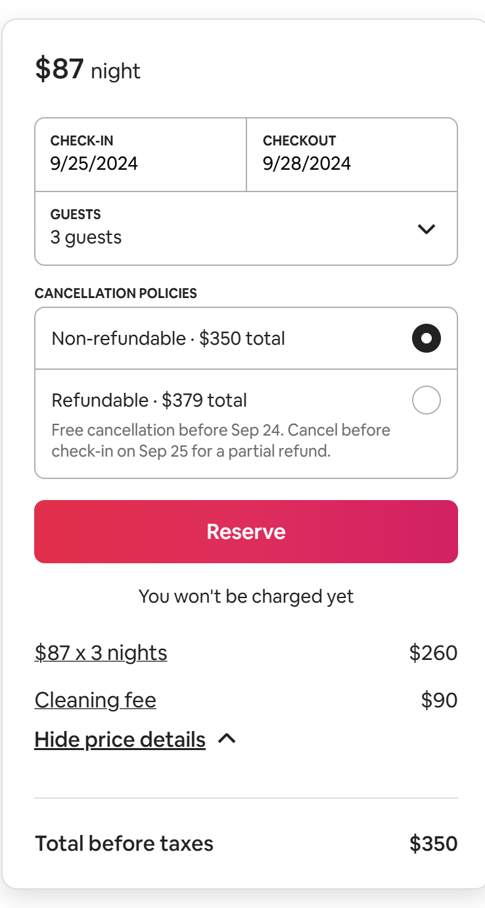
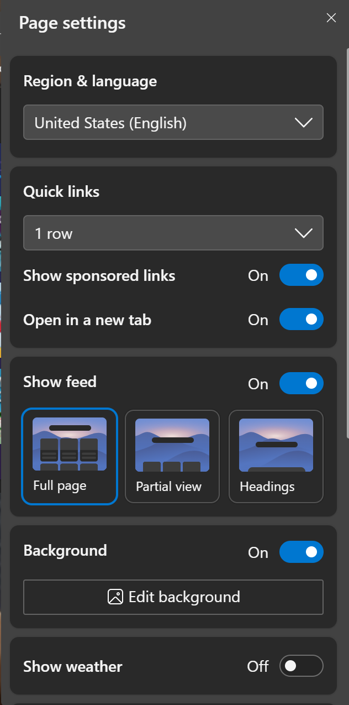
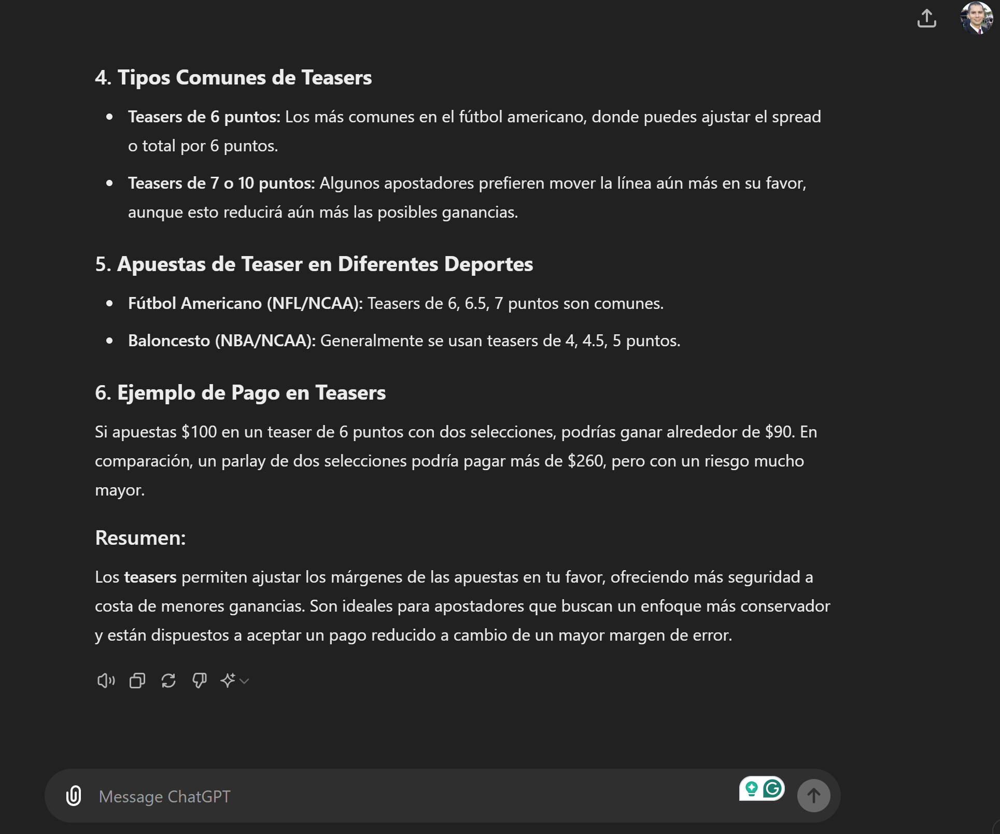
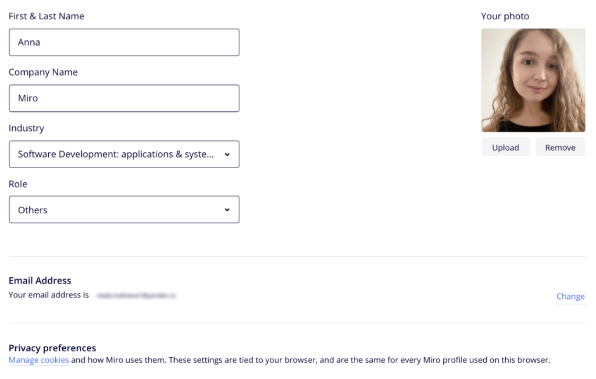

# Ejercicios teóricos, prácticos, sprints y pruebas de conceptos cortas

## Ejercicio #1 - patrones de diseño orientado a objetos parte I

El profesor va armar grupos de trabajo de forma aleatoria y a cada grupo se le va a asignar uno de los siguientes problemas. Realice el diseño de un esquema de las classes principales que se requieren para resolver el problema en cuestión, tomando en cuenta que debe utilizar al menos uno y máximo dos patrones de diseño de objetos de los ofrecidos en cada problema. 

Lectura de soporte y ejemplo: https://refactoring.guru/design-patterns/catalog

### Problema: ThinkTogether
El software de reuniones virtuales ThinkTogether actualmente solo soporta video llamadas con uso de cámara y micrófono. Sin embargo los dueños han hecho una fuerte inversión de capital para habilitarle funcionalidades nuevas:
- un bot va a generar las notas de la reunión completas
- se le va agregar un chat
- otro proceso se va encargar de resumir los puntos más importantes y las acciones por participante de la reunión 
- según como se configure la plataforma en la organización dichas anotaciones podrían estarse enviando por mail, o slack o el chat de la herramienta o alguna otra herramienta custom por medio de un hook en Rest
- se sabe que podrían existir multiples tipos de senders y multiples APIs de AI para implementar las nuevas funcionalidades

_patrones disponibles:_ command, mediator, chain of responsability
 

### Problema: SalmaDraw
El software de ilustración SalmaDraw se ha extendido en su uso en multiples dispositivos como apple computers, ipad, android tables, pc y algunos smartphones de pantalla grande. Sin embargo no todas las funcionalidades pueden operar de la misma manera dependiendo del hardware y el sistema operativo. Por ejemplo texturizar se podría hacer pixel perfect o algunas veces aplicarle algoritmos para hacer ajustes. Texturas generativas algunas veces las genera de cierto tamaño de resolución en otras ocaciones usa técnicas basados en texturas ya existentes. Según los puntos de presión del pen, las herramientas de dibujo podrían requerir correr algoritmos adicionales para hacer las líneas , contornos, rellenos y similares. Si cuenta con GPU o no, los filtros podrían ser básicos o usar nuevos con AI.  

_patrones disponibles:_ visitor, decorator, chain of responsability

## ejercicio #2 - dependency injection

Ellivhsan es una plataforma web de shopping en línea que vende productos para el cuidado facial y corporal, actualmente lleva 2 años en el mercado con mucho éxito. Desde que se creó, su arquitecta y product owner, la ingeniera Julieth, decidió que se iba a realizar bajo el modelo de server side rendering. Con el paso de los años, Julieth ha tenido que enfrentar los ajustes de CSS y JS para poder ofrecer una plataforma que sea totalmente responsive. Cuando llegan los request http al servidor con el respectivo path, llegan especificaciones del dispositivo cliente para que así los CSS y JS hagan los ajustes de responsive. Este approach ha funcionado muy bien, sin embargo ahora Julieth quiere llevar esto un poco más allá y no está satisfecha con solo entregar responsive a los frontend que buscan acomodar cosa por tamaño y reacomodar contenido, por el contrario, ahora quiere que dependiendo del dispositivo del cliente pueda ofrecer experiencias únicas según el device, como movimiento con giroscopio, 360, manipulación de video, generar instructivos de uso de los productos, dotar de espacios para hacer consultas a bots con AI y muchas otras funcionalidades. Dado que ahora no se trata únicamente de responsive si no de hacer render de las páginas en forma más especializada, Julieth ha optado por transformar el handling de los request http a un approach de dependency injection, de tal forma que la información proveniente del cliente respectivo, permita establecer cuál render sea más efectivo para generar la respuesta de formato ideal y se pueda crear una experiencia mucho más enriquecida en el sitio de Ellivhsan. Usted estuvo en la reunión con Julieth y le ha pedido que prepare en código un ejemplo abstracto general de como podría quedar la estructura del handler y la lógica de server side rendering utilizando dependency injection; para en la próxima reunión mostrarlo a todo el equipo de desarrollo.

- el ejercicio es individual
- puede utilizar cualquier lenguaje de programación para el ejemplo
- realice esto en papel o en un editor de texto 
- no es necesario que el código funcione, no se revisa sintáxis
- los métodos pueden ser dummies y usar comentarios para enriquecer
- enfóquese en la estructura del patrón, similar al ejemplo desarrollado por el profesor 
- entrega 31 de Julio, 9pm, correo: vsurak@gmail.com, subject: diseno - ejercicio #2
- en caso de que lo haga en papel enviar las fotografías legibles del código

## ejercicio #3 - design patterns observer, factory, builder

el siguiente diseño se ha implementado en un mobile application, el TrayectoryResolver en su método resolve va resolviendo K tareas, mantiene el id, número y estado de la tarea actual, así como la lista de tareas. El Dashboard de la aplicación es un Thread que cada WAIT_FOR_TRAYECTORY milisegundos chequea la tarea actual para refrescar el estado en la pantalla, y además, compara la tarea actual con la lista de tareas para determinar si ya se terminó la última y con ello saber si toda la trayectoria se resolvió y así mostrar el resultado final calculado por TractoryResolver. Modifique el diseño actual para que utilice Observer pattern y permita tener varios tipos de Resolvers no solo de trayectoria utilizando ya sea AbstractFactory o Builder pattern. 

- el entregable será el nuevo diseño de clases mejorado con los patrones, sea claro en el diagrama con los métodos que participan en los patrones, además de respetar las simbologías para que sea leíble todas las partes del patrón y sus interacciones. El entregable es una imagen legigle con el diseño de objetos mejorado.
- el ejercicio es individual
- entrega jueves 8 de Agosto, 10pm, correo: vsurak@gmail.com, subject: diseno - ejercicio #3 
- usar algun diagramador de UML 

## ejercicio #4 - design patterns bridge, adapter

bromelia es una aplicación que genera icons basados en imágenes existentes de dos proveedores. BromeliaPictInventory es la clase encargada de hablar tanto con el api de pixbay https://pixabay.com/api/docs/ y también con el api de unplash https://unsplash.com/documentation; para ambos casos se utilizan las funcionalides de search photos de ambas api's y así juntar ambos resultados en las top 10 fotos ganadoras según ciertos criterios de evaluación de las carácteristicas e información de las fotos retornadas por cada api. Sin embargo el código en BromeliaPictInventory se ha vuelto muy complicado y hay que estar lideando con las cosas que se pueden hacer en un api u en otro. Por esa razón, se le ha encomendado que implemente un patrón adapter para que sea usado desde BromeliaPictInventory eliminando por completo las diferencias entre las apis. Adicionalmente, ahora se quiere tener varios algoritmos de selección y puntuación de las fotos, para que no sea ya solo el top 10 y la evaluación hardcoded que existe de las fotos resultantes, si no que mas bien, el usuario desde Bromelia pueda seleccionar alguna técnica o tendencia, y así el algoritmo que se aplique sea diferente, aumentando la calidad del resultado. Para ello, se le ha pedido que abstraiga esa funcionalidad que también está en la clase BromeliaPictInventory, en el método, rankPhotosResult(listaFotosUnplash, listaFotosPixBay), para que ahora se puedan utilizar con un patrón bridge desde la misma clase BromeliaPictInventory.

- realice la reorganización del nuevo código utilizando el patrón bridge y adapter
- de las apis puede asumir algunas llamadas según la especificación de las apis de search photos de ambas plataformas, más no debe implementarse la llamada, solo saber cuál método del api es y sus parámetros de ser necesario
- debe ser claro la adaptación que se hace de las dos apis en el adapter y el uso de dicha adaptación en la clase BromeliaPictInventory, tanto para la información que se envía como la que se recibe
- debe ser claro la transformación que sufre la función rankPhotosResult que ahora podría ser valorada por K algoritmos, tome en cuenta que ya se hizo la adaptación de las api
- haga el solution en el lenguaje de su preferencia
- cree un folder "naive" para que se vea la estructura del código actual sin aplicar los cambios
- cree un folder "patternized" para que se vea la estructura nueva propuesta del código aplicando los patrones
- este ejercicio puede ser en parejas
- entrega sábado 10 de Agosto, 11am, correo: vsurak@gmail.com, subject: diseno - ejercicio #4 
- contenido: los integrantes del ejercicio, link al repositorio de git con la solución 

## ejercicio #5 - tiktok resumen

el profesor va asigar personas para fabricar pequeños reels de entre 20 a 35 segundos para resumir los temas vistos en clase a lo largo del semestre. dicha asignación se hará en las diferentes clases, y los tiktoks le serán enviados al profesor para su validación, para luego ser subidos a un tiktok que proporcionará el profesor y así verlos durante la clase. dichos clips van a ser evaluados y al final de semestre los top 3 tiktos que hayan obtenido mayor cantidad de likes, tendrán respectivamente 4%, 3% y 2% adicional a la entrega de actas. 

el tema central es res, umir/explicar un tópico visto en clase:

-- para el 25 de agosto
- ux, ILAMA GAMBOA NAOMI JOUSEPH
- authentication, KAUFFMANN PORCAR ERICK
- MFA, VENEGAS MASIS CARLOS ANDRES
- authorization, CABRERA TABASH SAMIR FERNANDO
- FGA, ACUÑA CAMPOS CRISTOPHER ANTONIO
- dependency injection, WONG HERRERA MELANIE CRISTINA

## ejercicio #6 - encuentre los REST endpoints

el profesor va a crear grupos de trabajo a los que les va a asignar una de las siguientes pantallas. proceda a identificar y definir todos los endpoints de un REST api que permita implementar dicha pantalla. cada endpoint deberá incluir:

- resource + path 
- method
- headers
- payload in json
- response in json
- justify the correctness of this endpoint

### airbnb book

### Settings

### chatgpt

### rent a car

### person profile

