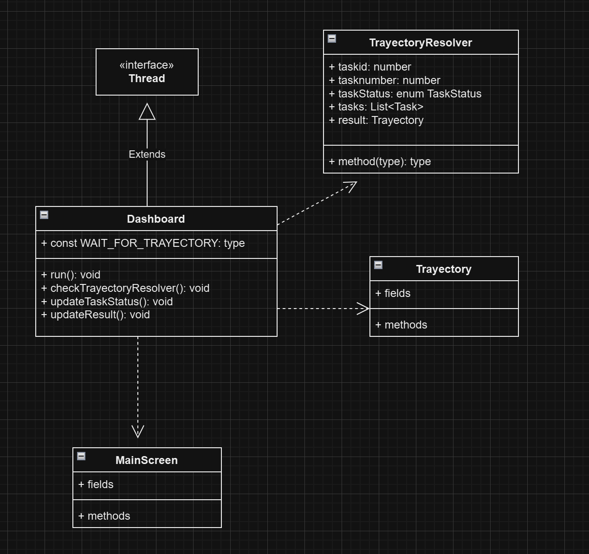
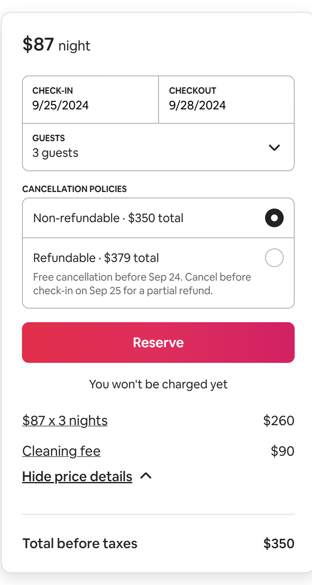
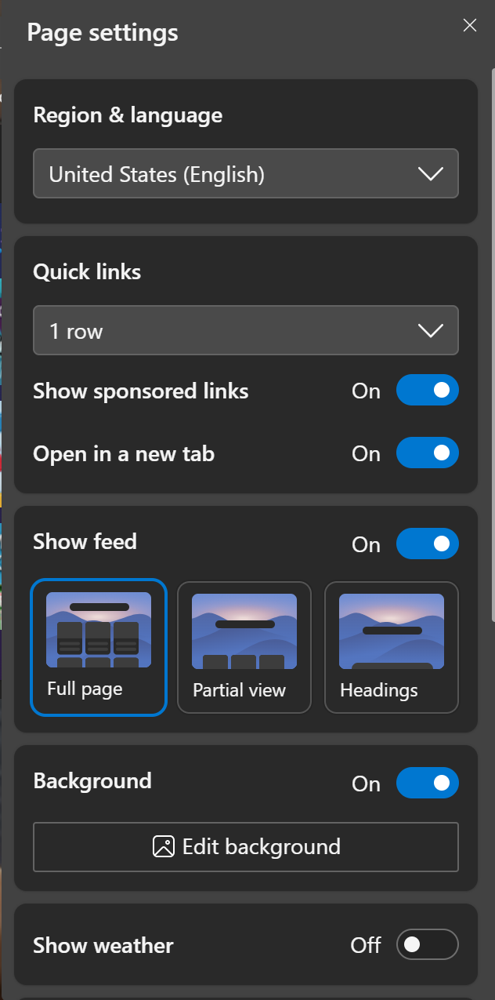
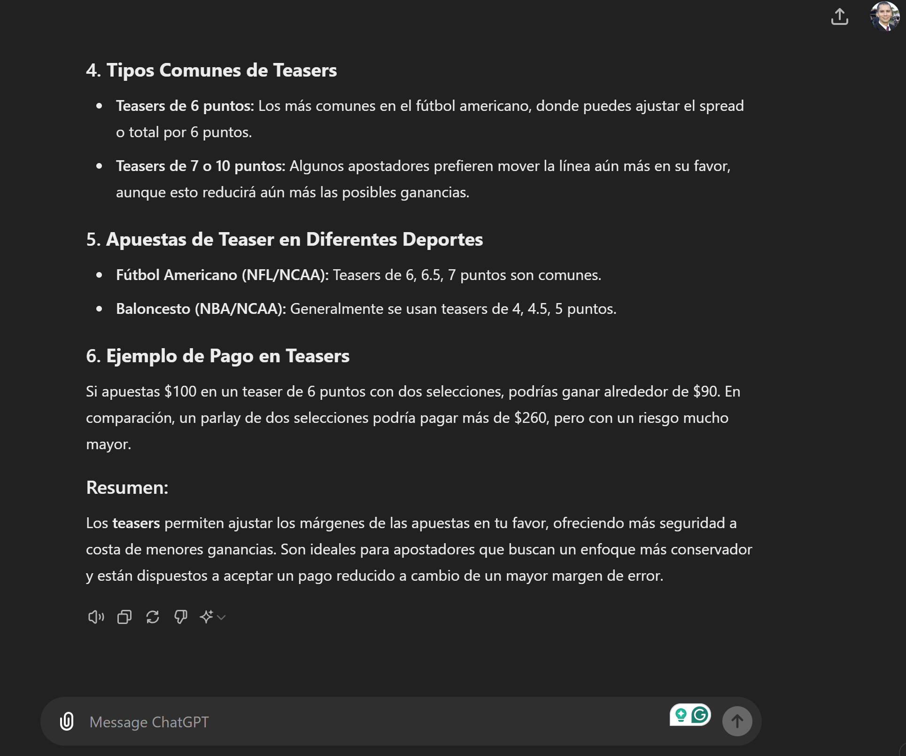
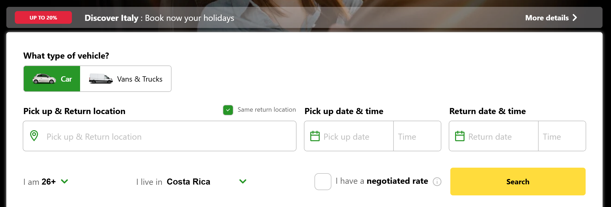
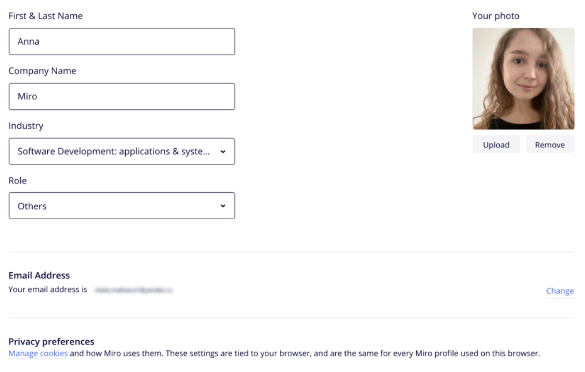

# Ejercicios teóricos, prácticos, sprints y pruebas de conceptos cortas


## Ejercicio #1 - patrones de diseño orientado a objetos parte I

El profesor va armar grupos de trabajo de forma aleatoria y a cada grupo se le va a asignar uno de los siguientes problemas. Realice el diseño de un esquema de las classes principales que se requieren para resolver el problema en cuestión, tomando en cuenta que debe utilizar al menos uno y máximo dos patrones de diseño de objetos de los ofrecidos en cada problema. 

Lectura de soporte y ejemplo: https://refactoring.guru/design-patterns/catalog

### Problema: ThinkTogether
El software de reuniones virtuales ThinkTogether actualmente solo soporta video llamadas con uso de cámara y micrófono. Sin embargo los dueños han hecho una fuerte inversión de capital para habilitarle funcionalidades nuevas:
- un bot va a generar las notas de la reunión completas
- se le va agregar un chat
- otro proceso se va encargar de resumir los puntos más importantes y las acciones por participante de la reunión 
- según como se configure la plataforma en la organización dichas anotaciones podrían estarse enviando por mail, o slack o el chat de la herramienta o alguna otra herramienta custom por medio de un hook en Rest
- se sabe que podrían existir multiples tipos de senders y multiples APIs de AI para implementar las nuevas funcionalidades

_patrones disponibles:_ command, mediator, chain of responsability
 

### Problema: SalmaDraw
El software de ilustración SalmaDraw se ha extendido en su uso en multiples dispositivos como apple computers, ipad, android tables, pc y algunos smartphones de pantalla grande. Sin embargo no todas las funcionalidades pueden operar de la misma manera dependiendo del hardware y el sistema operativo. Por ejemplo texturizar se podría hacer pixel perfect o algunas veces aplicarle algoritmos para hacer ajustes. Texturas generativas algunas veces las genera de cierto tamaño de resolución en otras ocaciones usa técnicas basados en texturas ya existentes. Según los puntos de presión del pen, las herramientas de dibujo podrían requerir correr algoritmos adicionales para hacer las líneas , contornos, rellenos y similares. Si cuenta con GPU o no, los filtros podrían ser básicos o usar nuevos con AI.  

_patrones disponibles:_ visitor, decorator, chain of responsability


## ejercicio #2 - dependency injection

Ellivhsan es una plataforma web de shopping en línea que vende productos para el cuidado facial y corporal, actualmente lleva 2 años en el mercado con mucho éxito. Desde que se creó, su arquitecta y product owner, la ingeniera Julieth, decidió que se iba a realizar bajo el modelo de server side rendering. Con el paso de los años, Julieth ha tenido que enfrentar los ajustes de CSS y JS para poder ofrecer una plataforma que sea totalmente responsive. Cuando llegan los request http al servidor con el respectivo path, llegan especificaciones del dispositivo cliente para que así los CSS y JS hagan los ajustes de responsive. Este approach ha funcionado muy bien, sin embargo ahora Julieth quiere llevar esto un poco más allá y no está satisfecha con solo entregar responsive a los frontend que buscan acomodar cosa por tamaño y reacomodar contenido, por el contrario, ahora quiere que dependiendo del dispositivo del cliente pueda ofrecer experiencias únicas según el device, como movimiento con giroscopio, 360, manipulación de video, generar instructivos de uso de los productos, dotar de espacios para hacer consultas a bots con AI y muchas otras funcionalidades. Dado que ahora no se trata únicamente de responsive si no de hacer render de las páginas en forma más especializada, Julieth ha optado por transformar el handling de los request http a un approach de dependency injection, de tal forma que la información proveniente del cliente respectivo, permita establecer cuál render sea más efectivo para generar la respuesta de formato ideal y se pueda crear una experiencia mucho más enriquecida en el sitio de Ellivhsan. Usted estuvo en la reunión con Julieth y le ha pedido que prepare en código un ejemplo abstracto general de como podría quedar la estructura del handler y la lógica de server side rendering utilizando dependency injection; para en la próxima reunión mostrarlo a todo el equipo de desarrollo.

- el ejercicio es individual
- puede utilizar cualquier lenguaje de programación para el ejemplo
- realice esto en papel o en un editor de texto 
- no es necesario que el código funcione, no se revisa sintáxis
- los métodos pueden ser dummies y usar comentarios para enriquecer
- enfóquese en la estructura del patrón, similar al ejemplo desarrollado por el profesor 
- entrega 31 de Julio, 9pm, correo: vsurak@gmail.com, subject: diseno - ejercicio #2
- en caso de que lo haga en papel enviar las fotografías legibles del código

## ejercicio #3 - design patterns observer, factory, builder

el siguiente diseño se ha implementado en un mobile application, el TrayectoryResolver en su método resolve va resolviendo K tareas, mantiene el id, número y estado de la tarea actual, así como la lista de tareas. El Dashboard de la aplicación es un Thread que cada WAIT_FOR_TRAYECTORY milisegundos chequea la tarea actual para refrescar el estado en la pantalla, y además, compara la tarea actual con la lista de tareas para determinar si ya se terminó la última y con ello saber si toda la trayectoria se resolvió y así mostrar el resultado final calculado por TractoryResolver. Modifique el diseño actual para que utilice Observer pattern y permita tener varios tipos de Resolvers no solo de trayectoria utilizando ya sea AbstractFactory o Builder pattern. 



- el entregable será el nuevo diseño de clases mejorado con los patrones, sea claro en el diagrama con los métodos que participan en los patrones, además de respetar las simbologías para que sea leíble todas las partes del patrón y sus interacciones. El entregable es una imagen legigle con el diseño de objetos mejorado.
- el ejercicio es individual
- entrega jueves 8 de Agosto, 10pm, correo: vsurak@gmail.com, subject: diseno - ejercicio #3 
- usar algun diagramador de UML 


## ejercicio #4 - design patterns bridge, adapter

bromelia es una aplicación que genera icons basados en imágenes existentes de dos proveedores. BromeliaPictInventory es la clase encargada de hablar tanto con el api de pixbay https://pixabay.com/api/docs/ y también con el api de unplash https://unsplash.com/documentation; para ambos casos se utilizan las funcionalides de search photos de ambas api's y así juntar ambos resultados en las top 10 fotos ganadoras según ciertos criterios de evaluación de las carácteristicas e información de las fotos retornadas por cada api. Sin embargo el código en BromeliaPictInventory se ha vuelto muy complicado y hay que estar lideando con las cosas que se pueden hacer en un api u en otro. Por esa razón, se le ha encomendado que implemente un patrón adapter para que sea usado desde BromeliaPictInventory eliminando por completo las diferencias entre las apis. Adicionalmente, ahora se quiere tener varios algoritmos de selección y puntuación de las fotos, para que no sea ya solo el top 10 y la evaluación hardcoded que existe de las fotos resultantes, si no que mas bien, el usuario desde Bromelia pueda seleccionar alguna técnica o tendencia, y así el algoritmo que se aplique sea diferente, aumentando la calidad del resultado. Para ello, se le ha pedido que abstraiga esa funcionalidad que también está en la clase BromeliaPictInventory, en el método, rankPhotosResult(listaFotosUnplash, listaFotosPixBay), para que ahora se puedan utilizar con un patrón bridge desde la misma clase BromeliaPictInventory.

- realice la reorganización del nuevo código utilizando el patrón bridge y adapter
- de las apis puede asumir algunas llamadas según la especificación de las apis de search photos de ambas plataformas, más no debe implementarse la llamada, solo saber cuál método del api es y sus parámetros de ser necesario
- debe ser claro la adaptación que se hace de las dos apis en el adapter y el uso de dicha adaptación en la clase BromeliaPictInventory, tanto para la información que se envía como la que se recibe
- debe ser claro la transformación que sufre la función rankPhotosResult que ahora podría ser valorada por K algoritmos, tome en cuenta que ya se hizo la adaptación de las api
- haga el solution en el lenguaje de su preferencia
- cree un folder "naive" para que se vea la estructura del código actual sin aplicar los cambios
- cree un folder "patternized" para que se vea la estructura nueva propuesta del código aplicando los patrones
- este ejercicio puede ser en parejas
- entrega sábado 10 de Agosto, 11am, correo: vsurak@gmail.com, subject: diseno - ejercicio #4 
- contenido: los integrantes del ejercicio, link al repositorio de git con la solución 


## ejercicio #5 - tiktok resumen

el profesor va asigar personas para fabricar pequeños reels de entre 20 a 35 segundos para resumir los temas vistos en clase a lo largo del semestre. dicha asignación se hará en las diferentes clases, y los tiktoks le serán enviados al profesor para su validación, para luego ser subidos a un tiktok que proporcionará el profesor y así verlos durante la clase. dichos clips van a ser evaluados y al final de semestre los top 3 tiktos que hayan obtenido mayor cantidad de likes, tendrán respectivamente 4%, 3% y 2% adicional a la entrega de actas. 

el tema central es res, umir/explicar un tópico visto en clase:

-- para el 25 de agosto
- ux, ILAMA GAMBOA NAOMI JOUSEPH
- authentication, KAUFFMANN PORCAR ERICK
- MFA, VENEGAS MASIS CARLOS ANDRES
- authorization, CABRERA TABASH SAMIR FERNANDO
- FGA, ACUÑA CAMPOS CRISTOPHER ANTONIO
- dependency injection, WONG HERRERA MELANIE CRISTINA

-- para el 8 de octubre

- CALVO RODRIGUEZ KEVIN YADIR, escoja un servicio del cloud platform de su proyecto y explique como pretende usarlo en el proyecto, para lograr qué cosa y el cómo se logra eso en su proyecto usando ese servicio

- SALAS ARAYA ANDRES, explicar el uso que va a tener la AI en su proyecto, cuál AI va usar, una explicación de como se invoca vía API y que es lo que espera que dicha AI logre y que cosas cree que no se van a poder lograr para su proyecto usando esa AI. 

- MASIS AAGESEN LUANY, en que consiste su proyecto y cómo ha sido el proceso de problem statement y diseño de arquitectura de alto nivel

- MORATAYA SANDOVAL PAMELA YARETH, un ejemplo en código del REST service de su proyecto que reciba un request, lo enrute a la lógica, y esa lógica haga un salvado en la base de datos. 

- VALVERDE ARGUEDAS SAMUEL, en que consiste la técnica de crazy 8's y que uso tuvo en su proyecto

- MORA URBINA ANDRES, explicar como funciona el patron de event driven que usa https://activitypub.rocks/  


## ejercicio #6 - encuentre los REST endpoints

el profesor va a crear grupos de trabajo a los que les va a asignar una de las siguientes pantallas. proceda a identificar y definir todos los endpoints de un REST api que permita implementar dicha pantalla. cada endpoint deberá incluir:

- resource + path 
- method
- headers
- payload in json
- response in json
- justify the correctness of this endpoint

### 1. airbnb book


### 2. Settings


### 3. chatgpt


### 4. rent a car


### 5. person profile


## ejercicio #7 - software architech elevator
1. según la lectura, mencione al menos 3 errores comunes en las organizaciones con respecto al alcance, vision o responsabilidades del arquitecto de software?

2. siguiendo la analogía del elevador, imagine una organización como el ITCR, cuáles podrían ser 7 de los pisos?

Enviar respuesta al correo vsurak@gmail.com, antes de las 11:20am, subject: diseno - ejercicio #7

## ejercicio #8 y #9 - microservices design

Dado el siguiente api documentada en este swagger file
```yml
openapi: 3.1.0
info:
  title: E-commerce API
  version: 1.0.0
  description: A mockup API for an e-commerce platform.

paths:
  /goods:
    get:
      summary: List all goods
      responses:
        '200':
          description: A list of goods
          content:
            application/json:
              schema:
                type: array
                items:
                  $ref: '#/components/schemas/Good'

  /goods/search:
    get:
      summary: Search goods
      parameters:
        - name: query
          in: query
          required: true
          schema:
            type: string
      responses:
        '200':
          description: Search results
          content:
            application/json:
              schema:
                type: array
                items:
                  $ref: '#/components/schemas/Good'

  /cart:
    post:
      summary: Add item to cart
      requestBody:
        required: true
        content:
          application/json:
            schema:
              $ref: '#/components/schemas/CartItem'
      responses:
        '201':
          description: Item added to cart

    delete:
      summary: Remove item from cart
      parameters:
        - name: itemId
          in: query
          required: true
          schema:
            type: string
      responses:
        '200':
          description: Item removed from cart

    get:
      summary: Review shopping cart before checkout
      responses:
        '200':
          description: Shopping cart details
          content:
            application/json:
              schema:
                type: array
                items:
                  $ref: '#/components/schemas/CartItem'

  /reviews/goods:
    post:
      summary: Add review for a good
      requestBody:
        required: true
        content:
          application/json:
            schema:
              $ref: '#/components/schemas/Review'
      responses:
        '201':
          description: Review added

  /reviews/sellers:
    post:
      summary: Add review for a seller
      requestBody:
        required: true
        content:
          application/json:
            schema:
              $ref: '#/components/schemas/Review'
      responses:
        '201':
          description: Review added

  /reviews:
    get:
      summary: Retrieve reviews for a list of goods
      parameters:
        - name: goodsIds
          in: query
          required: true
          schema:
            type: array
            items:
              type: string
      responses:
        '200':
          description: Reviews for the specified goods
          content:
            application/json:
              schema:
                type: array
                items:
                  $ref: '#/components/schemas/Review'

  /compare:
    get:
      summary: Compare goods with other platforms
      parameters:
        - name: goodId
          in: query
          required: true
          schema:
            type: string
      responses:
        '200':
          description: Comparison results
          content:
            application/json:
              schema:
                type: object

  /checkout:
    post:
      summary: Checkout
      requestBody:
        required: true
        content:
          application/json:
            schema:
              $ref: '#/components/schemas/Checkout'
      responses:
        '200':
          description: Checkout successful

components:
  schemas:
    Good:
      type: object
      properties:
        id:
          type: string
        name:
          type: string
        price:
          type: number
        description:
          type: string

    CartItem:
      type: object
      properties:
        goodId:
          type: string
        quantity:
          type: integer

    Review:
      type: object
      properties:
        userId:
          type: string
        rating:
          type: integer
        comment:
          type: string

    Checkout:
      type: object
      properties:
        cartId:
          type: string
        paymentMethod:
          type: string
```

haga un diagrama de bloques donde se transforme este REST api monolítico a una arquitectura de microservices, asegúrese que su diagrama visualmente y con la menor cantidad de texto posible logre mostrar lo siguiente:

- protocolos de comunicación usados
- tecnologías y lenguajes de programación a usar en las diferentes capas de la arquitectura
- cloud service utilizado
- cloud services requeridos usando la misma simbología que use el proveedor de cloud (aws, azure, gcp o digital ocean)
- servicios de authenticación, authorizacion, sesiones, balanceo de cargas
- si se trabaja en una sola base de datos o de varias, dejando clara la principal ventaja del esquema seleccionado
- conectividad con servicios de terceros
- la distribución de endpoints por microservicio

se sabe además que este api es para un marketplace donde se comercializan diferentes tipos de bienes, y que actualmente procesa de 4 a 7 millones de requets de búsqueda de bienes diarios, de los cuales entre el 4% al 13% son conversiones de compra en el marketplace y de un 1% a 2.5% son conversiones en otros sitios de compra cuando se usa la operación de comparativa. 

- el ejercicio se puede hacer en parejas. 
- fecha de entrega: viernes 6 de septiembre, 2024 antes de media noche. 
- [citas de revisión](https://outlook-sdf.office.com/bookwithme/user/7e85ed0aa69344e48d8dfd2b5da9d877@akurey.com/meetingtype/qlN1e15PykKdYs4Haqekmw2?bookingcode=9131d046-64eb-40dd-be92-a8c5f2428af8&anonymous&ep=mlink)
- entregable: un diagrama en pdf, miro, canva o https://app.diagrams.net/ tal que los integrantes del trabajo puedan explicar la solución planteada a nivel técnico y estratégico. 


## ejercicio #10 - conexion pool and cache
el profesor va a crear grupos aleatorios con un tema asignado, para el cuál deberá investigar y explicarle al grupo como programaría y configuraría dicho tema para ser usado en el caso #4. Cubra en su explicación:
- librerías disponibles y mejor calificadas para realizar dicha tarea en dicho lenguaje
- explique los parámetros que se puedan configurar en las instrucciones de forma simple para sus compañeros
- código ejemplo debidamente comentado 
- dos bondades del código expuesto
- un problema o limitante del código expuesto

Temas:
- conexion pool en java de tamaño fijo
- conexion pool en python con tamaño dinámico
- monitoreo de un conexion pool hecho en c#
- cache en redis accedida desde python
- cache en memcached accedida desde typescript
- cache en redis accedida desde typescript

El resultado deberá pegarlo en el text channel en discord del curso, agregando el nombre de los integrantes del grupo. Fecha y hora máxima para pegar este contenido: Viernes 13 de setiembre, 9:15am. 

## ejercicio #11 - principios de diseño
el profesor realizará una evaluación oral durante la clase solicitando a cada estudiante que de la materia vista en clase a la fecha, de ejemplos que cumplan con algun principio de diseño de los abordados en la unidad 4 del curso. 


## ejercicio #12 y #13 - requerimientos no funcionales del proyecto

en los grupos de trabajo del proyecto, refiérase al checklist o [cuestionario para identificar los requerimientos no funcionales de un sistema](https://github.com/vsurak/cursostec/blob/master/diseno/6.%20el%20proceso%20de%20revision%20del%20diseno.md#2-en-relaci%C3%B3n-con-los-atributos-de-calidad-del-software-requerimientos-no-funcionales) . Agregue en el md file de su proyecto una sección de segundo nivel con los requerimientos no funcionales de su proyecto, y conteste todas las preguntas del checklist, las respuestas deben cumplir:

  - ser cuantificables cuando se trate de tamaño, tiempo, costo
  - ser específicas en cuánto a tecnologías o técnicas, cuando se trate de herramientas que se necesiten para solventar dicho requerimiento, sistemas de terceros, clouds, documentación. Todas las herramientas, lenguajes, y cualquier otra que se mencione en estas respuestas deberá coincidir con lo entregado en el diagrama de arquitectura del sistema

fecha para el commit: viernes 4 de octubre, 8pm 


## ejercicio #14 - discusión de caso situacional hipotético

el profesor va a proceder a conversar sobre un caso en particular hipotético, los estudiantes deberán participar dando recomendaciones, sugiriendo técnicas, herramientas, diseños, prácticas de testing, documentación, refutando con base puntos de otros compañeros. cada estudiante deberá participar verbalmente al menos una vez en la discusión y el contenido de la participación definirá la nota recibida, el procesor va a tratar de refutar o cuestionar su participación en todo lo posible. Si un estudiante mencionó algún punto en particular, ya eso no podrá ser usado por otro estudiante. Para efectos de enriquecer su punto de discusión tome en cuenta:

- diseño de seguridad, herramientas, técnicas, pros, cons, velocidad de desarrollo
- diseño de frontend, tecnologías, patrones, procesos en background, ux, ui, lenguajes, velocidad de desarrollo, prioridades del negocio, el cómo diseñaría ciertos objetos
- diseño de backend, tipos de backends, patrones, servicios cloud, servicios de terceros, problemas de rendimiento, escalabilidad, conexiones a la base de datos, reducción de costos en cloud, almacenamiento de archivos
- diseño de datos, tipos de bases de datos, modelos de datos, cómo diseñaría ciertas tablas o colecciones, temas de rendimiento, velocidad de lectura, permisos en la base de datos
- cloud services, que cosas se pueden aprovechar del proveedor, costos, no code, componentes que deben utilizarse 

Su participación se medirá de la siguiente forma:
- las tecnologías, herramientas y técnicas mencionadas tienen coherencia con el punto discutido, los temas del curso y técnica, 35pts
- respaldó con criterio propio sus afirmaciones, apoyándose en algún item estudiado durante el curso 35pts
- deja claro consecuencias positivas y/o negativas de lo que está discutiendo, proponiendo; sabe que responder ante los cuestionamientos del profesor sobre su afirmación, 30pts

fecha de la actividad: miércoles 25 de setiembre en horario de clases

**caso situacional**

el artista neon frank va a dar una gira de conciertos en europa, latinoamérica y estados unidos durante el 2025, para un total de 37 conciertos en vivo. usted, como uno de los ingenieros de software del departamento de estrategia comercial y mercadeo del artista, está en una reunión donde se va conversar el tipo de experiencia que se quiere tener durante la gira. 

el director de mercadeo inicia explicando que tradicionalmente ellos le dan material a las agencias promotoras de cada país y los lineamientos que deben seguir para el mercadeo del evento, incluyendo frases, artes, reels para redes sociales de neon frank y clips de audio que pueden usar en la promoción. sin embargo, en esta oportunidad quieren crear otros canales de vivencia con el artista, por ello las promotoras en cada país se les va a ofrecer paquetes de funcionalidades que pueden adquirir con el show, los paquetes deben incluír al menos 2 funcionalidades de la siguiente lista:

- por la compra de ciertos productos del país, se dan activaciones para que se obsequien premios del artísta
- por medio de concursos en diversas redes sociales los fans ganan puntos que les permiten obtener productos NFT del artista
- habilitar realidad aumentada en productos patrocinadores del evento que acerquen a los fans con la personalidad del artista 
- un sistema de rifa de citas para compra de entradas para reducir el colapso de los sistemas de compras de entradas locales del país
- según la interacción de los fans con el contenido del evento en redes sociales puedan participar de una visita al backstage
- distribuir tracks separados por instrumentos de algunas canciones del artísta para que músicos locales puedan crear mixes o obras que concursen para ser usadas durante el evento
- recopilar audiencias, videos y clips de artistas locales interpretando total o parcialmente fragmentos de la música del artísta para que luego una AI filtre los top 3 para montar una improvisación en vivo con el artísta para el dia del evento
- entre los compradores de entrada algunos resulten seleccionados para conversar 10 minutos con neon frank por whatsapp, usando un número auto generado no trackeable posterior al chat 
- dar premios a las 3 mejores fotos tomadas por los fans del evento

el departamento de mercadeo de neon frank deberá proveer la plataforma tecnológica para facilitar todas las funciones anteriores y además de quedarse con información valiosa sobre los patrocinadores, costos, participantes, tiempos, y formas de integración que hicieron las promotoras en los fans, para más adelante hacer estudios de mercado por país. 

## ejercicio #15 - evaluación en diseño de arquitectura de software
el viernes 27 de setiembre se va a realizar durante la clase una evaluación teórica en tiempo real, para ello el profesor va a realizar 3 preguntas teóricas basadas en las [lecturas](https://github.com/vsurak/cursostec/blob/master/diseno/7.%20el%20dise%C3%B1o%20de%20la%20arquitectura%20de%20software.md), puntos del 1 al 4. De forma individual, el estudiante le enviará en máximo 1 minuto la respuesta al profesor por medio de un mensaje directo en discord. Las respuestas deberán ser propias del estudiante, invalidando cualquier copy/paste de las lecturas. 


Nodal es un ingeniero de software con dos años de experiencia, lleva 3 semanas reuniéndose con Belinda, gerente de una productora de fresas y sub productos que exporta a 3 países de latam. Han estado haciendo los mockups completos en dibujos a mano alzada de una futura aplicación para el control y monitoreo de calidad de las fresas y jaleas empacadas. Se han enfocado mucho en la sencillez del app para que los operarios puedan realizar las pruebas de calidad, registrar la información, tomar fotografías y videos de la evidencia; también para que el app controle los cambios de turno de los supervisores de calidad. Llevan aproximadamente 15 pantallas, bien detalladas, todas siguiendo un mismo estilo y cubriendo con mucho detalle cada aspecto de como funciona la nueva app. Terminando en semana 4, Belinda quiere iniciar cuánto antes con el desarrollo, y le ofrece a Nodal $80,000.00 dólares para desarrollar el app para Android. Nodal ha aceptado y le dice que podrá tener lista el app en 4 meses.

1. Qué factores importantes que influencian el diseño de software, fueron tomados en cuenta aquí que aportan valor, y cuáles se dejaron por fuera. Cómo podría usted solventar dichas falencias pero siempre manteniéndose en el mismo presupuesto y tiempo?

2. Pensando en diseño de componentes, explique qué aspectos podrían estarle causando a Nodal que el tiempo de desarrollo del sistema sea mucho mayor? 

3. Explique 1 riesgo en el proceso de diseño, que podría estar provocando que el sistema fracase total o parcialmente una vez que sea entregado al equipo de control de calidad de la planta de fresas?
