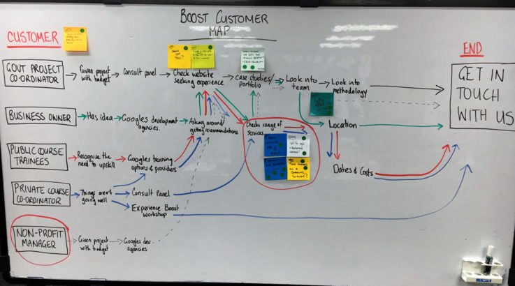

# proyecto del curso de diseño, II semestre 2024, 40%
_instituto tecnológico de costa rica_, escuela de computación  
_diseño de software_  
_prof. rodrigo núñez_  
_tipo:_ groups of 3

## description
el proyecto del curso de diseño tiene como objetivos: 

- enfocar la innovación y el emprendimiento como un proceso de diseño
- realizar entrenamientos en técnicas de diseño orientadas a productos y servicios
- crear un diseño de solución que comprenda todos los aspectos del diseño de software vistos durante el semestre en soluciones denominadas "end to end"
- prácticar técnologías y técnicas de diseño de valor agregado para la industria
- implementar una arquitectura de software "end to end" para una solución previamente diseñada usando todas las áreas del diseño vistas durante el curso
- implementar un prototipo rápido de una solución de software para un producto o servicio basado en un diseño completo "end to end"

se hace el llamado al estudiante en conjunto con su grupo de trabajo a "romper los techos" de lo establecido en la academia, de explorar ideas de productos y servicios no existentes, nunca planteados; a cuestionarse lo considerado social, moral y tradicionalmente aceptable, vendible, común y estudiado; para buscar nuevos horizontes transformadores que generen nuevas oportunidades técnicas, comerciales y sociales para las personas. 

aunque lo ideal es que un proyecto nazca como una idea, la cual, será el norte con el que se define una arquitectura de software, en este caso, se van a delimitar ciertos requerimientos técnicos, de producto/servicio y arquitectónicos que deberán llegar a cumplirse:

- el sistema deberá soportar internacionalización, tanto de idioma, moneda y país
- para su solución se va a requerir la integración con alguna AI existente, vía API o algún otro medio digital
- el problema y el sistema deben poder no solo ser sostenible en el tiempo económicamente, si no que también generar recursos frescos para su crecimiento, es decir debe ser rentable
- siempre el proyecto se va a enfocar en los aspectos de diseño de la solución, pero todos esos aspectos de diseño van a tener que implementarse hasta cumplir con un MVP (_minimum value product_)
- la definición del proyecto, sus requerimientos,  la arquitectura, el mvp, metodologías, el problema, stack de tecnologías y estrategia solución, deberá contar con visto bueno del profesor
- considere siempre investigar sobre problemas similares, cómo los han solucionado otras personas, en otros países y un análisis de su compentencia como creador de una solución innovadora
- realice en todo lo posible una discusión abierta de ideas con el profesor tanto como sea necesario para ir buscando un enfoque y alcance del proyecto
- se sugiere analizar industrias como: salud, vivienda, materiales, mascotas, real state, mechanics, economics, agriculture, real state development, insurance, traveling, tourist, water management, global warming, energy, logistics, retail y más, en general enfocarse en una industria y nicho

## stage #1 - problem definition

es necesario empezar el proyecto encontrando un muy buen problema. para lograr determinar ese buen problema en el que se diseñará una solución acorde a los requisitos anteriores se recomienda usar la siguiente guía:

1. hacer una sesión para generar ideas, entre los integrantes realizar un ejercicio de generación de ideas, poner todas las ideas en un whiteboard, no importa si parecen tener sentido o no, si nos gustan o no, idea son ideas. Darle a cada miembro del grupo una cantidad de votos finita que sea inferior a la cantidad de ideas y que tenga el tamaño del ranking finalista de ideas, realizar la votación individual de ideas repartiendo los votos

2. seleccionar las top ideas finalistas para realizar la investigación del problema

3. para realizar la investigación del problema utilice todo lo posible que encuentre en internet, enfóquese en encontrar explicaciones técnicas, soluciones que se han hecho en otros lugares, pros y cons de las soluciones existentes, tamaño de población, tamaño del nicho a alcanzar, países donde el problema está necesitando una solución urgente, tamaño del mercado en $, busque fuentes que respalden todo lo cuantitivo de su planteamiento

4. una vez que haya hecho investigación informativa digital, proceda a buscar en su "network" de personas profesionales en el tema con el que pueda realizar una entrevista para recopilar información de expertos, asegúrese que esos expertos tienen algún perfil en internet para que se pueda verificar su existencia y pertenencia en el problema. Para la entrevista:
    - nombre completo
    - posición
    - role
    - área de conocimiento
    - url al perfil
    - haga las preguntas que sea necesarias y tome notas, tome en cuenta en las preguntas opinion del problema, cómo cree esa persona que se podría solucionar, es de verdad ese el problema o hay otros posibles problemas que sean la causa del planteado, cuánto es el costo actual del problema y cuánto el costo de las soluciones, qué retos reconoce del problema, cuáles son los "blockers" principales para adoptar el problema

5. Una vez que tenga esta información recolectada, proceda a llenar el formulario de planteamiento del problema https://forms.gle/T1jLiHa83eYaZTRn6

fecha de entrega stage #1 : del 30 de agosto al 4 de setiembre, esto es para hacer el submit del formulario. recuerde que puede hacer varios submits de forma grupal o individual. 

- esta entrega no tiene ningún valor porcentual, pero es mandatorio para poder iniciar con el proceso de diseño del proyecto que se dará en las etapas posteriores 

## stage #2 - diseño de arquitectura - 6%

para este punto ya usted tuvo la sesión de trabajo con el profesor en la que se hizo un primer diseño de arquitectura de alto nivel para su proyecto. proceda ahora a seleccionar una herramienta que le permita realizar diagramas y que a la vez le permita realizar trabajo colaborativo con sus compañeros de grupo, como por ejemplo, canva, miro, diagram.net o otro similar. procedan entonces entre los integrantes del grupo a crear el diagrama de arquitectura general de su proyecto, siga los siguientes lineamientos:

1. durante la sesión con el profesor quedaron aspectos técnicos que debían investigar y decidir como grupo, lo primero es que todos esos pendientes esten definidos.

2. consulte esta imagen para determinar cuáles patrones parecen tener sentido dentro de su arquitectura y que componentes tecnológicos son los que van a ser parte de dichos patrones. valide esto con el profesor. no se limite a estos patrones, pueden existir más:

 

https://learn.microsoft.com/en-us/azure/architecture/patterns/

3. decidan la orientación de su diagrama de arquitectura, ya sea que se va a diagramar de izquierda a derecha, o bien de arriba abajo, o de abajo hacia arriba. siendo el punto de inicio de referencia el frontend, hasta llegar al punto más profundo que sería la capa de datos.

4. seleccione una paleta de colores a utilizar que permita agrupar elementos dependiendo de su alcance y/o capas, asignando un color a cada grupo, ejemplos de grupos: frontend, middlewares, backend, 3rd party services, security, data, cloud platform, cloud services, infraestructure.

5. identifique que componentes de la arquitectura son transversales y cuales de los elementos activos de la arquitectura requieren accederlos, de tal forma que se puedan diagramar transversalmente para indicar al lector del diagrama que dicho componente transversal es accesible desde esos elementos activos y no requerir entonces de diagramar líneas, haciendo así el diagrama más limpio. Por ejemplo, un elemento transveral puede ser una capa de authentication y authorization, si dicha capa transversal es usada por el FE y los services, entonces no hace falta tirar lineas de esos elementos activos (FE y services) hacia esa capa de seguridad, si no por el contrario solo se diagrama de forma transversal de forma que el ancho (en caso de izquierda derecha), o la altura (en caso de arriba abajo o abajo arriba) sean del mismo tamaño y coincidan alineadamente. 

6. ahora proceda a diagramar todos los bloques del diagrama con sus respectivos nombres, colores, ubicación y orientación decidida en los puntos anteriores. 

7. conecte los bloques usando flechas sólidas en un solo color, de tal forma que si una flecha es A--->B, significa que el componente arquitectónico A llama de alguna forma al componente arquitectónico B.

8. para todos los servicios del cloud platform seleccionado, identifique su nombre oficial y su ícono/logo en diagramas de arquitectura

9. Una vez terminado el diagrama proceda a validarlo con el siguiente checklist

- [ ] se respetó la paleta de colores acordada por el grupo 
- [ ] no hay exceso de flechas que se pudieron evitar con alguna transversalidad 
- [ ] los componentes que son propios del cloud platform están representados con su ícono
- [ ] todo aquello que sea programado tiene claro el lenguaje, frameworks y/o librerías a utilizar
- [ ] el uso de mayúsculas y minúsculas es uniforme
- [ ] los contrastes de color y letras permiten una clara lectura del diagrama
- [ ] son claros los protocolos de comunicación y los formatos de transmisión 
- [ ] en el diseño de la arquitectura se han eliminado cuellos de botella
- [ ] en el diseño de la arquitectura se han eliminado cualquier "single point of failure"
- [ ] en caso de existir más de una base de datos diferente es claro el contexto que almacena cada una
- [ ] es posible distinguir la técnica de escalabilidad que se va implementar 
- [ ] es claro si es server side o client side rendering
- [ ] los tipos de token que se van a validar y enviar están en el diagrama
- [ ] los patrones arquitectónicos son evidentes y enmarcados con línea punteada clara 

para este diagrama tendrá una revisión preliminar con el profesor la cuál deberá solicitarla a mas tardar para el 23 de setiembre. 

proceda a crear un repositorio en github para el proyecto donde todos sus compañeros tengan acceso y que el profesor también tenga derecho de lectura. cree un readme.md para el proyecto y documente en el readme:

- heading de primer nivel, nombre del proyecto y marca
- descripción breve del proyecto
- lista de requerimientos de alto nivel planteados en la sesión de trabajo con el profesor, agrupados por prioridad 1, 2 y 3.
- heading de segundo nivel, diagrama de arquitecura, y ponga aquí el respectivo diagrama terminado
- fecha y hora del último commit: 28 de setiembre, a media noche. 
- de la nota de este diagrama, 30 puntos corresponden a la participación en la sesión de trabajo presencial para el diseño preliminar de arquitectura que tuvieron con el profesor

## stage #3 - problem definition and ideation, 4%

el objetivo de esta etapa es determinar cuál es el problema más importante de todo el sistema a resolver, en cuyo punto toda la importancia del sistema recae y donde es necesario realizar la innovación, a esto le vamos a llamar el problem statement, y para encontrarlo vamos a realizar lo siguiente. 

1. Star from the end: entre los integrantes del grupo, reunirse para crear un diagrama, en el extremo derecho del diagrama va a existir lo que queremos que suceda satisfactoriamente en nuestro sistema, aquel objetivo, tarea o actividad, que define en su totalidad el éxito del proyecto y la aceptación de los usuarios por su sistema. lo escribimos en una cajita. 

2. Actors: en el extremo izquierdo del diagrama, anote verticalmente todos aquellos actores que disparan acciones las cuales son necesarias para que se logre el objetivo que está a la derecha. estos actores pueden ser personas, usuarios, otros sistemas. 

3. Flujo: ahora diagrame usando etiquetas y flechas los flujos de trabajo que me llevan paso a paso para que todos los actores logren llevar a cabo la completitud del objetivo o tarea final. 

por ejemplo vea este diagrama 

 

4. una vez con el diagrama listo, muéstreselo al profesor para chequearlo y haga las mejoras que se le sugieran.

5. observando el diagrama cada integrante de grupo puede votar por el paso más importante de todo el flujo, el cuál va a ser el foco de esfuerzo principal del proyecto. cada integrante tiene un solo voto. para determinar el paso más importante, puede ser identificando en el diagrama aquel paso que tiene que darse mandatoriamente para que se cumpla el objetivo, o bien, podría ser el paso que es más "atractivo" para el usuario, o bien podría ser aquel paso a donde muchos de los otros pasos llegan a el, haciendo de suma importancia innovar en ese paso para simplificar el sistema. 

6. una vez identificado el punto más crítico de su diagrama, el cuál todos han votado y coincidido en que ese paso es el más crítico. proceda entonces a escribir el "problem statement", el cuál ya no va a ser toda la magnitud de su sistema, si no que va a ser ese problema fundamental que ha sido identificado en el diagrama, y que ese problem statement será el norte, emblema y objetivo principal que deberá dar solución eficaz y diferenciada su sistema. 

7. el profesor va a revisar los problem statements de los grupos

8. seguidamente en clase también se va a hacer el ejercicio de los crazy 8's

9. con los crazy 8s terminados, cada estudiante selecciona el cuadro/idea que más le gustó y procede a dibujarlo en mayor detalle utilizando 3 cuadros

10. fuera de clase, el grupo de trabajo se reune y :
- cada integrante le presenta a su grupo su idea detallada seleccionada de los crazy 8s, y la explica
- los integrantes votan por la idea que más le gusto tomando en cuenta la de los compañeros
- como grupo diseñan y pasan en limpio un storyboard que sería la solución principal que se va implementar en el proyecto, el storyboard deberá tener de 3 a 7 frames máximo
- info adicional https://miro.com/es/storyboard/que-es-storyboard/ , https://www.bing.com/images/search?q=como+hacer+un+storyboard&form=HDRSC4&first=1 

11. agregue en el md file una sección de segundo nivel para incorporar el problem statement y la o las imágenes del storyboard.

fecha para el último commit: 28 de setiembre media noche

## alcance de cada proyecto 
para los siguientes stages del proyecto cada grupo tendrá asignado solo cierta parte, para dicha parte es donde van a realizar los diseños que se solicitan en los stages 4, 5 y 6. 

### **asignaciones:**

**minchapp** 
- visualizador que permita descubrir información de los cuidadores, ver detalles, crear un vínculo con el dueño de la casa para que este tenga la confianza de seleccionar a alguno de ellos.
- a nivel de datos es importante los cuidadores, información de ellos, media de los cuidadores, sus redes sociales, reviews, testimonios, depósitos de garantía, rates, hoja de delincuencia y cualquier otra información que los cuidadores desen compartir acerca de sus calidades y credenciales. además lo que sea necesario para poder integrarse con la AI. 
- a nivel de servicios lo más importante es lograr obtener la lista de los cuidadores la cual depende de filtros de usuario, queries textuales, AI, geolocalización, distancia, facilidades, credenciales, calidades, entrenamiento, reviews. tenga en cuenta que puede ser necesario hacer paginación, podría ser importante tener como tipo favoritos/like/saved cuidadores durante el proceso de búsqueda. 

**placewise** 
- las funcionalidades necesarias para poder publicar una propiedad usando tanto información detallada como medios visuales tales como fotos, videos, grabaciones, documentos, planos, experiencias en sitio, recorridos por la zona, lo que el promotor decida que puede fabricar para potenciar la propiedad
- a nivel de datos es importante el 100% de lo requerido para publicar la propiedad, excepto detalles que tengan que ver con asuntos legales, lo importante es crear excitación por las propiedades. en el caso de promotores y vendedores la información puede ser parcial, de forma que solo sea necesario un mínimo para poder hacer la publicación. la interacción con redes sociales, paginación podría ser necesario tomarlos en cuenta.
- a nivel de servicios solo aquello necesario para subir la propiedad de forma parcial y total, esto es porque podría ser que no todo el contenido esté listo en un solo momento, haciendo necesario que se vaya subiendo información parcialmente y hasta cierto momento el promotor decide publicar la propiedad
- tenga en cuenta que para un promotor, a nivel de UI, datos y servicios; podría estar trabajando en varias propiedades al mismo tiempo
- dejar las previstas en los pasos anteriores para la integración de la AI

**aiwoodworks** 
- creación del diseño basado en prompts únicamente, sin imágenes de referencia, con especificaciones básicas de dimensiones. luego basado en ese diseño lograr obtener un fabricante proponente que el comprador decida y se logre establecer la relación de posible contratación entre las partes. esto debe hacer en tiempo record. 
- a nivel de datos es importante tener historia de los prompts y los resultados obtenidos, también de todas las solicitudes hechas por el comprador y todas las ofertas o trabajdos dirigidos a los fabricantes. puede que exista cierta información en el fabricante que ayude a hacer el proceso de selección y quote del fabricante mucho más rápido. como el objetivo es ponerlos a negociar y ver detalles, los datos deben llegar hasta el punto en que se establece el vínculo de comunicación entre ambos. 
- en servicios tome en cuenta que puede requerir paginado, los tiempos de espera de los resultados de la AI, también la geo información es importante así como los filtros de búsqueda y selección. 

**lab.doc** 

**healthphone** 

**auctia**

**ilama**

**tpet**

## stage #4 - diseño del frontend 4%

el diseño del frontend de su proyecto va a estar compuesto de 4 piezas fundamentales de diseño: UI/UX, diagrama de capas, classes del sistema y boilerplate de la estructura del proyecto. todo esta sección de diseño se documentará en el mismo repositorio del proyecto en el readme.md, cree una sección de primer nivel "Diseño del frontend" y una de segundo nivel para cada uno de los artefactos del diseño del frontend. a continuación se detallan los entregables de cada artefacto del diseño de FE, tome en cuenta que solo deberá diseñar la parte que se indique de su proyecto. 

### ux/ui
- haga el diseño de las pantallas asignadas utilizando figma
- haga una matrix de requerimientos funcionales versus componentes visuales en las pantallas para cotejar que todas los requerimientos fueron cubiertos, las filas son requerimientos y las columnas componentes visuales 
- haga pruebas de usabilidad con 3 usuarios que no conozcan del proyecto y que cumplan con el perfil de "user persona" definido en la etapa 1
- documente los resultados de las pruebas en el MD file copiandolos de la herramienta de testing de UX usada
- haga los ajustes al UI dado los resultados de las pruebas
- documente en el md file un antes y un después de su diseño de UI

### diagrama de capas
- utilizando una herramienta de diagramación como miro, draw.io o similar, proceda a realizar un diagrama de las capas del UI, dichas capas podrían ser muy específicas dependiendo de la tecnología de frontend que haya escogido
- también las capas deben tener componentes de alto nivel en el frontend como por ejemplo: layers de visual componentes, de lógica, modelos, controladores, templates, capas de proxies o clientes de servicios, capas de seguridad, capas de procesamiento asíncrono según la tecnología, capa de lógica, capa de local storage por ejemplo. todas las capas dependen de la tecnología específica y de su proyecto en particular. se recomienda buscar ejemplos de diseños de capas de FE para la tecnología seleccionada en varios tipos de proyectos.
- utilice un conjunto de colores según la responsabilidad de las capas
- el diagrama de capas se puede ver como un "zoom in" del FE en el diagrama de la arquitectura
- si hay algún protocolo o tecnología en particular usada en alguna de las capas indíquela en el diagrama

### diagrama de classes
- haga el diagrama de las classes solicitadas utilizando el standard UML y una herramienta de graficación UML
- para este diagrama se espera que sean claras las classes, interfaces y classes abstractas; que esté bien utilizando las relaciones de objetos en las flechas directas e indirectas, así como claras las flechas de implements y herencia
- todas las classes deberán tener sus atributos con el tipo de dato correspondiente mas no se espera que sea 100% exhaustivo, no hace falta que el diagrama tenga los getters o setters propiamente del lenguaje
- las classes deberan tener mención de al menos el nombre de los métodos asignados, recuerde que en OO los métodos son verbos, las classes sustantivos en singular
- utilizando colores o cajas punteadas con labels, revele en el diagrama el uso de patrones de diseño

### boilerplate
- deberá crear el boilerplate que da inicio al proyecto de FE
- el boilderplate deberá estar hecho en el lenguaje de programación seleccionado
- cree en el repositorio un folder con el nombre de la aplicación, el cuál será su frontend
- dentro de dicho folder suba el código fuente del boilerplate
- en un nuevo readme.md, explique los diferentes folders y archivos del boilerplate
- no omita archivos de configuración, gitignore, o cualquier que sea necesario para ejecutar el FE
- en el readme raíz de su proyecto ponga en esta sección un link a este subfolder 

## stage #5 - diseño de los datos

## stage #6 - diseño del backend

