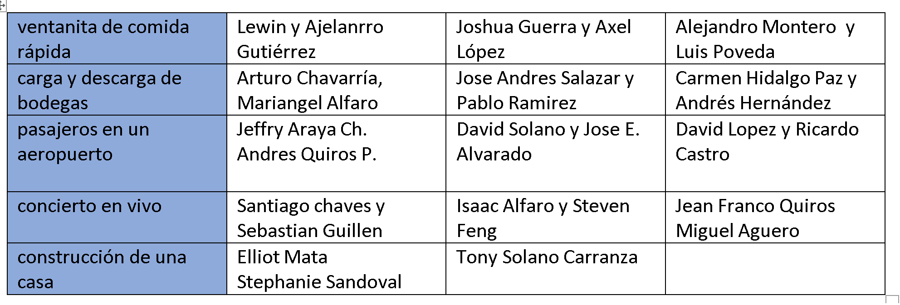

# caso #1, the news seeker, 10%

_instituto tecnológico de costa rica_, escuela de computación  
_estructuras de datos_  
_prof. rodrigo núñez_  
_type:_ individual

## descripción

un ejecutivo le ha pedido que le facilite una forma rápida de poder leer los titulares de noticias que le interesan únicamente, y solo aquellas que son más relevantes.

para ello, esa persona quiere un programa en C++ donde le pueda dar una única palabra que sea el tópico de su interés y la fecha a partir del cual quiere saber acerca del tema. con esa información el programa obtiene un conjunto de titulares que tienen que ver con el tema seleccionado.

una vez que el programa obtiene todos los titulares de las noticias, le muestra únicamente los 5 más relevantes, en orden de relevancia siempre.

seguidamente el ejecutivo le ha pedido que poder realizar las siguientes acciones:

a) mostrar todas las noticias ordenadas por relevancia

b) mostrar solo aquellos titulares que contengan al menos una vez una palabra de una lista proporcionada como input del usuario, donde cada palabra es separada por coma ,

c) eliminar de la lista de noticias, todas aquellas que tengan al menos una vez una palabra de una lista proporcionada como input del usuario, donde cada palabra es separada por coma ,

d) subir o bajar un titular de relevancia, es decir, indicando la posición actual del titular, puede indicarle ya sea un +Y o -Y, de tal forma que el titular sube o baja de posición de relevancia según el desplazamiento indicado por Y, por ejemplo si una noticia está en la posición 16, si el usuario indica reubicar(16, +7), pasaría a la posición 9.

cuando muestra los titulares, debe mostrar el número de posición de relevancia donde se encuentra el titular 1, 2, 3...N, y el titular respectivo.

## preliminar #1, 25 de agosto, 20pts

- determine que tipo de lista va a requerir para implementar el programa, ya sea lista simple, doblemente enlazada, circular, o doblemente enlazada circular

- determine cuáles métodos del TAD lista seleccionado necesita tener implementados y escribalos en un archivo .h, no hace falta que tengan body, pero si agregue comentarios indicando lo que supuestamente haría el método

- determine que métodos de operación para agregar, buscar, eliminar y reordenar titulares se van a necesitar y a cuáles métodos de la lista seleccionada va a ser necesario llamarlos, escriba esos métodos en un archivo .h, no hace falta que tengan body, pero si agregue comentarios indicando lo que supuestamente haría el método

- deberá enviar esto listo al profesor vía discord, usando un mensaje directo, a más tardar a las 10pm, indique su nombre completo y el link de github donde hizo commit del código

## preliminar #2, 3 de setiembre, 50pts

- usando las bases de listas hechas en clase, proceda a implementar la lista que usted seleccionó en el entregable #1

- proceda a implementar las funciones de titulares que seleccionó en el entregable #1

- haga un main de pruebas que le permita agregar varios titulares, mostrarlos, buscar, eliminar y reorganizar, probando que efectivamente funciona

- deberá enviar esto listo al asistente a más tardar a las 10pm, fvsasistencia@gmail.com, subject: estructuras - caso #1 - preliminar #2 y agregar el link del repositorio de github, indique el nombre del branch donde dicho commit final está acorde con la hora de entrega

## final, 6 de setiembre, 30pts

- con las clases helper proporcionadas con el profesor, agregue una capa más a su programa para que usando el api de https://newsapi.org, obtener las noticias en formato json

- dichas noticias son las que va a "parser" para extraer de ahí los titulares y así cargarlas a su sistema previamente hecho

- el programa final será revisado con cita a partir del 7 de setiembre

- REST url a utilizar, https://newsapi.org/v2/everything?q=election&from=2023-08-18&sortBy=popularity&apiKey=xxxxxxx

- a considerar para la revisión, si el estudiante no es capaz de explicar el código, se le rebajará 15 puntos

- los estudiantes que obtegan menos de 70 en la nota final del caso deberán tener una reunión de consulta con el profesor

---

# caso #2, simulation, 20%

_instituto tecnológico de costa rica_, escuela de computación  
_estructuras de datos_  
_prof. rodrigo núñez_  
_type:_ groups of two

## descripción

para este momento usted ya cuenta con una pareja de trabajo y un tema asignado para desarrollar el caso #2.

este caso #2 consiste en un proceso de simulación, es decir, es un programa que se ejecuta completamente solo sin intervención humana. para ello, una persona configura las reglas de la simulación y al echar a andar el programa, este se va comportando tal cual como se indica en las reglas de configuración.

del tema que ha seleccionado existen muchas partes que se pueden simular, entonces lo primero es determinar que de todo el proceso usted quiere simular. para ello proceda a investigar el tema asignado y a crear un diagrama donde pueda ver todos los flujos y procesos del tema seleccionado. a continuación aparecen algunos diagramas para que se de una idea de cómo podría diseñar el diagrama de flujos de los procesos deseados. no hace falta que diagrame todo el proceso completo, puede enfocarse en una sola parte.

https://communities.lendlease.com/contentassets/13b9b76667c94c9899d73d0287257995/ll_blog_how-long-to-build-02.jpg

https://www.eia.gov/energyexplained/natural-gas/images/Industry.png

https://interlakemecalux.cdnwm.com/warehouse-manual/warehouse-flowcart.1.0.jpg

https://www.webintravel.com/wp-content/uploads/2020/09/airport-process-chart-3-1066x440.jpg

https://storage.icograms.com/templates/preview/construction-building-process.png

https://think.aero/testing/wp-content/uploads/2020/05/Fig-1-Airport-process-1024x448.png

https://img.freepik.com/free-vector/seafood-production-process-flowchart_1284-25508.jpg

identifique en su diagrama por medio de colores o etiquetas, donde se podría hacer uso ya sea de:

a) mínimo dos pilas y una cola

b) mínimo dos colas y una pila

una vez terminado el diagrama, una persona del grupo deberá enviarselo como imágen al profesor vía discord para recibir retroalimentación.

## preliminar #1, 17 de setiembre, 20pts

el objetivo de este preliminar es crear un acuerdo entre los grupos de trabajo y el profesor, dejando claro, evidenciado y documentado lo que va a consistir su caso 2, los entregables y el alcance del mismo. para ello proceda a crear el siguiente entregable usando la herramienta que mejor le convenga pero asegurándose de entregar un pdf final único con el punto #1, #2. luego el punto #3 como archivo json y finalmente el punto #4 como archivos .h . todo lo anterior deberán subirlo a un repositorio en git, en un branch llamado "acuerdo" y enviar antes de media noche el link al profesor al correo vsurak@gmail.com .

1. _diagrama de proceso:_ usando el diagrama borrador sobre el proceso que ya hizo y al que el profesor ya le dió observaciones, proceda a pasar dicho diagrama a limpio, usando el formato de diagramas de estado.

https://medium.com/geekculture/how-to-create-a-state-diagram-110d709c2fc8

https://www.youtube.com/watch?v=obLemkvbWr0

2. agregue una descripción textual paso a paso al diagrama de tal forma que se identifiquen todos los procesos del sistema. deje claro los inputs de cada proceso y las salidas de cada proceso. tome en cuenta que los outputs de un proceso probablemente sean los inputs de otro.

3. diseñe el json file de configuración de la simulación, dicho json debe asegurarse que incluya aspectos como

   - tiempo escala de simulación
   - rangos de cantidades para todo lo que sea configurable
   - tiempos de ocurrencia de los eventos y su volúmen
   - velocidad o rangos de velocidad de procesamiento de cada proceso o etapa
   - listas o insumos de datos que sean casi aleatorios
   - tiempo o porcentajes de volúmenes de ocurrencias de cosas, objetos, personas o eventos
   - rangos de tiempos
   - listas de productos, nombres, métricas entre otros que sean necesarios

4. diseñe la lista de classes para implementar un simulador automático de los procesos en el diagrama anterior, para ello cree los .h necesarios en C++ que deje claro:

<nombre de classe>
<atributos con sus respectivos datatypes>
<métodos con sus parámetros>

por medio de comentarios en los .h deje claro:

- aquellas que son listas, pilas y colas
- los threads
- las clases que ayudan a procesar la configuración del simulador
- las clases o structs que sirven para guardar información
- las clases que manejan la lógica y reglas de la simulación
- la o las clases por las cuales se va poder saber lo que está pasando en la simulación
- las alertas de problemas en la simulación que hacen que el proceso tenga deficiencias

## preliminar #2, 8 de octubre, 30pts

1. para realizar el preliminar #2 del caso #2, deberá haber tenido aprobado las classes prototipo (.h) del preliminar #1, si usted obtuvo menos de 15 puntos entonces muy probablemente sus clases aún no están aprobadas y deberá obtener dicha aprobación haciendo los arreglos respectivos y presentando eso al profesor para el visto bueno. obtenga dicho visto bueno a más tardar el viernes 29 por la noche.

2. usando el diagrama de procesos que entregó en el preliminar #1, marque usando algún indicador o color, que es lo que va a implementar de su simulador en este segundo entregable, tome en cuenta que falta un entregable final de 50pts, de una duración de una semana.

3. envíe al profesor vía discord, el diagrama actualizado con las marcas que lo que va a implementar en este entregable #2. código ya existente como el de listas, pilas y colas, queda exhento de esta declaración de alcance. es decir, no es válido decir que va implementar las listas, pilas y colas.

4. proceda a implementar el programa en C++ basados en dicho alcance, el cuál deberá hacer commit a más tardar el domingo 8 a la media noche, la revisión será con cita. será válido exceder el alcance pactado durante la implementación, pero siempre se evaluará solo el alcance acordado.

## entrega final, 22 de octubre, 50pts

1. para este entregable ya usted cuenta con la revisión del entregable #2 hecha con el profesor, del cual pudieron haber salido diversas correciones

2. proceda a aplicar las correciones mencionadas y seguidamente a terminar al 100% los demás procesos de su simulador para que este pueda efectivamente ejecutarse en forma indefinida.

3. durante la revisión el profesor correrá el simulador con diversas configuraciones en el json buscando crear tamaños más grandes, mayores tiempos de espera, saturación de funciones en el tiempo, según así lo permita la configuración de la simulación.

4. deberá imprimir en consola las siguientes métricas:

   a. items ingresando, esto es cantidad de personas, ordenes, materiales, flores, etc en fin de lo que sea que se trate su simulador debe existir un item central, el cual debe poderser ver en todo momento cuántos hay en el sistema durante la simulación

   b. cola <nombre>, cantidad de items y tiempo promedio de espera en cola. para todas las colas de su simulador, imprima el nombre de la cola, la cantidad de items que tiene adentro y un promedio de cuánto tiempo están durando esos items en ser sacados de la cola.

   c. pila <nombre>, cantidad de items y tiempo promedio dentro de la pila. para todas las pilas de su simulador, imprima el nombre de la pila, la cantidad de items que tiene adentro y un promedio de cuánto tiempo están durando esos items en ser sacados de la pila.

5. durante la revisión se evaluará calidad de código, diseño de las clases, dominio de C++ y su orientación a objetos, comprensión de todos los algoritmos y procesos por parte de ambos miembros del grupo.

6. la revisión será con cita

# caso #3, the smart book reader, 25%

_instituto tecnológico de costa rica_, escuela de computación  
_estructuras de datos_  
_prof. rodrigo núñez_  
_type:_ groups of two

## descripción

una organización sin fines de lucro posee una basta colección de libros en formato txt. la organización quiere poder darle a las comunidades acceso a esos libros, sin embargo, dado que el formato txt no es sencillo de navegar, y además el uso que le podrían dar es más consultivo y citativo, quieren poder ofrecer un portal mucho más inteligente para que las personas comunes puedan hacer indagaciones puntuales sobre los libros.

la organización tiene la teoría de que las personas quieren indagar temas, inspirarse, ver frases, engancharse con pequeñas partes del libro, no leer libros completos. entonces en su idealización están imaginando que las personas ingresan a un portal web donde pueden por medio de una escritura en libre en free text, obtener fragmentos y análisis de los libros disponibles.

con ello, el resultado esperado es que el sistema haga la búsqueda sobre toda la biblioteca de libros y encuentre párrafos, episodios o frases que se acerquen a la idea o inspiración de la persona, y que así encuentre lo que anda buscando o incluso llegue a sentir el deseo de leer el libro completo.

los encargados del proyecto en la organización han especificado que luego de hacer una búsqueda ellos quieren poder ver en los resultados de búsqueda lo siguiente:

- el nombre del libro y su autor
- un extracto de un párrafo del libro que evoca a la frase de búsqueda
- el número de página donde se extrajo el párrafo o sección
- el sentimiento de la frase: negativo, positivo, neutro, misterioso, novela, fantasía
- una imagen o ícono que ilustre el texto extraído

como restricción, quieren que el sistema solo retorne el top 3 de los matches por libro y que retorne los resultados del top 10 de los libros, es decir, que máximo retornaría 30 resultados en caso de encontrar match.

para efectos de crear el sistema se cuentan con varios recursos:

a) la biblioteca de libros, hay que crear una biblioteca bajando libros de alguna fuente, recomendable que sea en un solo idioma, por ejemplo:

https://www.gutenberg.org/browse/scores/top
http://www.fullbooks.com/
https://www.blindworlds.com/publicacion/82460
https://www.samaelgnosis.net/libros/txt/
http://aktivaesperanto.org.es/descargas/index.htm

b) un catálogo de sustantivos importantes accesibles por medio de un api https://github.com/dulldesk/words-api , existen otras similares

c) maneras de encontrar sinónimos y palabras relaciondas por medio de un api, https://www.wordsapi.com/

d) inteligencias artificiales que pueden generar imágenes por medio de prompts o bien searches de íconos o palabras por api, como por ejemplo https://thenounproject.com/search/photos/?q=lights

e) modelos pre entrenados para análisis de sentimiento en texto como por ejemplo chatgpt y su api https://platform.openai.com/docs/guides/gpt/chat-completions-api

f) otros recursos disponibles gratis en el internet

## preliminar #1, descomposición de la frase e indexación de libros, lunes 30 de Octubre, 35pts

1. uno de los primeros retos es extraer aquello que sea realmente importante en la frase dada por el usuario, eliminar palabras repetidas y enfocarse en sustantivos y talvez algunos adjetivos. para ello puede ser necesario una cache de palabras la cual podría implementarse fácilmente por medio de hashtables

2. usando árboles AVL, hashtables y rankings, cree un sistema de indexación para los libros, de tal forma que dado la frase del usuario, se sepa una aproximación inicial de cuáles libros de la biblioteca vale la pena analizar, y que además permita llegar al archivo, sus índices y contenido rápidamente.

3. cree su biblioteca de libros con al menos 30 libros, dejándolos guardados en un folder.

4. para ir pensando en la integración de este sistema de indexado con una posible aplicación, permita que su programa funcione como un http server que proceso REST requests, el request que debe recibir es la frase enviada por el usuario, y la respuesta debe ser la lista de libros con una calificación, entre mayor la calificación es más probable que se encuentre contenido relacionado a la frase en ese libro.

5. pruebe su motor de búsqueda y servicio REST haciendo uso de postman.

6. el código del servidor web para rest no se va a evaluar, es decir, se puede usar como caja negra.

7. implemente estas estructuras y algoritmos en C++
