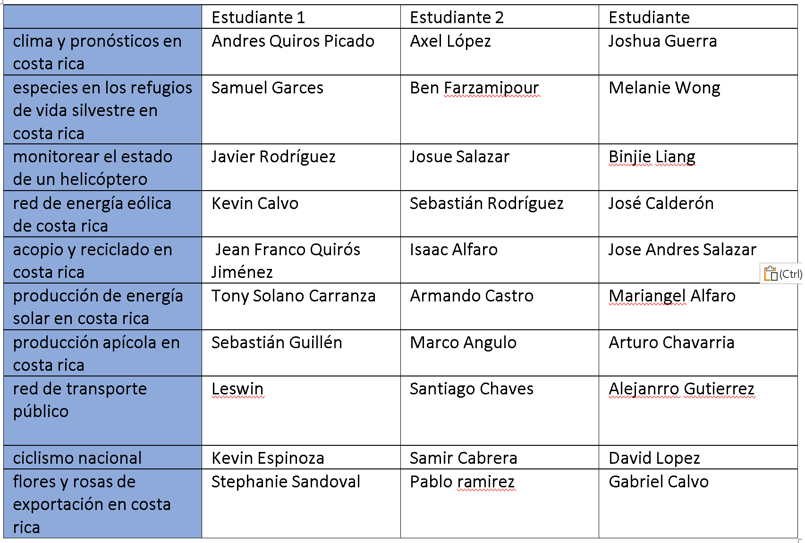

# caso #1, the self thinking house, 10%

_instituto tecnológico de costa rica_, escuela de computación  
_programación orientada a objetos_  
_prof. rodrigo núñez_  
_type:_ couples

## descripción

existe una casa donde ocurren sucesos aparentemente paranormales, los vecinos han reportado que la casa se abre por la mañana, apagando las luces, abriendo las ventanas e iniciando el día como cualquier otra casa. se ensucia como toda casa, se limpia como toda casa, huele como si alguien estuviera cocinando y al final del día las luces se prenden y se escucha una música chill, mientras la misma cierra sus puertas y se asegura para entrar en la quietud de la noche.

resulta que la casa no está embrujada, se trata de una casa que es auto mantenible, ella misma "piensa" y se auto sostiene para que cuando llegan los inquilinos no tengan que preocuparse por nada si no que solo vivir en la casa y disfrutar. el problema es que el sistema que controla la casa está hecho en cobol, se quiere instalar dispositivos más nuevos pero para ello el software controlador debe migrarse a java y ustedes han sido seleccionados para crear el sistema de la casa.

los creadores de la casa han decidido hacer un concurso para que varios fabricantes del software puedan proponerles la mejor casa posible, dando premios sorpresa a los participantes entre mejor quede la casa.

## subsistemas de la casa

la casa está dividida en 4 grandes sistemas que interactúan entre si para darle continuidad al funcionamiento de la misma los cuales se describen a continuación:

### habitaciones

1. corresponde a todas las habitaciones de la casa sala, comedor, cocina, cuartos, baños, cochera, entre otros

2. las habitaciones pueden iluminarse o apagarse, abrir o cerrar sus puertas y ventanas, pueden auto limpiarse.

3. dichas habitaciones tienen un tamaño definido, una cantidad de puertas y ventanas y ciertas luces.

4. el caso particular de los baños pueden abrir o cerrar las llaves de la ducha, innodoro y lava manos

### dispositivos

1. el sistema de dispositivos controla cocina, refrigeradora, tv, wifi, lavadora, secadora y otros electrodomésticos de la casa

2. la casa por medio de dichos dispositivos puede hacer el desayuno, cocinar en general, preparar recetas, lavar, secar y planchar la ropa, poner música, programas de televisión o en línea, mantener el wifi funcionando, iniciar alarmas y sensores

3. cada tipo de dispositivo tiene sus características y forma de funcionar dependiendo del tipo de dispositivo

### patio

1. el patio es el encargado de hacer crecer las plantas, floreen, dan frutos, es el encargado de secarse y regarse de agua cuando es necesario, es capaz de fumigarse para combatir insectos.

2. el patio incluye al suelo, al cesped, a los diferentes tipos de plantas y árboles. todos estos elementos existen en cierta cantidad y cierta extensión del terreno.

### control de respuesta

1. el sistema de control de respuesta pone a prueba los demás sistemas de la casa para garantizar que esta logra solventar debidamente las situaciones. entre las situaciones se destacan:

   - lluvia que satura el suelo del patio y puede hacer que entre agua por las ventanas o las puertas
   - ensuciar las habitaciones
   - taquear las tuberías de desagues
   - hacer que se acaben ingredientes para cocinar
   - suspender temporalmente el agua o la luz
   - hacer que el cesped crezca mucho
   - enviar plagas de insectos a las plantas

dado los requerimientos que deben cumplir los sistemas, organice un equipo de trabajo para diseñar, implementar y lograr que todos los sistemas de integren y operan en forma automática en la casa.

## preliminar #1, 25 de agosto, 20pts

- diseño de clases para el subsistema asignado a cada pareja
- el diseño debe considerar el uso de herencia y encapsulamiento para simplificar la lógica de los objetos
- cada grupo decide los tipos de classes que van a crear para la casa según el subsistema que hayan tenido asignados
- todas classes diseñadas deben tener los atributos y los métodos necesarios no solo para operar si no que también los métodos y necesarios para dar respuesta a los eventos del subsistema de control de respuesta
- el diseño deberá revisarse en formato PDF enviándolo al profesor al correo vsurak@gmail.com para las 8pm

## preliminar #2, 29 de agosto, 20pts

- diseño de clases de toda la casa completo
- para ello deberá integrarse con los otros subsistemas hechos por sus compañeros de tal forma que se integren los 4 necesarios
- el diseño debe considerar el uso de intefaces para facilitar la integración entre múltiples grupos, valiéndose de polimorfismo
- las interfaces que permiten la integración entre sistemas se diseñan en conjunto con todos los miembros pero es el grupo de control de respuesta quien tendrá la última palabra en cuanto a su implementación
- el diseño deberá revisarse en formato PDF enviándolo al profesor al correo vsurak@gmail.com para las 8pm, este diseño debe incluir los integrantes de todos los grupos, por ende es un envío por casa

## entregable final, 5 de setiembre, 60pts

- todos los grupos deben realizar su propia implementación del subsistema asignado
- cada subsistema deberá implementar un Thread el cual deberá leer un archivo json que contenga la configuración que le permita a la casa funcionar 24/7, es decir, dicho json debe decidir que cosas ocurren a qué hora y que día de la semana
- para este hilo se va usar una escala de 1 hora real equivale a 5 segundos en el sistema
- toda la casa opera en forma continua hasta que se detenga el programa
- los 4 grupos deben ponerse de acuerdo para hacer que el sistema se ejecute como uno solo y la casa opere en forma completa, por eso cada subsistema debe tener un único punto de inicio para que este sea llamado desde un main que deberá hacer el grupo de control de respuesta
- cada subsistema abrirá su propio JFrame donde deberá de alguna forma indicar lo que está pasando en la casa según el subsistema
- la revisión será con cita (asistente o profesor), primero una revisión con las parejas de los subsistemas y luego una completa con los 4 grupos integrados y funcionando
- cada grupo debe poder demostrar que el último commit fué hecho para la fecha de entrega máximo media noche.
- a nivel de subsistema se deberá tener un único repositorio donde sea evidente los commits de ambos integrantes a lo largo de los últimos 3 días minimo, de lo contrario la persona que no haya aportado perderá 10 puntos
- aquellas personas que obtengan menos de 70 deberán ir a reunión de consulta con el profesor
- 40 puntos serán para los subsistemas en forma individual y 20 puntos para la integración total de los 4 subsistemas

---

# caso #2, diseño e implementación de sistema a la medida, 20%

_instituto tecnológico de costa rica_, escuela de computación  
_programación orientada a objetos_  
_prof. rodrigo núñez_  
_type:_ individual

## descripción

_asignación de temas para caso #2_

como estudiante usted a selecciónado un tema de trabajo para el caso #2 el cual ha estudiado para entender como funciona, entre los aspectos más importantes que debe averiguar son:

1. que cosas actualmente existen con respecto a sistemas que se usen en ese tema
2. qué dispositivos, aparatos o tecnologías están asociados al tema
3. cómo están conectados a nivel nacional y como funcionan para el país
4. qué procesos o procedimientos son usuales en esos sistemas humanos
5. qué personas están involucradas, que ingresan y qué reciben
6. que son los productos o cosas que entran o salen de los procesos
7. qué unidades de medidas, cantidades, precios de cosas usualmente se dan en ese contexto
8. existen edificios, localidades o tipos de areas donde sucede estos procesos
9. existe en su tema asuntos de transporte, envío, comercialización
10. busque ejemplos de como se le muestra a los usuarios la información usualmente en estos sistemas

ahora proceda a crear un documento en la nube donde aparezca su nombre completo, el tema asignado y respuesta a todas las preguntas anteriores, puede usar copy paste de internet, usar imágenes, chatgpt, etc. para cuando aplica recuerde contextualizarlo para costa rica.

luego de entender bien el problema, los sistemas y procesos, seleccione una pequeña parte para la cual usted le haría un sistema, luego escriba en el documento:

- resumen de lo que haría el sistema en máximo 3 párrafos
- describa 3 procesos que haría su sistema, los 3 procesos deben estar vinculados entre ellos de alguna forma. deje claro que información va ingresar el usuario en cada proceso y que información debería salir resultado del proceso.

para lo anterior se van a usar 30 minutos, posteriormente el profesor aleatoriamente por tema va a preguntar la definición hecha a uno de los estudiantes para ir aclarando la definición.

---
