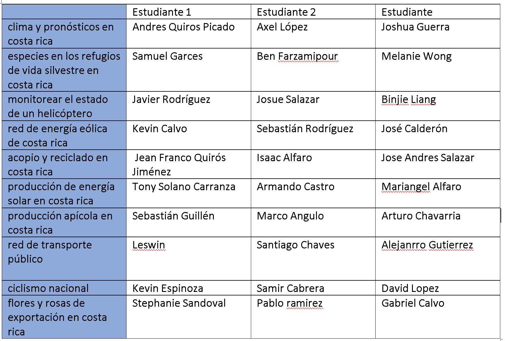

# caso #1, the self thinking house, 10%

_instituto tecnológico de costa rica_, escuela de computación  
_programación orientada a objetos_  
_prof. rodrigo núñez_  
_type:_ couples

## descripción

existe una casa donde ocurren sucesos aparentemente paranormales, los vecinos han reportado que la casa se abre por la mañana, apagando las luces, abriendo las ventanas e iniciando el día como cualquier otra casa. se ensucia como toda casa, se limpia como toda casa, huele como si alguien estuviera cocinando y al final del día las luces se prenden y se escucha una música chill, mientras la misma cierra sus puertas y se asegura para entrar en la quietud de la noche.

resulta que la casa no está embrujada, se trata de una casa que es auto mantenible, ella misma "piensa" y se auto sostiene para que cuando llegan los inquilinos no tengan que preocuparse por nada si no que solo vivir en la casa y disfrutar. el problema es que el sistema que controla la casa está hecho en cobol, se quiere instalar dispositivos más nuevos pero para ello el software controlador debe migrarse a java y ustedes han sido seleccionados para crear el sistema de la casa.

los creadores de la casa han decidido hacer un concurso para que varios fabricantes del software puedan proponerles la mejor casa posible, dando premios sorpresa a los participantes entre mejor quede la casa.

## subsistemas de la casa

la casa está dividida en 4 grandes sistemas que interactúan entre si para darle continuidad al funcionamiento de la misma los cuales se describen a continuación:

### habitaciones

1. corresponde a todas las habitaciones de la casa sala, comedor, cocina, cuartos, baños, cochera, entre otros

2. las habitaciones pueden iluminarse o apagarse, abrir o cerrar sus puertas y ventanas, pueden auto limpiarse.

3. dichas habitaciones tienen un tamaño definido, una cantidad de puertas y ventanas y ciertas luces.

4. el caso particular de los baños pueden abrir o cerrar las llaves de la ducha, innodoro y lava manos

### dispositivos

1. el sistema de dispositivos controla cocina, refrigeradora, tv, wifi, lavadora, secadora y otros electrodomésticos de la casa

2. la casa por medio de dichos dispositivos puede hacer el desayuno, cocinar en general, preparar recetas, lavar, secar y planchar la ropa, poner música, programas de televisión o en línea, mantener el wifi funcionando, iniciar alarmas y sensores

3. cada tipo de dispositivo tiene sus características y forma de funcionar dependiendo del tipo de dispositivo

### patio

1. el patio es el encargado de hacer crecer las plantas, floreen, dan frutos, es el encargado de secarse y regarse de agua cuando es necesario, es capaz de fumigarse para combatir insectos.

2. el patio incluye al suelo, al cesped, a los diferentes tipos de plantas y árboles. todos estos elementos existen en cierta cantidad y cierta extensión del terreno.

### control de respuesta

1. el sistema de control de respuesta pone a prueba los demás sistemas de la casa para garantizar que esta logra solventar debidamente las situaciones. entre las situaciones se destacan:

   - lluvia que satura el suelo del patio y puede hacer que entre agua por las ventanas o las puertas
   - ensuciar las habitaciones
   - taquear las tuberías de desagues
   - hacer que se acaben ingredientes para cocinar
   - suspender temporalmente el agua o la luz
   - hacer que el cesped crezca mucho
   - enviar plagas de insectos a las plantas

dado los requerimientos que deben cumplir los sistemas, organice un equipo de trabajo para diseñar, implementar y lograr que todos los sistemas de integren y operan en forma automática en la casa.

## preliminar #1, 25 de agosto, 20pts

- diseño de clases para el subsistema asignado a cada pareja
- el diseño debe considerar el uso de herencia y encapsulamiento para simplificar la lógica de los objetos
- cada grupo decide los tipos de classes que van a crear para la casa según el subsistema que hayan tenido asignados
- todas classes diseñadas deben tener los atributos y los métodos necesarios no solo para operar si no que también los métodos y necesarios para dar respuesta a los eventos del subsistema de control de respuesta
- el diseño deberá revisarse en formato PDF enviándolo al profesor al correo vsurak@gmail.com para las 8pm

## preliminar #2, 29 de agosto, 20pts

- diseño de clases de toda la casa completo
- para ello deberá integrarse con los otros subsistemas hechos por sus compañeros de tal forma que se integren los 4 necesarios
- el diseño debe considerar el uso de intefaces para facilitar la integración entre múltiples grupos, valiéndose de polimorfismo
- las interfaces que permiten la integración entre sistemas se diseñan en conjunto con todos los miembros pero es el grupo de control de respuesta quien tendrá la última palabra en cuanto a su implementación
- el diseño deberá revisarse en formato PDF enviándolo al profesor al correo vsurak@gmail.com para las 8pm, este diseño debe incluir los integrantes de todos los grupos, por ende es un envío por casa

## entregable final, 5 de setiembre, 60pts

- todos los grupos deben realizar su propia implementación del subsistema asignado
- cada subsistema deberá implementar un Thread el cual deberá leer un archivo json que contenga la configuración que le permita a la casa funcionar 24/7, es decir, dicho json debe decidir que cosas ocurren a qué hora y que día de la semana
- para este hilo se va usar una escala de 1 hora real equivale a 5 segundos en el sistema
- toda la casa opera en forma continua hasta que se detenga el programa
- los 4 grupos deben ponerse de acuerdo para hacer que el sistema se ejecute como uno solo y la casa opere en forma completa, por eso cada subsistema debe tener un único punto de inicio para que este sea llamado desde un main que deberá hacer el grupo de control de respuesta
- cada subsistema abrirá su propio JFrame donde deberá de alguna forma indicar lo que está pasando en la casa según el subsistema
- la revisión será con cita (asistente o profesor), primero una revisión con las parejas de los subsistemas y luego una completa con los 4 grupos integrados y funcionando
- cada grupo debe poder demostrar que el último commit fué hecho para la fecha de entrega máximo media noche.
- a nivel de subsistema se deberá tener un único repositorio donde sea evidente los commits de ambos integrantes a lo largo de los últimos 3 días minimo, de lo contrario la persona que no haya aportado perderá 10 puntos
- aquellas personas que obtengan menos de 70 deberán ir a reunión de consulta con el profesor
- 40 puntos serán para los subsistemas en forma individual y 20 puntos para la integración total de los 4 subsistemas

---

# caso #2, diseño e implementación de sistema a la medida, 20%

_instituto tecnológico de costa rica_, escuela de computación  
_programación orientada a objetos_  
_prof. rodrigo núñez_  
_type:_ individual

## descripción

_asignación de temas para caso #2_

como estudiante usted a selecciónado un tema de trabajo para el caso #2 el cual ha estudiado para entender como funciona, entre los aspectos más importantes que debe averiguar son:

1. que cosas actualmente existen con respecto a sistemas que se usen en ese tema
2. qué dispositivos, aparatos o tecnologías están asociados al tema
3. cómo están conectados a nivel nacional y como funcionan para el país
4. qué procesos o procedimientos son usuales en esos sistemas humanos
5. qué personas están involucradas, que ingresan y qué reciben
6. que son los productos o cosas que entran o salen de los procesos
7. qué unidades de medidas, cantidades, precios de cosas usualmente se dan en ese contexto
8. existen edificios, localidades o tipos de areas donde sucede estos procesos
9. existe en su tema asuntos de transporte, envío, comercialización
10. busque ejemplos de como se le muestra a los usuarios la información usualmente en estos sistemas

ahora proceda a crear un documento en la nube donde aparezca su nombre completo, el tema asignado y respuesta a todas las preguntas anteriores, puede usar copy paste de internet, usar imágenes, chatgpt, etc. para cuando aplica recuerde contextualizarlo para costa rica.

luego de entender bien el problema, los sistemas y procesos, seleccione una pequeña parte para la cual usted le haría un sistema, luego escriba en el documento:

- resumen de lo que haría el sistema en máximo 3 párrafos
- describa 3 procesos que haría su sistema, los 3 procesos deben estar vinculados entre ellos de alguna forma. deje claro que información va ingresar el usuario en cada proceso y que información debería salir resultado del proceso.

enviarle al profesor por discord el link al documento, el lunes 11 de setiembre. luego de esto el profesor le dará retroalimentación de cambios a la documentación y durante la clase del miércoles se expondrán algunos casos.

---

# entregable #1, diseño del sistema, sábado 16 de setiembre, 30pts

durante la semana va a recibir retroalimentación para terminar de afinar el alcance de lo que va a resolver en el caso #2 basado en el punto anterior. con las correciones claras ahora proceda a fabricar los siguientes insumos de diseño:

1. diagrama de clases del sistema, siguiendo las prácticas de encapsulamiento y modularidad vistas a la fecha. utilice colores diferentes y una etiqueta para marcar claramente los packages de su programa. considere separar UI, configuración, modelo, lógica, controllers y almacenamiento de información. tenga presente que información base de carga puede ser tomada de un json previamente fabricado. además si su sistema requiere almacenamiento de información para uso posterior cuando se vuelva a abrir la aplicación, deberá resolver el problema de almacenamiento externo, para ello queda a criterio del estudiante investigar y aplicar una solución. se recomienda investigar sobre objetos persistentes, o también caches persistentes o bien serialización y deserialización de objetos.

2. diseño de las ventanas del sistema; para ello implemente en java todas las ventanas que va a necesitar su sistema, es importante que tenga claro lo que su sistema va hacer y como va a funcionar para diseñar dichas pantallas. se recomienda buscar en internet pantallas similares. utilice como insumo los procesos que haya concordado a implementar con el profesor. internamente en el código, a modo comentarios, pegue el acuerdo del proceso de dicha pantalla, aprobado en conjunto con el profesor, el cual discutieron en discord como versión final.

entregable: cree un repo para su proyeto y un branch que se llame "acuerdo", suba un pdf con el punto #1, garantice que la calidad de la resolución permita leerlo adecuadamente. suba los .java de su gui al mismo repo y en un folder que se llame "wireframes" suba screenshots de las pantallas hechas. deben haber tantos screnshots como ventanas java implementadas. envíe un correo al profesor con copia al asistente, con el link del repositorio antes de media noche. fvsasistencia@gmail.com, subject: poo - caso #2 - preliminar #1, el correo del profesor vsurak@gmail.com

# entregable #2, primer etapa de implementación, jueves 5 de octubre, 30pts

1. para realizar este preliminar debe contar con un diseño de clases y de ventanas aprobado por el profesor. en el caso de que haya obtenido menos de 20 puntos en el preliminar #1, no se puede considerar que su diseño y ventanas está aprobado. debe tener este visto bueno para más tardar el domingo 1ro de octubre.

2. el profesor le dará una cita de consulta para hacer un chequeo del avance hecho cuando ya haya avanzado en este preliminar

3. usted va a definir el alcance de este entregable, dicha estrategia deberá escribirsela al profesor en prosa vía discord. usted decide la estrategia que más se adecue a su sistema y lo que quiere resolver en el sistema, de tal forma que pueda atacar inicialmente aquello que considere más importante para el éxito de su programa. aun así a continuar aparecen 3 ejemplos de estrategias que puede usar o basarse en ellas para definir la suya:

   - ejemplo estrategia A: voy a implementar primero las ventanas con sus controllers usando datos de prueba hardcoded, esto porque quiero estar 100% seguro de que cuales son las entradas y salidas que deben estar en todo el sistema, esto para que en el último entregable todas mis clases se ajusten bien a la información de las pantallas.

   - ejemplo estrategia B: tengo muchas dudas del json, voy a implementar la carga del json y los hilos de ejecución de forma que el programa logre extraer esa data y generar información usando los parámetros de los json, imprimiendo todo eso en consola, así dejo para el final todo lo que son pantallas y las otras clases que las puedo implementar más fácilmente pues lo veo más simple.

   - ejemplo estrategia C: voy a implementar los controllers y las clases de mi modelo completas de tal forma que desde el controlador con un main yo pueda verificar que todo funciona correctamente y con sentido. Para ya al final solo hacer pantallas que es más sencillo y así tengo menos riesgo por si me dejan más trabajo en otro curso.

4. una vez con la estrategia establecida, comuníquesela al profesor vía discord y ahora contará hasta el 5 de octubre para hacer commit de la implementación que usted acordó entregar en esta estrategia. en la clase principal donde tenga el main de inicio del programa, copie a modo commentario el acuerdo de lo que hace su sistema al que llegó con el profesor para el preliminar #1 y también la estrategia que acordó con el profesor en este entregable #2.

5. la revisión será con cita, se evaluará completitud de la estrategia definida, diseño de clases, calidad de código, orientación a objetos, modularidad, herencia, polimorfismo, encapsulamiento.

6. nuevamente tendrá hasta la media noche del 5 de octubre para el commit de este preliminar, la revisión será con cita.

7. tome en cuenta que para el entregable final contará aproximadamente entre 6 a 9 días.

# entregable final, segunda etapa de implementación, domingo 22 de octubre, 40pts

1. para este entregable usted ya debió haber hecho la entrega #2 basado en una estrategia de trabajo

2. tuvo una revisión con su profesor del cual pudieron salir mejoras que debe aplicar a su programa

3. termine de implementar el sistema para completarlo según lo acordado cubriendo con este el 100% del scope

4. se calificará en esta revisión, calidad de código, nombres de clases, modularidad, definición de clases y sus responsabilidades, la ejecución correcta del programa y la persistencia de la información.

# caso #3, empoderando al productor agrícola costarricense, 35%

_instituto tecnológico de costa rica_, escuela de computación  
_programación orientada a objetos_  
_prof. rodrigo núñez_  
_type:_ groups of two

## descripción

en costa rica el sector agrícola tiene dos realidades:

a) las de los grandes productores que poseen procesos industriales de gran volúmen, mecanización, laboratorios, ingeniería y una alta capacidad de exportación

b) la de los pequeños y medianos productos, pobres entre los pobres, donde su realidad es una, las ganancias de sus producción simplemente no alcanza para vivir; y extrañamente, el consumidor pagando altas sumas por productos en supermercados

por qué la producción agrícola no genera los ingresos y el bienestar de vida que debería siendo este tan importante ?

la agricultura es una actividad de alto riesgo, esto porque los cultivos están sujetos a cambios en el clima, plagas, precios muy altos en abonos y plaguicidas, un mercado de oferta demanda con muchas variaciones. los agricultores, históricamente, para producir deben solicitar financiamiento a entidades bancarias, hagase la idea hipotética que usted necesita 1000 colones para sembrar unas hectáreas, cuidarlas, cosecharlas y llevarlas a la venta. usted pronostica que va a vender su producción en 1500 colones, al final, la ganancia van a ser 500 colones en caso de sacar casi el 100% de la producción sin problema.

sin embargo, que pasa si para cuando saca su producto, el precio de dicho producto hace que lo más que pueda obtener de la venta sean 700 colones. quiere decir que no va a lograr pagar el préstamo y tampoco le generó ganancia. súmele que entonces para la próxima producción, va a necesitar de nuevo otro préstamo.

no existe una forma certera de garantizar un precio, y en la mayoría de los casos tampoco es posible garantizar los compradores del producto. a continuación se muestran varios datos informativos relacionados a esta problemática:

- el calentamiento global afecta la agricultura, existe un incremento en la temperatural anual y disminución de lluvias que estará muy marcado para el 2030

- distribución de cultivos principales en el país

- existen regiones del país que dependen en mayor medida de la actividad agrícola

- nuestros agricultores tienen un perfil, ante una actividad que no tiene herederos, pocos hijos de agricultores continúan con la actividad

- el sector agrícola debe competir con otros sectores para obtener mano de obra local

- certificarse con estándarres mundiales, carbono neutral o similares es costoso

- hay muy poco financiamiento nacional e internacional, es financiamiento de alto riesgo

- se recibe asistente técnica del mag que es muy tradicional sin innovación, sin técnicas y tecnología reciente

- la brecha tecnológica rural crea una barrera para aprovechar la digitalización

- hay poco intercambio técnico y de producción con otros países

- el sector agrícola está muy sujeto al modelo aternalista

- hay mucha resistancia al cambio en el sector

- el sector productivo agrícula participa muy poco en plataformas digitales o gestoras de conocimiento

- se conoce que en los mercados globales y altamente competitivos es urgente darle valor agregado a la
  producción, sin embargo esta suele ser de una escala menor o muy artesanal

- por ejemplo no es lo mismo exportar banano que puré o banano pasa, una piña, que jugo concentrado, café en grano o café tostado, a un esqueje ornamental que una planta en maceta

- es imperativo que en Costa Rica se refuerce el sistema de investigación y transferencia de tecnología, que se integre más con el sistema universitario, y que permita ofrecer al productor el ingrediente innovador en sus actividades para mejorar la productividad, mecanizar procesos, o producir bajo ambientes controlados

- los miles de mujeres y hombres que laboran en la producción agrícola, son héroes anónimos que merecen nuestro apoyo y reconocimiento, lamentablemente muchos de ellos se han visto obligados como consecuencia de una estrategia de desarrollo excluyente, a vivir en precaria subsistencia

- los productores son víctimas de una doble injusticia: la de los países ricos que predican el libre comercio, pero practican multimillonarios subsidios, el proteccionismo agrícola; y la de nuestros ingenuos gobiernos, que eluden el problema con la consigna de “sálvese el que pueda”

- la investigación agrícola ha estado a cargo del Ministerio de Agricultura y Ganadería y en menor grado en las universidades. Este modelo ha sido insuficiente, no solo por la escasa inversión de recursos que el Estado hace en este campo, sino también porque la investigación que se hace, pareciera no tener el retorno económico en el sector a que esta
  dirigida, por lo que las empresas agrícolas adolecen de la base tecnológica esencial para competir en el mercado Internacional y para mantenerse competitivas mediante una permanente modernización y transformación

- por otra parte, el recurso hídrico es un gran desafío; la extracción de agua para la agricultura representa el 70% del total de extracciones de este recurso

- la FAO estima que más del 40% de la población rural del mundo vive en cuencas de ríos que carecen de agua. en algunas de estas zonas, entre el 80 y el 90% del agua se utiliza con fines agrícolas

- los productores están ahogados por préstamos caros, insumos agrícolas con precios por las nubes, pagos debajo de los costos y desalojos de casa, tierras y herramientas de trabajo

- existen casos de personas que se quitan la vida como resultado de los desalojos que sufren los agricultores

- 37% del trabajo de los hombres en las zonas rurales es del sector primario (agricultura, ganadería y pesca), según datos del Instituto Nacional de Estadística y Censos (INEC) del III trimestre 2022

- la morosidad en la cartera de crédito agrícola aumenta desde el 2016 y en diciembre del 2021 rompió récord con un saldo agropecuario en riesgo, es superior a ₡68.920 millones, lo que representó un 14,3% de la cartera total agropecuaria y un aumento del 3,9% con respecto año anterior

- el sector agropecuario está siendo víctima de una carnicería financiera. bancos públicos y banca privada van tras los patrimonios de las y los productores

- "yo soy agricultor, tengo 38 años de vender en la Feria del agricultor de Tibás y 37 de vender en la Feria del Agricultor de Hatillo, por primera vez en 37 años tengo cinco domingos de no vender en Hatillo porque no tengo producción, se me pusieron tan caros los insumos que tuve que reestructurar"

- “Nosotros estamos parando de producir tubérculos, porque ya no hay una relación beneficiosa a la hora de vender y le castigan a uno la cosecha. en mi pueblo he contado con los dedos de la mano y me sobran los agricultores que ahorita siguen ahí"

como puede leerse, la lista de retos del sector agrícola pequeño y mediano es alto, y cualquier idea que se quiera implementar requiere un ingrediente inevitable, mucho mucho dinero.

## preliminar #1, diseño de una solución, 25 de octubre, 15pts

1. mínimo haga un grupo de trabajo de dos personas para discutir sobre este caso

2. lean cuidadosamente toda la información presente en este caso, consulte videos en youtube, lea noticias, en general, infórmese de este problema

3. genere una lista de ideas de soluciones de software que busquen solucionar 1 o más problemas de los antes planteados, escriban las ideas bajo alguna dinámica y converselas con su compañer@ de trabajo y con otros compañeros de clase. busque una forma de que la pareja con ayuda de los compañeros, voten y opinen por las ideas de una forma cuantitativa para determinar cuáles de las ideas podrían ser mejores en terminos de factibilidad, tecnología y alcance, es decir, que llegue a apoyar o mejorar a la mayor cantidad de personas. para dichas ideas, no se preocupe por detalles de implementación o tecnologías que usted aún no conozca

4. si es necesario reclute más personas para desarrollar la idea; podrá agregar más personas al equipo de trabajo usando las siguientes reglas de conformación de equipo de trabajo:

   - si su idea resuelve de 1 a 2 problemas , 2 integrantes
   - si resuelve 2.x problemas, 3 integrantes
   - si resuelve 3 a 4 problemas, 4 integrantes
   - se aceptan grupos más grandes previo discusión y aprobación con el profesor

5. diseñe en un diagrama amplio y detallado de un MVP para su idea, es decir, el minimo producto viable para poder fabricar su idea, dicho diagrama debe poder mostrar el flujo de su idea, flujo del sistema, la forma en que se financia, la forma en que genera ganancias, la arquitectura de software de la solución y el diseño en capas de objetos que van a ser necesarios en este desarrollo.

6. prepare un pitch de 3 minutos máximo de su idea para presentarla al grupo.
