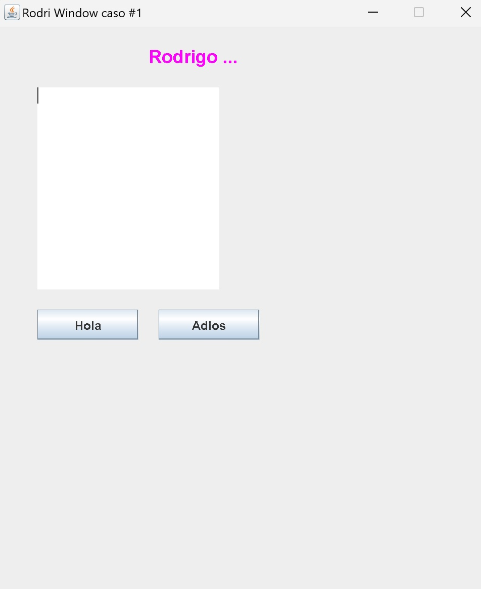

## actividades dentro de la clase

### avance y soporte del profesor

1. Durante 30 minutos van a trabajar en el entregable final del caso #1 en los subsistemas en parejas, el profesor revisará algunos trabajos por muestreo de todas las casas durante este tiempo, adicionalmente del diagrama. Mientras el profesor revisa los demás continuarán avanzando.

### creación asistida de un UI

Para este ejercicio vamos a solicitar ayuda a chatGPT o bard para que nos permita construir un UI y mostrar información de mismo en java, para ello en forma individual, en el proyecto en el que han estado trabajando el caso #1, se le van a presentar pasos y prompts para chatgpt para que les permita crear un UI como el siguiente:

1. agregue un package gui y dentro de ese un package para cada miembro de la pareja de trabajo

2. _prompt_: how to create a JFrame with a fixed size, it cannot be maximize and needs to appear in a specific position on the screen?

con eso, cree entonces una ventana de 500x600, ubicada en la posición, 50x60 de la pantalla y deberá llamarse con un nombre relacionado al caso #1.

3. agregue el main y compruebe que efectivamente la ventana aparece

4. _prompt_: add one JLabel with specific text size and color, centered at the top of the JFrame, using null layout

5. Renombre la variable con Lbl_sunombre, y sustituya el texto del JLabel por su nombre, escoja un color y un tamaño de 18

6. _prompt_: add a JTextArea allowing multiple lines in a custom position of the JFrame. Use a Rectangle class instead of setBounds.

7. renombre la variable del JTextArea por outputConsole y ubiquelo en la posición 40,60, con un ancho de 180 y un alto de 200.

8. _prompt_: add two buttons in a specific location and assign the onclick event for both using lambda expressions

9. Cambie el nombre de las variables y el label del display de los botones por Hola y Adios, y ubique los botones debajo del textbox uno a la par del otro.

10. En el llamado de los botones invoke a métodos privados de la clase hecha, pongales el nombre que guste a los métodos. Ambos métodos deben ser diferentes.

11. Ahora haga que el primer boton al apretarlo, agregue una linea de texto en el TextArea con el mensaje de su elección, implemente eso en el método privado que está invocando.

12. Haga que el segundo boton cambie el color del primer boton.

El UI deberá quedar similar al que aparece en este ejercicio. Una vez que termine, pastee el código completo en un mensaje directo al profesor y también el screenshot de su UI una vez que se hayan oprimido los dos botones.
