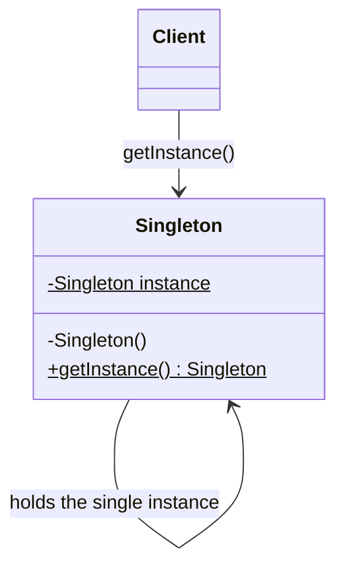
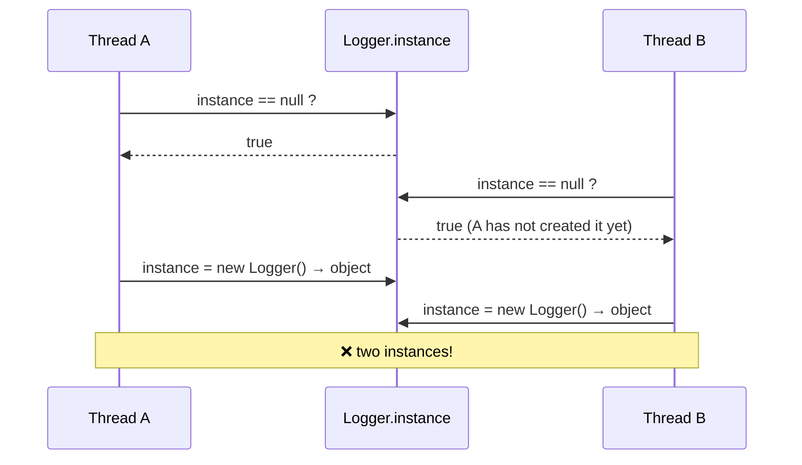
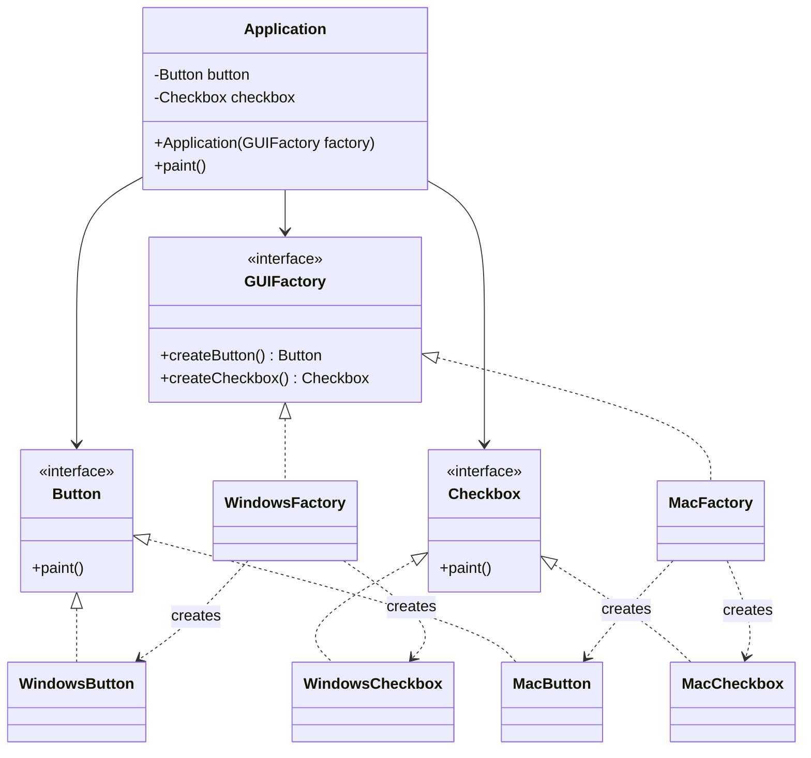
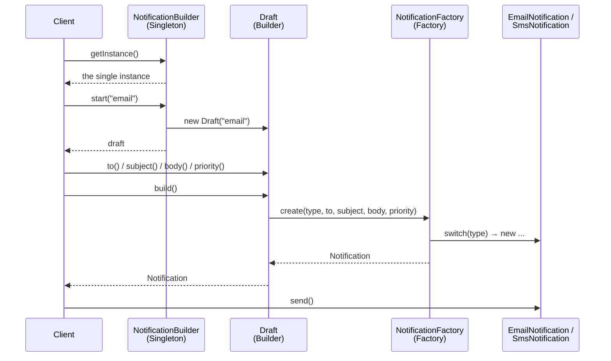

# Creational Design Patterns

Creational patterns deal with **how objects are created**. Instead of scattering `new SomeClass(...)` all over the code, they move object creation into a dedicated place, so the rest of the program depends on *what* it needs, not on *how* it is built.

| Pattern | Main question it answers |
|---|---|
| Singleton | How do I guarantee there is only **one** instance of a class? |
| Abstract Factory | How do I create **families** of related objects without depending on their concrete classes? |
| Builder | How do I construct a **complex** object step by step? |

---

## 1. Singleton

📖 Reference: https://refactoring.guru/design-patterns/singleton

### Situation
Some objects must exist only once in the whole application: a configuration manager, a logger, a connection pool, a cache. If any part of the code can do `new Logger()`, you can end up with several loggers writing to the same file, or several pools exhausting the database.

### Goal
1. Ensure a class has **only one instance**.
2. Provide a **global access point** to that instance.

### Actors

| Actor | Responsibility |
|---|---|
| **Singleton class** | Holds a `private static` field with the single instance, has a `private` constructor (nobody else can call `new`), and exposes a `public static getInstance()` method. |
| **Client** | Any code that needs the object. It never calls `new`; it always calls `Singleton.getInstance()`. |



### 1.1 Not thread safe (no lock)

```java
public class Logger {
    private static Logger instance;   // the single instance

    private Logger() {                // nobody can do "new Logger()"
        System.out.println("Creating Logger...");
    }

    public static Logger getInstance() {
        if (instance == null) {       // (1) check
            instance = new Logger();  // (2) create
        }
        return instance;
    }

    public void log(String msg) {
        System.out.println("[LOG] " + msg);
    }
}
```

This works perfectly **in a single-threaded program**. The problem appears with several threads:



Demo that can show the problem (you may see "Creating Logger..." printed more than once):

```java
public class NotThreadSafeDemo {
    public static void main(String[] args) {
        for (int i = 0; i < 10; i++) {
            new Thread(() -> {
                Logger logger = Logger.getInstance();
                System.out.println(Thread.currentThread().getName() + " -> " + logger.hashCode());
            }).start();
        }
    }
}
```

If the printed `hashCode` values are not all the same, more than one instance was created.

### 1.2 Thread safe with a lock (`synchronized`)

The simplest fix is to make `getInstance()` `synchronized`: only one thread at a time can enter the method.

```java
public class Logger {
    private static Logger instance;

    private Logger() { }

    public static synchronized Logger getInstance() {
        if (instance == null) {
            instance = new Logger();
        }
        return instance;
    }
}
```

✅ Correct. ❌ But **every** call pays the cost of acquiring the lock, even after the instance already exists (which is 99.99% of the calls).

### 1.3 Thread safe with double-checked locking

Lock **only** when the instance doesn't exist yet. The `volatile` keyword is required so that other threads never see a half-constructed object.

```java
public class Logger {
    private static volatile Logger instance;

    private Logger() { }

    public static Logger getInstance() {
        if (instance == null) {                 // 1st check, no lock (fast path)
            synchronized (Logger.class) {       // lock only the first time(s)
                if (instance == null) {         // 2nd check, inside the lock
                    instance = new Logger();
                }
            }
        }
        return instance;
    }
}
```

Why the second check? Threads A and B may both pass the first check; A enters the lock and creates the object; when B finally enters the lock, the second check stops it from creating another one.

### 1.4 Thread safe with a semaphore

A `Semaphore` with **1 permit** behaves like a lock (a *mutex*). It is more explicit and lets you use `tryAcquire` with timeouts, but you must always release it in a `finally`.

```java
import java.util.concurrent.Semaphore;

public class Logger {
    private static volatile Logger instance;
    private static final Semaphore semaphore = new Semaphore(1); // 1 permit = mutual exclusion

    private Logger() { }

    public static Logger getInstance() {
        if (instance == null) {
            try {
                semaphore.acquire();            // wait for the permit
                try {
                    if (instance == null) {
                        instance = new Logger();
                    }
                } finally {
                    semaphore.release();        // ALWAYS give the permit back
                }
            } catch (InterruptedException e) {
                Thread.currentThread().interrupt();
                throw new IllegalStateException("Interrupted while creating Logger", e);
            }
        }
        return instance;
    }
}
```

### 1.5 Thread safe without any lock

You can let the JVM do the synchronization for you. Static initialization of a class is guaranteed to be thread safe by the JVM.

**Eager initialization** – created when the class is loaded:

```java
public class Logger {
    private static final Logger INSTANCE = new Logger();
    private Logger() { }
    public static Logger getInstance() { return INSTANCE; }
}
```

**Holder idiom (lazy, no lock)** – created only the first time `getInstance()` is called:

```java
public class Logger {
    private Logger() { }

    private static class Holder {                 // loaded only when first used
        private static final Logger INSTANCE = new Logger();
    }

    public static Logger getInstance() {
        return Holder.INSTANCE;
    }
}
```

### Comparison

| Variant | Thread safe? | Uses lock? | Lazy? | Cost per call | Notes |
|---|---|---|---|---|---|
| 1.1 Basic | ❌ No | No | Yes | Very low | Only valid in single-threaded code |
| 1.2 `synchronized` method | ✅ Yes | Yes, always | Yes | High (lock every call) | Simplest correct version |
| 1.3 Double-checked locking | ✅ Yes | Only at creation | Yes | Low | Needs `volatile` |
| 1.4 Semaphore | ✅ Yes | Only at creation | Yes | Low | Explicit, supports timeouts, must `release()` in `finally` |
| 1.5 Eager / Holder | ✅ Yes | No (JVM handles it) | Eager: No / Holder: Yes | Very low | Recommended in most Java code |

**Lock vs. no lock, in short:**
- **Without a lock**, the check-then-create (`if null -> new`) is not atomic, so two threads can interleave and create two objects.
- **With a lock/semaphore**, the check-then-create becomes a *critical section*: only one thread at a time can execute it.
- **Without a lock but relying on the JVM** (static init), you get thread safety for free, because the JVM guarantees a class is initialized exactly once.

---

## 2. Abstract Factory

📖 Reference: https://refactoring.guru/design-patterns/abstract-factory

### Situation
You are building a UI that must run on **Windows** and **Mac**. Each platform has its own `Button` and `Checkbox`. The products come in **families**: a Windows button must be used with a Windows checkbox, never mixed with a Mac one. If the client code does `new WindowsButton()` directly, adding a new platform (e.g., Linux) means changing code everywhere.

### Goal
Provide an interface to create **families of related objects** without specifying their concrete classes. The client only talks to interfaces; switching the whole family means switching just one factory object.

### Actors

| Actor | Responsibility | In the example |
|---|---|---|
| **Abstract Products** | Interfaces for each kind of product in the family. | `Button`, `Checkbox` |
| **Concrete Products** | Implementations of each product for one variant/family. | `WindowsButton`, `MacButton`, `WindowsCheckbox`, `MacCheckbox` |
| **Abstract Factory** | Interface with one creation method per abstract product. | `GUIFactory` |
| **Concrete Factories** | Implement the creation methods for one family. | `WindowsFactory`, `MacFactory` |
| **Client** | Uses only the abstract factory and abstract products. | `Application` |



### Base code (products and factories)

```java
// ----- Abstract products -----
public interface Button   { void paint(); }
public interface Checkbox { void paint(); }

// ----- Concrete products: Windows family -----
public class WindowsButton implements Button {
    public void paint() { System.out.println("Rendering a Windows button"); }
}
public class WindowsCheckbox implements Checkbox {
    public void paint() { System.out.println("Rendering a Windows checkbox"); }
}

// ----- Concrete products: Mac family -----
public class MacButton implements Button {
    public void paint() { System.out.println("Rendering a Mac button"); }
}
public class MacCheckbox implements Checkbox {
    public void paint() { System.out.println("Rendering a Mac checkbox"); }
}

// ----- Abstract factory -----
public interface GUIFactory {
    Button createButton();
    Checkbox createCheckbox();
}

// ----- Concrete factories -----
public class WindowsFactory implements GUIFactory {
    public Button createButton()     { return new WindowsButton(); }
    public Checkbox createCheckbox() { return new WindowsCheckbox(); }
}
public class MacFactory implements GUIFactory {
    public Button createButton()     { return new MacButton(); }
    public Checkbox createCheckbox() { return new MacCheckbox(); }
}

// ----- Client: only knows interfaces -----
public class Application {
    private final Button button;
    private final Checkbox checkbox;

    public Application(GUIFactory factory) {
        this.button = factory.createButton();
        this.checkbox = factory.createCheckbox();
    }

    public void paint() {
        button.paint();
        checkbox.paint();
    }
}
```

The remaining question is: **who decides which concrete factory to use?** Below are two variations.

### 2.1 Choosing the factory with a `switch`

```java
public class FactoryProvider {
    public static GUIFactory getFactory(String os) {
        switch (os.toLowerCase()) {
            case "windows": return new WindowsFactory();
            case "mac":     return new MacFactory();
            default: throw new IllegalArgumentException("Unknown OS: " + os);
        }
    }
}

public class Main {
    public static void main(String[] args) {
        GUIFactory factory = FactoryProvider.getFactory("mac");
        new Application(factory).paint();
        // Rendering a Mac button
        // Rendering a Mac checkbox
    }
}
```

- ✅ Simple, readable, type safe, errors caught at compile time.
- ❌ Every new family (e.g., `LinuxFactory`) requires **modifying** the `switch` (violates the Open/Closed principle).

### 2.2 Choosing the factory with reflection (class name as a string)

The class name can come from a config file, a database, or an environment variable. The code never mentions the concrete classes.

```java
public class FactoryProvider {
    public static GUIFactory getFactory(String className) {
        try {
            Class<?> clazz = Class.forName(className);              // load the class by name
            Object obj = clazz.getDeclaredConstructor().newInstance(); // call the no-arg constructor
            if (!(obj instanceof GUIFactory)) {
                throw new IllegalArgumentException(className + " is not a GUIFactory");
            }
            return (GUIFactory) obj;
        } catch (ReflectiveOperationException e) {
            throw new IllegalArgumentException("Cannot create factory: " + className, e);
        }
    }
}

public class Main {
    public static void main(String[] args) {
        // Could be read from config.properties: gui.factory=com.example.gui.WindowsFactory
        String factoryClass = "com.example.gui.WindowsFactory";

        GUIFactory factory = FactoryProvider.getFactory(factoryClass);
        new Application(factory).paint();
        // Rendering a Windows button
        // Rendering a Windows checkbox
    }
}
```

- ✅ Adding a `LinuxFactory` requires **no change** in `FactoryProvider`: just create the class and change the string in the config.
- ❌ Errors (typo in the name, missing constructor) only appear at **runtime**; reflection is slower and harder to follow.

### Switch vs. Reflection

| | `switch` | Reflection |
|---|---|---|
| Add new family | Modify the switch | Only add the class + config |
| Errors detected | Compile time | Runtime |
| Performance | Fast | Slower (cache the result if called often) |
| Readability | High | Medium |
| Typical use | Small, fixed set of options | Plugins, frameworks, configurable systems |

---

## 3. Builder

📖 Reference: https://refactoring.guru/design-patterns/builder

### Situation
You need to create a `Pizza` (or a `House`, an `HttpRequest`, a `Report`...) that has many optional parts: size, crust, cheese, pepperoni, mushrooms, extra sauce... A constructor with 10 parameters is unreadable and error prone:

```java
new Pizza("L", "thin", true, false, true, false, false, true, null, 2); // what is what?!
```

Creating many constructor overloads ("telescoping constructors") doesn't scale either.

### Goal
Separate the **construction** of a complex object from its **representation**, so you can build it **step by step**, calling only the steps you need, and the same construction process can produce different representations.

### Actors

| Actor | Responsibility | In the example |
|---|---|---|
| **Product** | The complex object being built. | `Pizza` |
| **Builder (interface)** | Declares the construction steps common to all builders. | `PizzaBuilder` |
| **Concrete Builder** | Implements the steps and keeps the product under construction; returns it with `build()`. | `ItalianPizzaBuilder` |
| **Director** (optional) | Knows the *order* of steps to build common configurations (recipes). | `PizzaChef` |
| **Client** | Creates the builder, optionally passes it to the director, and gets the result. | `Main` |

### Code example

```java
import java.util.ArrayList;
import java.util.List;

// ----- Product -----
public class Pizza {
    private String size;
    private String crust;
    private boolean cheese;
    private final List<String> toppings = new ArrayList<>();

    void setSize(String size)   { this.size = size; }
    void setCrust(String crust) { this.crust = crust; }
    void setCheese(boolean c)   { this.cheese = c; }
    void addTopping(String t)   { toppings.add(t); }

    @Override
    public String toString() {
        return "Pizza[size=" + size + ", crust=" + crust + ", cheese=" + cheese + ", toppings=" + toppings + "]";
    }
}

// ----- Builder interface -----
public interface PizzaBuilder {
    PizzaBuilder reset();
    PizzaBuilder size(String size);
    PizzaBuilder crust(String crust);
    PizzaBuilder cheese();
    PizzaBuilder topping(String topping);
    Pizza build();
}

// ----- Concrete builder -----
public class ItalianPizzaBuilder implements PizzaBuilder {
    private Pizza pizza = new Pizza();

    public PizzaBuilder reset()                { pizza = new Pizza(); return this; }
    public PizzaBuilder size(String size)      { pizza.setSize(size); return this; }
    public PizzaBuilder crust(String crust)    { pizza.setCrust(crust); return this; }
    public PizzaBuilder cheese()               { pizza.setCheese(true); return this; }
    public PizzaBuilder topping(String t)      { pizza.addTopping(t); return this; }

    public Pizza build() {
        Pizza result = pizza;
        reset();              // ready to build the next pizza
        return result;
    }
}

// ----- Director (optional): predefined recipes -----
public class PizzaChef {
    public Pizza makeMargherita(PizzaBuilder b) {
        return b.reset().size("M").crust("thin").cheese().topping("tomato").topping("basil").build();
    }

    public Pizza makePepperoni(PizzaBuilder b) {
        return b.reset().size("L").crust("classic").cheese().topping("pepperoni").build();
    }
}

// ----- Client -----
public class Main {
    public static void main(String[] args) {
        PizzaBuilder builder = new ItalianPizzaBuilder();

        // Using the director (predefined recipe)
        PizzaChef chef = new PizzaChef();
        System.out.println(chef.makeMargherita(builder));

        // Using the builder directly (custom pizza, fluent API)
        Pizza custom = builder.size("S").crust("thick").topping("mushrooms").topping("olives").build();
        System.out.println(custom);
    }
}
```

Output:
```
Pizza[size=M, crust=thin, cheese=true, toppings=[tomato, basil]]
Pizza[size=S, crust=thick, cheese=false, toppings=[mushrooms, olives]]
```

Notice how readable `builder.size("S").crust("thick")...` is compared with a 10-parameter constructor. Each method returns `this`, which enables **method chaining** (fluent interface).

---

## 4. Mixed example: Factory + Singleton Builder

### Situation
A small notification system can send **Email** and **SMS** messages. Requirements:

- A **Factory** decides which kind of notification to create from a string (`"email"`, `"sms"`), so the client does not depend on concrete classes.
- Each notification is a complex object (recipient, subject, body, priority...), so it is assembled with a **Builder**.
- The builder is a **Singleton**: there is a single, shared, thread-safe `NotificationBuilder` in the application. Because it is shared by many threads, it must not keep the "object under construction" as shared state; instead `getInstance()` hands out a fresh, independent *session* for every build (each `start()` returns a new `Draft`).

### Actors in this example

| Pattern | Actor | Class |
|---|---|---|
| Factory | Abstract product | `Notification` |
| Factory | Concrete products | `EmailNotification`, `SmsNotification` |
| Factory | Factory | `NotificationFactory` |
| Builder | Builder (steps) | `NotificationBuilder.Draft` |
| Builder | Product | `Notification` (the one produced by the factory) |
| Singleton | Singleton | `NotificationBuilder` |
| — | Client | `Main` |

### Code

```java
import java.util.concurrent.ExecutorService;
import java.util.concurrent.Executors;

// ======================= PRODUCTS =======================
public interface Notification {
    void send();
}

public class EmailNotification implements Notification {
    private final String to, subject, body;
    private final int priority;

    EmailNotification(String to, String subject, String body, int priority) {
        this.to = to; this.subject = subject; this.body = body; this.priority = priority;
    }

    public void send() {
        System.out.printf("[EMAIL p%d] to=%s | subject=%s | %s%n", priority, to, subject, body);
    }
}

public class SmsNotification implements Notification {
    private final String to, body;
    private final int priority;

    SmsNotification(String to, String body, int priority) {
        this.to = to; this.body = body; this.priority = priority;
    }

    public void send() {
        System.out.printf("[SMS   p%d] to=%s | %s%n", priority, to, body);
    }
}

// ======================= FACTORY =======================
public class NotificationFactory {
    public static Notification create(String type, String to, String subject, String body, int priority) {
        switch (type.toLowerCase()) {
            case "email": return new EmailNotification(to, subject, body, priority);
            case "sms":   return new SmsNotification(to, body, priority);
            default: throw new IllegalArgumentException("Unknown notification type: " + type);
        }
    }
}

// ======================= SINGLETON BUILDER =======================
public final class NotificationBuilder {

    // --- Singleton (thread safe, lazy, no lock: holder idiom) ---
    private NotificationBuilder() { }

    private static class Holder {
        private static final NotificationBuilder INSTANCE = new NotificationBuilder();
    }

    public static NotificationBuilder getInstance() {
        return Holder.INSTANCE;
    }

    // --- Builder: every start() returns a NEW draft, so threads never share state ---
    public Draft start(String type) {
        return new Draft(type);
    }

    public static class Draft {
        private final String type;
        private String to;
        private String subject = "(no subject)";
        private String body = "";
        private int priority = 3;

        private Draft(String type) { this.type = type; }

        public Draft to(String to)           { this.to = to; return this; }
        public Draft subject(String subject) { this.subject = subject; return this; }
        public Draft body(String body)       { this.body = body; return this; }
        public Draft priority(int priority)  { this.priority = priority; return this; }

        public Notification build() {
            if (to == null || to.isEmpty()) {
                throw new IllegalStateException("Recipient is required");
            }
            // The builder delegates the concrete class decision to the FACTORY
            return NotificationFactory.create(type, to, subject, body, priority);
        }
    }
}

// ======================= CLIENT =======================
public class Main {
    public static void main(String[] args) {
        NotificationBuilder builder = NotificationBuilder.getInstance();

        Notification welcome = builder.start("email")
                .to("ana@mail.com")
                .subject("Welcome!")
                .body("Thanks for joining the course.")
                .priority(2)
                .build();

        Notification code = builder.start("sms")
                .to("+506 8888-8888")
                .body("Your code is 4821")
                .priority(1)
                .build();

        welcome.send();
        code.send();

        // Same singleton used concurrently from several threads
        ExecutorService pool = Executors.newFixedThreadPool(4);
        for (int i = 1; i <= 4; i++) {
            final int n = i;
            pool.submit(() -> {
                NotificationBuilder b = NotificationBuilder.getInstance();
                System.out.println("Thread " + n + " uses builder #" + b.hashCode());
                b.start(n % 2 == 0 ? "email" : "sms")
                 .to("user" + n + "@mail.com")
                 .body("Message " + n)
                 .build()
                 .send();
            });
        }
        pool.shutdown();
    }
}
```

Possible output (thread order may vary, but the builder hash is always the same):
```
[EMAIL p2] to=ana@mail.com | subject=Welcome! | Thanks for joining the course.
[SMS   p1] to=+506 8888-8888 | Your code is 4821
Thread 1 uses builder #1163157884
Thread 2 uses builder #1163157884
[SMS   p3] to=user1@mail.com | Message 1
[EMAIL p3] to=user2@mail.com | subject=(no subject) | Message 2
...
```

### How the three patterns collaborate



- **Singleton** → one shared entry point to build notifications.
- **Builder** → readable step-by-step configuration with validation in `build()`.
- **Factory** → decides the concrete class, so adding `PushNotification` only touches the factory (or, using the reflection variation from section 2.2, not even that).

> ⚠️ Design note: a singleton builder that stored the fields directly in the singleton (`this.to = ...`) would **not** be thread safe: two threads building at the same time would overwrite each other's data. That is why the singleton only creates independent `Draft` objects.
