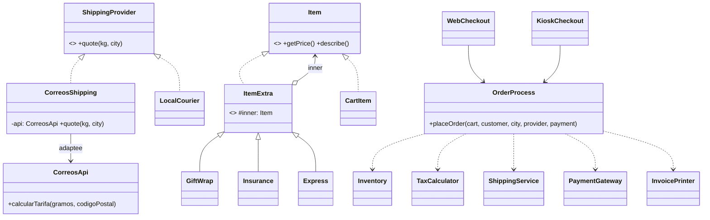

# Actividad Semana #11: Detectalo y luego dirigí a la IA

**Patrones:** Adapter · Decorator · Facade  **Duración:** 50 minutos  **Formato:** parejas, una computadora y un asistente de programación con IA por pareja

> **Idea central:** si podés describir una estructura con suficiente precisión para que una IA la construya, entendés el patrón. En esta actividad **ustedes** encuentran dónde aplica un patrón y **ustedes** deciden la estructura. La IA solo escribe el código.

---

## Parte 1: Hoja para estudiantes

### Las reglas

1. **Trabajen en parejas.** El **driver** escribe los prompts. El **navigator** revisa cada respuesta de la IA contra los chequeos de esa ronda. Intercambien roles en cada ronda.
2. **Palabras prohibidas en los prompts:** `adapter`, `decorator`, `facade`, `wrapper`, `pattern`, `design pattern`, y sus equivalentes en español: `adaptador`, `decorador`, `fachada`, `envoltorio`, `patrón`, `patrón de diseño`. Tampoco frases como `refactorizá esto usando…`, `¿qué patrón…?`, `mejorá este código`, `limpiá esto`.
   Un prompt que use cualquiera de ellas **no cuenta**. (`gift wrap` sí se puede usar porque es una característica del producto.)
3. **No le pregunten a la IA dónde están los problemas.** Detectarlos es trabajo de ustedes (Paso 1).
4. **Un paso por prompt.** Nada de prompts de "hacé todo de una vez".
5. **La salida base es su prueba.** Después de cada cambio, `Main` debe imprimir **exactamente** la salida base de abajo.
6. **Lleven una bitácora de prompts** en `prompts.md`: copien cada prompt que envían y agreguen una línea sobre qué hizo bien o mal la IA. Esta bitácora es lo que se califica.

### El proyecto inicial: TecShop checkout

Carpeta: `src/patterns/tecshop/` (paquete `tecshop`)

| Clase | Qué hace |
|---|---|
| `Main` | Arma dos carritos; uno se paga en la web y otro en el kiosco |
| `WebCheckout`, `KioskCheckout` | Ejecutan una compra de principio a fin |
| `Cart`, `CartItem` | Productos y sus extras (envoltura de regalo, seguro, envío exprés) |
| `Inventory`, `TaxCalculator`, `PaymentGateway`, `InvoicePrinter`, `Money` | Servicios de la tienda |
| `ShippingService` | Escoge un proveedor de envío y obtiene una cotización |
| `ShippingProvider`, `LocalCourier` | **Nuestra** interfaz de envío y nuestro mensajero propio |
| `CorreosApi` | SDK **de terceros** de Correos de Costa Rica. **No se puede modificar.** |

Para ejecutarlo:

```bash
cd src/patterns/tecshop
javac -encoding UTF-8 -d out *.java
java -cp out tecshop.Main
```

**Salida base** (debe mantenerse idéntica):

```
Inventory: reserved 3 items
Payment: charged CRC 61,832.00 via credit card
----- INVOICE: Ana -----
  Laptop stand + gift wrap + express  CRC 29,000.00
  USB-C hub + insurance  CRC 18,900.00
  Notebook  CRC 3,500.00
  Subtotal: CRC 51,400.00
  Tax:      CRC 6,682.00
  Shipping: CRC 3,750.00
  TOTAL:    CRC 61,832.00

Inventory: reserved 1 items
Payment: charged CRC 53,592.75 via SINPE Movil
----- INVOICE: Luis -----
  Mechanical keyboard + gift wrap + insurance  CRC 45,675.00
  Subtotal: CRC 45,675.00
  Tax:      CRC 5,937.75
  Shipping: CRC 1,980.00
  TOTAL:    CRC 53,592.75
```

### Paso 1: Detección (sin IA). Completen el Mapa de Problemas

Lean el código. Hay **tres** problemas de diseño. Usen la Tarjeta de Detección para encontrarlos.

| # | Dónde (clase.método) | Síntoma: ¿qué va a doler cuando el código cambie? | ¿Quién sabe demasiado? | ¿Qué clase(s) existente(s) dejarían intactas? |
|---|---|---|---|---|
| S1 | | | | |
| S2 | | | | |
| S3 | | | | |

### Tarjeta de Detección

| Si ves… | Preguntate… | Movimiento estructural |
|---|---|---|
| Código cliente que **convierte** unidades, tipos o nombres antes de llamar a una clase que **no puede cambiar** | "¿Podría mi código hablar solo con **mi** interfaz?" | Una clase nueva **implementa mi interfaz**, **guarda el objeto ajeno** en un atributo y **traduce** cada llamada. |
| **Banderas booleanas** o cadenas de `if` que suman costo o comportamiento, o **una subclase por cada combinación** | "¿Podría cada extra ser su propio objeto que agrego **en tiempo de ejecución**?" | Objetos que **comparten la interfaz del ítem**, **guardan otro ítem** y **le suman a su resultado**. Se pueden apilar. |
| La **misma secuencia de varios pasos** sobre varias clases de un subsistema, **copiada** en varios clientes | "¿Podrían los clientes llamar a **un solo método**?" | Una clase **es dueña de la secuencia** y ofrece un método simple. Las clases del subsistema quedan como están. |

### Plantilla de directiva técnica

Cada prompt que escriban debe tener estas cinco partes:

```
CONTEXTO:    Qué archivos/clases están involucrados (peguen solo lo que la IA necesita).
TAREA:       UN paso: una clase nueva, o un cambio en una clase.
ESTRUCTURA:  Nombre del tipo; qué implementa/extiende; atributos (¿private? ¿final?);
             parámetros del constructor; firmas de métodos; a qué objeto delega
             cada método y qué hace antes/después de delegar.
REGLAS:      Qué NO debe cambiar (p. ej. "no modifiques CorreosApi");
             sin librerías nuevas; mantener el paquete tecshop; no tocar otros archivos.
TERMINADO:   Compila; Main imprime exactamente la salida base;
             mostrame solo el archivo nuevo/modificado.
```

**Prompts débiles vs. un prompt fuerte**

| ❌ Débil | Por qué es débil |
|---|---|
| "Arreglá el código de envíos, está desordenado." | Sin estructura ni restricciones. La IA decide todo. |
| "Aplicá el patrón adapter a Correos." | Usa una palabra prohibida. No aprenden nada de la estructura. |
| "Refactorizá todo el proyecto para que sea fácil de extender." | Demasiado en un solo paso. No lo pueden verificar. |

✅ Fuerte:

> CONTEXTO: `ShippingProvider.java` y `CorreosApi.java` (pegados abajo).
> TAREA: Creá una clase nueva `CorreosShipping` en el paquete `tecshop`.
> ESTRUCTURA: Implementa `ShippingProvider`. Tiene un único atributo `private final CorreosApi api` que recibe en su constructor. Por ahora, dejá que `quote` lance `UnsupportedOperationException`.
> REGLAS: No modifiques `CorreosApi`, `ShippingProvider` ni ningún otro archivo.
> TERMINADO: Compila. Mostrame solo el archivo nuevo.

### Rondas

En cada ronda escriban su **propia** secuencia de prompts con la plantilla, regístrenla y verifiquen la salida base después de cada paso.

**Ronda 1: S1 (10 min).** El navigator verifica:
- [ ] ¿`ShippingService` todavía menciona `CorreosApi`, gramos, códigos postales o `₡`?
- [ ] ¿`CorreosApi` quedó intacta?
- [ ] ¿La salida coincide con la salida base?

**Ronda 2: S2 (12 min).** Intercambien roles. El navigator verifica:
- [ ] ¿Puedo agregar un 4.º extra (p. ej. *grabado*, +CRC 3,000) **sin editar ninguna clase existente**? Pruébenlo.
- [ ] ¿Puedo escoger los extras de cada ítem **en tiempo de ejecución** desde `Main`?
- [ ] ¿La salida coincide con la salida base? (Pista: piensen en el **orden** de los extras del teclado.)

**Ronda 3: S3 (9 min).** Intercambien roles. El navigator verifica:
- [ ] ¿`WebCheckout` y `KioskCheckout` quedan reducidos a **una sola llamada** cada uno?
- [ ] ¿Las clases de checkout todavía crean `Inventory`, `TaxCalculator`, etc.?
- [ ] ¿Las clases de servicios de la tienda quedaron sin cambios?
- [ ] ¿La salida coincide con la salida base?

### Boleta de salida (individual, últimos 2 minutos)

Escriban **un** prompt, sin palabras prohibidas, que haría que una IA cree desde cero la estructura que construyeron en la Ronda 2.

---

## Parte 2: Guía para el docente

### Cronograma (50 min)

| Min | Fase | Qué pasa | Rol del docente |
|---|---|---|---|
| 0–5 | **Gancho y reglas** | Proyectar los prompts débiles vs. el fuerte. Explicar las palabras prohibidas, los roles, la salida base y la bitácora. | Decirlo claro: *"Hoy la IA es su teclado, no su arquitecta."* |
| 5–12 | **Detección (sin IA)** | Las parejas leen el código y completan el Mapa de Problemas con la Tarjeta de Detección. | En el minuto 11, hacer un plenario rápido de 1 minuto: confirmar la **ubicación** de S1–S3. **No decir los nombres de los patrones.** |
| 12–22 | **Ronda 1: S1** | Prompt, ejecutar, comparar, registrar. | Circular por el aula. Si una pareja se traba, preguntar: *"¿Qué interfaz le gustaría a `ShippingService` que tuviera Correos?"* |
| 22–34 | **Ronda 2: S2** | Cambio de roles. | Preguntar: *"¿De dónde saca su precio el extra, si no es de las banderas?"* |
| 34–43 | **Ronda 3: S3** | Cambio de roles. | Preguntar: *"Si mañana aparece un tercer checkout (app móvil), ¿cuántas líneas copiaría?"* |
| 43–50 | **Cierre** | **Revelar los nombres** (S1 = Adapter, S2 = Decorator, S3 = Facade). Las parejas etiquetan sus clases con los nombres de los actores de la [Semana #11](Week%20%2311.md) (Target, Adaptee, Component, Base Decorator, Subsystem…). Una pareja proyecta su mejor y su peor prompt. El grupo dice qué parte de la plantilla le faltó al peor. Boleta de salida. | Mostrar la nota "Proxy vs. Decorator" como adelanto de la próxima clase. |

### Rúbrica de la bitácora de prompts (0–2 puntos por criterio, 8 en total)

| Criterio | 0 | 1 | 2 |
|---|---|---|---|
| **Estructura específica** | "Hacelo mejor" | Nombra clases, pero no atributos ni delegación | Nombra el tipo, implements/extends, atributos, parámetros del constructor y delegación |
| **Incremental** | Un prompt enorme | 2 pasos por ronda | 3 o más pasos pequeños y verificables por ronda |
| **Restricciones** | Ninguna | Algunas | Indica explícitamente, siempre, qué no debe cambiar |
| **Verificación** | Nunca lo ejecutaron | Lo ejecutaron | Verificaron la salida base después de cada paso **y** registraron al menos un error de la IA que detectaron |

Una palabra prohibida deja ese prompt en 0.

### Qué observar (errores comunes de la IA que los estudiantes deberían detectar)

- **S1:** la IA modifica `CorreosApi` para que encaje, o mantiene la rama `if ("correos")` y solo mueve la conversión a un método auxiliar. Eso es un helper estático, no un objeto que implementa nuestra interfaz.
- **S2:** la IA crea subclases como `GiftWrapExpressItem` (otra vez la explosión de clases). O se le olvida que `Cart` e `InvoicePrinter` ahora deben usar el tipo de la **interfaz**, no `CartItem`. O reordena los extras, lo que cambia el precio del teclado (el seguro es el 5 % de lo que envuelve). Es un buen momento para el cierre: **con extras apilables, el orden importa**.
- **S3:** la IA "simplifica" metiendo `TaxCalculator` dentro de la clase nueva, o borra las clases del subsistema. El subsistema debe quedar intacto y sin saber que existe la clase nueva.

<details>
<summary><strong>Solucionario: secuencias de prompts de referencia y estructura resultante (solo docente)</strong></summary>

Este solucionario fue verificado: al aplicarlo, la salida es idéntica a la salida base.

#### S1 → Adapter
1. Crear `CorreosShipping implements ShippingProvider` con un atributo `private final CorreosApi api` recibido en el constructor. Por ahora `quote` lanza una excepción.
2. Implementar `quote(kg, city)`: convertir kg a gramos `int` (`Math.round(kg * 1000)`), buscar el código postal en un atributo `Map<String,String>` (San Jose 10101, Alajuela 20101, Cartago 30101, Limon 70101), llamar a `api.calcularTarifa`, quitar el `₡` y convertir a `double`. Ciudad desconocida → `IllegalArgumentException`.
3. En `ShippingService`, reemplazar los dos atributos y el `if/else` por un `Map<String, ShippingProvider>`: `"local"` → `new LocalCourier()`, `"correos"` → `new CorreosShipping(new CorreosApi())`. `quote` busca y delega.
4. Ejecutar y comparar con la salida base.

Actores: **Target** `ShippingProvider` · **Adaptee** `CorreosApi` · **Adapter** `CorreosShipping` · **Client** `ShippingService`.

#### S2 → Decorator
1. Crear la interfaz `Item { double getPrice(); String describe(); }`. `CartItem` la implementa, se le quitan los 3 booleanos y su constructor pasa a ser `(String name, double basePrice)`. `Cart` e `InvoicePrinter` usan `Item` en lugar de `CartItem`.
2. Crear `abstract class ItemExtra implements Item` con `protected final Item inner` recibido en el constructor. Ambos métodos delegan en `inner`.
3. Crear `GiftWrap` (+1500, `" + gift wrap"`), `Insurance` (+5 % de `inner.getPrice()`, `" + insurance"`) y `Express` (+2500, `" + express"`). Cada una extiende `ItemExtra`, llama primero a `inner` y luego suma.
4. En `Main`: `new Express(new GiftWrap(new CartItem("Laptop stand", 25000)))`, `new Insurance(new CartItem("USB-C hub", 18000))`, `new Insurance(new GiftWrap(new CartItem("Mechanical keyboard", 42000)))`.
5. Extra: agregar `Engraving` sin tocar ninguna clase existente.

Actores: **Component** `Item` · **Concrete Component** `CartItem` · **Base Decorator** `ItemExtra` · **Concrete Decorators** `GiftWrap`, `Insurance`, `Express` · **Client** `Main`.

#### S3 → Facade
1. Crear `OrderProcess` con atributos privados para `Inventory`, `TaxCalculator`, `ShippingService`, `PaymentGateway` e `InvoicePrinter`, y un método `placeOrder(Cart cart, String customer, String city, String shippingProvider, String paymentMethod)` que ejecuta los 5 pasos en el orden actual.
2. Reescribir `WebCheckout.buy` y `KioskCheckout.buy` para que cada uno tenga un `OrderProcess` y haga **una** sola llamada (`"correos"/"credit card"` y `"local"/"SINPE Movil"`).
3. Verificar que ninguna clase de checkout haga referencia a clases del subsistema, y comparar con la salida base.

Actores: **Facade** `OrderProcess` · **Subsystem** `Inventory`, `TaxCalculator`, `ShippingService`, `PaymentGateway`, `InvoicePrinter` · **Clients** `WebCheckout`, `KioskCheckout`.



</details>
