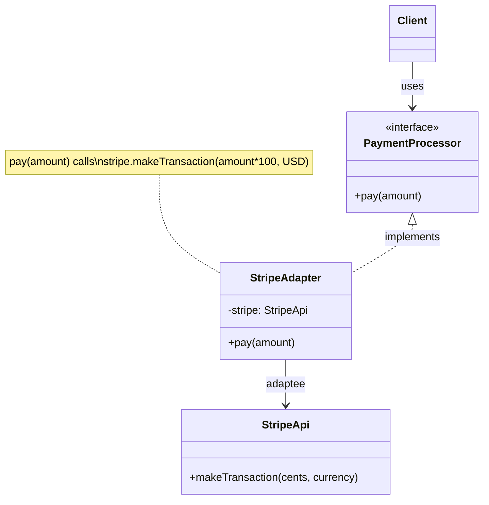
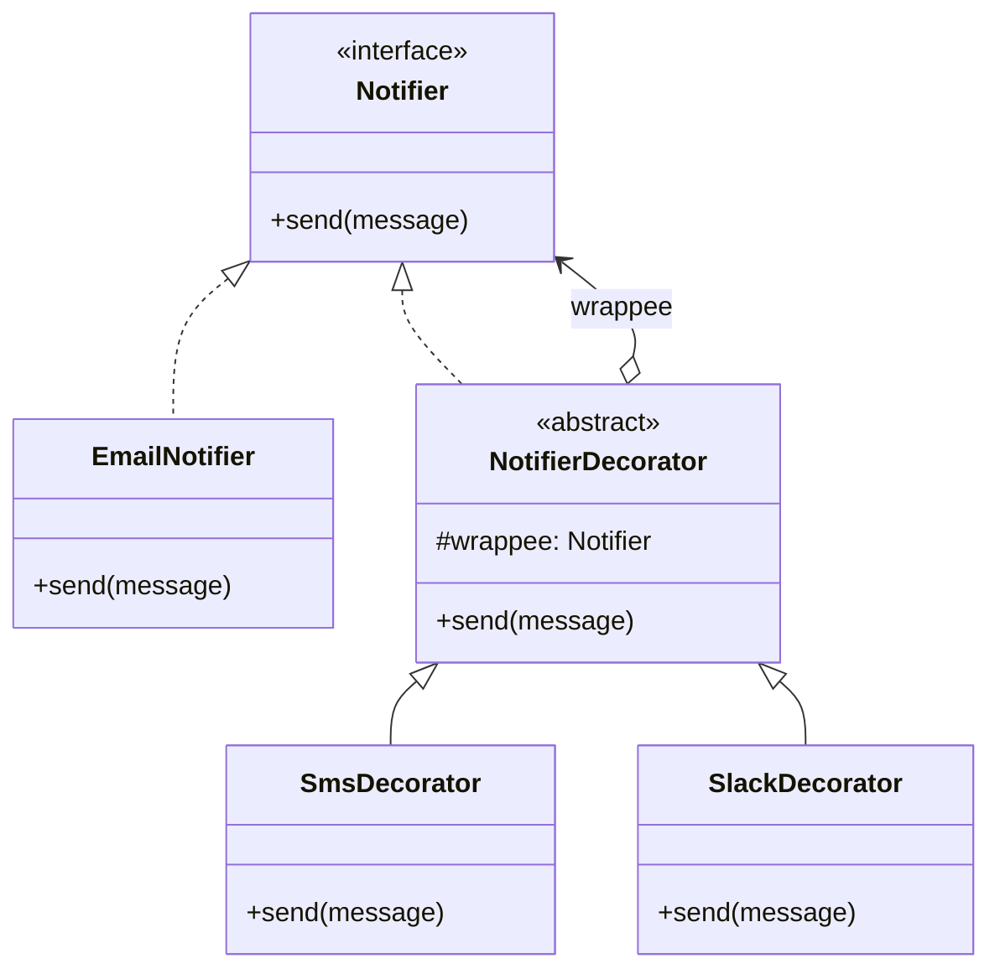
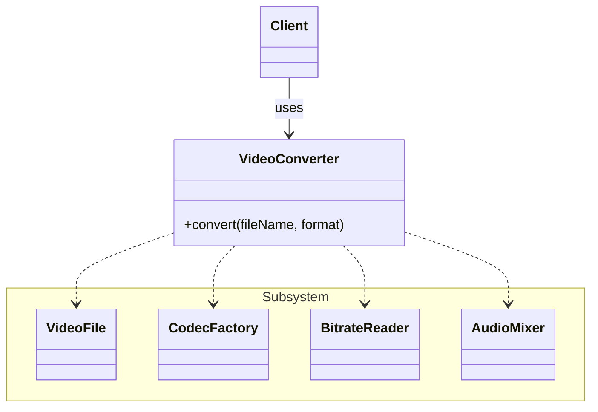
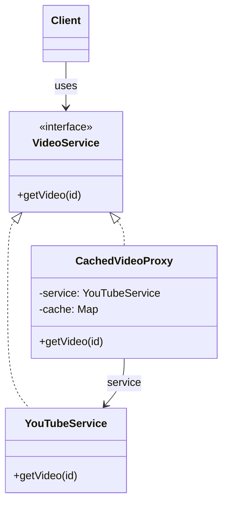
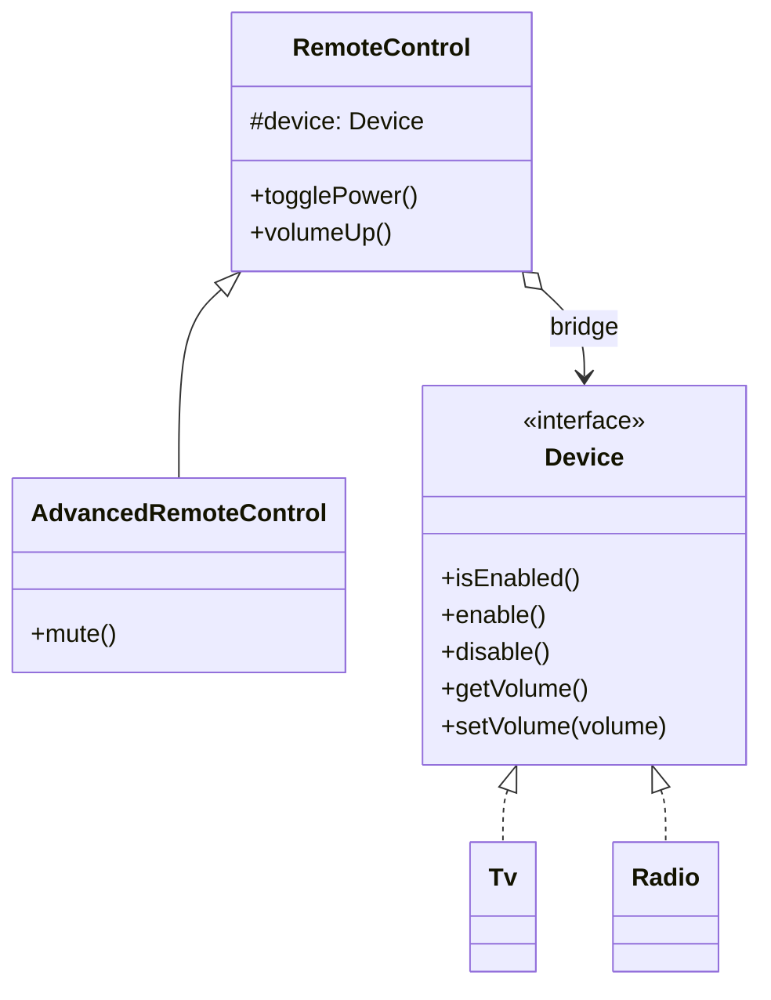

# Structural Design Patterns

Structural patterns deal with **how classes and objects are combined** to form larger structures. They help when two pieces don't fit together, when you want to add behavior without touching existing code, or when a structure is too complex and needs a simpler face. The key tool in almost all of them is **composition**: an object holds a reference to another object and delegates work to it.

| Pattern | Main question it answers |
|---|---|
| Adapter | How do I make an object with an **incompatible interface** work with my code? |
| Decorator | How do I **add behavior** to an object at runtime without changing its class? |
| Facade | How do I offer a **simple interface** to a complex subsystem? |
| Proxy | How do I **control access** to an object (lazy loading, caching, security, logging)? |
| Bridge | How do I split a class that grows in **two independent dimensions** into two hierarchies? |

---

## 1. Adapter

📖 Reference: https://refactoring.guru/design-patterns/adapter

### Situation
Your application works with an interface you designed, for example `PaymentProcessor` with `pay(double amount)`. Now you must integrate a third-party library (or legacy code) whose class does the same job but with a different method: `makeTransaction(int cents, String currency)`. You can't (or shouldn't) change the library, and you don't want to rewrite your client code.

### Goal
Allow objects with **incompatible interfaces** to collaborate by placing a **translator** in the middle that converts calls from one interface into the other.

### Actors

| Actor | Responsibility |
|---|---|
| **Client** | Contains the business logic. It only knows the **Target** interface. |
| **Target (Client Interface)** | The interface the client expects. |
| **Adaptee (Service)** | The useful class with an incompatible interface (third-party / legacy). |
| **Adapter** | Implements the Target and holds a reference to the Adaptee. It receives calls in the Target format and translates them to the Adaptee format. |



### Code example

```java
// Target: the interface our application uses
interface PaymentProcessor {
    void pay(double amount);
}

// Adaptee: third-party class we cannot modify
class StripeApi {
    public void makeTransaction(int cents, String currency) {
        System.out.println("Stripe: charging " + cents + " cents in " + currency);
    }
}

// Adapter: translates PaymentProcessor calls into StripeApi calls
class StripeAdapter implements PaymentProcessor {
    private final StripeApi stripe;

    public StripeAdapter(StripeApi stripe) {
        this.stripe = stripe;
    }

    @Override
    public void pay(double amount) {
        int cents = (int) Math.round(amount * 100);   // data conversion
        stripe.makeTransaction(cents, "USD");          // call delegation
    }
}

// Client: only knows PaymentProcessor
public class Main {
    public static void main(String[] args) {
        PaymentProcessor processor = new StripeAdapter(new StripeApi());
        processor.pay(25.50);
        // Stripe: charging 2550 cents in USD
    }
}
```

---

## 2. Decorator

📖 Reference: https://refactoring.guru/design-patterns/decorator

### Situation
You have a `Notifier` that sends emails. Later, some users want SMS too, others Slack, others SMS + Slack + email. Creating a subclass for every combination (`EmailSmsNotifier`, `EmailSlackNotifier`, `EmailSmsSlackNotifier`, ...) causes a **class explosion**. Inheritance is static: you can't change the behavior at runtime.

### Goal
Attach **new responsibilities to an object dynamically** by wrapping it inside other objects (wrappers) that share the same interface. Wrappers can be **stacked** in any order and combination.

### Actors

| Actor | Responsibility |
|---|---|
| **Component** | Common interface for both the wrapped object and the wrappers. |
| **Concrete Component** | The original object with the basic behavior. |
| **Base Decorator** | Implements Component and holds a reference to a Component (the wrapped object). By default it just delegates. |
| **Concrete Decorators** | Extend the Base Decorator and add behavior **before or after** delegating to the wrapped object. |
| **Client** | Builds the chain of wrappers and works with it through the Component interface. |



### Code example

```java
// Component
interface Notifier {
    void send(String message);
}

// Concrete Component
class EmailNotifier implements Notifier {
    @Override
    public void send(String message) {
        System.out.println("Email: " + message);
    }
}

// Base Decorator
abstract class NotifierDecorator implements Notifier {
    protected final Notifier wrappee;

    protected NotifierDecorator(Notifier wrappee) {
        this.wrappee = wrappee;
    }

    @Override
    public void send(String message) {
        wrappee.send(message);   // default: just delegate
    }
}

// Concrete Decorators
class SmsDecorator extends NotifierDecorator {
    public SmsDecorator(Notifier wrappee) { super(wrappee); }

    @Override
    public void send(String message) {
        super.send(message);                     // original behavior
        System.out.println("SMS: " + message);   // extra behavior
    }
}

class SlackDecorator extends NotifierDecorator {
    public SlackDecorator(Notifier wrappee) { super(wrappee); }

    @Override
    public void send(String message) {
        super.send(message);
        System.out.println("Slack: " + message);
    }
}

// Client
public class Main {
    public static void main(String[] args) {
        Notifier notifier = new EmailNotifier();
        notifier = new SmsDecorator(notifier);     // wrap with SMS
        notifier = new SlackDecorator(notifier);   // wrap with Slack

        notifier.send("Server is down!");
        // Email: Server is down!
        // SMS: Server is down!
        // Slack: Server is down!
    }
}
```

> Java itself uses this pattern: `new BufferedReader(new InputStreamReader(new FileInputStream("file.txt")))`.

---

## 3. Facade

📖 Reference: https://refactoring.guru/design-patterns/facade

### Situation
To convert a video, your code must use a complex library: load the file, detect the codec, create a bitrate reader, mix audio, write the result... Dozens of classes that must be initialized and called in the right order. If that logic is spread across your business code, it becomes **tightly coupled** to the library and hard to maintain.

### Goal
Provide a **simple, high-level interface** to a complex subsystem, exposing only the features the client actually needs.

### Actors

| Actor | Responsibility |
|---|---|
| **Facade** | Knows which subsystem classes to use and in what order. Offers a few simple methods to the client. |
| **Additional Facade** *(optional)* | Created to avoid one huge facade; can be used by clients or by other facades. |
| **Complex Subsystem** | Dozens of classes that do the real work. They don't know the facade exists. |
| **Client** | Uses the facade instead of calling the subsystem directly. |



### Code example

```java
// Complex subsystem (simplified)
class VideoFile {
    private final String name;
    public VideoFile(String name) { this.name = name; }
    public String getName() { return name; }
}

class CodecFactory {
    public String extract(VideoFile file) {
        System.out.println("CodecFactory: extracting codec from " + file.getName());
        return "mpeg4";
    }
}

class BitrateReader {
    public String read(VideoFile file, String codec) {
        System.out.println("BitrateReader: reading file with " + codec);
        return "buffer";
    }
    public String convert(String buffer, String format) {
        System.out.println("BitrateReader: converting buffer to " + format);
        return "converted-" + format;
    }
}

class AudioMixer {
    public String fix(String result) {
        System.out.println("AudioMixer: fixing audio");
        return result;
    }
}

// Facade
class VideoConverter {
    public String convert(String fileName, String format) {
        VideoFile file = new VideoFile(fileName);
        String codec = new CodecFactory().extract(file);
        BitrateReader reader = new BitrateReader();
        String buffer = reader.read(file, codec);
        String result = reader.convert(buffer, format);
        return new AudioMixer().fix(result);
    }
}

// Client: one line instead of the whole process
public class Main {
    public static void main(String[] args) {
        VideoConverter converter = new VideoConverter();
        String mp4 = converter.convert("funny-cats.ogg", "mp4");
        System.out.println("Result: " + mp4);
    }
}
```

---

## 4. Proxy

📖 Reference: https://refactoring.guru/design-patterns/proxy

### Situation
You have a heavy object, for example a service that downloads videos from YouTube or queries a big database. Creating it is expensive and many requests repeat the same data. You'd like to add **lazy initialization**, **caching**, **access control** or **logging**, but you can't modify the service class, and you don't want to repeat that logic in every client.

### Goal
Provide a **substitute (placeholder)** for another object. The proxy has the same interface as the real object, so the client doesn't notice the difference, and it controls access to the original: it can do something **before or after** forwarding the request.

### Actors

| Actor | Responsibility |
|---|---|
| **Service Interface** | Declares the interface of the service. The proxy must follow it to disguise itself as the real object. |
| **Service** | The real class that does the useful (and expensive) work. |
| **Proxy** | Implements the Service Interface and holds a reference to the Service. Manages its lifecycle (lazy creation), caching, permissions, logging, etc., then delegates. |
| **Client** | Works with both services and proxies through the same interface. |

Common types of proxy: **virtual** (lazy initialization), **protection** (access control), **remote** (object on another server), **logging**, **caching**.



### Code example

```java
import java.util.HashMap;
import java.util.Map;

// Service Interface
interface VideoService {
    String getVideo(String id);
}

// Service: real (slow) object
class YouTubeService implements VideoService {
    public YouTubeService() {
        System.out.println("Connecting to YouTube... (expensive)");
    }

    @Override
    public String getVideo(String id) {
        System.out.println("Downloading video " + id + " from YouTube...");
        return "Video[" + id + "]";
    }
}

// Proxy: lazy initialization + caching
class CachedVideoProxy implements VideoService {
    private YouTubeService service;                     // created only when needed
    private final Map<String, String> cache = new HashMap<>();

    @Override
    public String getVideo(String id) {
        if (cache.containsKey(id)) {
            System.out.println("Returning video " + id + " from cache");
            return cache.get(id);
        }
        if (service == null) {
            service = new YouTubeService();             // lazy initialization
        }
        String video = service.getVideo(id);
        cache.put(id, video);
        return video;
    }
}

// Client
public class Main {
    public static void main(String[] args) {
        VideoService videos = new CachedVideoProxy();
        videos.getVideo("abc");   // connects + downloads
        videos.getVideo("abc");   // from cache
        videos.getVideo("xyz");   // downloads (already connected)
    }
}
```

> **Proxy vs. Decorator:** both wrap an object with the same interface. The **decorator** is about *adding behavior* and the client usually composes it; the **proxy** is about *controlling access* and usually manages the lifecycle of its service by itself.

---

## 5. Bridge

📖 Reference: https://refactoring.guru/design-patterns/bridge

### Situation
You have a `Shape` class with subclasses `Circle` and `Square`. Now you want colors: `RedCircle`, `BlueCircle`, `RedSquare`, `BlueSquare`. Adding a new shape or a new color multiplies the number of classes (**shapes × colors**). The hierarchy is growing in **two independent dimensions**.

Another classic example: **remote controls** (basic, advanced) × **devices** (TV, radio).

### Goal
Split a large class (or a set of closely related classes) into two separate hierarchies, **abstraction** and **implementation**, that can be developed independently. The abstraction holds a reference (the *bridge*) to an implementation object and delegates the low-level work to it. Composition replaces inheritance.

### Actors

| Actor | Responsibility |
|---|---|
| **Abstraction** | High-level control logic. Holds a reference to an Implementation and delegates low-level work to it. |
| **Refined Abstraction** *(optional)* | Variants of the control logic. Work with any implementation through the Implementation interface. |
| **Implementation** | Interface common to all concrete implementations. The abstraction only talks to implementations through it. |
| **Concrete Implementations** | Platform-specific code (each device, each color, each OS...). |
| **Client** | Links an abstraction with an implementation and then only works with the abstraction. |



### Code example

```java
// Implementation interface
interface Device {
    boolean isEnabled();
    void enable();
    void disable();
    int getVolume();
    void setVolume(int volume);
    String getName();
}

// Concrete Implementations
class Tv implements Device {
    private boolean on = false;
    private int volume = 30;

    public boolean isEnabled() { return on; }
    public void enable() { on = true; }
    public void disable() { on = false; }
    public int getVolume() { return volume; }
    public void setVolume(int volume) { this.volume = Math.max(0, Math.min(100, volume)); }
    public String getName() { return "TV"; }
}

class Radio implements Device {
    private boolean on = false;
    private int volume = 10;

    public boolean isEnabled() { return on; }
    public void enable() { on = true; }
    public void disable() { on = false; }
    public int getVolume() { return volume; }
    public void setVolume(int volume) { this.volume = Math.max(0, Math.min(100, volume)); }
    public String getName() { return "Radio"; }
}

// Abstraction
class RemoteControl {
    protected final Device device;   // the "bridge"

    public RemoteControl(Device device) {
        this.device = device;
    }

    public void togglePower() {
        if (device.isEnabled()) device.disable(); else device.enable();
        System.out.println(device.getName() + " power: " + (device.isEnabled() ? "ON" : "OFF"));
    }

    public void volumeUp() {
        device.setVolume(device.getVolume() + 10);
        System.out.println(device.getName() + " volume: " + device.getVolume());
    }
}

// Refined Abstraction
class AdvancedRemoteControl extends RemoteControl {
    public AdvancedRemoteControl(Device device) {
        super(device);
    }

    public void mute() {
        device.setVolume(0);
        System.out.println(device.getName() + " muted");
    }
}

// Client: any remote works with any device
public class Main {
    public static void main(String[] args) {
        RemoteControl basic = new RemoteControl(new Tv());
        basic.togglePower();   // TV power: ON
        basic.volumeUp();      // TV volume: 40

        AdvancedRemoteControl advanced = new AdvancedRemoteControl(new Radio());
        advanced.togglePower(); // Radio power: ON
        advanced.volumeUp();    // Radio volume: 20
        advanced.mute();        // Radio muted
    }
}
```

> Adding a new device (e.g. `Speaker`) or a new remote (e.g. `VoiceRemote`) requires **one** new class, not one per combination.

---

## Summary

| Pattern | Structure | Key idea |
|---|---|---|
| Adapter | Wraps an object with a **different** interface | Translate an interface into another one |
| Decorator | Wraps an object with the **same** interface, stackable | Add behavior at runtime |
| Facade | One object in front of **many** subsystem objects | Simplify a complex subsystem |
| Proxy | Wraps an object with the **same** interface | Control access (lazy, cache, security, log) |
| Bridge | Abstraction **has-a** implementation, two hierarchies | Separate two dimensions that vary independently |
