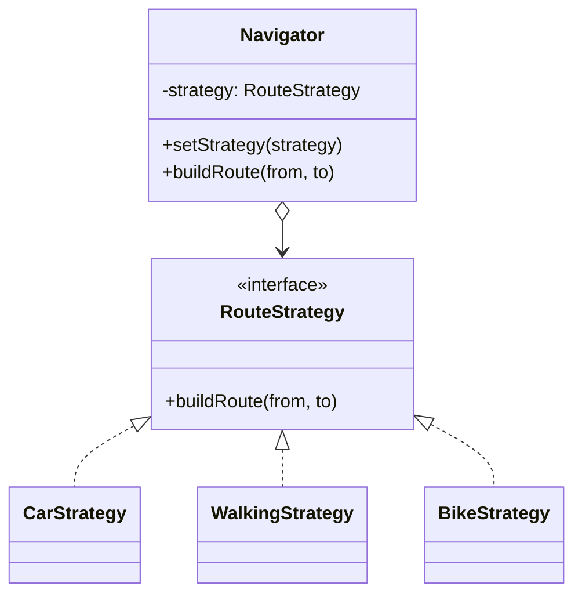
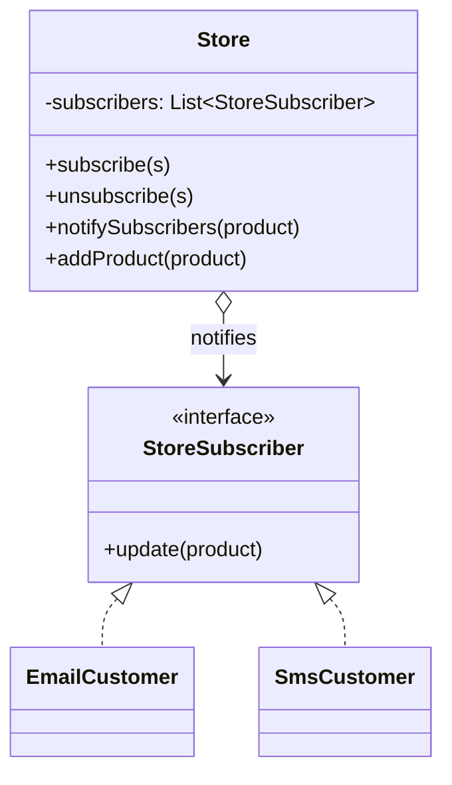
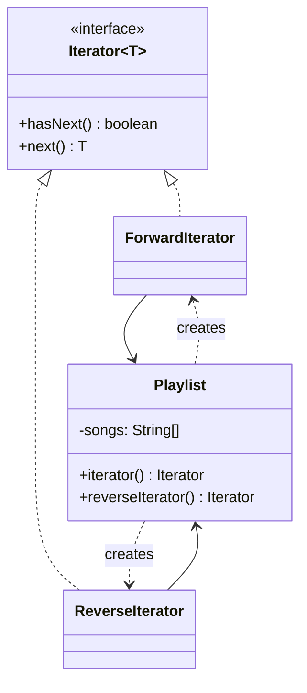
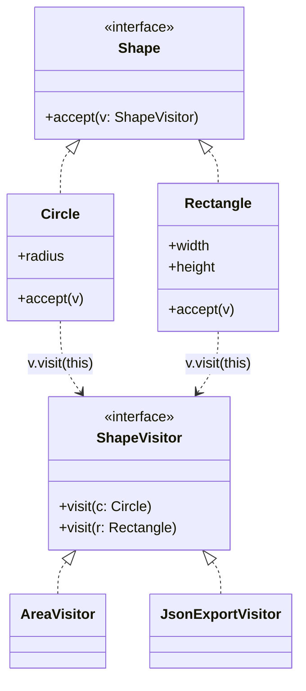
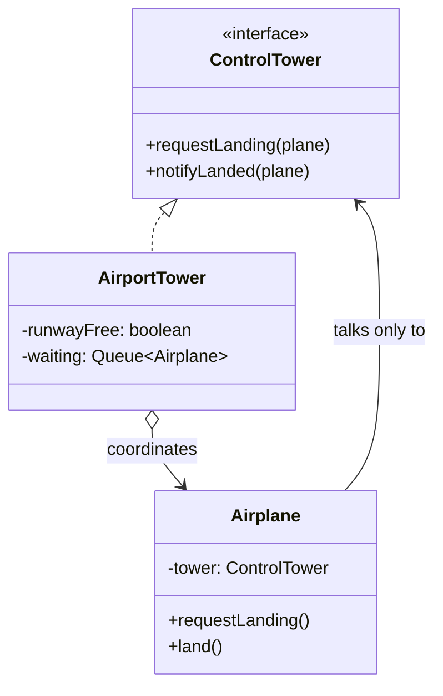
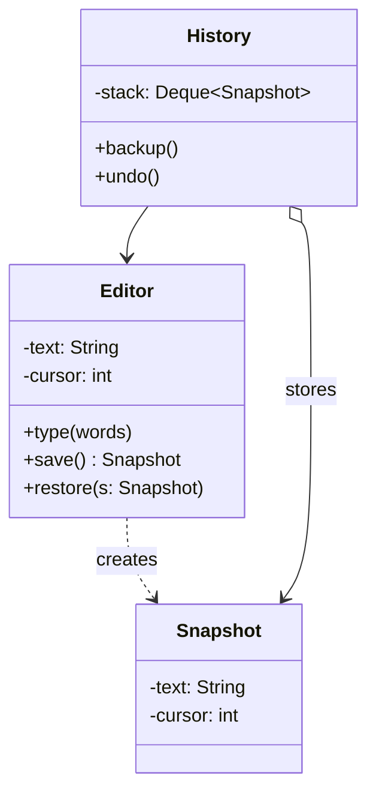
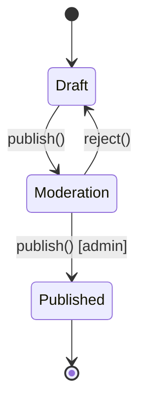
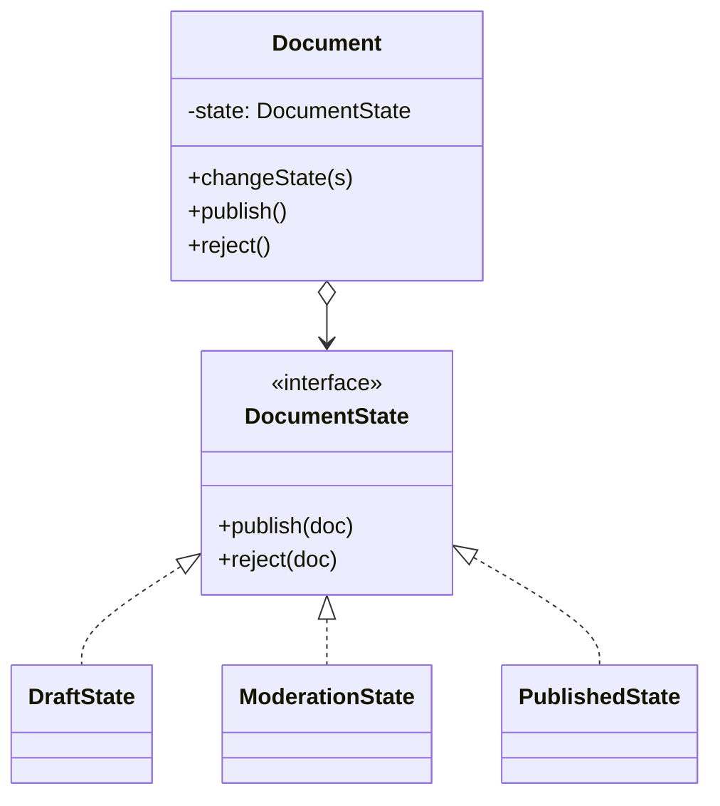
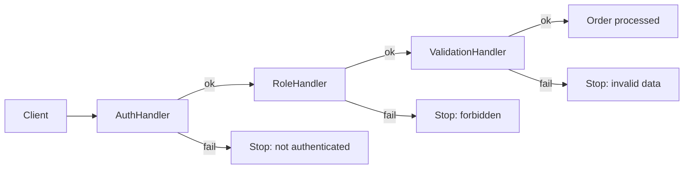

# Behavioral Design Patterns

Behavioral patterns deal with **how objects communicate and share responsibilities**. They focus on algorithms, on who does what, and on how requests and notifications flow between objects. The common goal is to keep objects **loosely coupled**: an object should be able to collaborate with others without knowing too much about their concrete classes.

| Pattern | Main question it answers |
|---|---|
| Strategy | How do I **swap algorithms** at runtime without `if/else` chains? |
| Observer | How do I **notify many objects** automatically when one object changes? |
| Iterator | How do I **traverse a collection** without exposing its internal structure? |
| Visitor | How do I **add new operations** to a class hierarchy without modifying those classes? |
| Mediator | How do I stop objects from **talking directly** to each other and centralize their communication? |
| Memento | How do I **save and restore** an object's state without breaking encapsulation? |
| State | How do I make an object **change its behavior** when its internal state changes? |
| Chain of Responsibility | How do I pass a request along a **chain of handlers** until one handles it? |

---

## 1. Strategy

📖 Reference: https://refactoring.guru/design-patterns/strategy

### Situation
You are building a navigation app. At first it only builds routes for cars. Then users ask for walking routes, then public transport, then bicycle. Every new option adds another `if/else` branch to the `Navigator` class, which grows huge, hard to test, and every change risks breaking the other algorithms.

### Goal
Define a **family of algorithms**, put each one in its **own class**, and make them **interchangeable**. The main object (context) delegates the work to a strategy object and can switch strategies at runtime.

### Actors

| Actor | Responsibility |
|---|---|
| **Context** | Holds a reference to a Strategy and delegates the work to it. It doesn't know which concrete strategy it uses. |
| **Strategy** | Common interface for all algorithms. |
| **Concrete Strategies** | Different implementations of the algorithm. |
| **Client** | Creates a concrete strategy and passes it to the context (and may change it later). |



### Code example

```java
// Strategy
interface RouteStrategy {
    String buildRoute(String from, String to);
}

// Concrete Strategies
class CarStrategy implements RouteStrategy {
    public String buildRoute(String from, String to) {
        return "Car route from " + from + " to " + to + " using highways";
    }
}

class WalkingStrategy implements RouteStrategy {
    public String buildRoute(String from, String to) {
        return "Walking route from " + from + " to " + to + " using sidewalks";
    }
}

class BikeStrategy implements RouteStrategy {
    public String buildRoute(String from, String to) {
        return "Bike route from " + from + " to " + to + " using bike lanes";
    }
}

// Context
class Navigator {
    private RouteStrategy strategy;

    public void setStrategy(RouteStrategy strategy) {
        this.strategy = strategy;
    }

    public void buildRoute(String from, String to) {
        System.out.println(strategy.buildRoute(from, to));
    }
}

// Client
public class Main {
    public static void main(String[] args) {
        Navigator navigator = new Navigator();

        navigator.setStrategy(new CarStrategy());
        navigator.buildRoute("San José", "Cartago");
        // Car route from San José to Cartago using highways

        navigator.setStrategy(new WalkingStrategy());   // swap at runtime
        navigator.buildRoute("San José", "Cartago");
        // Walking route from San José to Cartago using sidewalks
    }
}
```

> Adding a new algorithm means adding **one new class**; `Navigator` never changes (Open/Closed Principle).

---

## 2. Observer

📖 Reference: https://refactoring.guru/design-patterns/observer

### Situation
An online store receives a new product that many customers are waiting for. Customers could check the store every day (wasting their time), or the store could email **every** customer (spamming those who don't care). We need a way for only the **interested** customers to be notified automatically when the event happens.

### Goal
Define a **subscription mechanism**: one object (publisher) keeps a list of subscribers and **notifies all of them** automatically when its state changes. Subscribers can join or leave at runtime.

### Actors

| Actor | Responsibility |
|---|---|
| **Publisher (Subject)** | Keeps a list of subscribers, offers `subscribe` / `unsubscribe` methods, and notifies all subscribers when an event happens. |
| **Subscriber (Observer)** | Interface with the notification method, usually `update(...)`. |
| **Concrete Subscribers** | React to the notification in their own way. |
| **Client** | Creates publishers and subscribers and registers the subscribers. |



### Code example

```java
import java.util.ArrayList;
import java.util.List;

// Subscriber
interface StoreSubscriber {
    void update(String product);
}

// Concrete Subscribers
class EmailCustomer implements StoreSubscriber {
    private final String email;

    public EmailCustomer(String email) { this.email = email; }

    public void update(String product) {
        System.out.println("Email to " + email + ": " + product + " is now available!");
    }
}

class SmsCustomer implements StoreSubscriber {
    private final String phone;

    public SmsCustomer(String phone) { this.phone = phone; }

    public void update(String product) {
        System.out.println("SMS to " + phone + ": " + product + " arrived!");
    }
}

// Publisher
class Store {
    private final List<StoreSubscriber> subscribers = new ArrayList<>();

    public void subscribe(StoreSubscriber s)   { subscribers.add(s); }
    public void unsubscribe(StoreSubscriber s) { subscribers.remove(s); }

    private void notifySubscribers(String product) {
        for (StoreSubscriber s : subscribers) {
            s.update(product);
        }
    }

    public void addProduct(String product) {
        System.out.println("Store: new product " + product);
        notifySubscribers(product);
    }
}

// Client
public class Main {
    public static void main(String[] args) {
        Store store = new Store();
        StoreSubscriber ana = new EmailCustomer("ana@mail.com");
        StoreSubscriber luis = new SmsCustomer("8888-0000");

        store.subscribe(ana);
        store.subscribe(luis);
        store.addProduct("iPhone 20");
        // Store: new product iPhone 20
        // Email to ana@mail.com: iPhone 20 is now available!
        // SMS to 8888-0000: iPhone 20 arrived!

        store.unsubscribe(luis);
        store.addProduct("PS6");
        // Store: new product PS6
        // Email to ana@mail.com: PS6 is now available!
    }
}
```

---

## 3. Iterator

📖 Reference: https://refactoring.guru/design-patterns/iterator

### Situation
Collections store elements in different structures: arrays, lists, trees, graphs. Client code that needs to go through the elements must know the internal structure of each collection. Besides, the same collection may need several ways of traversal (forward, backward, depth-first, breadth-first...), and putting all that logic inside the collection blurs its main responsibility: **storing data**.

### Goal
Extract the **traversal behavior** of a collection into a separate object called an **iterator**, so clients can go through the elements in a uniform way **without knowing the internal representation**.

### Actors

| Actor | Responsibility |
|---|---|
| **Iterator** | Interface with the traversal operations: `hasNext()`, `next()`. |
| **Concrete Iterator** | Implements a specific traversal algorithm and keeps track of the current position. |
| **Collection (Iterable)** | Interface with a method to obtain an iterator. |
| **Concrete Collection** | Stores the elements and returns new concrete iterators. |
| **Client** | Works with collections and iterators through their interfaces. |



### Code example

Java already provides the `Iterator<T>` and `Iterable<T>` interfaces, so we implement them directly. Implementing `Iterable` also allows the collection to be used in a `for-each` loop.

```java
import java.util.Iterator;
import java.util.NoSuchElementException;

// Concrete Collection
class Playlist implements Iterable<String> {
    private final String[] songs;

    public Playlist(String... songs) { this.songs = songs; }

    // Default traversal: used by for-each
    @Override
    public Iterator<String> iterator() {
        return new ForwardIterator();
    }

    public Iterator<String> reverseIterator() {
        return new ReverseIterator();
    }

    // Concrete Iterator 1
    private class ForwardIterator implements Iterator<String> {
        private int position = 0;

        public boolean hasNext() { return position < songs.length; }

        public String next() {
            if (!hasNext()) throw new NoSuchElementException();
            return songs[position++];
        }
    }

    // Concrete Iterator 2
    private class ReverseIterator implements Iterator<String> {
        private int position = songs.length - 1;

        public boolean hasNext() { return position >= 0; }

        public String next() {
            if (!hasNext()) throw new NoSuchElementException();
            return songs[position--];
        }
    }
}

// Client: doesn't know the playlist uses an array
public class Main {
    public static void main(String[] args) {
        Playlist playlist = new Playlist("Song A", "Song B", "Song C");

        for (String song : playlist) {
            System.out.println("Playing " + song);   // A, B, C
        }

        Iterator<String> it = playlist.reverseIterator();
        while (it.hasNext()) {
            System.out.println("Reverse " + it.next()); // C, B, A
        }
    }
}
```

---

## 4. Visitor

📖 Reference: https://refactoring.guru/design-patterns/visitor

### Situation
You have a stable hierarchy of classes, for example shapes: `Circle`, `Rectangle`. Now you are asked to export them to XML, then to JSON, then to compute areas, then to draw them... Adding each new operation as a method in every shape class pollutes those classes with unrelated responsibilities, and you may not even be allowed to modify them.

### Goal
**Separate operations from the objects** they work on. Each new operation lives in its own **visitor** class with one method per element type. The elements only need a single `accept(visitor)` method, which calls back the right visitor method (**double dispatch**).

### Actors

| Actor | Responsibility |
|---|---|
| **Visitor** | Interface declaring one `visit` method per concrete element type. |
| **Concrete Visitor** | Implements one operation (e.g. export to JSON) for every element type. |
| **Element** | Interface declaring the `accept(Visitor v)` method. |
| **Concrete Elements** | Implement `accept` by calling the visitor method that matches their own class: `v.visit(this)`. |
| **Client** | Usually holds a collection of elements and applies a visitor to all of them. |



### Code example

```java
import java.util.List;

// Visitor
interface ShapeVisitor {
    void visit(Circle circle);
    void visit(Rectangle rectangle);
}

// Element
interface Shape {
    void accept(ShapeVisitor visitor);
}

// Concrete Elements
class Circle implements Shape {
    final double radius;

    Circle(double radius) { this.radius = radius; }

    public void accept(ShapeVisitor visitor) { visitor.visit(this); }  // double dispatch
}

class Rectangle implements Shape {
    final double width, height;

    Rectangle(double width, double height) { this.width = width; this.height = height; }

    public void accept(ShapeVisitor visitor) { visitor.visit(this); }
}

// Concrete Visitor 1: compute areas
class AreaVisitor implements ShapeVisitor {
    public void visit(Circle c) {
        System.out.printf("Circle area: %.2f%n", Math.PI * c.radius * c.radius);
    }
    public void visit(Rectangle r) {
        System.out.printf("Rectangle area: %.2f%n", r.width * r.height);
    }
}

// Concrete Visitor 2: export to JSON
class JsonExportVisitor implements ShapeVisitor {
    public void visit(Circle c) {
        System.out.println("{\"type\":\"circle\",\"radius\":" + c.radius + "}");
    }
    public void visit(Rectangle r) {
        System.out.println("{\"type\":\"rectangle\",\"width\":" + r.width + ",\"height\":" + r.height + "}");
    }
}

// Client
public class Main {
    public static void main(String[] args) {
        List<Shape> shapes = List.of(new Circle(2), new Rectangle(3, 4));

        ShapeVisitor area = new AreaVisitor();
        ShapeVisitor json = new JsonExportVisitor();

        for (Shape s : shapes) s.accept(area);
        // Circle area: 12.57
        // Rectangle area: 12.00

        for (Shape s : shapes) s.accept(json);
        // {"type":"circle","radius":2.0}
        // {"type":"rectangle","width":3.0,"height":4.0}
    }
}
```

> Adding a new **operation** = one new visitor class. Trade-off: adding a new **element type** (e.g. `Triangle`) forces you to update every visitor.

---

## 5. Mediator

📖 Reference: https://refactoring.guru/design-patterns/mediator

### Situation
Think of an airport: if every airplane had to talk to every other airplane to decide who lands next, chaos would follow. The same happens in a UI dialog: a checkbox shows a text field, a button validates all fields, a dropdown enables the button... Each component references the others directly, creating a **web of dependencies** where components can't be reused separately.

### Goal
Reduce chaotic dependencies by making objects **communicate only through a mediator** object (like the control tower). Components don't know each other; they just notify the mediator, and the mediator decides who must react.

### Actors

| Actor | Responsibility |
|---|---|
| **Mediator** | Interface with a method used by components to notify events, e.g. `notify(sender, event)`. |
| **Concrete Mediator** | Knows all the components and coordinates them: decides what happens when a component reports an event. |
| **Components (Colleagues)** | Classes with business logic. Each has a reference to the Mediator (interface) and never calls other components directly. |



### Code example

```java
import java.util.LinkedList;
import java.util.Queue;

// Mediator
interface ControlTower {
    void requestLanding(Airplane plane);
    void notifyLanded(Airplane plane);
}

// Component
class Airplane {
    private final String id;
    private final ControlTower tower;

    public Airplane(String id, ControlTower tower) {
        this.id = id;
        this.tower = tower;
    }

    public String getId() { return id; }

    public void requestLanding() {
        System.out.println(id + ": requesting landing");
        tower.requestLanding(this);
    }

    public void land() {
        System.out.println(id + ": landing...");
        tower.notifyLanded(this);
    }
}

// Concrete Mediator
class AirportTower implements ControlTower {
    private boolean runwayFree = true;
    private final Queue<Airplane> waiting = new LinkedList<>();

    public void requestLanding(Airplane plane) {
        if (runwayFree) {
            runwayFree = false;
            System.out.println("Tower: " + plane.getId() + " cleared to land");
        } else {
            System.out.println("Tower: " + plane.getId() + " please wait");
            waiting.add(plane);
        }
    }

    public void notifyLanded(Airplane plane) {
        System.out.println("Tower: " + plane.getId() + " landed, runway free");
        runwayFree = true;
        Airplane next = waiting.poll();
        if (next != null) requestLanding(next);
    }
}

// Client
public class Main {
    public static void main(String[] args) {
        AirportTower tower = new AirportTower();
        Airplane a1 = new Airplane("AV101", tower);
        Airplane a2 = new Airplane("CM202", tower);

        a1.requestLanding();  // AV101: requesting landing
                              // Tower: AV101 cleared to land
        a2.requestLanding();  // CM202: requesting landing
                              // Tower: CM202 please wait
        a1.land();            // AV101: landing...
                              // Tower: AV101 landed, runway free
                              // Tower: CM202 cleared to land
        a2.land();            // CM202: landing...
                              // Tower: CM202 landed, runway free
    }
}
```

> Airplanes never reference each other. To change the landing rules, you only modify `AirportTower`.

---

## 6. Memento

📖 Reference: https://refactoring.guru/design-patterns/memento

### Situation
You are building a text editor with **undo**. To undo, you must save snapshots of the editor's state before each change. But the state lives in private fields; making them public to copy them would break encapsulation, and any change in the editor's fields would break the code that copies them.

### Goal
Let the object **create snapshots of its own state** (mementos) and restore from them later, without exposing its internal details. Another object (caretaker) stores the snapshots but **can't read or modify** their content.

### Actors

| Actor | Responsibility |
|---|---|
| **Originator** | The object whose state must be saved. It creates mementos of itself (`save()`) and restores its state from them (`restore(m)`). |
| **Memento** | Immutable value object holding a snapshot of the originator's state. |
| **Caretaker** | Knows **when** and **why** to save/restore (e.g. a history stack), but never looks inside the memento. |



### Code example

```java
import java.util.ArrayDeque;
import java.util.Deque;

// Originator
class Editor {
    private String text = "";
    private int cursor = 0;

    public void type(String words) {
        text += words;
        cursor = text.length();
    }

    public String getText() { return text; }

    public Snapshot save() {
        return new Snapshot(text, cursor);
    }

    public void restore(Snapshot s) {
        this.text = s.text;
        this.cursor = s.cursor;
    }

    // Memento: nested class with private fields, only Editor can read them
    public static class Snapshot {
        private final String text;
        private final int cursor;

        private Snapshot(String text, int cursor) {
            this.text = text;
            this.cursor = cursor;
        }
    }
}

// Caretaker
class History {
    private final Deque<Editor.Snapshot> stack = new ArrayDeque<>();
    private final Editor editor;

    public History(Editor editor) { this.editor = editor; }

    public void backup() {
        stack.push(editor.save());
    }

    public void undo() {
        if (!stack.isEmpty()) {
            editor.restore(stack.pop());
        }
    }
}

// Client
public class Main {
    public static void main(String[] args) {
        Editor editor = new Editor();
        History history = new History(editor);

        history.backup();
        editor.type("Hello");
        history.backup();
        editor.type(" World");
        System.out.println(editor.getText());  // Hello World

        history.undo();
        System.out.println(editor.getText());  // Hello

        history.undo();
        System.out.println(editor.getText());  // (empty)
    }
}
```

---

## 7. State

📖 Reference: https://refactoring.guru/design-patterns/state

### Situation
A document can be in `Draft`, `Moderation` or `Published` state. The `publish()` method behaves differently in each: in Draft it sends to moderation, in Moderation it publishes (only if the user is an admin), in Published it does nothing. Implementing this with `switch(state)` inside every method produces big conditionals that must be updated every time a new state or transition appears.

### Goal
Let an object **change its behavior when its internal state changes**, as if it changed its class. Each state becomes a **separate class**, and the main object (context) delegates the state-dependent work to the current state object. States can trigger transitions to other states.

### Actors

| Actor | Responsibility |
|---|---|
| **Context** | Holds a reference to the current State, delegates state-specific work to it, and offers a method to change the state. |
| **State** | Interface declaring the state-specific methods. |
| **Concrete States** | Implement the behavior for one state. They usually keep a reference to the context to trigger **transitions**. |





> **State vs Strategy:** both look the same structurally. In Strategy the client picks the algorithm and strategies don't know each other; in State the **states themselves** decide the transitions to other states.

### Code example

```java
// State
interface DocumentState {
    void publish(Document doc);
    void reject(Document doc);
}

// Concrete States
class DraftState implements DocumentState {
    public void publish(Document doc) {
        System.out.println("Draft -> sent to moderation");
        doc.changeState(new ModerationState());
    }
    public void reject(Document doc) {
        System.out.println("Draft: nothing to reject");
    }
}

class ModerationState implements DocumentState {
    public void publish(Document doc) {
        if (doc.isAdmin()) {
            System.out.println("Moderation -> published");
            doc.changeState(new PublishedState());
        } else {
            System.out.println("Moderation: only an admin can publish");
        }
    }
    public void reject(Document doc) {
        System.out.println("Moderation -> back to draft");
        doc.changeState(new DraftState());
    }
}

class PublishedState implements DocumentState {
    public void publish(Document doc) {
        System.out.println("Published: already published");
    }
    public void reject(Document doc) {
        System.out.println("Published: cannot reject a published document");
    }
}

// Context
class Document {
    private DocumentState state = new DraftState();
    private final boolean admin;

    public Document(boolean admin) { this.admin = admin; }

    public boolean isAdmin() { return admin; }

    void changeState(DocumentState state) { this.state = state; }

    public void publish() { state.publish(this); }
    public void reject()  { state.reject(this); }
}

// Client
public class Main {
    public static void main(String[] args) {
        Document doc = new Document(true);
        doc.publish();  // Draft -> sent to moderation
        doc.reject();   // Moderation -> back to draft
        doc.publish();  // Draft -> sent to moderation
        doc.publish();  // Moderation -> published
        doc.publish();  // Published: already published
    }
}
```

---

## 8. Chain of Responsibility

📖 Reference: https://refactoring.guru/design-patterns/chain-of-responsibility

### Situation
An online ordering system must run several checks on each request: is the user authenticated? Is the user an admin? Is the data valid? Has this IP sent too many requests? Putting all checks in one method creates a bloated, fragile block of code, and different endpoints need different combinations and orders of checks.

### Goal
Turn each check into a standalone **handler** object and link the handlers into a **chain**. A request travels along the chain: each handler decides either to **process it and stop**, or to **pass it to the next** handler. The sender doesn't know which handler will finally deal with the request.

### Actors

| Actor | Responsibility |
|---|---|
| **Handler** | Interface (or abstract class) declaring the method to handle requests and a way to set the next handler. |
| **Base Handler** | Optional abstract class holding the reference to the next handler and the default "pass it on" behavior. |
| **Concrete Handlers** | Contain the actual processing code. Each decides whether to handle the request, stop it, or forward it. |
| **Client** | Builds the chain (once or dynamically) and sends requests to the first handler. |



### Code example

```java
// Request
class Request {
    final String user;
    final String role;
    final int quantity;

    Request(String user, String role, int quantity) {
        this.user = user;
        this.role = role;
        this.quantity = quantity;
    }
}

// Base Handler
abstract class Handler {
    private Handler next;

    public Handler setNext(Handler next) {
        this.next = next;
        return next;          // allows chaining: a.setNext(b).setNext(c)
    }

    public boolean handle(Request request) {
        if (next == null) return true;     // end of chain: everything passed
        return next.handle(request);
    }
}

// Concrete Handlers
class AuthHandler extends Handler {
    public boolean handle(Request r) {
        if (r.user == null) {
            System.out.println("AuthHandler: user not authenticated");
            return false;                  // stop the chain
        }
        return super.handle(r);            // pass to next
    }
}

class RoleHandler extends Handler {
    public boolean handle(Request r) {
        if (!"customer".equals(r.role) && !"admin".equals(r.role)) {
            System.out.println("RoleHandler: role " + r.role + " not allowed");
            return false;
        }
        return super.handle(r);
    }
}

class ValidationHandler extends Handler {
    public boolean handle(Request r) {
        if (r.quantity <= 0) {
            System.out.println("ValidationHandler: invalid quantity");
            return false;
        }
        return super.handle(r);
    }
}

// Client
public class Main {
    public static void main(String[] args) {
        Handler chain = new AuthHandler();
        chain.setNext(new RoleHandler())
             .setNext(new ValidationHandler());

        process(chain, new Request("ana", "customer", 2));  // Order processed
        process(chain, new Request(null, "customer", 2));   // AuthHandler: user not authenticated
        process(chain, new Request("luis", "guest", 2));    // RoleHandler: role guest not allowed
        process(chain, new Request("ana", "admin", 0));     // ValidationHandler: invalid quantity
    }

    static void process(Handler chain, Request r) {
        if (chain.handle(r)) {
            System.out.println("Order processed for " + r.user);
        }
    }
}
```

> Handlers can be added, removed or reordered without touching the client or the other handlers. Java servlet **filters** and Spring Security filter chains work this way.

---

## Summary

| Pattern | Structure | Key idea |
|---|---|---|
| Strategy | Context **has-a** interchangeable algorithm | Swap algorithms at runtime |
| Observer | Publisher keeps a **list of subscribers** | Notify many objects automatically on change |
| Iterator | Traversal extracted into an **iterator object** | Go through a collection without knowing its structure |
| Visitor | Elements `accept` a visitor, visitor has a method **per element type** | Add operations without changing element classes |
| Mediator | Components talk only to a **central mediator** | Remove direct dependencies between components |
| Memento | Originator creates **opaque snapshots**, caretaker stores them | Save/restore state without breaking encapsulation |
| State | Context **has-a** state object that changes itself | Behavior changes when the internal state changes |
| Chain of Responsibility | Handlers linked in a **chain** | Pass a request along until it's handled or stopped |
