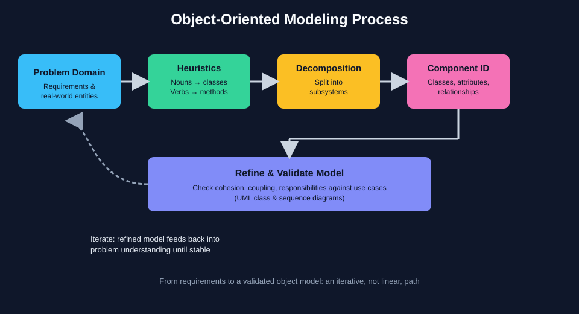
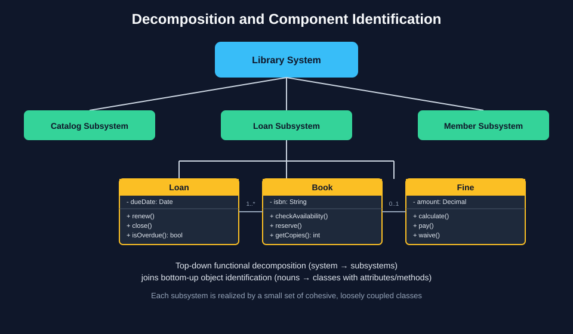

# Introduction to Software Modeling and Decomposition

## 1. Introduction to Software Modeling

Software modeling is the practice of building a simplified, abstract representation of a system before (and while) it is implemented in code. In object-oriented development, a model captures the entities that matter to the problem domain, the data they hold, the behavior they expose, and the relationships that connect them. Modeling matters because software systems are too complex to reason about directly in code: a model lets a team communicate a shared understanding of the system, validate design decisions early — when they are cheap to change — and provide a blueprint that guides implementation. Without a model, developers tend to encode ad-hoc assumptions directly into classes, producing designs that are hard to extend, hard to test, and hard to explain to someone new to the project.

In object-oriented design, the most common modeling artifact is the UML class diagram, complemented by sequence or interaction diagrams that show how objects collaborate over time. A class diagram is not just documentation — it is a design tool: drawing it forces the designer to decide what a `Customer` is responsible for, what an `Order` needs to know, and how the two interact, before a single line of code is written. Consider an online bookstore: instead of jumping directly to a `checkout()` function full of conditionals, a modeler first asks "what are the things in this domain?" and "what do they do?" — arriving at classes such as `Customer`, `ShoppingCart`, `Order`, `Payment`, and `Book`, each with a clear single responsibility, and relationships such as "a `Customer` places many `Order`s" or "an `Order` is composed of `OrderItem`s". This upfront model becomes the skeleton onto which the implementation is later attached.

## 2. Modeling Techniques and Heuristics

Because there is no mechanical algorithm that transforms a requirements document into a perfect class diagram, designers rely on heuristics — practical rules of thumb refined by experience — to guide the process. The best-known heuristic is the noun/verb analysis: nouns and noun phrases in the problem description are candidates for classes or attributes, while verbs and verb phrases are candidates for methods or relationships. Other heuristics include looking for real-world entities with independent existence (candidate classes), grouping related data that always changes together (candidate attributes), and being wary of "god classes" that try to do everything — a signal that further decomposition is needed. These techniques are not infallible; they are starting points that a designer refines through judgment, feedback, and iteration.

Applying this to a case: given the requirement "A student enrolls in a course; the course has a schedule, an instructor, and a maximum capacity; when a student enrolls, the system must check that the course is not full and that the student has completed the prerequisites," noun/verb analysis surfaces candidate classes `Student`, `Course`, `Enrollment`, `Schedule`, `Instructor`, and candidate methods `enroll()`, `hasAvailableSeats()`, `hasCompletedPrerequisites()`. Notice that "enrolls" is a verb but is modeled as its own class, `Enrollment`, rather than only as a method — this is a common refinement heuristic: when a relationship between two objects carries its own data (such as an enrollment date or a grade) or its own behavior, it deserves to become a first-class object (an association class) instead of being reduced to a simple method call.

## 3. General Principles of Decomposition

Decomposition is the act of breaking a large, complex problem into smaller, more manageable parts so that each part can be understood, designed, and built independently. In object-oriented design, decomposition is guided by two complementary principles: cohesion and coupling. High cohesion means that each component (class, module, or subsystem) has a single, well-defined purpose and everything inside it is closely related to that purpose. Low coupling means that components depend on each other as little as possible, and where dependencies exist, they go through narrow, stable interfaces rather than exposing internal details. Together, these principles produce systems where a change in one part is unlikely to ripple uncontrollably through the rest — the essence of maintainable design.

A practical illustration: imagine designing a restaurant management system as a single monolithic `Restaurant` class that handles menus, table reservations, kitchen orders, billing, and staff schedules. This violates cohesion (the class has five unrelated responsibilities) and, in practice, also increases coupling, because every other part of the system that needs any one of those behaviors must depend on this single enormous class. Applying decomposition, the same system is split into `MenuCatalog`, `ReservationManager`, `KitchenOrder`, `Invoice`, and `StaffSchedule`, each with one responsibility and communicating through small, explicit interfaces (for example, `KitchenOrder` only needs to know about `MenuItem`, not about `StaffSchedule`). The result is a design where the billing logic can be changed or tested without touching reservations, and a new feature like table-side ordering can be added by extending `ReservationManager` and `KitchenOrder` without modifying `Invoice` at all.

## 4. Fundamental Decomposition Techniques

Two classic strategies are used to decompose a system: top-down decomposition and bottom-up composition, and in practice most designs use a mix of both. Top-down decomposition starts from the whole system and progressively splits it into subsystems, then into modules, then into classes, refining the granularity at each step until the pieces are small enough to design and implement directly — this mirrors functional decomposition but applied to responsibilities rather than procedures. Bottom-up composition starts from the concrete entities and behaviors observed in the problem domain (often via noun/verb analysis), models them as individual classes, and then groups related classes into higher-level subsystems or packages once patterns of collaboration emerge. Top-down is useful when the overall structure of the system is already understood at a high level; bottom-up is useful when the domain is being explored for the first time and understanding builds from concrete examples.

Consider designing a hospital management system top-down: the system is first split into three subsystems — `PatientCare`, `Administration`, and `Billing` — purely based on the major functional areas the hospital already recognizes. Only after that split does the designer descend into `PatientCare` and identify classes such as `Patient`, `Appointment`, `MedicalRecord`, and `Prescription`. Contrast this with a bottom-up approach to the same domain: a designer interviewing hospital staff first captures individual objects mentioned in conversation — `Patient`, `Doctor`, `Appointment`, `Invoice`, `Prescription` — models each with its attributes and methods, and only afterward notices that `Patient`, `Appointment`, and `MedicalRecord` cluster naturally around patient care, while `Invoice` and `Payment` cluster around billing, and groups them into subsystems accordingly. Both techniques converge on a similar decomposition, but they start from opposite ends of the problem.

## 5. Identification of Components

Once a system has been decomposed into subsystems, the next step is identifying the concrete components — classes, interfaces, and their relationships — that will realize each subsystem. Component identification asks, for each subsystem: what are the distinct responsibilities within it, which of those responsibilities should be bundled into the same class versus separated into different classes, and how should those classes relate to one another (association, aggregation, composition, inheritance, or realization of an interface). A useful test at this stage is the "single responsibility" question — if a class's description requires the word "and" to explain what it does, it is often a signal that it should be split into two components.

Returning to the `PatientCare` subsystem identified earlier, component identification proceeds by examining each responsibility in detail: managing patient demographic data becomes the `Patient` class; scheduling becomes the `Appointment` class, associated with `Patient` and `Doctor`; tracking diagnoses, treatments, and history becomes the `MedicalRecord` class, composed of one or more `Patient` objects (a `MedicalRecord` cannot exist without its `Patient`, which is a composition relationship); and issuing medication becomes the `Prescription` class, associated with both `MedicalRecord` and `Doctor`. If it turns out that `Doctor` behavior is needed both in `PatientCare` and in `Administration` (for scheduling shifts), the designer identifies `Doctor` as a shared component and defines a clean interface, such as a `Schedulable` interface, so both subsystems depend on a narrow contract rather than on each other's internal implementation — completing the bridge from decomposition down to a concrete, implementable object model.

---

## Illustrating the Process

