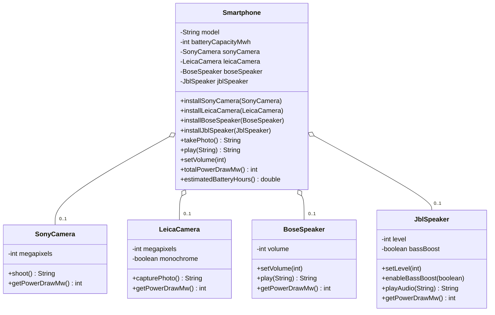
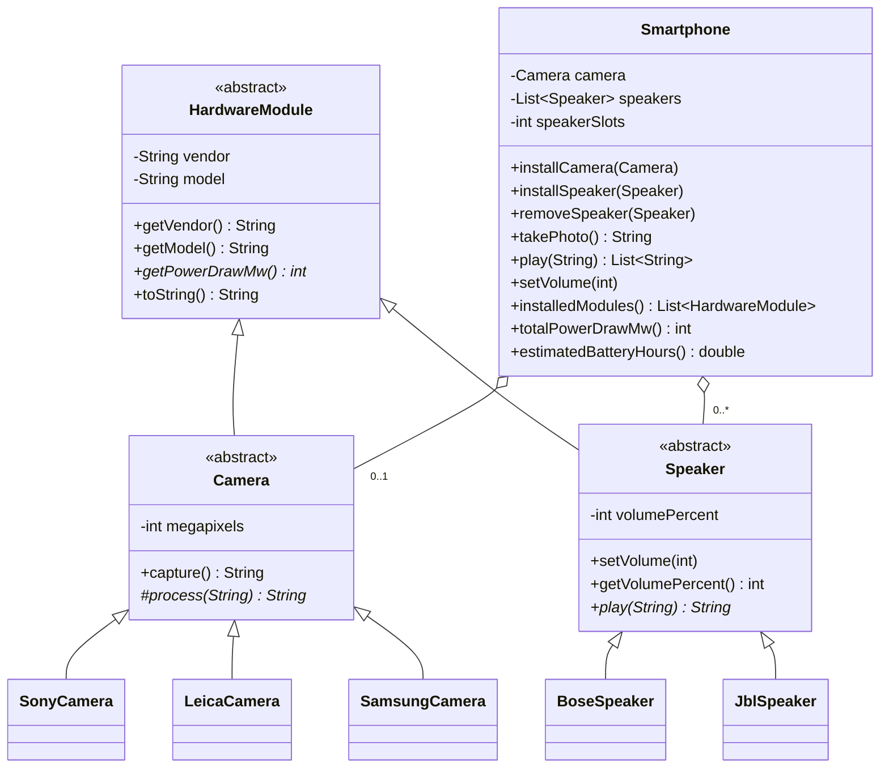
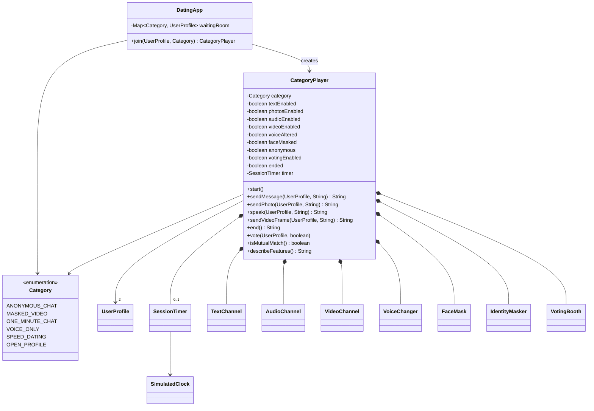
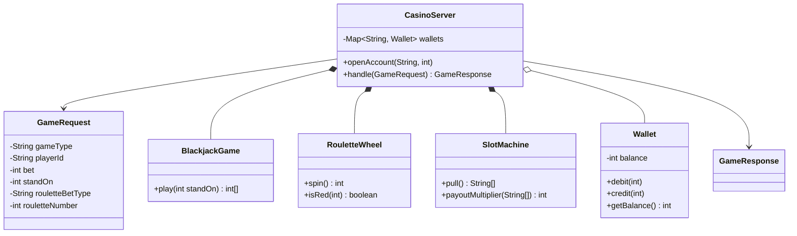
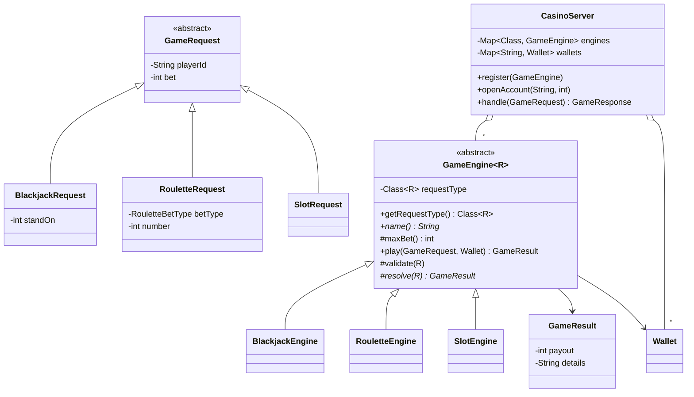
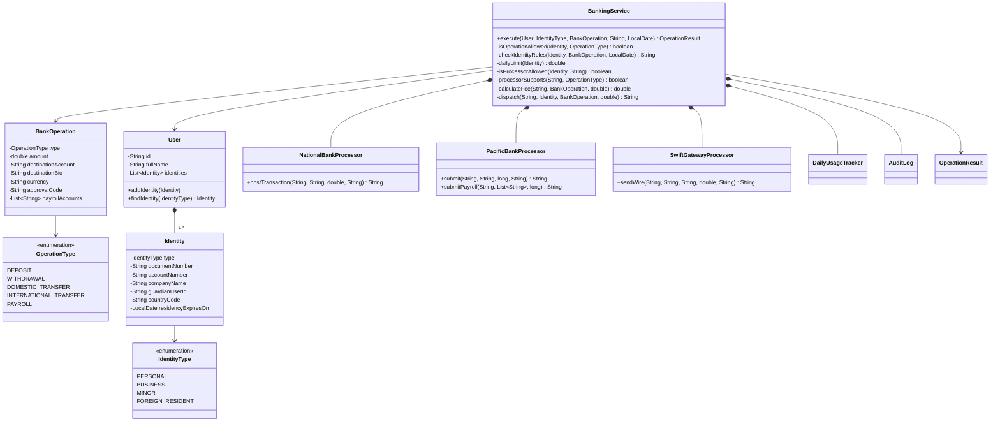

# Java review

```java
///
int edad = 25;
double precio = 19.99;
boolean activo = true;
char inicial = 'A';

///
int[] numeros = {10, 20, 30, 40};
String[] nombres = new String[3];
nombres[0] = "Juan";

/// 
List<String> colores = new ArrayList<>();
colores.add("rojo");
colores.add("azul");

// 
Persona persona = null;
Coche coche = null;
LocalDate fecha = null;

// 
public void mostrarMensaje() {
    System.out.println("Hola");
}

// 
public int sumar(int a, int b) {
    return a + b;
}

// 
public Persona crearPersona(String nombre) {
    return new Persona(nombre);
}

// 
public void modificarValor(int x) {
    x = x + 10;
}

// 
public void modificarObjeto(Persona p) {
    p.setNombre("Nuevo");
}

// 
String texto = "123";
int numero = Integer.parseInt(texto);

// 
int primitivo = 42;
Integer objeto = Integer.valueOf(primitivo);

// 
FileReader fr = new FileReader("archivo.txt");
BufferedReader br = new BufferedReader(fr);
String linea = br.readLine();
br.close();

// 
FileWriter fw = new FileWriter("salida.txt");
fw.write("Contenido");
fw.close();

// 
@Override
public String toString() {
    return "Objeto";
}

@Deprecated
public void metodoAntiguo() { }

// 
for (int i = 0; i < 10; i++) {
    for (int j = 0; j < 5; j++) {
        if (i == j) break;
    }
}

// 
int contador = 0;
while (contador < 100 && contador % 2 == 0) {
    contador += 2;
}

// 
public interface Configuracion {
    final static int PUERTO = 8080;
    final static String SERVIDOR = "localhost";
}

// 
public class MiExcepcion extends Exception {
    public MiExcepcion(String mensaje) {
        super(mensaje);
    }
}

// 
if (edad < 0) {
    throw new IllegalArgumentException("Edad no válida");
}

// 
public void leerArchivo() throws IOException {
    FileReader fr = new FileReader("archivo.txt");
}

// 
double valor = 3.14;
int entero = (int) valor;

// 
double resultado = Math.sqrt(16);
int redondeo = (int) resultado;

// 
SimpleDateFormat sdf = new SimpleDateFormat("dd/MM/yyyy");
Date fecha = sdf.parse("25/12/2023");

// 
Date hoy = new Date();
String texto = new SimpleDateFormat("dd/MM/yyyy").format(hoy);

// 
int edad = 20;
String categoria = edad >= 18 ? "Adulto" : "Menor";

// 
int dia = 3;
switch (dia) {
    case 1: System.out.println("Lunes"); break;
    case 2: System.out.println("Martes"); break;
}

// 
double potencia = Math.pow(2, 3);
double raiz = Math.sqrt(16);
double minimo = Math.min(5, 3);

// 
int a = 10, b = 3, c = 2;
int modulo = a % b;
c *= 5;
a++;
```

# Inheritance, Polymorphism, and Separation of Concerns: Design and Code

You already know the definitions: inheritance lets a class reuse and specialize another class, polymorphism lets one call behave differently depending on the object that receives it, and separation of concerns says that each part of a system should deal with one thing. This document works backwards from those definitions. Each problem starts with the design most of us write first, using only classes, fields, and conditionals. That design **works**: it compiles, runs, and gives correct output. Then we look at what it costs to keep it alive as requirements change.

Problems 1 and 3 each finish with a redesign that uses inheritance and polymorphism. Problems 2 and 4 stop after the first design on purpose. They are left for you to refactor, and each one ends with a set of guiding questions.

The problems get harder as you go:

| # | Problem | What gets harder |
|---|---------|------------------|
| 1 | Modular smartphone | One device, N interchangeable vendors |
| 2 | Dating app with category players | Behavior switched on and off by category |
| 3 | Casino game server | Routing incoming objects to the right logic |
| 4 | Multi-identity banking with processors | Identities × operations × processors, each with its own rules |

Keep these three questions in mind while reading each first design:

| Concept | The question to ask | The symptom when it is missing |
|---------|---------------------|--------------------------------|
| Inheritance | What do these classes have in common, and where does that shared code live? | The same fields and validation copied across classes |
| Polymorphism | Can I make one call and let each object decide how to respond? | `if`/`switch` on a type code, or on which field is not `null` |
| Separation of concerns | Does each class have exactly one reason to change? | One central class that changes whenever any vendor, game, or rule changes |

---

## Problem 1: Modular Smartphone

### 1.1 Description

A manufacturer sells a modular smartphone. The phone body (screen, processor, battery) is sold on its own. The customer buys the **camera** and the **speakers** separately from any of **N vendors**: Sony, Leica, and Samsung for cameras, Bose and JBL for speakers. New vendors sign up every quarter.

Whatever the vendor, the phone must be able to:

- take a photo with the installed camera;
- play audio through the installed speakers and set their volume;
- estimate battery life from the power drawn by the installed modules.

Each vendor's hardware behaves differently. Leica offers a monochrome sensor, JBL has a bass boost and uses a 0–10 volume scale, and every module draws a different amount of power.

### 1.2 Design without inheritance or polymorphism

Each vendor ships its own class with its own method names, as vendor SDKs usually do. The phone keeps one field per vendor module, and each field stays `null` until that module is installed. Every operation first works out which field is not `null`. To keep this version short, the phone has only one speaker slot.

#### Class diagram



#### Code

```java
public class SonyCamera {
    private final int megapixels;

    public SonyCamera(int megapixels) {
        this.megapixels = megapixels;
    }

    public String shoot() {
        return "Sony " + megapixels + "MP photo with Real-time Tracking autofocus";
    }

    public int getPowerDrawMw() {
        return 450;
    }
}
```

```java
public class LeicaCamera {
    private final int megapixels;
    private final boolean monochrome;

    public LeicaCamera(int megapixels, boolean monochrome) {
        this.megapixels = megapixels;
        this.monochrome = monochrome;
    }

    public String capturePhoto() {
        String mode = monochrome ? "black & white" : "color";
        return "Leica " + megapixels + "MP " + mode + " photo with Summilux lens profile";
    }

    public int getPowerDrawMw() {
        return monochrome ? 380 : 520;
    }
}
```

```java
public class BoseSpeaker {
    private int volume = 50;

    public void setVolume(int volume) {
        if (volume < 0 || volume > 100) {
            throw new IllegalArgumentException("Volume must be between 0 and 100");
        }
        this.volume = volume;
    }

    public String play(String track) {
        return "Bose plays '" + track + "' at " + volume + "% with SoundTouch EQ";
    }

    public int getPowerDrawMw() {
        return 300;
    }
}
```

```java
public class JblSpeaker {
    private int level = 5;
    private boolean bassBoost;

    public void setLevel(int level) {
        if (level < 0 || level > 10) {
            throw new IllegalArgumentException("Level must be between 0 and 10");
        }
        this.level = level;
    }

    public void enableBassBoost(boolean enabled) {
        this.bassBoost = enabled;
    }

    public String playAudio(String track) {
        return "JBL plays '" + track + "' at level " + level + "/10" + (bassBoost ? " with Bass Boost" : "");
    }

    public int getPowerDrawMw() {
        return bassBoost ? 420 : 280;
    }
}
```

```java
public class Smartphone {
    private static final int BASE_POWER_DRAW_MW = 800;

    private final String model;
    private final int batteryCapacityMwh;

    private SonyCamera sonyCamera;
    private LeicaCamera leicaCamera;
    private BoseSpeaker boseSpeaker;
    private JblSpeaker jblSpeaker;

    public Smartphone(String model, int batteryCapacityMwh) {
        this.model = model;
        this.batteryCapacityMwh = batteryCapacityMwh;
    }

    public void installSonyCamera(SonyCamera camera) {
        sonyCamera = camera;
        leicaCamera = null;
    }

    public void installLeicaCamera(LeicaCamera camera) {
        leicaCamera = camera;
        sonyCamera = null;
    }

    public void installBoseSpeaker(BoseSpeaker speaker) {
        boseSpeaker = speaker;
        jblSpeaker = null;
    }

    public void installJblSpeaker(JblSpeaker speaker) {
        jblSpeaker = speaker;
        boseSpeaker = null;
    }

    public String takePhoto() {
        if (sonyCamera != null) {
            return sonyCamera.shoot();
        }
        if (leicaCamera != null) {
            return leicaCamera.capturePhoto();
        }
        return "No camera installed";
    }

    public String play(String track) {
        if (boseSpeaker != null) {
            return boseSpeaker.play(track);
        }
        if (jblSpeaker != null) {
            return jblSpeaker.playAudio(track);
        }
        return "No speaker installed";
    }

    public void setVolume(int percent) {
        if (boseSpeaker != null) {
            boseSpeaker.setVolume(percent);
        }
        if (jblSpeaker != null) {
            jblSpeaker.setLevel(percent / 10);
        }
    }

    public int totalPowerDrawMw() {
        int total = BASE_POWER_DRAW_MW;
        if (sonyCamera != null) {
            total += sonyCamera.getPowerDrawMw();
        }
        if (leicaCamera != null) {
            total += leicaCamera.getPowerDrawMw();
        }
        if (boseSpeaker != null) {
            total += boseSpeaker.getPowerDrawMw();
        }
        if (jblSpeaker != null) {
            total += jblSpeaker.getPowerDrawMw();
        }
        return total;
    }

    public double estimatedBatteryHours() {
        return (double) batteryCapacityMwh / totalPowerDrawMw();
    }

    public String getModel() {
        return model;
    }
}
```

```java
public class SmartphoneDemo {
    public static void main(String[] args) {
        Smartphone phone = new Smartphone("ModuPhone X", 18000);

        phone.installSonyCamera(new SonyCamera(48));
        phone.installBoseSpeaker(new BoseSpeaker());
        phone.setVolume(70);
        System.out.println(phone.takePhoto());
        System.out.println(phone.play("Bohemian Rhapsody"));
        System.out.printf("Estimated battery: %.1f hours%n", phone.estimatedBatteryHours());

        phone.installLeicaCamera(new LeicaCamera(40, true));
        JblSpeaker jbl = new JblSpeaker();
        jbl.enableBassBoost(true);
        phone.installJblSpeaker(jbl);
        phone.setVolume(70);
        System.out.println(phone.takePhoto());
        System.out.println(phone.play("Bohemian Rhapsody"));
        System.out.printf("Estimated battery: %.1f hours%n", phone.estimatedBatteryHours());
    }
}
```

#### Design review

- **Adding one vendor touches `Smartphone` in four places.** Adding Samsung means a new field, a new `install...` method, a new branch in `takePhoto()`, and a new branch in `totalPowerDrawMw()`. `Smartphone` has one reason to change *per vendor*, which is the opposite of separation of concerns.
- **Nothing in the code enforces the "only one camera" rule.** Every `install...` method has to clear the other vendors' fields by hand. With three camera vendors, each install method clears two fields. If you forget one, the phone "has" two cameras, and `takePhoto()` silently uses whichever `if` comes first.
- **The phone knows vendor details.** The phone converts a percentage into JBL's 0–10 scale inside `setVolume()`. That knowledge belongs to the JBL module.
- **The fields grow as slots × vendors.** A phone with two speaker slots and two speaker vendors would need `leftBose`, `leftJbl`, `rightBose`, `rightJbl`, and every method above would double in size.
- **There is no common type.** You cannot write a `List` of "things installed in the phone", so every calculation over the modules has to list each field by name.

### 1.3 Improved design with inheritance and polymorphism

Start by asking what every module has in common, whatever its vendor or kind: a vendor, a model name, and a power draw. That becomes the abstract class `HardwareModule`. Next, ask what every *camera* has in common (it captures photos and has a resolution) and what every *speaker* has in common (it plays audio and has a volume). Those become the abstract classes `Camera` and `Speaker`. Each vendor then becomes a small subclass that fills in only the behavior that is really vendor-specific.

`Smartphone` now depends only on `Camera`, `Speaker`, and `HardwareModule`. It manages **slots** and **power**, and nothing else.

#### Class diagram



#### Code

```java
public abstract class HardwareModule {
    private final String vendor;
    private final String model;

    protected HardwareModule(String vendor, String model) {
        this.vendor = vendor;
        this.model = model;
    }

    public String getVendor() {
        return vendor;
    }

    public String getModel() {
        return model;
    }

    public abstract int getPowerDrawMw();

    @Override
    public String toString() {
        return vendor + " " + model + " (" + getPowerDrawMw() + " mW)";
    }
}
```

`Camera.capture()` is a **template method**. It is `final`, so every camera follows the same steps: read the sensor, process the frame, then label the result. Each vendor supplies only the processing step, `process()`.

```java
public abstract class Camera extends HardwareModule {
    private final int megapixels;

    protected Camera(String vendor, String model, int megapixels) {
        super(vendor, model);
        this.megapixels = megapixels;
    }

    public int getMegapixels() {
        return megapixels;
    }

    public final String capture() {
        String rawFrame = megapixels + "MP raw frame";
        return getVendor() + " " + getModel() + ": " + process(rawFrame);
    }

    protected abstract String process(String rawFrame);
}
```

```java
public class SonyCamera extends Camera {
    public SonyCamera(int megapixels) {
        super("Sony", "IMX-Pro", megapixels);
    }

    @Override
    protected String process(String rawFrame) {
        return rawFrame + " -> Real-time Tracking autofocus -> Sony color science";
    }

    @Override
    public int getPowerDrawMw() {
        return 450;
    }
}
```

```java
public class LeicaCamera extends Camera {
    private final boolean monochrome;

    public LeicaCamera(int megapixels, boolean monochrome) {
        super("Leica", monochrome ? "M-Mono" : "M-Color", megapixels);
        this.monochrome = monochrome;
    }

    @Override
    protected String process(String rawFrame) {
        return rawFrame + " -> Summilux lens profile -> " + (monochrome ? "black & white" : "color") + " rendering";
    }

    @Override
    public int getPowerDrawMw() {
        return monochrome ? 380 : 520;
    }
}
```

This is the vendor that joined later. Adding it took **one new class** and **no changes** to `Smartphone`:

```java
public class SamsungCamera extends Camera {
    public SamsungCamera(int megapixels) {
        super("Samsung", "ISOCELL", megapixels);
    }

    @Override
    protected String process(String rawFrame) {
        return rawFrame + " -> 9-to-1 pixel binning -> Night mode";
    }

    @Override
    public int getPowerDrawMw() {
        return 400;
    }
}
```

`Speaker` validates the volume once for every vendor. The phone always speaks in percentages, and each vendor converts to its own scale.

```java
public abstract class Speaker extends HardwareModule {
    private int volumePercent = 50;

    protected Speaker(String vendor, String model) {
        super(vendor, model);
    }

    public final void setVolume(int percent) {
        if (percent < 0 || percent > 100) {
            throw new IllegalArgumentException("Volume must be between 0 and 100");
        }
        this.volumePercent = percent;
    }

    public int getVolumePercent() {
        return volumePercent;
    }

    public abstract String play(String track);
}
```

```java
public class BoseSpeaker extends Speaker {
    public BoseSpeaker() {
        super("Bose", "SoundTouch Mini");
    }

    @Override
    public String play(String track) {
        return "Bose plays '" + track + "' at " + getVolumePercent() + "% with SoundTouch EQ";
    }

    @Override
    public int getPowerDrawMw() {
        return 300;
    }
}
```

```java
public class JblSpeaker extends Speaker {
    private final boolean bassBoost;

    public JblSpeaker(boolean bassBoost) {
        super("JBL", "Flip Micro");
        this.bassBoost = bassBoost;
    }

    @Override
    public String play(String track) {
        int level = getVolumePercent() / 10;
        return "JBL plays '" + track + "' at level " + level + "/10" + (bassBoost ? " with Bass Boost" : "");
    }

    @Override
    public int getPowerDrawMw() {
        return bassBoost ? 420 : 280;
    }
}
```

```java
import java.util.ArrayList;
import java.util.List;

public class Smartphone {
    private static final int BASE_POWER_DRAW_MW = 800;

    private final String model;
    private final int batteryCapacityMwh;
    private final int speakerSlots;

    private Camera camera;
    private final List<Speaker> speakers = new ArrayList<>();

    public Smartphone(String model, int batteryCapacityMwh, int speakerSlots) {
        this.model = model;
        this.batteryCapacityMwh = batteryCapacityMwh;
        this.speakerSlots = speakerSlots;
    }

    public void installCamera(Camera camera) {
        this.camera = camera;
    }

    public void installSpeaker(Speaker speaker) {
        if (speakers.size() >= speakerSlots) {
            throw new IllegalStateException("All " + speakerSlots + " speaker slots are occupied");
        }
        speakers.add(speaker);
    }

    public void removeSpeaker(Speaker speaker) {
        speakers.remove(speaker);
    }

    public String takePhoto() {
        return camera == null ? "No camera installed" : camera.capture();
    }

    public List<String> play(String track) {
        List<String> output = new ArrayList<>();
        for (Speaker speaker : speakers) {
            output.add(speaker.play(track));
        }
        return output;
    }

    public void setVolume(int percent) {
        for (Speaker speaker : speakers) {
            speaker.setVolume(percent);
        }
    }

    public List<HardwareModule> installedModules() {
        List<HardwareModule> modules = new ArrayList<>(speakers);
        if (camera != null) {
            modules.add(0, camera);
        }
        return modules;
    }

    public int totalPowerDrawMw() {
        int total = BASE_POWER_DRAW_MW;
        for (HardwareModule module : installedModules()) {
            total += module.getPowerDrawMw();
        }
        return total;
    }

    public double estimatedBatteryHours() {
        return (double) batteryCapacityMwh / totalPowerDrawMw();
    }

    public String getModel() {
        return model;
    }
}
```

```java
public class SmartphoneDemo {
    public static void main(String[] args) {
        Smartphone phone = new Smartphone("ModuPhone X", 18000, 2);
        phone.installCamera(new SonyCamera(48));
        phone.installSpeaker(new BoseSpeaker());
        phone.installSpeaker(new JblSpeaker(true));
        phone.setVolume(70);

        System.out.println(phone.takePhoto());
        for (String line : phone.play("Bohemian Rhapsody")) {
            System.out.println(line);
        }
        printModules(phone);

        phone.installCamera(new LeicaCamera(40, true));
        System.out.println(phone.takePhoto());

        phone.installCamera(new SamsungCamera(200));
        System.out.println(phone.takePhoto());
        printModules(phone);

        try {
            phone.installSpeaker(new BoseSpeaker());
        } catch (IllegalStateException e) {
            System.out.println("Cannot install: " + e.getMessage());
        }
    }

    private static void printModules(Smartphone phone) {
        System.out.println("Installed modules:");
        for (HardwareModule module : phone.installedModules()) {
            System.out.println("  - " + module);
        }
        System.out.printf("Estimated battery: %.1f hours%n", phone.estimatedBatteryHours());
    }
}
```

#### What changed

| Change request | First design | Improved design |
|----------------|--------------|-----------------|
| New camera vendor | New class + 4 edits in `Smartphone` | New subclass of `Camera`, no edits |
| Second speaker slot | Fields double (slots × vendors) | Constructor argument `speakerSlots` |
| "Only one camera" rule | Enforced by hand in every install method | Enforced by the type: there is one `Camera` field |
| Volume scale per vendor | Converted in `Smartphone` | Converted in the vendor's `play()` |
| Power calculation | One `if` per vendor | One loop over `List<HardwareModule>` |

Why abstract classes and not interfaces? Every module has *state* (vendor, model, volume) and *code* (the capture steps, the volume check) that should be written once. An interface could define the contract, but it cannot hold that state. In a larger system you might define both: a `Speaker` interface for callers, and an `AbstractSpeaker` base class that vendors can extend if they want to.

---

## Problem 2: Dating App with Category Players

### 2.1 Description

A dating app lets people meet in different **categories**, where each category is a different way of interacting. A user picks a category, the app pairs them with another user who is waiting in the same category, and then opens a **player**. The player is the session screen, and it enables only the features that category allows.

| Category | Text | Photos | Voice | Video | Special rules |
|----------|------|--------|-------|-------|---------------|
| Anonymous chat | yes | no | no | no | Nicknames are replaced by a random alias |
| Masked video | no | no | yes, **altered** | yes, **face hidden** behind an avatar | Anonymous alias |
| One-minute chat | yes | no | no | no | Anonymous; the session expires after 60 seconds |
| Voice only | no | no | yes | no | The real nickname is shown |
| Speed dating | no | no | yes | yes | 3-minute limit; afterwards both people vote, and it is a match only if both say yes |
| Open profile | yes | yes | yes | yes | No restrictions |

The product team plans to add more categories soon, such as a "blind date" that starts as a masked video and reveals faces after five minutes.

### 2.2 Design without inheritance or polymorphism

Each technical capability gets its own class: text channel, audio channel, video channel, voice changer, face mask, identity masker, session timer, and voting booth. That is already a reasonable **separation of concerns at the capability level**: the voice changer knows nothing about dating, and the timer knows nothing about video.

The decision about *which* capabilities a category turns on lives in a single class, `CategoryPlayer`. It stores that decision as a set of boolean flags, which a `switch` on the category sets. Every action the user can take (send a message, speak, send a video frame) checks the relevant flags before it goes through.

A `SimulatedClock` stands in for the real clock, so the demo can "wait" 60 seconds instantly.

#### Class diagram



#### Code

```java
public enum Category {
    ANONYMOUS_CHAT,
    MASKED_VIDEO,
    ONE_MINUTE_CHAT,
    VOICE_ONLY,
    SPEED_DATING,
    OPEN_PROFILE
}
```

```java
public class UserProfile {
    private final String id;
    private final String nickname;
    private final int age;

    public UserProfile(String id, String nickname, int age) {
        this.id = id;
        this.nickname = nickname;
        this.age = age;
    }

    public String getId() {
        return id;
    }

    public String getNickname() {
        return nickname;
    }

    public int getAge() {
        return age;
    }
}
```

```java
public class SimulatedClock {
    private long seconds;

    public long now() {
        return seconds;
    }

    public void advance(long seconds) {
        this.seconds += seconds;
    }
}
```

```java
public class SessionTimer {
    private final SimulatedClock clock;
    private final long limitSeconds;
    private long startedAt = -1;

    public SessionTimer(SimulatedClock clock, long limitSeconds) {
        this.clock = clock;
        this.limitSeconds = limitSeconds;
    }

    public void start() {
        startedAt = clock.now();
    }

    public boolean isExpired() {
        return startedAt >= 0 && clock.now() - startedAt >= limitSeconds;
    }

    public long getLimitSeconds() {
        return limitSeconds;
    }
}
```

```java
import java.util.ArrayList;
import java.util.List;

public class TextChannel {
    private final List<String> transcript = new ArrayList<>();

    public String send(String sender, String text) {
        String line = "(text) " + sender + ": " + text;
        transcript.add(line);
        return line;
    }

    public List<String> getTranscript() {
        return transcript;
    }
}
```

```java
public class AudioChannel {
    public String transmit(String speaker, String words) {
        return "(audio) " + speaker + " says: " + words;
    }
}
```

```java
public class VideoChannel {
    private boolean open;

    public void open() {
        open = true;
    }

    public void close() {
        open = false;
    }

    public boolean isOpen() {
        return open;
    }

    public String transmit(String sender, String frame) {
        if (!open) {
            throw new IllegalStateException("Video channel is closed");
        }
        return "(video) " + sender + ": " + frame;
    }
}
```

```java
public class VoiceChanger {
    private final String preset;

    public VoiceChanger(String preset) {
        this.preset = preset;
    }

    public String alter(String words) {
        return "[" + preset + "-pitched voice] " + words;
    }
}
```

```java
public class FaceMask {
    private final String avatar;

    public FaceMask(String avatar) {
        this.avatar = avatar;
    }

    public String apply(String frame) {
        return frame + " [face hidden behind " + avatar + " avatar]";
    }
}
```

```java
public class IdentityMasker {
    public String alias(UserProfile user) {
        return "Anon-" + Math.abs(user.getId().hashCode() % 1000);
    }
}
```

```java
import java.util.HashMap;
import java.util.Map;

public class VotingBooth {
    private final Map<String, Boolean> votes = new HashMap<>();

    public void vote(String userId, boolean interested) {
        votes.put(userId, interested);
    }

    public boolean isMutualMatch() {
        return votes.size() == 2 && !votes.containsValue(false);
    }
}
```

```java
import java.util.ArrayList;
import java.util.List;

public class CategoryPlayer {
    private final Category category;
    private final UserProfile first;
    private final UserProfile second;
    private final SimulatedClock clock;

    private boolean textEnabled;
    private boolean photosEnabled;
    private boolean audioEnabled;
    private boolean videoEnabled;
    private boolean voiceAltered;
    private boolean faceMasked;
    private boolean anonymous;
    private boolean votingEnabled;
    private boolean ended;
    private SessionTimer timer;

    private final TextChannel text = new TextChannel();
    private final AudioChannel audio = new AudioChannel();
    private final VideoChannel video = new VideoChannel();
    private final VoiceChanger voiceChanger = new VoiceChanger("deep");
    private final FaceMask faceMask = new FaceMask("fox");
    private final IdentityMasker identityMasker = new IdentityMasker();
    private final VotingBooth votingBooth = new VotingBooth();

    public CategoryPlayer(Category category, UserProfile first, UserProfile second, SimulatedClock clock) {
        this.category = category;
        this.first = first;
        this.second = second;
        this.clock = clock;
        configure();
    }

    private void configure() {
        switch (category) {
            case ANONYMOUS_CHAT:
                textEnabled = true;
                anonymous = true;
                break;
            case MASKED_VIDEO:
                audioEnabled = true;
                videoEnabled = true;
                voiceAltered = true;
                faceMasked = true;
                anonymous = true;
                break;
            case ONE_MINUTE_CHAT:
                textEnabled = true;
                anonymous = true;
                timer = new SessionTimer(clock, 60);
                break;
            case VOICE_ONLY:
                audioEnabled = true;
                break;
            case SPEED_DATING:
                audioEnabled = true;
                videoEnabled = true;
                votingEnabled = true;
                timer = new SessionTimer(clock, 180);
                break;
            case OPEN_PROFILE:
                textEnabled = true;
                photosEnabled = true;
                audioEnabled = true;
                videoEnabled = true;
                break;
        }
    }

    public void start() {
        if (timer != null) {
            timer.start();
        }
        if (videoEnabled) {
            video.open();
        }
    }

    public String sendMessage(UserProfile from, String message) {
        ensureParticipant(from);
        ensureActive();
        if (!textEnabled) {
            throw new UnsupportedOperationException("Text chat is not available in " + category);
        }
        return text.send(displayName(from), message);
    }

    public String sendPhoto(UserProfile from, String photoFile) {
        ensureParticipant(from);
        ensureActive();
        if (!photosEnabled) {
            throw new UnsupportedOperationException("Photos are not available in " + category);
        }
        return text.send(displayName(from), "<photo " + photoFile + ">");
    }

    public String speak(UserProfile from, String words) {
        ensureParticipant(from);
        ensureActive();
        if (!audioEnabled) {
            throw new UnsupportedOperationException("Voice is not available in " + category);
        }
        String spoken = voiceAltered ? voiceChanger.alter(words) : words;
        return audio.transmit(displayName(from), spoken);
    }

    public String sendVideoFrame(UserProfile from, String frame) {
        ensureParticipant(from);
        ensureActive();
        if (!videoEnabled) {
            throw new UnsupportedOperationException("Video is not available in " + category);
        }
        String visible = faceMasked ? faceMask.apply(frame) : frame;
        return video.transmit(displayName(from), visible);
    }

    public String end() {
        ended = true;
        if (videoEnabled) {
            video.close();
        }
        return votingEnabled ? "Session over - both participants must vote" : "Session over";
    }

    public void vote(UserProfile user, boolean interested) {
        ensureParticipant(user);
        if (!votingEnabled) {
            throw new UnsupportedOperationException("Voting is not available in " + category);
        }
        if (!ended) {
            throw new IllegalStateException("Voting opens when the session ends");
        }
        votingBooth.vote(user.getId(), interested);
    }

    public boolean isMutualMatch() {
        return votingEnabled && votingBooth.isMutualMatch();
    }

    public String describeFeatures() {
        List<String> features = new ArrayList<>();
        if (textEnabled) features.add("text");
        if (photosEnabled) features.add("photos");
        if (audioEnabled) features.add(voiceAltered ? "altered voice" : "voice");
        if (videoEnabled) features.add(faceMasked ? "masked video" : "video");
        if (anonymous) features.add("anonymous");
        if (timer != null) features.add("limit " + timer.getLimitSeconds() + "s");
        if (votingEnabled) features.add("voting");
        return category + " -> " + String.join(", ", features);
    }

    private void ensureParticipant(UserProfile user) {
        if (user != first && user != second) {
            throw new IllegalArgumentException(user.getNickname() + " is not part of this session");
        }
    }

    private void ensureActive() {
        if (ended) {
            throw new IllegalStateException("Session has ended");
        }
        if (timer != null && timer.isExpired()) {
            throw new IllegalStateException("Time is up for " + category);
        }
    }

    private String displayName(UserProfile user) {
        return anonymous ? identityMasker.alias(user) : user.getNickname();
    }
}
```

```java
import java.util.EnumMap;
import java.util.Map;

public class DatingApp {
    private final SimulatedClock clock;
    private final Map<Category, UserProfile> waitingRoom = new EnumMap<>(Category.class);

    public DatingApp(SimulatedClock clock) {
        this.clock = clock;
    }

    public CategoryPlayer join(UserProfile user, Category category) {
        UserProfile waiting = waitingRoom.remove(category);
        if (waiting == null) {
            waitingRoom.put(category, user);
            return null;
        }
        CategoryPlayer player = new CategoryPlayer(category, waiting, user, clock);
        player.start();
        return player;
    }
}
```

```java
public class DatingDemo {
    public static void main(String[] args) {
        SimulatedClock clock = new SimulatedClock();
        DatingApp app = new DatingApp(clock);

        UserProfile ana = new UserProfile("u1", "Ana", 27);
        UserProfile ben = new UserProfile("u2", "Ben", 29);
        UserProfile carla = new UserProfile("u3", "Carla", 31);
        UserProfile dan = new UserProfile("u4", "Dan", 30);

        app.join(ana, Category.ANONYMOUS_CHAT);
        CategoryPlayer chat = app.join(ben, Category.ANONYMOUS_CHAT);
        System.out.println(chat.describeFeatures());
        System.out.println(chat.sendMessage(ana, "Hi! Favorite book?"));
        System.out.println(chat.sendMessage(ben, "Dune. Yours?"));
        try {
            chat.sendPhoto(ana, "selfie.jpg");
        } catch (UnsupportedOperationException e) {
            System.out.println("Blocked: " + e.getMessage());
        }

        app.join(carla, Category.MASKED_VIDEO);
        CategoryPlayer masked = app.join(dan, Category.MASKED_VIDEO);
        System.out.println(masked.describeFeatures());
        System.out.println(masked.sendVideoFrame(carla, "waving hello"));
        System.out.println(masked.speak(dan, "Nice to meet you"));

        app.join(ana, Category.ONE_MINUTE_CHAT);
        CategoryPlayer quick = app.join(dan, Category.ONE_MINUTE_CHAT);
        System.out.println(quick.describeFeatures());
        System.out.println(quick.sendMessage(ana, "Quick: beach or mountains?"));
        clock.advance(61);
        try {
            quick.sendMessage(dan, "Mountains!");
        } catch (IllegalStateException e) {
            System.out.println("Blocked: " + e.getMessage());
        }

        app.join(ben, Category.SPEED_DATING);
        CategoryPlayer speed = app.join(carla, Category.SPEED_DATING);
        System.out.println(speed.describeFeatures());
        System.out.println(speed.speak(ben, "So, what do you do?"));
        System.out.println(speed.sendVideoFrame(carla, "smiling"));
        clock.advance(180);
        System.out.println(speed.end());
        speed.vote(ben, true);
        speed.vote(carla, true);
        System.out.println("Mutual match: " + speed.isMutualMatch());
    }
}
```

#### Design review

- **`CategoryPlayer` has two jobs.** It holds the *policy* (what each category allows) and the *orchestration* (routing messages through the right channels). A new category, a new capability, or a change to how audio is sent all mean editing the same class.
- **The flags allow meaningless combinations.** Eight booleans give 256 combinations, and most of them make no sense (`faceMasked` without `videoEnabled`, or `votingEnabled` without a timer). Nothing in the code prevents an inconsistent configuration. Only the `switch` happens to avoid one.
- **The same guard is repeated in every action.** Every action method runs `ensureParticipant`, then `ensureActive`, then "is this feature on?", then "is this feature altered?". The shape is identical and only the flags differ.
- **Category rules are scattered special cases.** Speed dating's "vote after the session" rule is spread across `votingEnabled`, `ended`, `end()`, `vote()`, and `isMutualMatch()`. The one-minute rule is split between `configure()` and `ensureActive()`.
- **"Blind date" does not fit.** Revealing faces after five minutes means `faceMasked` has to change with time. That needs a new time-based branch inside `sendVideoFrame()` and `speak()`, and possibly a second timer, all inside the class that every other category depends on.
- **Every player builds every capability.** An anonymous text chat still creates a `VideoChannel`, a `VoiceChanger`, a `FaceMask`, and a `VotingBooth`.

#### Refactoring challenge

Redesign this system so that **adding a category means adding a class, not editing `CategoryPlayer`**. These questions can guide you:

1. What does every player have in common, whatever its category (participants, the "is active" check, display names, starting and ending)? Where should that shared code live?
2. Which of the player's methods would behave differently in each category? Could each category be a subclass that overrides only those methods?
3. Is "voice altered" really a property of the *player*? Or could it be a wrapper around an audio channel that has the same methods but changes the words before passing them on? The same question applies to "face masked" and video.
4. Timed categories (one-minute chat, speed dating) share behavior. Is "timed session" a level in your hierarchy, or a component that some players use?
5. Draw your design, then check it against "blind date". How many existing classes did you have to change?

---

## Problem 3: Casino Game Server

### 3.1 Description

An online casino runs a single game server. Client apps (web, mobile, kiosk) send **request objects** to the server. The server reads each request, routes it to the right game logic, moves chips in the player's wallet, and returns a response. It starts with **Blackjack**, **Roulette**, and **Slots**, and marketing wants a new game every few months.

These rules apply to every game:

- A bet must be greater than zero and no more than that game's maximum bet (1,000 chips, or 100 for slots).
- The player must have enough chips. The bet is **debited before** the game is played, and any winnings are **credited after**.
- A request that fails validation must not touch the wallet.

Each game needs different data in its request and has its own (simplified) rules:

| Game | Request data | Rules |
|------|--------------|-------|
| Blackjack | `standOn`: the total at which the player stops drawing (12–21) | Automatic play: the player draws up to `standOn`, then the dealer draws up to 17. Above 21 is a bust. A win pays 2× the bet, a tie returns the bet. |
| Roulette | Bet type (`NUMBER`, `RED`, `BLACK`, `EVEN`, `ODD`) and a number 0–36 for `NUMBER` bets | European wheel with pockets 0–36. A winning number pays 36×, a winning color or parity pays 2×. 0 is neither red, black, even, nor odd. |
| Slots | Only the bet | Three reels. Three matching symbols pay 3× to 50×, depending on the symbol. |

### 3.2 Design without inheritance or polymorphism

There is one request class, with a `gameType` string and a field for every piece of data any game might need. The server uses a `switch` on `gameType`, and each `case` validates, debits, calls the game, computes the payout, and credits the winnings.

#### Class diagram



#### Code

```java
public class GameRequest {
    private final String gameType;   // "BLACKJACK", "ROULETTE", "SLOT"
    private final String playerId;
    private final int bet;
    private int standOn;             // blackjack only
    private String rouletteBetType;  // roulette only: "NUMBER", "RED", "BLACK", "EVEN", "ODD"
    private int rouletteNumber;      // roulette only, when the bet type is "NUMBER"

    public GameRequest(String gameType, String playerId, int bet) {
        this.gameType = gameType;
        this.playerId = playerId;
        this.bet = bet;
    }

    public String getGameType() { return gameType; }
    public String getPlayerId() { return playerId; }
    public int getBet() { return bet; }
    public int getStandOn() { return standOn; }
    public void setStandOn(int standOn) { this.standOn = standOn; }
    public String getRouletteBetType() { return rouletteBetType; }
    public void setRouletteBetType(String rouletteBetType) { this.rouletteBetType = rouletteBetType; }
    public int getRouletteNumber() { return rouletteNumber; }
    public void setRouletteNumber(int rouletteNumber) { this.rouletteNumber = rouletteNumber; }
}
```

```java
public class Wallet {
    private final String playerId;
    private int balance;

    public Wallet(String playerId, int initialBalance) {
        this.playerId = playerId;
        this.balance = initialBalance;
    }

    public int getBalance() {
        return balance;
    }

    public void debit(int amount) {
        if (amount > balance) {
            throw new IllegalStateException("Insufficient chips: balance " + balance + ", bet " + amount);
        }
        balance -= amount;
    }

    public void credit(int amount) {
        balance += amount;
    }

    public String getPlayerId() {
        return playerId;
    }
}
```

```java
public class GameResponse {
    private final String playerId;
    private final String game;
    private final boolean accepted;
    private final int payout;
    private final int balance;
    private final String message;

    private GameResponse(String playerId, String game, boolean accepted, int payout, int balance, String message) {
        this.playerId = playerId;
        this.game = game;
        this.accepted = accepted;
        this.payout = payout;
        this.balance = balance;
        this.message = message;
    }

    public static GameResponse completed(String playerId, String game, int payout, int balance, String message) {
        return new GameResponse(playerId, game, true, payout, balance, message);
    }

    public static GameResponse rejected(String playerId, String message) {
        return new GameResponse(playerId, "-", false, 0, -1, message);
    }

    public boolean isAccepted() {
        return accepted;
    }

    @Override
    public String toString() {
        return accepted
                ? String.format("[%s] %s: %s | payout %d | balance %d", playerId, game, message, payout, balance)
                : String.format("[%s] REJECTED: %s", playerId, message);
    }
}
```

```java
import java.util.Random;

public class BlackjackGame {
    private final Random random;

    public BlackjackGame(Random random) {
        this.random = random;
    }

    public int[] play(int standOn) {
        int player = drawHand(standOn);
        int dealer = player > 21 ? 0 : drawHand(17);
        return new int[] {player, dealer};
    }

    private int drawHand(int standOn) {
        int total = 0;
        int softAces = 0;
        while (total < standOn) {
            int card = drawCard();
            if (card == 11) {
                softAces++;
            }
            total += card;
            if (total > 21 && softAces > 0) {
                total -= 10;
                softAces--;
            }
        }
        return total;
    }

    private int drawCard() {
        int rank = random.nextInt(13) + 1;
        return rank == 1 ? 11 : Math.min(rank, 10);
    }
}
```

```java
import java.util.Random;
import java.util.Set;

public class RouletteWheel {
    private static final Set<Integer> RED_POCKETS =
            Set.of(1, 3, 5, 7, 9, 12, 14, 16, 18, 19, 21, 23, 25, 27, 30, 32, 34, 36);

    private final Random random;

    public RouletteWheel(Random random) {
        this.random = random;
    }

    public int spin() {
        return random.nextInt(37);
    }

    public boolean isRed(int pocket) {
        return RED_POCKETS.contains(pocket);
    }
}
```

```java
import java.util.Random;

public class SlotMachine {
    private static final String[] SYMBOLS = {"CHERRY", "LEMON", "BELL", "BAR", "SEVEN"};
    private static final int[] MULTIPLIERS = {3, 5, 10, 20, 50};

    private final Random random;

    public SlotMachine(Random random) {
        this.random = random;
    }

    public String[] pull() {
        String[] reels = new String[3];
        for (int i = 0; i < reels.length; i++) {
            reels[i] = SYMBOLS[random.nextInt(SYMBOLS.length)];
        }
        return reels;
    }

    public int payoutMultiplier(String[] reels) {
        if (!reels[0].equals(reels[1]) || !reels[1].equals(reels[2])) {
            return 0;
        }
        for (int i = 0; i < SYMBOLS.length; i++) {
            if (SYMBOLS[i].equals(reels[0])) {
                return MULTIPLIERS[i];
            }
        }
        return 0;
    }
}
```

```java
import java.util.HashMap;
import java.util.Map;
import java.util.Random;

public class CasinoServer {
    private static final int MAX_BET = 1000;
    private static final int MAX_SLOT_BET = 100;

    private final Map<String, Wallet> wallets = new HashMap<>();
    private final BlackjackGame blackjack;
    private final RouletteWheel roulette;
    private final SlotMachine slots;

    public CasinoServer(Random random) {
        blackjack = new BlackjackGame(random);
        roulette = new RouletteWheel(random);
        slots = new SlotMachine(random);
    }

    public void openAccount(String playerId, int chips) {
        wallets.put(playerId, new Wallet(playerId, chips));
    }

    public GameResponse handle(GameRequest request) {
        String playerId = request.getPlayerId();
        Wallet wallet = wallets.get(playerId);
        if (wallet == null) {
            return GameResponse.rejected(playerId, "Unknown player");
        }
        int bet = request.getBet();

        switch (request.getGameType()) {
            case "BLACKJACK": {
                if (bet <= 0 || bet > MAX_BET) {
                    return GameResponse.rejected(playerId, "Blackjack bets must be between 1 and " + MAX_BET);
                }
                if (request.getStandOn() < 12 || request.getStandOn() > 21) {
                    return GameResponse.rejected(playerId, "standOn must be between 12 and 21");
                }
                if (wallet.getBalance() < bet) {
                    return GameResponse.rejected(playerId, "Insufficient chips");
                }
                wallet.debit(bet);
                int[] totals = blackjack.play(request.getStandOn());
                int player = totals[0];
                int dealer = totals[1];
                int payout;
                String details;
                if (player > 21) {
                    payout = 0;
                    details = "Player busts with " + player;
                } else if (dealer > 21 || player > dealer) {
                    payout = bet * 2;
                    details = "Win: player " + player + " vs dealer " + dealer;
                } else if (player == dealer) {
                    payout = bet;
                    details = "Push: player " + player + " vs dealer " + dealer;
                } else {
                    payout = 0;
                    details = "Lose: player " + player + " vs dealer " + dealer;
                }
                wallet.credit(payout);
                return GameResponse.completed(playerId, "Blackjack", payout, wallet.getBalance(), details);
            }
            case "ROULETTE": {
                if (bet <= 0 || bet > MAX_BET) {
                    return GameResponse.rejected(playerId, "Roulette bets must be between 1 and " + MAX_BET);
                }
                if (request.getRouletteBetType() == null) {
                    return GameResponse.rejected(playerId, "Roulette bet type is required");
                }
                if ("NUMBER".equals(request.getRouletteBetType())
                        && (request.getRouletteNumber() < 0 || request.getRouletteNumber() > 36)) {
                    return GameResponse.rejected(playerId, "Roulette number must be between 0 and 36");
                }
                if (wallet.getBalance() < bet) {
                    return GameResponse.rejected(playerId, "Insufficient chips");
                }
                wallet.debit(bet);
                int pocket = roulette.spin();
                boolean won;
                int multiplier;
                switch (request.getRouletteBetType()) {
                    case "NUMBER": won = pocket == request.getRouletteNumber(); multiplier = 36; break;
                    case "RED": won = roulette.isRed(pocket); multiplier = 2; break;
                    case "BLACK": won = pocket != 0 && !roulette.isRed(pocket); multiplier = 2; break;
                    case "EVEN": won = pocket != 0 && pocket % 2 == 0; multiplier = 2; break;
                    case "ODD": won = pocket % 2 == 1; multiplier = 2; break;
                    default:
                        wallet.credit(bet);
                        return GameResponse.rejected(playerId, "Unknown roulette bet: " + request.getRouletteBetType());
                }
                int payout = won ? bet * multiplier : 0;
                wallet.credit(payout);
                return GameResponse.completed(playerId, "Roulette", payout, wallet.getBalance(),
                        "Ball landed on " + pocket + (won ? " - you win" : " - you lose"));
            }
            case "SLOT": {
                if (bet <= 0 || bet > MAX_SLOT_BET) {
                    return GameResponse.rejected(playerId, "Slot bets must be between 1 and " + MAX_SLOT_BET);
                }
                if (wallet.getBalance() < bet) {
                    return GameResponse.rejected(playerId, "Insufficient chips");
                }
                wallet.debit(bet);
                String[] reels = slots.pull();
                int payout = bet * slots.payoutMultiplier(reels);
                wallet.credit(payout);
                return GameResponse.completed(playerId, "Slots", payout, wallet.getBalance(), String.join(" | ", reels));
            }
            default:
                return GameResponse.rejected(playerId, "Unknown game type: " + request.getGameType());
        }
    }
}
```

```java
import java.util.List;
import java.util.Random;

public class CasinoDemo {
    public static void main(String[] args) {
        CasinoServer server = new CasinoServer(new Random(42));
        server.openAccount("alice", 500);
        server.openAccount("bob", 200);

        GameRequest blackjack = new GameRequest("BLACKJACK", "alice", 50);
        blackjack.setStandOn(17);

        GameRequest red = new GameRequest("ROULETTE", "alice", 20);
        red.setRouletteBetType("RED");

        GameRequest lucky7 = new GameRequest("ROULETTE", "bob", 10);
        lucky7.setRouletteBetType("NUMBER");
        lucky7.setRouletteNumber(7);

        GameRequest slot = new GameRequest("SLOT", "bob", 5);
        GameRequest typo = new GameRequest("ROULETE", "bob", 10);
        GameRequest missingData = new GameRequest("BLACKJACK", "bob", 10);

        for (GameRequest request : List.of(blackjack, red, lucky7, slot, typo, missingData)) {
            System.out.println(server.handle(request));
        }
    }
}
```

#### Design review

- **`GameRequest` holds every game's fields at once.** A slot request carries a `standOn` and a `rouletteNumber` that mean nothing to slots. The compiler cannot stop a blackjack request that never sets `standOn` (it defaults to `0`, and the server rejects it only at runtime), as the `missingData` request in the demo shows.
- **The game type is a string.** `"ROULETE"` compiles without complaint. So does `"slot"` in lowercase.
- **The money protocol is copied in every case.** "Validate, check balance, debit, play, credit" appears three times. A change to that protocol, such as logging every debit for auditors, has to be made three times and kept consistent. Roulette even has to *refund* the bet in its `default` branch, because it debited too early.
- **Game rules have leaked into the server.** The server decides who won at blackjack and knows roulette's payout table. `BlackjackGame` only deals cards. `CasinoServer` mixes three concerns: routing, money, and game rules.
- **Adding a game means editing the two most central classes.** Poker needs new fields in `GameRequest` and a new `case` in `CasinoServer.handle()`. Every game in production is then exposed to the risk of that edit.

### 3.3 Improved design with inheritance and polymorphism

There are three ideas in this redesign:

1. **The request's type is the routing information.** Each game defines its own subclass of an abstract `GameRequest`, containing only the fields that game needs. There is no type string and no unused fields. A `BlackjackRequest` without `standOn` cannot be built.
2. **The protocol is written once, in a template method.** The abstract `GameEngine<R>` defines `play()` as `final`: validate, then debit, then resolve, then credit. No game can skip the debit or credit before validating. Games customize only the steps that vary: `validate()` (by overriding it and calling `super`), `maxBet()`, and `resolve()`. The generic parameter `R` means `RouletteEngine.resolve()` receives a `RouletteRequest` directly, so the game code needs no casts.
3. **Routing becomes a map lookup.** The server keeps a map from request class to engine. It knows nothing about any specific game, and its only concerns are finding the player's wallet, dispatching the request, and building the response.

#### Class diagram



#### Code

`Wallet` and `GameResponse` are the same as in the first design. They are repeated here so that this version compiles on its own.

```java
public class Wallet {
    private final String playerId;
    private int balance;

    public Wallet(String playerId, int initialBalance) {
        this.playerId = playerId;
        this.balance = initialBalance;
    }

    public int getBalance() {
        return balance;
    }

    public void debit(int amount) {
        if (amount > balance) {
            throw new IllegalStateException("Insufficient chips: balance " + balance + ", bet " + amount);
        }
        balance -= amount;
    }

    public void credit(int amount) {
        balance += amount;
    }

    public String getPlayerId() {
        return playerId;
    }
}
```

```java
public class GameResponse {
    private final String playerId;
    private final String game;
    private final boolean accepted;
    private final int payout;
    private final int balance;
    private final String message;

    private GameResponse(String playerId, String game, boolean accepted, int payout, int balance, String message) {
        this.playerId = playerId;
        this.game = game;
        this.accepted = accepted;
        this.payout = payout;
        this.balance = balance;
        this.message = message;
    }

    public static GameResponse completed(String playerId, String game, int payout, int balance, String message) {
        return new GameResponse(playerId, game, true, payout, balance, message);
    }

    public static GameResponse rejected(String playerId, String message) {
        return new GameResponse(playerId, "-", false, 0, -1, message);
    }

    public boolean isAccepted() {
        return accepted;
    }

    @Override
    public String toString() {
        return accepted
                ? String.format("[%s] %s: %s | payout %d | balance %d", playerId, game, message, payout, balance)
                : String.format("[%s] REJECTED: %s", playerId, message);
    }
}
```

```java
public abstract class GameRequest {
    private final String playerId;
    private final int bet;

    protected GameRequest(String playerId, int bet) {
        this.playerId = playerId;
        this.bet = bet;
    }

    public String getPlayerId() {
        return playerId;
    }

    public int getBet() {
        return bet;
    }
}
```

```java
public class BlackjackRequest extends GameRequest {
    private final int standOn;

    public BlackjackRequest(String playerId, int bet, int standOn) {
        super(playerId, bet);
        this.standOn = standOn;
    }

    public int getStandOn() {
        return standOn;
    }
}
```

```java
public enum RouletteBetType {
    NUMBER, RED, BLACK, EVEN, ODD
}
```

```java
public class RouletteRequest extends GameRequest {
    private final RouletteBetType betType;
    private final int number;

    public RouletteRequest(String playerId, int bet, RouletteBetType betType) {
        this(playerId, bet, betType, -1);
    }

    public RouletteRequest(String playerId, int bet, int number) {
        this(playerId, bet, RouletteBetType.NUMBER, number);
    }

    private RouletteRequest(String playerId, int bet, RouletteBetType betType, int number) {
        super(playerId, bet);
        this.betType = betType;
        this.number = number;
    }

    public RouletteBetType getBetType() {
        return betType;
    }

    public int getNumber() {
        return number;
    }
}
```

```java
public class SlotRequest extends GameRequest {
    public SlotRequest(String playerId, int bet) {
        super(playerId, bet);
    }
}
```

```java
public class GameResult {
    private final int payout;
    private final String details;

    public GameResult(int payout, String details) {
        this.payout = payout;
        this.details = details;
    }

    public int getPayout() {
        return payout;
    }

    public String getDetails() {
        return details;
    }
}
```

```java
public abstract class GameEngine<R extends GameRequest> {
    private final Class<R> requestType;

    protected GameEngine(Class<R> requestType) {
        this.requestType = requestType;
    }

    public Class<R> getRequestType() {
        return requestType;
    }

    public abstract String name();

    protected int maxBet() {
        return 1000;
    }

    public final GameResult play(GameRequest request, Wallet wallet) {
        R typedRequest = requestType.cast(request);
        validate(typedRequest);
        wallet.debit(typedRequest.getBet());
        GameResult result = resolve(typedRequest);
        wallet.credit(result.getPayout());
        return result;
    }

    protected void validate(R request) {
        if (request.getBet() <= 0 || request.getBet() > maxBet()) {
            throw new IllegalArgumentException(name() + " bets must be between 1 and " + maxBet());
        }
    }

    protected abstract GameResult resolve(R request);
}
```

```java
import java.util.Random;

public class BlackjackEngine extends GameEngine<BlackjackRequest> {
    private final Random random;

    public BlackjackEngine(Random random) {
        super(BlackjackRequest.class);
        this.random = random;
    }

    @Override
    public String name() {
        return "Blackjack";
    }

    @Override
    protected void validate(BlackjackRequest request) {
        super.validate(request);
        if (request.getStandOn() < 12 || request.getStandOn() > 21) {
            throw new IllegalArgumentException("standOn must be between 12 and 21");
        }
    }

    @Override
    protected GameResult resolve(BlackjackRequest request) {
        int player = drawHand(request.getStandOn());
        if (player > 21) {
            return new GameResult(0, "Player busts with " + player);
        }
        int dealer = drawHand(17);
        String totals = "player " + player + " vs dealer " + dealer;
        if (dealer > 21 || player > dealer) {
            return new GameResult(request.getBet() * 2, "Win: " + totals);
        }
        if (player == dealer) {
            return new GameResult(request.getBet(), "Push: " + totals);
        }
        return new GameResult(0, "Lose: " + totals);
    }

    private int drawHand(int standOn) {
        int total = 0;
        int softAces = 0;
        while (total < standOn) {
            int card = drawCard();
            if (card == 11) {
                softAces++;
            }
            total += card;
            if (total > 21 && softAces > 0) {
                total -= 10;
                softAces--;
            }
        }
        return total;
    }

    private int drawCard() {
        int rank = random.nextInt(13) + 1;
        return rank == 1 ? 11 : Math.min(rank, 10);
    }
}
```

```java
import java.util.Random;
import java.util.Set;

public class RouletteEngine extends GameEngine<RouletteRequest> {
    private static final Set<Integer> RED_POCKETS =
            Set.of(1, 3, 5, 7, 9, 12, 14, 16, 18, 19, 21, 23, 25, 27, 30, 32, 34, 36);

    private final Random random;

    public RouletteEngine(Random random) {
        super(RouletteRequest.class);
        this.random = random;
    }

    @Override
    public String name() {
        return "Roulette";
    }

    @Override
    protected void validate(RouletteRequest request) {
        super.validate(request);
        if (request.getBetType() == null) {
            throw new IllegalArgumentException("Roulette bet type is required");
        }
        if (request.getBetType() == RouletteBetType.NUMBER && (request.getNumber() < 0 || request.getNumber() > 36)) {
            throw new IllegalArgumentException("Roulette number must be between 0 and 36");
        }
    }

    @Override
    protected GameResult resolve(RouletteRequest request) {
        int pocket = random.nextInt(37);
        boolean won = wins(request, pocket);
        int multiplier = request.getBetType() == RouletteBetType.NUMBER ? 36 : 2;
        int payout = won ? request.getBet() * multiplier : 0;
        return new GameResult(payout, "Ball landed on " + pocket + (won ? " - you win" : " - you lose"));
    }

    private boolean wins(RouletteRequest request, int pocket) {
        switch (request.getBetType()) {
            case NUMBER: return pocket == request.getNumber();
            case RED: return RED_POCKETS.contains(pocket);
            case BLACK: return pocket != 0 && !RED_POCKETS.contains(pocket);
            case EVEN: return pocket != 0 && pocket % 2 == 0;
            case ODD: return pocket % 2 == 1;
            default: throw new IllegalArgumentException("Unknown bet type: " + request.getBetType());
        }
    }
}
```

This `switch` is fine. It is *inside* roulette and chooses between roulette's own bet types, which form a small, closed set. The problem in the first design was a `switch` in the *server* that chose between games, which is an open set that keeps growing.

```java
import java.util.Random;

public class SlotEngine extends GameEngine<SlotRequest> {
    private static final String[] SYMBOLS = {"CHERRY", "LEMON", "BELL", "BAR", "SEVEN"};
    private static final int[] MULTIPLIERS = {3, 5, 10, 20, 50};

    private final Random random;

    public SlotEngine(Random random) {
        super(SlotRequest.class);
        this.random = random;
    }

    @Override
    public String name() {
        return "Slots";
    }

    @Override
    protected int maxBet() {
        return 100;
    }

    @Override
    protected GameResult resolve(SlotRequest request) {
        int[] reels = new int[3];
        for (int i = 0; i < reels.length; i++) {
            reels[i] = random.nextInt(SYMBOLS.length);
        }
        boolean jackpot = reels[0] == reels[1] && reels[1] == reels[2];
        int payout = jackpot ? request.getBet() * MULTIPLIERS[reels[0]] : 0;
        String display = SYMBOLS[reels[0]] + " | " + SYMBOLS[reels[1]] + " | " + SYMBOLS[reels[2]];
        return new GameResult(payout, display);
    }
}
```

```java
import java.util.HashMap;
import java.util.Map;

public class CasinoServer {
    private final Map<Class<? extends GameRequest>, GameEngine<?>> engines = new HashMap<>();
    private final Map<String, Wallet> wallets = new HashMap<>();

    public void register(GameEngine<?> engine) {
        engines.put(engine.getRequestType(), engine);
    }

    public void openAccount(String playerId, int chips) {
        wallets.put(playerId, new Wallet(playerId, chips));
    }

    public GameResponse handle(GameRequest request) {
        String playerId = request.getPlayerId();
        GameEngine<?> engine = engines.get(request.getClass());
        if (engine == null) {
            return GameResponse.rejected(playerId, "No game registered for " + request.getClass().getSimpleName());
        }
        Wallet wallet = wallets.get(playerId);
        if (wallet == null) {
            return GameResponse.rejected(playerId, "Unknown player");
        }
        try {
            GameResult result = engine.play(request, wallet);
            return GameResponse.completed(playerId, engine.name(), result.getPayout(), wallet.getBalance(), result.getDetails());
        } catch (IllegalArgumentException | IllegalStateException e) {
            return GameResponse.rejected(playerId, e.getMessage());
        }
    }
}
```

#### Adding a fourth game

Marketing asks for "High Card": the player and the dealer each draw a card from 1 to 13, the higher card wins 2×, and a tie returns the bet. The whole change is **two new classes and one `register` call**. `CasinoServer`, `GameEngine`, and the existing games stay untouched.

```java
public class HighCardRequest extends GameRequest {
    public HighCardRequest(String playerId, int bet) {
        super(playerId, bet);
    }
}
```

```java
import java.util.Random;

public class HighCardEngine extends GameEngine<HighCardRequest> {
    private final Random random;

    public HighCardEngine(Random random) {
        super(HighCardRequest.class);
        this.random = random;
    }

    @Override
    public String name() {
        return "High Card";
    }

    @Override
    protected GameResult resolve(HighCardRequest request) {
        int player = random.nextInt(13) + 1;
        int dealer = random.nextInt(13) + 1;
        String cards = "player " + player + " vs dealer " + dealer;
        if (player > dealer) {
            return new GameResult(request.getBet() * 2, "Win: " + cards);
        }
        if (player == dealer) {
            return new GameResult(request.getBet(), "Tie: " + cards);
        }
        return new GameResult(0, "Lose: " + cards);
    }
}
```

```java
import java.util.List;
import java.util.Random;

public class CasinoDemo {
    public static void main(String[] args) {
        Random random = new Random(42);
        CasinoServer server = new CasinoServer();
        server.register(new BlackjackEngine(random));
        server.register(new RouletteEngine(random));
        server.register(new SlotEngine(random));
        server.register(new HighCardEngine(random));
        server.openAccount("alice", 500);
        server.openAccount("bob", 200);

        List<GameRequest> incoming = List.of(
                new BlackjackRequest("alice", 50, 17),
                new RouletteRequest("alice", 20, RouletteBetType.RED),
                new RouletteRequest("bob", 10, 7),
                new SlotRequest("bob", 5),
                new HighCardRequest("bob", 25),
                new SlotRequest("bob", 500),
                new BlackjackRequest("bob", 10, 25),
                new RouletteRequest("carol", 10, RouletteBetType.EVEN));

        for (GameRequest request : incoming) {
            System.out.println(server.handle(request));
        }
    }
}
```

#### What changed

| Change request | First design | Improved design |
|----------------|--------------|-----------------|
| New game | New fields in `GameRequest` + new `case` in `CasinoServer` | New request class + new engine class + `register()` |
| Missing request data | Detected at runtime, if at all | Cannot be expressed: the constructor requires it |
| Typo in the game type | Compiles, then gets rejected at runtime | There is no string to mistype |
| Change to the money protocol | Edit three `case` blocks | Edit `GameEngine.play()` once |
| Who decides the payout | The server | The game's engine |
| Testing blackjack alone | Go through `CasinoServer.handle()` | Call `BlackjackEngine.play()` directly with a test wallet |

---

## Problem 4: Multi-Identity Banking with Processors

### 4.1 Description

A banking platform serves users who can hold **K types of identity** at the same time. One person might be a private individual *and* the legal representative of a company. Another might be a minor whose parent is their guardian. The identity used for an operation determines what the user may do, how much they can move per day, and which extra rules apply.

Operations are carried out through **processors**, which are external banks and payment networks. There are several of them, and each has its own API, its own fees, and its own way of reporting failures.

**Identities**

| Identity | Documents | Allowed operations | Daily limit (outgoing) | Extra rules |
|----------|-----------|--------------------|------------------------|-------------|
| Personal | National ID | Deposit, withdrawal, domestic transfer | 2,000 | — |
| Business | Tax ID + company name | All, including international transfer and payroll | 50,000 | Operations above 10,000 need an approval code |
| Minor | National ID + guardian | Deposit, withdrawal | 100 | Must have a guardian; National Bank only |
| Foreign resident | Passport + country + residency expiry date | All except payroll | 5,000 | Blocked once the residency permit has expired |

**Processors**

| Processor | Operations | Fee | API style |
|-----------|------------|-----|-----------|
| National Bank | Deposit, withdrawal, domestic transfer | Free | `postTransaction(...)` returns a reference, or `null` if rejected |
| Pacific Bank | Domestic transfer, payroll | 0.5% | Amounts in **cents**; returns `"REJECTED:<reason>"` on failure |
| SWIFT gateway | International transfer | 25 flat + 1% if not USD | **Throws an exception** on invalid data |

A payroll pays the same amount to each employee on the list, so its total is that amount × the number of employees. Deposits do not count against the daily limit.

### 4.2 Design without inheritance or polymorphism

`Identity` is a single class with a type code, holding the fields that *any* identity type might need. The processors are three unrelated classes, because each one mirrors a different external API. A single `BankingService` coordinates everything. It finds the identity, checks the permissions, identity rules, and limits, picks the processor, calculates the fee, calls the processor with that processor's own method signature, turns each processor's failure style into a result, and writes the audit trail.

#### Class diagram



#### Code

```java
public enum IdentityType {
    PERSONAL, BUSINESS, MINOR, FOREIGN_RESIDENT
}
```

```java
public enum OperationType {
    DEPOSIT, WITHDRAWAL, DOMESTIC_TRANSFER, INTERNATIONAL_TRANSFER, PAYROLL
}
```

```java
import java.time.LocalDate;

public class Identity {
    private final IdentityType type;
    private final String documentNumber;
    private final String accountNumber;

    private String companyName;           // BUSINESS only
    private String guardianUserId;        // MINOR only
    private String countryCode;           // FOREIGN_RESIDENT only
    private LocalDate residencyExpiresOn; // FOREIGN_RESIDENT only

    public Identity(IdentityType type, String documentNumber, String accountNumber) {
        this.type = type;
        this.documentNumber = documentNumber;
        this.accountNumber = accountNumber;
    }

    public IdentityType getType() { return type; }
    public String getDocumentNumber() { return documentNumber; }
    public String getAccountNumber() { return accountNumber; }
    public String getCompanyName() { return companyName; }
    public void setCompanyName(String companyName) { this.companyName = companyName; }
    public String getGuardianUserId() { return guardianUserId; }
    public void setGuardianUserId(String guardianUserId) { this.guardianUserId = guardianUserId; }
    public String getCountryCode() { return countryCode; }
    public void setCountryCode(String countryCode) { this.countryCode = countryCode; }
    public LocalDate getResidencyExpiresOn() { return residencyExpiresOn; }
    public void setResidencyExpiresOn(LocalDate residencyExpiresOn) { this.residencyExpiresOn = residencyExpiresOn; }
}
```

```java
import java.util.ArrayList;
import java.util.List;

public class User {
    private final String id;
    private final String fullName;
    private final List<Identity> identities = new ArrayList<>();

    public User(String id, String fullName) {
        this.id = id;
        this.fullName = fullName;
    }

    public void addIdentity(Identity identity) {
        identities.add(identity);
    }

    public Identity findIdentity(IdentityType type) {
        for (Identity identity : identities) {
            if (identity.getType() == type) {
                return identity;
            }
        }
        return null;
    }

    public String getId() {
        return id;
    }

    public String getFullName() {
        return fullName;
    }
}
```

```java
import java.util.ArrayList;
import java.util.List;

public class BankOperation {
    private final OperationType type;
    private final double amount;               // per payee when the type is PAYROLL
    private String destinationAccount;         // transfers only
    private String destinationBic;             // international transfers only
    private String currency = "USD";
    private String approvalCode;               // large business operations only
    private List<String> payrollAccounts = new ArrayList<>(); // payroll only

    public BankOperation(OperationType type, double amount) {
        this.type = type;
        this.amount = amount;
    }

    public OperationType getType() { return type; }
    public double getAmount() { return amount; }
    public String getDestinationAccount() { return destinationAccount; }
    public void setDestinationAccount(String destinationAccount) { this.destinationAccount = destinationAccount; }
    public String getDestinationBic() { return destinationBic; }
    public void setDestinationBic(String destinationBic) { this.destinationBic = destinationBic; }
    public String getCurrency() { return currency; }
    public void setCurrency(String currency) { this.currency = currency; }
    public String getApprovalCode() { return approvalCode; }
    public void setApprovalCode(String approvalCode) { this.approvalCode = approvalCode; }
    public List<String> getPayrollAccounts() { return payrollAccounts; }
    public void setPayrollAccounts(List<String> payrollAccounts) { this.payrollAccounts = payrollAccounts; }
}
```

The three processors below stand in for external APIs. Their method names, units, and failure styles are deliberately inconsistent, because real third-party APIs are.

```java
public class NationalBankProcessor {
    private int sequence = 1000;

    public String postTransaction(String accountNumber, String kind, double amount, String counterparty) {
        if (amount > 20000) {
            return null;
        }
        sequence++;
        return "NB-" + kind.charAt(0) + sequence;
    }
}
```

```java
import java.util.List;

public class PacificBankProcessor {
    private int sequence = 5000;

    public String submit(String customerRef, String operationCode, long amountInCents, String destination) {
        if (amountInCents > 10_000_000L) {
            return "REJECTED:amount exceeds 100,000.00";
        }
        sequence++;
        return "PB-" + operationCode + "-" + sequence;
    }

    public String submitPayroll(String customerRef, List<String> accounts, long centsPerAccount) {
        if (accounts.isEmpty()) {
            return "REJECTED:empty payroll";
        }
        sequence++;
        return "PB-PAYROLL-" + sequence + " (" + accounts.size() + " payees)";
    }
}
```

```java
public class SwiftGatewayProcessor {
    private int sequence = 1;

    public String sendWire(String fromAccount, String toAccount, String bic, double amount, String currency) {
        if (bic == null || (bic.length() != 8 && bic.length() != 11)) {
            throw new IllegalArgumentException("Invalid BIC: " + bic);
        }
        return String.format("SWIFT-%s-%06d", currency, sequence++);
    }
}
```

```java
public class OperationResult {
    private final boolean success;
    private final String reference;
    private final double fee;
    private final String message;

    private OperationResult(boolean success, String reference, double fee, String message) {
        this.success = success;
        this.reference = reference;
        this.fee = fee;
        this.message = message;
    }

    public static OperationResult success(String reference, double fee) {
        return new OperationResult(true, reference, fee, "OK");
    }

    public static OperationResult failure(String message) {
        return new OperationResult(false, null, 0, message);
    }

    public boolean isSuccess() {
        return success;
    }

    @Override
    public String toString() {
        return success
                ? String.format("OK ref=%s fee=%.2f", reference, fee)
                : "FAILED: " + message;
    }
}
```

```java
import java.time.LocalDate;
import java.util.HashMap;
import java.util.Map;

public class DailyUsageTracker {
    private final Map<String, Double> usage = new HashMap<>();

    public double usedOn(Identity identity, LocalDate day) {
        return usage.getOrDefault(key(identity, day), 0.0);
    }

    public void record(Identity identity, LocalDate day, double amount) {
        usage.merge(key(identity, day), amount, Double::sum);
    }

    private String key(Identity identity, LocalDate day) {
        return identity.getDocumentNumber() + "|" + day;
    }
}
```

```java
import java.util.ArrayList;
import java.util.List;

public class AuditLog {
    private final List<String> entries = new ArrayList<>();

    public void record(String entry) {
        entries.add(entry);
    }

    public List<String> getEntries() {
        return entries;
    }
}
```

```java
import java.time.LocalDate;

public class BankingService {
    private static final double BUSINESS_APPROVAL_THRESHOLD = 10_000;

    private final NationalBankProcessor nationalBank = new NationalBankProcessor();
    private final PacificBankProcessor pacificBank = new PacificBankProcessor();
    private final SwiftGatewayProcessor swiftGateway = new SwiftGatewayProcessor();
    private final DailyUsageTracker usageTracker = new DailyUsageTracker();
    private final AuditLog auditLog = new AuditLog();

    public OperationResult execute(User user, IdentityType identityType, BankOperation operation,
                                   String processorName, LocalDate today) {
        Identity identity = user.findIdentity(identityType);
        if (identity == null) {
            return reject(user, "User has no " + identityType + " identity");
        }
        if (!isOperationAllowed(identity, operation.getType())) {
            return reject(user, identityType + " identities cannot perform " + operation.getType());
        }
        String identityProblem = checkIdentityRules(identity, operation, today);
        if (identityProblem != null) {
            return reject(user, identityProblem);
        }

        double total = totalAmount(operation);
        if (operation.getType() != OperationType.DEPOSIT) {
            double used = usageTracker.usedOn(identity, today);
            double limit = dailyLimit(identity);
            if (used + total > limit) {
                return reject(user, String.format("Daily limit exceeded: %.2f used + %.2f requested > %.2f",
                        used, total, limit));
            }
        }

        if (!isProcessorAllowed(identity, processorName)) {
            return reject(user, identityType + " identities cannot use " + processorName);
        }
        if (!processorSupports(processorName, operation.getType())) {
            return reject(user, processorName + " does not support " + operation.getType());
        }

        double fee = calculateFee(processorName, operation, total);
        String reference;
        try {
            reference = dispatch(processorName, identity, operation, total);
        } catch (IllegalArgumentException e) {
            return reject(user, processorName + " error: " + e.getMessage());
        }
        if (reference == null) {
            return reject(user, processorName + " rejected the operation");
        }
        if (reference.startsWith("REJECTED:")) {
            return reject(user, processorName + " rejected the operation: " + reference.substring("REJECTED:".length()));
        }

        if (operation.getType() != OperationType.DEPOSIT) {
            usageTracker.record(identity, today, total);
        }
        auditLog.record(String.format("OK %s as %s: %s %.2f %s via %s -> %s", user.getId(), identityType,
                operation.getType(), total, operation.getCurrency(), processorName, reference));
        return OperationResult.success(reference, fee);
    }

    public AuditLog getAuditLog() {
        return auditLog;
    }

    private boolean isOperationAllowed(Identity identity, OperationType operation) {
        switch (identity.getType()) {
            case PERSONAL:
                return operation == OperationType.DEPOSIT
                        || operation == OperationType.WITHDRAWAL
                        || operation == OperationType.DOMESTIC_TRANSFER;
            case BUSINESS:
                return true;
            case MINOR:
                return operation == OperationType.DEPOSIT || operation == OperationType.WITHDRAWAL;
            case FOREIGN_RESIDENT:
                return operation != OperationType.PAYROLL;
            default:
                return false;
        }
    }

    private String checkIdentityRules(Identity identity, BankOperation operation, LocalDate today) {
        if (identity.getType() == IdentityType.FOREIGN_RESIDENT
                && (identity.getResidencyExpiresOn() == null || identity.getResidencyExpiresOn().isBefore(today))) {
            return "Residency permit expired";
        }
        if (identity.getType() == IdentityType.BUSINESS
                && totalAmount(operation) > BUSINESS_APPROVAL_THRESHOLD
                && operation.getApprovalCode() == null) {
            return "Business operations above 10,000 require an approval code";
        }
        if (identity.getType() == IdentityType.MINOR && identity.getGuardianUserId() == null) {
            return "Minor accounts must have a guardian";
        }
        if ((operation.getType() == OperationType.DOMESTIC_TRANSFER
                || operation.getType() == OperationType.INTERNATIONAL_TRANSFER)
                && operation.getDestinationAccount() == null) {
            return "Destination account is required";
        }
        if (operation.getType() == OperationType.INTERNATIONAL_TRANSFER && operation.getDestinationBic() == null) {
            return "BIC is required for international transfers";
        }
        if (operation.getType() == OperationType.PAYROLL && operation.getPayrollAccounts().isEmpty()) {
            return "Payroll needs at least one payee";
        }
        return null;
    }

    private double totalAmount(BankOperation operation) {
        if (operation.getType() == OperationType.PAYROLL) {
            return operation.getAmount() * operation.getPayrollAccounts().size();
        }
        return operation.getAmount();
    }

    private double dailyLimit(Identity identity) {
        switch (identity.getType()) {
            case PERSONAL: return 2_000;
            case BUSINESS: return 50_000;
            case MINOR: return 100;
            case FOREIGN_RESIDENT: return 5_000;
            default: return 0;
        }
    }

    private boolean isProcessorAllowed(Identity identity, String processorName) {
        if (identity.getType() == IdentityType.MINOR) {
            return processorName.equals("NATIONAL");
        }
        return true;
    }

    private boolean processorSupports(String processorName, OperationType operation) {
        switch (processorName) {
            case "NATIONAL":
                return operation == OperationType.DEPOSIT
                        || operation == OperationType.WITHDRAWAL
                        || operation == OperationType.DOMESTIC_TRANSFER;
            case "PACIFIC":
                return operation == OperationType.DOMESTIC_TRANSFER || operation == OperationType.PAYROLL;
            case "SWIFT":
                return operation == OperationType.INTERNATIONAL_TRANSFER;
            default:
                return false;
        }
    }

    private double calculateFee(String processorName, BankOperation operation, double total) {
        switch (processorName) {
            case "NATIONAL":
                return 0;
            case "PACIFIC":
                return Math.round(total * 0.005 * 100) / 100.0;
            case "SWIFT":
                return 25 + (operation.getCurrency().equals("USD") ? 0 : total * 0.01);
            default:
                return 0;
        }
    }

    private String dispatch(String processorName, Identity identity, BankOperation operation, double total) {
        switch (processorName) {
            case "NATIONAL":
                return nationalBank.postTransaction(identity.getAccountNumber(), operation.getType().name(),
                        total, operation.getDestinationAccount());
            case "PACIFIC":
                if (operation.getType() == OperationType.PAYROLL) {
                    return pacificBank.submitPayroll(identity.getAccountNumber(), operation.getPayrollAccounts(),
                            Math.round(operation.getAmount() * 100));
                }
                return pacificBank.submit(identity.getAccountNumber(), "TRF", Math.round(total * 100),
                        operation.getDestinationAccount());
            case "SWIFT":
                return swiftGateway.sendWire(identity.getAccountNumber(), operation.getDestinationAccount(),
                        operation.getDestinationBic(), total, operation.getCurrency());
            default:
                return null;
        }
    }

    private OperationResult reject(User user, String reason) {
        auditLog.record("REJECTED " + user.getId() + ": " + reason);
        return OperationResult.failure(reason);
    }
}
```

```java
import java.time.LocalDate;
import java.util.List;

public class BankingDemo {
    public static void main(String[] args) {
        LocalDate today = LocalDate.of(2026, 9, 28);
        BankingService bank = new BankingService();

        User ana = new User("u-100", "Ana Rojas");
        ana.addIdentity(new Identity(IdentityType.PERSONAL, "1-1234-5678", "CR01-ANA-PERS"));
        Identity anaBusiness = new Identity(IdentityType.BUSINESS, "3-101-998877", "CR01-ANA-BIZ");
        anaBusiness.setCompanyName("Rojas Bakery S.A.");
        ana.addIdentity(anaBusiness);

        User leo = new User("u-101", "Leo Rojas");
        Identity leoMinor = new Identity(IdentityType.MINOR, "1-9999-0001", "CR01-LEO-MIN");
        leoMinor.setGuardianUserId(ana.getId());
        leo.addIdentity(leoMinor);

        User kenji = new User("u-200", "Kenji Sato");
        Identity kenjiResident = new Identity(IdentityType.FOREIGN_RESIDENT, "JP-TK4455667", "CR01-KEN-RES");
        kenjiResident.setCountryCode("JP");
        kenjiResident.setResidencyExpiresOn(LocalDate.of(2027, 3, 31));
        kenji.addIdentity(kenjiResident);

        BankOperation withdrawal = new BankOperation(OperationType.WITHDRAWAL, 500);
        print("Ana withdraws 500 as PERSONAL via NATIONAL",
                bank.execute(ana, IdentityType.PERSONAL, withdrawal, "NATIONAL", today));

        BankOperation wire = new BankOperation(OperationType.INTERNATIONAL_TRANSFER, 1000);
        wire.setDestinationAccount("DE89370400440532013000");
        wire.setDestinationBic("COBADEFF");
        wire.setCurrency("EUR");
        print("Ana wires 1,000 EUR abroad as PERSONAL",
                bank.execute(ana, IdentityType.PERSONAL, wire, "SWIFT", today));
        print("Kenji wires 1,000 EUR abroad as FOREIGN_RESIDENT",
                bank.execute(kenji, IdentityType.FOREIGN_RESIDENT, wire, "SWIFT", today));

        BankOperation payroll = new BankOperation(OperationType.PAYROLL, 4000);
        payroll.setPayrollAccounts(List.of("CR01-EMP-1", "CR01-EMP-2", "CR01-EMP-3"));
        print("Ana runs a 3-person payroll as BUSINESS without approval",
                bank.execute(ana, IdentityType.BUSINESS, payroll, "PACIFIC", today));
        payroll.setApprovalCode("APR-7781");
        print("Ana runs the same payroll with an approval code",
                bank.execute(ana, IdentityType.BUSINESS, payroll, "PACIFIC", today));

        BankOperation allowance = new BankOperation(OperationType.WITHDRAWAL, 150);
        print("Leo withdraws 150 as MINOR",
                bank.execute(leo, IdentityType.MINOR, allowance, "NATIONAL", today));
        BankOperation deposit = new BankOperation(OperationType.DEPOSIT, 50);
        print("Leo deposits 50 via PACIFIC",
                bank.execute(leo, IdentityType.MINOR, deposit, "PACIFIC", today));
        print("Leo tries to act as BUSINESS",
                bank.execute(leo, IdentityType.BUSINESS, deposit, "NATIONAL", today));

        BankOperation badWire = new BankOperation(OperationType.INTERNATIONAL_TRANSFER, 200);
        badWire.setDestinationAccount("GB29NWBK60161331926819");
        badWire.setDestinationBic("XYZ");
        print("Kenji wires with an invalid BIC",
                bank.execute(kenji, IdentityType.FOREIGN_RESIDENT, badWire, "SWIFT", today));

        System.out.println();
        System.out.println("Audit log:");
        for (String entry : bank.getAuditLog().getEntries()) {
            System.out.println("  " + entry);
        }
    }

    private static void print(String scenario, OperationResult result) {
        System.out.println(scenario);
        System.out.println("  -> " + result);
    }
}
```

#### Design review

- **Rules are spread across `switch` statements, one dimension at a time.** Identity types appear in `isOperationAllowed`, `checkIdentityRules`, `dailyLimit`, and `isProcessorAllowed`. Processor names appear in `processorSupports`, `calculateFee`, and `dispatch`. Adding a "Senior citizen" identity means editing four methods. Adding a "Crypto" processor means editing three more, and you only find all of them by reading the whole class.
- **`Identity` is really four classes in one.** Every instance carries fields that are meaningless for its type: a minor has a `companyName`, and a business has a `residencyExpiresOn`. Nothing stops you from creating a `FOREIGN_RESIDENT` with no expiry date, and the code has to handle that `null` at runtime. The same is true of `BankOperation`: `payrollAccounts` on a withdrawal, a `destinationBic` on a deposit.
- **The processors have three different failure styles.** They report failure with `null`, with a `"REJECTED:"` prefix, and with an exception. `BankingService` has to know all three conventions, and its translation logic grows with every processor.
- **Unit conversion lives in the wrong place.** Converting to cents for Pacific (`Math.round(total * 100)`) is a detail of Pacific's API, but it lives in the service.
- **`BankingService` has many reasons to change.** Permissions, identity rules, limits, fees, routing, API translation, and auditing all live in one class. Each is a separate concern, owned by a different stakeholder: compliance, product, finance, or integrations.
- **It cannot be tested in isolation.** The processors are created with `new` inside the service, so no test can run without them. You cannot test "business approval threshold" without also going through the real processor code.
- **The rules multiply.** With K identities, O operations, and P processors, the number of possible combinations is K × O × P. The first design encodes them as nested conditionals, so the code grows with the number of combinations instead of with the number of types.

#### Refactoring challenge

Redesign this system so that **adding an identity type or a processor means adding a class**, and `BankingService` shrinks to a short sequence of calls to collaborators. These questions can guide you:

1. Which rules belong to the *identity itself*: allowed operations, daily limit, extra checks such as residency expiry or guardian? What would an abstract `Identity` with four subclasses look like, and which methods would each subclass override?
2. The three processors are external code you cannot modify. How can you give them one common contract, for example `ProcessorResult process(Identity, BankOperation)`, *without* changing their classes? (Hint: think of a class that wraps each processor and translates its API and failure style.)
3. Where should the rule "minors can only use National Bank" live: in the identity, in the processor, or in a separate policy object? Defend your choice.
4. Should the operations be a hierarchy too (`Withdrawal`, `DomesticTransfer`, `InternationalTransfer`, `Payroll`), so that a payroll owns its list of payees and a deposit has no BIC?
5. After your redesign, count the classes you change to add (a) a "Senior citizen" identity with a 3,000 limit and (b) a "Crypto" processor that supports only international transfers. Compare that with the first design.

